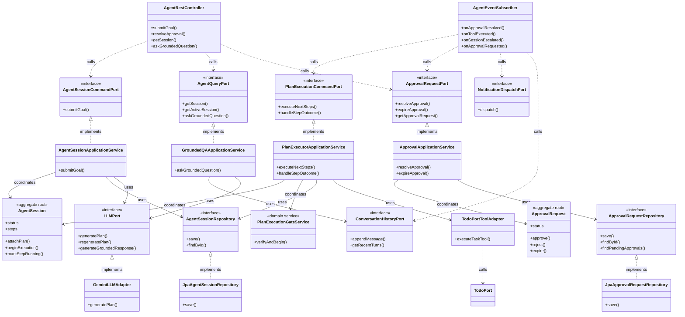
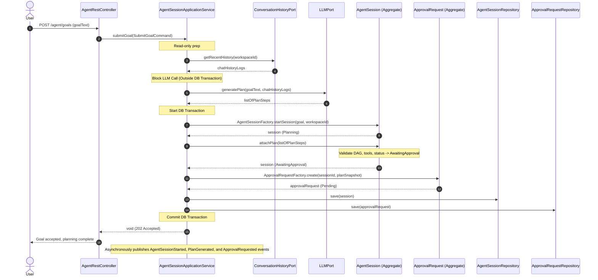
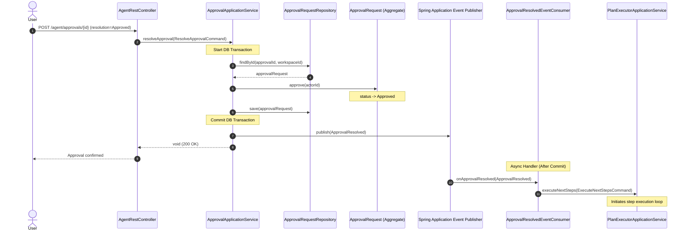

# Application Model Specification — AI Agent Bounded Context

## Document Metadata
- **Version**: 2.1.0
- **Status**: Updated per Review
- **Date**: August 2, 2026
- **Author**: Principal Clean Architect
- **References**: 
  - [`domain-model.md`](file:///D:/VsCode/Java/ai_executive_assistant/docs/domain-model/agent/domain-model.md)
  - [`context-map.md`](file:///D:/VsCode/Java/ai_executive_assistant/docs/context-mapping/context-map.md)
  - [`architecture-v2.md`](file:///D:/VsCode/Java/ai_executive_assistant/docs/architecture/architecture-v2.md)
  - [`user-stories-v2.md`](file:///D:/VsCode/Java/ai_executive_assistant/docs/requirements/user-stories-v2.md)

---

## 1. Executive Summary

The **AI Agent Bounded Context** (Cognitive Orchestration) coordinates the cognitive process of decomposing natural language user intents, orchestrating execution steps, obtaining human-in-the-loop validation, reflecting on failures, and grounding answers. 

This document defines the **Application Layer** for the AI Agent context, which encapsulates the application use cases, defines commands and queries, establishes transactional boundaries, lists inbound and outbound ports, and traces event-driven communications. In conformance with Hexagonal and Clean Architecture principles, the application layer acts as the orchestrator of domain logic and remains free from framework (Spring) or database technology-specific details.

```
                           +--------------------------+
                           |    Presentation Layer    |
                           |   (Controllers, SSE)     |
                           +------------+-------------+
                                        | (Calls)
                                        v
+------------------+       +------------+-------------+       +------------------+
|  Inbound Ports   | <---+ |    Application Services  | +---> |  Outbound Ports  |
| (API Interfaces) |       |  (Use Cases & Commands)  |       | (SPI Interfaces) |
+------------------+       +------------+-------------+       +--------+---------+
                                        |                              |
                                        | (Coordinates)                | (Implemented by)
                                        v                              v
                           +------------+-------------+       +------------------+
                           |       Domain Model       |       |  Infrastructure  |
                           |   (Aggregates, Services) |       | (DB Repo, LLM,   |
                           +--------------------------+       |  Tool Adapters)  |
                                                              +------------------+
```

---

## 2. Use Case Catalog

### UC-AGENT-001: Submit Goal & Generate Plan
- **ID**: `UC-AGENT-001`
- **Actor**: Executive / Individual Professional
- **Trigger**: User enters a high-level goal in natural language.
- **Pre-conditions**:
  - The user has an active session and is authenticated under a valid `WorkspaceId`.
- **Post-conditions**:
  - A new `AgentSession` is initialized in `Planning` status, transitioning to `AwaitingApproval` once steps are attached.
  - An associated `ApprovalRequest` is created in `Pending` status.
  - Events published: `AgentSessionStarted`, `PlanGenerated`, and `ApprovalRequested`.
- **Normal Flow**:
  1. The application layer receives a goal string and workspace identity.
  2. The application validates constraints (blank text, length limits).
  3. The application queries the `ConversationHistoryPort` and `MemoryStorePort` to provide context for planning.
  4. The application invokes the `LLMPort` to decompose the goal into a dependency-aware list of steps.
  5. The application validates that each step's tool reference is registered in the `ToolRegistry` and that the step graph forms a Directed Acyclic Graph (DAG).
  6. A transaction is opened:
     - The application creates the `AgentSession` aggregate via `AgentSessionFactory.startSession(goal, workspaceId)`.
     - The plan steps are attached to the session via `AgentSession.attachPlan(steps)`.
     - The session status transitions to `AwaitingApproval`.
     - The application creates the `ApprovalRequest` aggregate via `ApprovalRequestFactory.create(...)` containing a snapshot of the plan steps.
     - Both aggregates are persisted to their respective repositories.
     - Transactions are committed, and the domain events `AgentSessionStarted`, `PlanGenerated`, and `ApprovalRequested` are dispatched.
- **Exception Flows**:
  - **Invalid Goal Text**: Returns validation error; no session created.
  - **LLM Decomposition Failure**: Returns planning failure; user receives an error message.
  - **Cyclic Step Dependencies**: If `attachPlan` detects a cycle, it throws a validation error; the session is discarded.
  - **Unregistered Tool Reference**: If a step invokes an unregistered capability, the plan is rejected.

### UC-AGENT-002: Resolve Approval Request
- **ID**: `UC-AGENT-002`
- **Actor**: Executive / Individual Professional
- **Trigger**: User approves or rejects a proposed execution plan.
- **Pre-conditions**:
  - A corresponding `ApprovalRequest` exists in `Pending` status.
  - The actor has authorization to perform actions in the target workspace.
- **Post-conditions**:
  - `ApprovalRequest` transitions to `Approved` or `Rejected`.
  - Event published: `ApprovalResolved`.
- **Normal Flow (Approved)**:
  1. The application layer receives the approval ID, user ID, and `Approved` decision.
  2. A transaction is opened:
     - The application loads the `ApprovalRequest` from `ApprovalRequestRepository`.
     - The application executes `ApprovalRequest.approve(actorId)`.
     - The status transitions to `Approved`.
     - The aggregate is saved, the transaction commits, and the `ApprovalResolved` event is published.
  3. The `ApprovalResolved` listener receives the event and invokes the execution orchestrator to start the step loop.
- **Normal Flow (Rejected)**:
  1. The application layer receives the approval ID, user ID, and `Rejected` decision.
  2. A transaction is opened:
     - The application loads the `ApprovalRequest` and executes `ApprovalRequest.reject(actorId)`.
     - The status transitions to `Rejected`.
     - The aggregate is saved, the transaction commits, and the `ApprovalResolved` event is published.
  3. The `ApprovalResolved` listener handles the rejection:
     - A transaction is opened:
       - The application loads the corresponding `AgentSession`.
       - It executes `AgentSession.handlePlanRejection(reason)`.
       - If `replanCount < 3`, `replanCount` increments and status transitions back to `Planning` (raising `SessionReplanned`).
       - If `replanCount == 3`, status transitions to `Escalated` (raising `SessionEscalated`).
       - The session is saved, and the transaction commits.
     - If in `Planning`, a new plan generation is triggered asynchronously (repeating the LLM flow in UC-AGENT-001).
- **Exception Flows**:
  - **Approval Already Resolved**: Attempting to resolve an approved, rejected, or expired request triggers an invariant validation error.
  - **Unauthorized User**: Rejects the decision if the `actorId` is not member of the `WorkspaceId`.

### UC-AGENT-003: Execute Next Steps (Plan Execution Loop)
- **ID**: `UC-AGENT-003`
- **Actor**: System (Asynchronous Worker / Event Consumer)
- **Trigger**: An approval is resolved as `Approved` or a previous step completes successfully.
- **Pre-conditions**:
  - The `AgentSession` status is `Executing`.
  - The associated `ApprovalRequest` status is verified as `Approved`.
- **Post-conditions**:
  - Eligible steps with satisfied dependencies transition to `Running` status.
  - Tool execution adapters are invoked asynchronously.
  - Event published: `PlanStepStarted` per step.
- **Normal Flow**:
  1. The application execution orchestrator loads the `AgentSession`.
  2. The application checks the approval status via `PlanExecutionGateService`.
  3. The application computes the set of next executable steps using `PlanDependencyOrderingService` (steps in `Pending` status whose prerequisites are all `Succeeded`).
  4. For each eligible step:
     - A transaction is opened:
       - The session transitions the step state to `Running` via `AgentSession.markStepRunning(stepId)`.
       - The session is saved, the transaction commits, and `PlanStepStarted` is published.
     - The step's tool parameter values are resolved.
     - The application invokes the corresponding tool adapter in the Tool Registry (non-transactional external network/API call).
     - Upon completion (either success or failure), the outcome is dispatched via a command to update step state (UC-AGENT-004).

### UC-AGENT-004: Handle Step Execution Outcome
- **ID**: `UC-AGENT-004`
- **Actor**: System (Tool execution callback or thread worker)
- **Trigger**: A running plan step finishes execution.
- **Pre-conditions**:
  - The parent `AgentSession` is in `Executing` status.
  - The target `PlanStep` status is `Running`.
- **Post-conditions**:
  - The step status transitions to `Succeeded` or `Failed`.
  - Session status updates (may transition to `Succeeded`, `Planning`, or `Escalated`).
  - Events published: `ToolExecuted`, and optionally `SessionReplanned`, `SessionEscalated`, `SessionSucceeded`.
- **Normal Flow (Step Succeeded)**:
  1. The application layer receives the step execution result as success.
  2. A transaction is opened:
     - The application loads the `AgentSession`.
     - The session transitions the step state to `Succeeded` via `AgentSession.markStepSucceeded(stepId)`.
     - The application checks if all steps in the plan are `Succeeded`.
       - If yes, transitions session state to `Succeeded` and raises `SessionSucceeded`.
     - The session aggregate is saved and the transaction commits.
  3. The domain event `ToolExecuted` is published.
  4. If the session is still `Executing` (not all steps are done), the application triggers another execution loop iteration (UC-AGENT-003).
- **Normal Flow (Step Failed)**:
  1. The application layer receives the step execution failure and error details.
  2. A transaction is opened:
     - The application loads the `AgentSession`.
     - The session transitions the step state to `Failed` via `AgentSession.handleStepFailure(stepId, reason)`.
     - The aggregate evaluates the re-planning limit:
       - If `replanCount < 3`, `replanCount` is incremented, steps are cleared, status is set to `Planning`, and `SessionReplanned` is published.
       - If `replanCount == 3`, status is set to `Escalated`, and `SessionEscalated` is published.
     - The session aggregate is saved and the transaction commits.
  3. The domain event `ToolExecuted` (success=false) is published.
  4. If the session transitioned to `Planning`, the application triggers a new plan generation asynchronously.
  5. If the session transitioned to `Escalated`, the execution loops halts and an escalation alert is dispatched to the user.

### UC-AGENT-005: Handle Approval Request Expiration
- **ID**: `UC-AGENT-005`
- **Actor**: System (Scheduler / Expiry Timer)
- **Trigger**: The expiration timestamp on a pending approval request is reached.
- **Pre-conditions**:
  - The `ApprovalRequest` is in `Pending` status.
  - The current timestamp is past `expiresAt`.
- **Post-conditions**:
  - `ApprovalRequest` transitions to `Expired`.
  - The associated `AgentSession` transitions to `Escalated`.
  - Events published: `ApprovalExpired` and `SessionEscalated`.
- **Normal Flow**:
  1. The scheduler triggers the expiration handler for the `ApprovalId`.
  2. A transaction is opened:
     - The application loads the `ApprovalRequest`.
     - It executes `ApprovalRequest.expire()`, changing status to `Expired`.
     - The request is saved, transaction commits, and `ApprovalExpired` is published.
  3. The `ApprovalExpired` consumer handles the expiration:
     - A transaction is opened:
       - The application loads the corresponding `AgentSession`.
       - It executes `AgentSession.handleApprovalExpiration()`.
       - The session status transitions to `Escalated` with reason "Approval request expired".
       - The session is saved, transaction commits, and `SessionEscalated` is published.
  4. The escalation alert is dispatched to the user.

### UC-AGENT-006: Answer Grounded Chat Question (QA)
- **ID**: `UC-AGENT-006`
- **Actor**: Executive / Individual Professional
- **Trigger**: User asks a factual question about their data.
- **Pre-conditions**:
  - User has active session access to the workspace.
- **Post-conditions**:
  - An answer is returned to the user, grounded in workspace records, with explicit source citations.
- **Normal Flow**:
  1. The application layer receives the query text and workspace context.
  2. The application retrieves conversation history via `ConversationHistoryPort` and semantic facts/preferences via `MemoryStorePort`.
  3. The application calls `LLMPort` passing the query, history, and retrieved facts, along with strict grounding prompts.
  4. The LLM returns a response containing answer text and source references.
  5. The application validates the response against `GroundingValidatorService`.
     - If the LLM could not ground the answer in the provided documents or context, it ensures the answer is mapped to "I do not know" and no citation is claimed.
  6. The application appends the chat interaction to the conversation history.
  7. The grounded answer is returned to the client interface.

### UC-AGENT-007: Begin Execution After Approval
- **ID**: `UC-AGENT-007`
- **Actor**: System (ApprovalResolvedEventConsumer)
- **Trigger**: `ApprovalResolved` event with resolution `Approved` is received.
- **Pre-conditions**:
  - The `AgentSession` is in `AwaitingApproval` status.
  - The `ApprovalRequest` status is `Approved`.
- **Post-conditions**:
  - `AgentSession` transitions from `AwaitingApproval` to `Executing`.
- **Normal Flow**:
  1. The event consumer receives `ApprovalResolved` (resolution = Approved).
  2. A transaction is opened:
     - The application loads the `AgentSession` by the session ID embedded in the approval.
     - Invokes `AgentSession.beginExecution(actorId)` via `PlanExecutionGateService.verifyAndBegin()`.
     - Session status transitions to `Executing`.
     - The session is saved and the transaction commits.
  3. The application immediately calls `executeNextSteps` (UC-AGENT-003) to start the first round of eligible steps.
- **Exception Flows**:
  - **Session not in AwaitingApproval**: Throws invariant error; no state change.

### UC-AGENT-008: Record Tool Invocation in Conversation History
- **ID**: `UC-AGENT-008`
- **Actor**: System (ToolExecutedEventConsumer)
- **Trigger**: `ToolExecuted` domain event is published.
- **Pre-conditions**:
  - An active `Conversation` exists for the workspace/user session.
- **Post-conditions**:
  - A new `ConversationTurn` (role = Agent) is appended to the conversation log.
- **Normal Flow**:
  1. The event consumer receives `ToolExecuted`.
  2. The application constructs a message summarizing the tool name, parameters, and outcome.
  3. The application calls `ConversationHistoryPort.appendMessage(AppendTurnCommand)` with the constructed turn.
- **Notes**: This satisfies AI-002 AC requirement to log tool invocations into conversation history.

### UC-AGENT-009: Dispatch Escalation Notification
- **ID**: `UC-AGENT-009`
- **Actor**: System (SessionEscalatedEventConsumer / ApprovalExpiredEventConsumer)
- **Trigger**: `SessionEscalated` or `ApprovalExpired` domain event is published.
- **Pre-conditions**:
  - Valid `WorkspaceId` and `UserId` are present in the event payload.
- **Post-conditions**:
  - An escalation alert is dispatched to the user via `NotificationDispatchPort`.
- **Normal Flow**:
  1. The event consumer receives `SessionEscalated` (or `ApprovalExpired`).
  2. The application builds a `DispatchNotificationCommand` with urgency level `Urgent`, referencing the session and reason.
  3. The application calls `NotificationDispatchPort.dispatch(command)`.
- **Notes**: Fulfils the escalation alert obligation in UC-AGENT-004/005 final steps.

---

## 3. Command Catalog

Commands represent write requests that mutate the state of aggregates. They are validated for structural rules before being processed.

```
       Command Bus / Handler
  +───────────────────────────────+
  | Validate Command Constraints  |
  +───────────────┬───────────────+
                  | (Valid)
                  v
  +───────────────────────────────+
  | Load Aggregate via Repository |
  +───────────────┬───────────────+
                  |
                  v
  +───────────────────────────────+
  | Execute Aggregate Behavior    |
  +───────────────┬───────────────+
                  | (Saves & Commits)
                  v
  +───────────────────────────────+
  | Publish Domain Events         |
  +───────────────────────────────+
```

### SubmitGoalCommand
- **Payload**:
  ```typescript
  interface SubmitGoalCommand {
    workspaceId: string; // Tenant context
    userId: string;      // Initiating actor
    goalText: string;    // Natural language goal
  }
  ```
- **Validation**:
  - `workspaceId` and `userId` must be valid, non-blank strings.
  - `goalText` must be non-blank and conform to length constraints (5 to 1000 characters).

### ResolveApprovalCommand
- **Payload**:
  ```typescript
  interface ResolveApprovalCommand {
    workspaceId: string;
    actorId: string;      // Authorized user resolving the approval
    approvalId: string;   // target ApprovalRequest
    resolution: "Approved" | "Rejected";
  }
  ```
- **Validation**:
  - `approvalId` must be a valid UUID.
  - `actorId` must match workspace member credentials.
  - `resolution` must be one of the enum values.

### ExecuteNextStepsCommand
- **Payload**:
  ```typescript
  interface ExecuteNextStepsCommand {
    workspaceId: string;
    sessionId: string;
  }
  ```
- **Validation**:
  - `sessionId` must be a valid UUID.

### HandleStepOutcomeCommand
- **Payload**:
  ```typescript
  interface HandleStepOutcomeCommand {
    workspaceId: string;
    sessionId: string;
    stepId: string;
    success: boolean;
    errorReason?: string;
  }
  ```
- **Validation**:
  - `sessionId` and `stepId` must be valid UUIDs.
  - If `success` is false, `errorReason` should be provided.

### ExpireApprovalCommand
- **Payload**:
  ```typescript
  interface ExpireApprovalCommand {
    workspaceId: string;
    approvalId: string;
  }
  ```
- **Validation**:
  - `approvalId` must be a valid UUID.

---

## 4. Query Catalog

Queries are read-only requests. They do not mutate state and bypass aggregate write constraints.

### GetAgentSessionQuery
- **Parameters**: `workspaceId: string`, `sessionId: string`
- **Return Type**: `AgentSessionDTO`
  ```typescript
  interface AgentSessionDTO {
    sessionId: string;
    workspaceId: string;
    goal: string;
    status: string;
    replanCount: number;
    steps: Array<{
      stepId: string;
      toolName: string;
      parameters: Record<string, any>;
      status: string;
    }>;
  }
  ```

### GetApprovalRequestQuery
- **Parameters**: `workspaceId: string`, `approvalId: string`
- **Return Type**: `ApprovalRequestDTO`
  ```typescript
  interface ApprovalRequestDTO {
    approvalId: string;
    sessionId: string;
    workspaceId: string;
    status: string;
    expiresAt?: string;
    planSnapshot: Array<{
      stepId: string;
      toolName: string;
      description: string;
    }>;
  }
  ```

### GetActiveSessionQuery
- **Parameters**: `workspaceId: string`, `userId: string`
- **Return Type**: `AgentSessionDTO | null`

### AskGroundedQuestionQuery
- **Parameters**: `workspaceId: string`, `userId: string`, `questionText: string`
- **Return Type**: `GroundedAnswerDTO`
  ```typescript
  interface GroundedAnswerDTO {
    answerText: string;
    citations: Array<{
      documentId: string;
      sourceType: string;
      snippetText: string;
    }>;
  }
  ```

---

## 5. Application Service Design

Application services act as facade controllers in the application layer. They expose interfaces to drive user transactions and coordinate infrastructure.

### `AgentSessionApplicationService`
Coordinates the lifecycle of `AgentSession` aggregates.
- **`submitGoal(SubmitGoalCommand): void`**:
  - Triggers asynchronous goal processing. Resolves history and preferences.
  - Calls `LLMPort` to generate the plan.
  - Triggers transaction: Starts session, attaches plan steps, creates approval request, saves both, publishes events.
- **`replanSession(sessionId, reason): void`**:
  - Called internally on step failure. Increments `replanCount`, sets status to `Planning`, saves, and triggers asynchronous planning.
- **`completeSession(sessionId): void`**:
  - Marks the session status as `Succeeded`.
- **`failSession(sessionId, reason): void`**:
  - Marks the session status as `Failed`.

### `ApprovalApplicationService`
Coordinates user decisions and approval expiry.
- **`resolveApproval(ResolveApprovalCommand): void`**:
  - Loads the `ApprovalRequest` aggregate.
  - Calls `approve(actorId)` or `reject(actorId)`.
  - Saves the aggregate and commits. Events trigger downstream execution or re-planning.
- **`expireApproval(ExpireApprovalCommand): void`**:
  - Loads the pending request.
  - Invokes `expire()` if past timeout.
  - Commits changes; published `ApprovalExpired` event will trigger session escalation.

### `PlanExecutorApplicationService`
Manages step execution and tool registry invocation.
- **`executeNextSteps(ExecuteNextStepsCommand): void`**:
  - Loads the session.
  - Invokes `PlanExecutionGateService` to verify approval validity.
  - Filters executable steps using `PlanDependencyOrderingService`.
  - For each step: Marks status as `Running` in a transaction, then triggers asynchronous invocation of the target tool adapter.
- **`handleStepOutcome(HandleStepOutcomeCommand): void`**:
  - Marks step success or failure.
  - On failure: Triggers re-planning or escalation.
  - On success: Triggers next iteration of `executeNextSteps`.

### `GroundedQAApplicationService`
Manages RAG-grounded user questions.
- **`askQuestion(AskGroundedQuestionQuery): GroundedAnswerDTO`**:
  - Retrieves memory facts and chat logs from memory ports.
  - Invokes LLM API with grounding context.
  - Verifies citations via `GroundingValidatorService` and returns grounded results.

---

## 6. Inbound Ports

Inbound ports (Driving Ports) define the API interfaces exposed by the application layer. Primary adapters (like Spring REST/SSE Controllers or Cron schedule runners) invoke these interfaces.

### `AgentSessionCommandPort`
Replaces the former `AgentCommandPort` for session-lifecycle write operations.

```java
package com.assistant.agent.application.ports.in;

public interface AgentSessionCommandPort {
    /**
     * Accepts a user goal to initiate session planning.
     */
    void submitGoal(SubmitGoalCommand command);
}
```

### `PlanExecutionCommandPort`
Handles step-execution write operations, previously co-located on `AgentCommandPort`.

```java
package com.assistant.agent.application.ports.in;

public interface PlanExecutionCommandPort {
    /**
     * Asynchronously executes eligible steps for a session.
     */
    void executeNextSteps(ExecuteNextStepsCommand command);

    /**
     * Records the outcome of a plan step execution.
     */
    void handleStepOutcome(HandleStepOutcomeCommand command);
}
```

### `AgentQueryPort`
New dedicated query port. Separates reads from write ports (CQRS).

```java
package com.assistant.agent.application.ports.in;

public interface AgentQueryPort {
    /**
     * Returns the current state of a session.
     */
    AgentSessionDTO getSession(GetAgentSessionQuery query);

    /**
     * Returns the active session for a workspace/user, or null.
     */
    AgentSessionDTO getActiveSession(GetActiveSessionQuery query);

    /**
     * Submits a grounded QA request and returns the citing answer.
     * Read-only: no aggregate mutation (history append is a separate command).
     */
    GroundedAnswerDTO askGroundedQuestion(AskGroundedQuestionQuery query);
}
```

### `ApprovalRequestPort`
```java
package com.assistant.agent.application.ports.in;

public interface ApprovalRequestPort {
    /**
     * Processes user resolution of a pending plan.
     */
    void resolveApproval(ResolveApprovalCommand command);

    /**
     * Triggers verification of a request's expiration state.
     */
    void expireApproval(ExpireApprovalCommand command);

    /**
     * Returns the current state of an approval request.
     */
    ApprovalRequestDTO getApprovalRequest(GetApprovalRequestQuery query);
}
```

---

## 7. Outbound Ports

Outbound ports (Driven Ports) define the SPI interfaces that the application layer calls. Secondary adapters (JPA repositories, LLM Clients, or Port adapters for other bounded contexts) implement these interfaces.

### `AgentSessionRepository`
```java
package com.assistant.agent.application.ports.out;

import com.assistant.agent.domain.model.AgentSession;
import com.assistant.agent.domain.model.AgentSessionId;
import com.assistant.shared.WorkspaceId;
import java.util.Optional;

public interface AgentSessionRepository {
    void save(AgentSession session);
    Optional<AgentSession> findById(AgentSessionId sessionId, WorkspaceId workspaceId);
    Optional<AgentSession> findActiveSession(WorkspaceId workspaceId);
}
```

### `ApprovalRequestRepository`
```java
package com.assistant.agent.application.ports.out;

import com.assistant.agent.domain.model.ApprovalRequest;
import com.assistant.agent.domain.model.ApprovalId;
import com.assistant.agent.domain.model.AgentSessionId;
import com.assistant.shared.WorkspaceId;
import java.util.Optional;
import java.util.List;

public interface ApprovalRequestRepository {
    void save(ApprovalRequest request);
    Optional<ApprovalRequest> findById(ApprovalId approvalId, WorkspaceId workspaceId);
    Optional<ApprovalRequest> findBySessionId(AgentSessionId sessionId, WorkspaceId workspaceId);
    List<ApprovalRequest> findPendingApprovals();
}
```

### `LLMPort`
```java
package com.assistant.agent.application.ports.out;

import com.assistant.agent.domain.model.PlanStep;
import com.assistant.agent.domain.model.GoalText;
import java.util.List;

public interface LLMPort {
    /**
     * Invokes the LLM to decompose a goal into step sequence schemas.
     */
    List<PlanStep> generatePlan(GoalText goal, List<String> historyContext, List<String> memoryContext);

    /**
     * Invokes the LLM to revise a plan based on failure logs.
     */
    List<PlanStep> regeneratePlan(GoalText goal, List<PlanStep> currentSteps, String failureReason);

    /**
     * Executes RAG grounded generation using provided text documents.
     */
    GroundedAnswerResponse generateGroundedResponse(String question, List<String> documents);
}
```

### Productivity & Shared Inbound Ports (Cross-Context Calls)
These ports are imported from their respective target contexts to let agent tool adapters execute actions.

- **`TodoPort`** (owned by `Todo` Context): Creating, updating, or deleting tasks during step execution.
- **`CalendarPort`** (owned by `Calendar` Context): Scheduling, modifying, or querying event calendars.
- **`ConversationHistoryPort`** and **`MemoryStorePort`** (owned by `Memory` Context): Storing chat messages and fetching user defaults.
- **`NotificationDispatchPort`** (owned by `Notification` Context): Pushing escalation alerts and approval notifications to users (UC-AGENT-009).

---

## 8. Transaction Flow & Boundaries

To preserve consistency and prevent database performance degradation, transactions are kept highly localized. **Slow blocking operations, such as LLM planning calls and external tool API calls, must run OUTSIDE database transactions.**

```
+─────────────────────────────────────────────────────────────────────────────+
|                          Execution Loop Thread                              |
|                                                                             |
|  [Transaction 1: Mark Step Running]                                         |
|    - Load AgentSession                                                      |
|    - markStepRunning(stepId)                                                |
|    - Save AgentSession -> Emits PlanStepStarted                             |
|  [Commit]                                                                   |
|                                                                             |
|  [Non-Transactional External Call]                                          |
|    - Invoke Tool adapter (e.g. TodoPort, CalendarPort, Google API)          |
|    - Wait for response / result                                             |
|                                                                             |
|  [Transaction 2: Record Tool Outcome]                                       |
|    - Load AgentSession                                                      |
|    - markStepSucceeded / handleStepFailure                                  |
|    - Save AgentSession -> Emits ToolExecuted                                |
|  [Commit]                                                                   |
+─────────────────────────────────────────────────────────────────────────────+
```

### 1. Goal Submission & Planning Transaction Flow
1. **Non-Transactional stage**:
   - Primary adapter calls `AgentSessionApplicationService.submitGoal()`.
   - The application fetches chat history and preferences via memory ports.
   - The application calls `LLMPort.generatePlan()`. This is a blocking network call to the LLM service.
2. **Transactional stage**:
   - The application opens a database transaction.
   - It instantiates the `AgentSession` aggregate and attaches the generated plan steps.
   - It instantiates the `ApprovalRequest` aggregate.
   - It saves both aggregates to `AgentSessionRepository` and `ApprovalRequestRepository` within the same transaction.
   - The transaction commits.
   - Events `AgentSessionStarted`, `PlanGenerated`, and `ApprovalRequested` are dispatched.

### 2. Approval Resolution Transaction Flow
1. **Transactional stage**:
   - Primary adapter calls `ApprovalApplicationService.resolveApproval()`.
   - The application opens a database transaction.
   - It loads the `ApprovalRequest` aggregate from the repository.
   - It calls `approve(actorId)` or `reject(actorId)` on the aggregate.
   - It saves the aggregate to `ApprovalRequestRepository`.
   - The transaction commits.
   - Event `ApprovalResolved` is dispatched.

### 3. Execution Loop Transaction Flow
The execution loop runs asynchronously to avoid blocking the user request.
1. **Non-Transactional stage**:
   - The loop identifies eligible pending steps via `PlanDependencyOrderingService`.
2. **Transactional stage (Per-Step Start)**:
   - The application opens a database transaction.
   - It loads the `AgentSession` aggregate.
   - It calls `AgentSession.markStepRunning(stepId)`.
   - It saves the session and commits the transaction.
   - Event `PlanStepStarted` is published.
3. **Non-Transactional stage (Tool Execution)**:
   - The application invokes the corresponding tool adapter class.
   - The adapter executes (e.g. calls `TodoPort` or an external SaaS webhook).
   - The execution returns a success/failure result.
4. **Transactional stage (Per-Step End)**:
   - The application opens a database transaction.
   - It loads the `AgentSession` aggregate.
   - If success: calls `AgentSession.markStepSucceeded(stepId)`. If all done, calls `completeSession()`.
   - If failure: calls `AgentSession.handleStepFailure(stepId, reason)`. This might trigger a transition back to `Planning` or transition to `Escalated`.
   - It saves the session and commits the transaction.
   - Event `ToolExecuted` is published.

---

## 9. Domain Event Consumers

Domain event consumers listen to published domain events asynchronously (after transaction commit) to trigger downstream application workflows.

### `ApprovalResolvedEventConsumer`
- **Listens to**: `ApprovalResolved`
- **Behavior**:
  - If resolution is `Approved`: Calls `AgentCommandPort.executeNextSteps` to launch the execution loop.
  - If resolution is `Rejected`: Calls `AgentSessionApplicationService.replanSession` to trigger re-planning.

### `ApprovalExpiredEventConsumer`
- **Listens to**: `ApprovalExpired`
- **Behavior**:
  - Calls `AgentSessionApplicationService.failSession` or trigger escalation handlers on the session.

### `ToolExecutedEventConsumer`
- **Listens to**: `ToolExecuted`
- **Behavior**:
  - Calls `ConversationHistoryPort.appendMessage(AppendTurnCommand)` to record the tool invocation and result in conversation history (UC-AGENT-008 / AI-002 AC).
  - If `success` is true and session remains `Executing`: Triggers `PlanExecutionCommandPort.executeNextSteps` to evaluate next ready steps.
  - If `success` is false and session transitioned to `Planning`: Initiates the asynchronous LLM re-planning sequence (`LLMPort.regeneratePlan`).

### `SessionEscalatedEventConsumer`
- **Listens to**: `SessionEscalated`
- **Behavior**:
  - Calls `NotificationDispatchPort.dispatch(DispatchNotificationCommand)` with urgency `Urgent` to alert the user (UC-AGENT-009).

### `ApprovalRequestedEventConsumer`
- **Listens to**: `ApprovalRequested`
- **Behavior**:
  - Calls `NotificationDispatchPort.dispatch(DispatchNotificationCommand)` with urgency `Normal` to notify the user that their approval is required.

---

## 10. Dependency Diagram

The following diagram illustrates the dependency flow within the `agent` module. The core domain contains no external dependencies, and all dependencies point inward toward the domain layer.



---

## 11. Sequence Diagrams

### 1. Goal Submission & Planning Sequence
This diagram shows how a user goal is received, decomposed by the LLM (outside database transaction), and stored along with an approval request.



### 2. Approval Resolution & Launch Sequence
Shows how a user's approval is resolved and how the execution worker is triggered to run the first plan steps.



### 3. Step Execution Loop, Failure & Re-planning Sequence
Illustrates how the plan execution loop handles step failures by triggering self-reflection and re-planning.

```mermaid
sequenceDiagram
    autonumber
    participant ExecService as PlanExecutorApplicationService
    participant OrderingService as PlanDependencyOrderingService
    participant Gate as PlanExecutionGateService
    participant RepoSession as AgentSessionRepository
    participant Session as AgentSession (Aggregate)
    participant ToolAdapter as TodoPortToolAdapter
    participant LLM as LLMPort
    
    ExecService->>RepoSession: findById(sessionId, workspaceId)
    RepoSession-->>ExecService: session
    
    ExecService->>Gate: verifyAndBeginExecution(session)
    Note over Gate: Checks linked ApprovalRequest is Approved
    Gate-->>ExecService: approved=true
    
    ExecService->>OrderingService: getExecutableSteps(session)
    OrderingService-->>ExecService: [PlanStep_1]
    
    Note over ExecService: Start DB Transaction
    ExecService->>Session: markStepRunning(stepId_1)
    Note over Session: Step status -> Running
    ExecService->>RepoSession: save(session)
    Note over ExecService: Commit DB Transaction
    
    Note over ExecService: Execute Tool (Outside Transaction)
    ExecService->>ToolAdapter: execute(PlanStep_1.parameters)
    Note over ToolAdapter: Calls TodoPort / external API
    ToolAdapter-->>ExecService: success=false, error="Validation Failure"
    
    Note over ExecService: Start DB Transaction
    ExecService->>Session: handleStepFailure(stepId_1, error)
    Note over Session: Step status -> Failed
    Note over Session: Check replanCount (currently 0 < 3)
    Note over Session: replanCount++, clear steps, status -> Planning
    ExecService->>RepoSession: save(session)
    Note over ExecService: Commit DB Transaction
    
    Note over ExecService: Asynchronously trigger re-planning (Outside Transaction)
    ExecService->>LLM: regeneratePlan(goal, currentSteps, error)
    LLM-->>ExecService: revisedPlanSteps
    
    Note over ExecService: Start DB Transaction
    ExecService->>Session: attachPlan(revisedPlanSteps)
    Note over Session: Validate and status -> AwaitingApproval
    ExecService->>RepoSession: save(session)
    Note over ExecService: Commit DB Transaction
    
    Note over ExecService: Asynchronously publishes PlanGenerated and ApprovalRequested events
