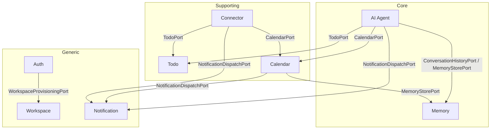

# Application Model Consistency Overview

- **Document Version**: 1.0.0
- **Status**: Review Complete
- **Date**: August 2, 2026
- **Author**: Principal Solution Architect
- **Inputs**:
  - `docs/application-model/{agent,auth,calendar,connector,memory,notification,todo,workspace}/application-model.md`
  - `docs/context-mapping/context-map.md`
  - `docs/domain-model/domain-model-overview.md`
  - `docs/architecture/architecture-v2.md`

---

## 1. Executive Summary

A cross-context review of all **8 active Application Models** (**Auth**, **Workspace**, **Todo**, **Calendar**, **Memory**, **Notification**, **AI Agent**, **Connector**) was performed against the approved Context Map, Domain Model Consistency Overview, and Architecture v2 baseline.

The models are architecturally sound and align with the modular-monolith / hexagonal baseline:

1. **Dependency direction is correct** — every cross-context caller depends on the *inbound port* of the upstream provider; no module imports another module's internals.
2. **No circular dependencies** — the historical `Memory ↔ AI Agent` cycle is broken (AD-014); Memory has zero outward application-layer dependencies.
3. **Port ownership is consistent** — every public port is declared exactly once by its owning context, and the callers listed in the Context Map are reflected in the application models.
4. **Shared Kernel usage is clean** — all cross-context references are by immutable identifier Value Objects; domain event payloads carry IDs only.
5. **Transaction boundaries are localized** — slow external calls (LLM, tool adapters, email/Slack, vault) run outside database transactions; per-aggregate transactions are respected.

The review found **no structural blockers**. Gaps are concentrated in *completeness of wiring*, not in architecture:

- **Cross-context port dependencies are documented inconsistently.** Agent lists its foreign ports; Calendar, Connector, and Auth do not list the foreign ports they call (`MemoryStorePort`, `NotificationDispatchPort`, `TodoPort`, `CalendarPort`, `WorkspaceProvisioningPort`).
- **Several events lack an explicit consumer wiring** (e.g. `ReminderTriggered → Notification`, `SessionEscalated → Notification`, `ToolExecuted → ConversationHistoryPort.appendMessage`).
- **The Agent execution loop is an implicit saga / process manager** spanning `AgentSession` and `ApprovalRequest` across multiple transactions; it should be declared explicitly.
- **Command catalog completeness lags port/use-case coverage** (orphan commands, missing commands for port methods).
- **A CQRS smell exists in AI Agent**: `askGroundedQuestion` (a read) lives on the write-oriented `AgentCommandPort`.

These are additive recommendations. They do not alter the approved domain models or require re-architecting. The suite is **READY FOR API DESIGN**.

---

## 2. Context Dependency Matrix

The matrix shows **synchronous port dependencies** between contexts. Rows are downstream callers; columns are upstream providers. Only inbound-port access is permitted (AD-015); cells marked `—` mean no direct port call (passive tenancy/identity consumption still applies at the gateway).

| Downstream \ Upstream | Auth | Workspace | Memory | Todo | Calendar | Notification | Connector |
| :--- | :---: | :---: | :---: | :---: | :---: | :---: | :---: |
| **Auth** | — | `WorkspaceProvisioningPort` | — | — | — | — | — |
| **Workspace** | — | — | — | — | — | — | — |
| **AI Agent** | — | *(tenancy conformist)* | `ConversationHistoryPort`, `MemoryStorePort` | `TodoPort` (via Tool Adapters) | `CalendarPort` (via Tool Adapters) | `NotificationDispatchPort` *(escalation/approval alerts)* | — |
| **Memory** | — | *(tenancy conformist)* | — | — | — | — | — |
| **Todo** | — | *(tenancy conformist)* | — | — | — | — | — |
| **Calendar** | — | *(tenancy conformist)* | `MemoryStorePort` *(overlap preference)* | — | — | `NotificationDispatchPort` *(reminders)* | — |
| **Notification** | — | *(tenancy conformist)* | — | — | — | — | — |
| **Connector** | — | *(tenancy conformist)* | — | `TodoPort` *(sync writes)* | `CalendarPort` *(sync writes)* | `NotificationDispatchPort` *(sync alerts)* | — |

Notes:
- Passive consumption of `Auth` identity context (thread-local `UserId`) and `Workspace` tenancy (`TenantValidationPort` at the gateway) applies to every context and is not repeated as a row.
- `Workflow` and `Notes` are deferred/reserved and excluded from MVP modeling.
- Cells marked with *italic annotations* are **implied by use-case prose but not yet listed in the owning caller's outbound port section** — see §7 Integration Review.

---

## 3. Command Flow Matrix

Every command in the 8 catalogs, its application handler, the aggregate(s) it mutates, and its cross-context side effects.

| Command | Owning Context | Handler (Application Service) | Aggregate(s) Mutated | Cross-Context Effects | TX Notes |
| :--- | :--- | :--- | :--- | :--- | :--- |
| `RegisterUserCommand` | Auth | `UserIdentityApplicationService` | `UserIdentity` | `WorkspaceProvisioningPort.provisionDefaultWorkspace` (sync, in-TX) | 1 TX |
| `LoginUserCommand` | Auth | `UserIdentityApplicationService` | `UserIdentity` (counter/lock) | `TokenGenerationService` (after TX) | 1 TX + out-of-TX token |
| `ChangePasswordCommand` | Auth | `UserIdentityApplicationService` | `UserIdentity` | — | 1 TX |
| `UnlockUserCommand` | Auth | `UserIdentityApplicationService` | `UserIdentity` | — | 1 TX |
| `SuspendUserCommand` | Auth | **None (orphan)** | `UserIdentity` *(intended)* | — | not wired |
| `ProvisionWorkspaceCommand` | Workspace | `WorkspaceApplicationService` | `Workspace` | publishes `WorkspaceProvisioned` | 1 TX |
| `RenameWorkspaceCommand` | Workspace | `WorkspaceApplicationService` | `Workspace` | — | 1 TX |
| `SuspendWorkspaceCommand` | Workspace | **None (orphan)** | `Workspace` *(intended)* | — | not wired |
| `CreateTaskCommand` | Todo | `TodoApplicationService` | `Task` | publishes `TaskCreated` → Notification/Connector | 1 TX |
| `UpdateTaskCommand` | Todo | `TodoApplicationService` | `Task` | — | 1 TX |
| `ConfigureRecurrenceCommand` | Todo | `TodoApplicationService` | `Task` | — | 1 TX (post-MVP) |
| `CreateEventCommand` | Calendar | `CalendarApplicationService` | `CalendarEvent` (+ `Reminder`) | reads `MemoryStorePort` overlap pref (out-of-TX) | 1 TX |
| `RescheduleEventCommand` | Calendar | `CalendarApplicationService` | `CalendarEvent` | overlap check via repo | 1 TX |
| `SnoozeReminderCommand` | Calendar | `CalendarApplicationService` | `CalendarEvent` | — | 1 TX |
| `AppendTurnCommand` | Memory | `MemoryApplicationService` | `Conversation` | publishes `MemoryUpdated` | fast-path append |
| `UpdatePreferencesCommand` | Memory | `MemoryApplicationService` | `UserPreferences` | publishes `MemoryUpdated` | 1 TX |
| `DispatchNotificationCommand` | Notification | `NotificationApplicationService` | `InAppNotification` | `EmailDispatcherPort` / `SlackDispatcherPort` (async, out-of-TX) | per-channel TX |
| `MarkNotificationReadCommand` | Notification | `NotificationApplicationService` | `InAppNotification` | — | 1 TX |
| `RegisterConnectionCommand` | Connector | `ConnectorApplicationService` | `Connection` | `CredentialVaultPort` (out-of-TX) | 1 TX |
| `TriggerSyncCommand` | Connector | `ConnectorApplicationService` | `Connection` | `TodoPort` / `CalendarPort` writes per item; `NotificationDispatchPort` | per-item local TX + 1 connection TX |
| `SubmitGoalCommand` | AI Agent | `AgentSessionApplicationService` | `AgentSession`, `ApprovalRequest` | `ConversationHistoryPort`/`MemoryStorePort` (read), `LLMPort` (out-of-TX) | 2 aggregates / 1 TX |
| `ResolveApprovalCommand` | AI Agent | `ApprovalApplicationService` | `ApprovalRequest` | `ApprovalResolved` → execution loop / re-plan | 1 TX |
| `ExecuteNextStepsCommand` | AI Agent | `PlanExecutorApplicationService` | `AgentSession` (steps) | tool adapters → `TodoPort`/`CalendarPort` (out-of-TX) | per-step TX |
| `HandleStepOutcomeCommand` | AI Agent | `PlanExecutorApplicationService` | `AgentSession` | `LLMPort` re-plan (out-of-TX) | 1 TX |
| `ExpireApprovalCommand` | AI Agent | `ApprovalApplicationService` | `ApprovalRequest` | `ApprovalExpired` → session escalation | 1 TX |

**Findings**
- `ResolveConflictCommand` is referenced on `SyncOrchestrationPort` but absent from the Connector command catalog.
- Orphan commands with no handler or use case: `SuspendUserCommand` (Auth), `SuspendWorkspaceCommand` (Workspace).
- Port methods without catalog commands: `reopenTask`, `softDeleteTask`, `recoverTask`, `completeTask` (Todo); `deleteEvent`, `dismissReminder` (Calendar); `dismiss` (Notification); `suspend`/`reactivate` (Connector).
- `LoginUserCommand` conflates credential mutation and token issuance — acceptable for the login boundary, flagged for CQRS purity.

---

## 4. Event Flow Matrix

All domain events referenced by the application models, their producers, and their consumers. *Italicized consumers are implied by prose but not yet wired as explicit application-model consumers.*

| Event | Producing Context | Consumers | Wired in App Models? | Payload |
| :--- | :--- | :--- | :---: | :--- |
| `UserRegistered` | Auth | Workspace (provisioning), Notification | **Synchronous port instead of event** (see §7) | `UserId`, `Email` |
| `AccountLocked` | Auth | Notification | No | `UserId`, `WorkspaceId` |
| `WorkspaceProvisioned` | Workspace | Memory (bootstrap prefs), Notification (bootstrap profile) | No | `WorkspaceId`, `UserId` |
| `WorkspaceRenamed` | Workspace | — | — | `WorkspaceId` |
| `TaskCreated` | Todo | Notification, Connector, Workflow* | Todo publishes; Notification/Connector consume | `TaskId`, `WorkspaceId`, `UserId` |
| `TaskCompleted` | Todo | Memory (stats), Workflow* | Todo publishes; Memory consumer not modeled | `TaskId`, `WorkspaceId`, `CompletedAt` |
| `TaskRecovered` | Todo | Notification, Connector | Todo publishes; consumers not modeled | `TaskId`, `WorkspaceId` |
| `CalendarEventCreated` | Calendar | Notification, Workflow*, Connector | Calendar publishes; consumers not modeled | `EventId`, `WorkspaceId`, `StartsAt` |
| `CalendarEventUpdated` | Calendar | Notification, Connector | Calendar publishes | `EventId`, `WorkspaceId` |
| `ReminderTriggered` | Calendar | Notification (dispatch) | **Calendar publishes; Notification consumer not modeled** | `EventId`, `ReminderId`, `WorkspaceId` |
| `MemoryUpdated` | Memory | AI Agent (context refresh) | Memory publishes; Agent consumer not modeled | `UserId`, `WorkspaceId`, `UpdateType` |
| `InAppNotificationCreated` | Notification | Presentation (SSE) | Implied (streaming) | `NotificationId`, `WorkspaceId` |
| `ConnectorSynced` | Connector | Notification, Audit | Connector publishes | `ConnectorId`, `WorkspaceId`, `TasksCount` |
| `ConnectorSyncFailed` | Connector | Notification, Audit | Connector publishes | `ConnectorId`, `WorkspaceId`, `ErrorMsg` |
| `AgentSessionStarted` | AI Agent | *(internal / audit)* | Published | `SessionId`, `WorkspaceId` |
| `PlanGenerated` | AI Agent | *(internal / Notification)* | Published | `SessionId`, `WorkspaceId` |
| `ApprovalRequested` | AI Agent | Notification, Workflow* | Agent publishes; Notification consumer not modeled | `ApprovalId`, `SessionId`, `WorkspaceId` |
| `ApprovalResolved` | AI Agent | **AI Agent (self: execution/re-plan)**, Notification, Workflow* | Agent self-consumer modeled | `ApprovalId`, `Resolution` |
| `ApprovalExpired` | AI Agent | **AI Agent (self: escalation)**, Notification | Agent self-consumer modeled | `ApprovalId`, `WorkspaceId` |
| `PlanStepStarted` | AI Agent | *(internal)* | Published | `SessionId`, `StepId` |
| `ToolExecuted` | AI Agent | Audit; **AI Agent (self: next step); Memory (`ConversationHistoryPort` log)** | Agent self-consumer modeled; **history append not wired** | `AgentSessionId`, `ToolName`, `Status` |
| `SessionReplanned` | AI Agent | *(internal)* | Published | `SessionId`, `ReplanCount` |
| `SessionEscalated` | AI Agent | Notification (escalation alert) | **Agent alert dispatch not wired** | `SessionId`, `WorkspaceId`, `Reason` |
| `SessionSucceeded` | AI Agent | *(internal / Notification)* | Published | `SessionId`, `WorkspaceId` |

*Workflow consumers are post-MVP and not in scope for MVP wiring.*

**Findings**
- The agent model publishes 11 events; only `ApprovalRequested`, `ApprovalResolved`, and `ToolExecuted` appear in the Context Map event catalog. `AgentSessionStarted`, `PlanGenerated`, `ApprovalExpired`, `PlanStepStarted`, `SessionReplanned`, `SessionEscalated`, `SessionSucceeded` must be added to the Shared Kernel / Context Map event catalog for API-design consistency.
- `ReminderTriggered` is missing from the Context Map event catalog (present in domain-overview and Calendar model) — catalog must be reconciled.
- The Context Map and domain-overview disagree on `UserRegistered → Workspace`: the Context Map wires synchronous `WorkspaceProvisioningPort`; the domain-overview recommends an async after-commit handler. The app models implement the synchronous variant; see §7.

---

## 5. Application Service Matrix

| Application Service | Context | Implements (Inbound Ports) | Coordinates (Aggregates) | Uses (Outbound / Foreign Ports) |
| :--- | :--- | :--- | :--- | :--- |
| `UserIdentityApplicationService` | Auth | `AuthenticationGateway` | `UserIdentity` | `UserIdentityRepository`, `TokenGenerationService`, **`WorkspaceProvisioningPort` (foreign)** |
| `WorkspaceApplicationService` | Workspace | `WorkspaceProvisioningPort`, `TenantValidationPort` | `Workspace`, `Membership` | `WorkspaceRepository` |
| `TodoApplicationService` | Todo | `TodoPort` | `Task` | `TodoRepository` |
| `CalendarApplicationService` | Calendar | `CalendarPort` | `CalendarEvent` (+ `Reminder`) | `CalendarEventRepository`, **`MemoryStorePort` (foreign)**, **`NotificationDispatchPort` (foreign)** |
| `MemoryApplicationService` | Memory | `ConversationHistoryPort`, `MemoryStorePort` | `Conversation`, `UserPreferences` | `ConversationRepository`, `UserPreferencesRepository` |
| `NotificationApplicationService` | Notification | `NotificationDispatchPort`, `NotificationManagementPort` | `InAppNotification`, `NotificationProfile` | `InAppNotificationRepository`, `NotificationProfileRepository`, `EmailDispatcherPort`, `SlackDispatcherPort` |
| `ConnectorApplicationService` | Connector | `ConnectorLifecyclePort`, `SyncOrchestrationPort` | `Connection`, `SyncConflict` | `ConnectionRepository`, `CredentialVaultPort`, `ExternalProviderPort`, **`TodoPort` (foreign)**, **`CalendarPort` (foreign)**, **`NotificationDispatchPort` (foreign)** |
| `AgentSessionApplicationService` | AI Agent | `AgentCommandPort` (partial) | `AgentSession`, `ApprovalRequest` | `AgentSessionRepository`, `ApprovalRequestRepository`, `LLMPort`, `ConversationHistoryPort`, `MemoryStorePort`, `NotificationDispatchPort` |
| `ApprovalApplicationService` | AI Agent | `ApprovalRequestPort` | `ApprovalRequest` | `ApprovalRequestRepository` |
| `PlanExecutorApplicationService` | AI Agent | `AgentCommandPort` (partial) | `AgentSession` | `AgentSessionRepository`, `PlanExecutionGateService`, `PlanDependencyOrderingService`, tool adapters (→ `TodoPort`/`CalendarPort`), `LLMPort` |
| `GroundedQAApplicationService` | AI Agent | *(none declared)* | *(none)* | `ConversationHistoryPort`, `MemoryStorePort`, `LLMPort`, `GroundingValidatorService` |

**Findings**
- **`AgentCommandPort` is declared as implemented by *two* services** (`AgentSessionApplicationService` and `PlanExecutorApplicationService` in the agent dependency diagram). One port interface with multiple implementers forces callers to guess which bean serves which method. **Split the interface** into `AgentSessionCommandPort` and `PlanExecutionCommandPort` (or collapse to one facade) before API design.
- `GroundedQAApplicationService` is not shown in the agent dependency diagram and its inbound port is undeclared. It must either implement a new `AgentQueryPort` or be folded into the session command service.
- Calendar, Connector, and Auth do not declare their foreign-port dependencies in their outbound-port sections (bold entries above). This must be added for a complete hexagonal contract.

---

## 6. Port Matrix

Deduped registry of every port defined by the application models, with owner, direction, and callers — cross-checked against the Context Map §7 Port Map.

| Port | Direction | Owner | Declared in Owner App Model | Callers (from App Models) | Declared by Callers |
| :--- | :---: | :--- | :---: | :--- | :---: |
| `AuthenticationGateway` | Inbound | Auth | ✅ | Presentation (REST) | n/a |
| `UserIdentityRepository` | Outbound | Auth | ✅ | `UserIdentityApplicationService` | n/a |
| `TokenGenerationService` | Outbound | Auth | ✅ | `UserIdentityApplicationService` | n/a |
| `WorkspaceProvisioningPort` | Inbound | Workspace | ✅ | Auth (`UserIdentityApplicationService`) | ❌ (not listed in Auth model) |
| `TenantValidationPort` | Inbound | Workspace | ✅ | Gateway / all contexts | ❌ (implicit) |
| `WorkspaceRepository` | Outbound | Workspace | ✅ | `WorkspaceApplicationService` | n/a |
| `ConversationHistoryPort` | Inbound | Memory | ✅ | AI Agent | ✅ (agent lists it) |
| `MemoryStorePort` | Inbound | Memory | ✅ | AI Agent, **Calendar** | ❌ (Calendar not listed) |
| `ConversationRepository`, `UserPreferencesRepository` | Outbound | Memory | ✅ | `MemoryApplicationService` | n/a |
| `TodoPort` | Inbound | Todo | ✅ | Agent Tool Adapters, **Connector** | ❌ (Connector not listed) |
| `TodoRepository` | Outbound | Todo | ✅ | `TodoApplicationService` | n/a |
| `CalendarPort` | Inbound | Calendar | ✅ | Agent Tool Adapters, **Connector** | ❌ (Connector not listed) |
| `CalendarEventRepository` | Outbound | Calendar | ✅ | `CalendarApplicationService` | n/a |
| `NotificationDispatchPort` | Inbound | Notification | ✅ | **Calendar, Connector, AI Agent** | ❌ (none of the three list it) |
| `NotificationManagementPort` | Inbound | Notification | ✅ | Presentation | n/a |
| `InAppNotificationRepository`, `NotificationProfileRepository`, `EmailDispatcherPort`, `SlackDispatcherPort` | Outbound | Notification | ✅ | `NotificationApplicationService` | n/a |
| `AgentCommandPort` | Inbound | AI Agent | ✅ | Presentation (SSE), event subscribers | n/a |
| `ApprovalRequestPort` | Inbound | AI Agent | ✅ | Presentation | n/a |
| `AgentSessionRepository`, `ApprovalRequestRepository`, `LLMPort` | Outbound | AI Agent | ✅ | agent app services | n/a |
| `ConnectorLifecyclePort`, `SyncOrchestrationPort` | Inbound | Connector | ✅ | Presentation (REST), cron | n/a |
| `ConnectionRepository`, `CredentialVaultPort`, `ExternalProviderPort` | Outbound | Connector | ✅ | `ConnectorApplicationService` | n/a |

**Port ownership is correct and non-duplicated.** The single systematic gap is that **callers omit their foreign-port dependencies**, which weakens the published interface contract for API design. All 5 foreign-port references (`WorkspaceProvisioningPort` from Auth; `MemoryStorePort`, `NotificationDispatchPort`, `TodoPort`, `CalendarPort` from Calendar/Connector/Agent) are owned by the upstream context, so ownership is unambiguous.

Additional port-level notes:
- **`CalendarPort.deleteEvent(WorkspaceId, EventId)`** takes raw IDs while sibling methods take command objects — normalize for API design.
- **`TodoRepository` vs domain `TaskRepository`** naming divergence (flagged in Todo review) — align before adapter implementation.
- **`ApprovalRequestRepository.findPendingApprovals()`** is the scheduler entry for expiry — good; keep it out of the public inbound API.

---

## 7. Integration Review

The nine review criteria, assessed across all models.

### 7.1 Cross-Context Interactions ✅ (with completeness gap)

All synchronous interactions route through inbound ports in the correct direction (Agent→Memory/Todo/Calendar/Notification; Calendar→Memory/Notification; Connector→Todo/Calendar/Notification; Auth→Workspace). The blocker: **four of the five cross-context dependencies are undocumented in the caller's outbound sections**, so the API-design team cannot derive the full dependency graph from a single model. Foreign-port dependencies must be listed in each caller's outbound-port section (as Agent already does).

### 7.2 Domain Event Consumers ⚠️

The only fully-wired consumer paths are within the AI Agent (self-consumption of `ApprovalResolved`, `ApprovalExpired`, `ToolExecuted`). The remaining consumption paths (`ReminderTriggered → Notification`, `SessionEscalated/ApprovalRequested → Notification`, `TaskCompleted → Memory`, `MemoryUpdated → Agent`) are published by producers but have **no modeled consumer use cases or listener adapters**. Each consumer should be listed as a use case in the consuming context (per the pattern used for `ApprovalResolvedEventConsumer`).

### 7.3 Port Ownership ✅

Every port is owned by exactly one context and declared once (§6). No port is re-declared in a foreign context. The Tool Registry adapter pattern (`TodoPortToolAdapter` inside Agent that calls `TodoPort`) complies with AD-004/AD-016 — tools are Agent-local adapters, they do not re-own the port.

### 7.4 Dependency Direction ✅

All dependencies point from downstream caller toward the upstream provider's **inbound** port. No context imports another context's aggregates, repositories, or services. The only dependency to infrastructure is through outbound SPI ports implemented by foreign adapters. `GroundedQAApplicationService` currently has no declared inbound port — its read path must be exposed via a query port, otherwise the presentation layer has no seam to depend on.

### 7.5 Circular Dependency ✅

No cycles exist. Confirmed statically:
- Agent → {Memory, Todo, Calendar, Notification} — none depend back on Agent at the application layer.
- Calendar → {Memory, Notification} — Memory and Notification do not depend on Calendar.
- Connector → {Todo, Calendar, Notification} — none depend back.
- Auth → Workspace; Workspace → nothing.
- Memory → nothing outward (AD-014 holds).

The one *runtime* re-entrancy risk is the Agent's self-consumed event loop (`ToolExecuted` → next steps → `PlanStepStarted`). It is a sequential in-process loop with a bounded re-plan cap (≤3) and is therefore safe, but must be guarded against double-dispatch in API design (idempotent step-state transitions).

### 7.6 Duplicate Application Services ⚠️

No cross-context service duplication. Within AI Agent, however, **`AgentCommandPort` is implemented by two services** (§5) — an interface ambiguity that must be resolved by splitting the port or merging the services. `GroundedQAApplicationService` is a third service overlapping the same port surface. No other context exhibits split-interface implementations.

### 7.7 Shared Kernel Usage ✅

- Cross-aggregate references are exclusively Shared Kernel identifiers (`WorkspaceId`, `UserId`, `TaskId`, `EventId`, `ApprovalId`, `SessionId`, `ConnectionId`, `NotificationId`, `ConflictId`). No object references cross boundaries.
- `RecurrencePattern` remains in the Shared Kernel (Todo-owned behavior, Calendar reads) per AD-011 — no application model introduces a competing recurrence type.
- **Naming drift**: the agent model introduces `AgentSessionId` (`com.assistant.agent.domain.model`) while the Shared Kernel / domain-overview specifies `SessionId` shared by AI Agent and Memory. Memory's `ConversationHistoryPort` uses `com.assistant.shared.SessionId` for its conversation. The relationship between `SessionId` (Memory conversation), `AgentSessionId` (Agent), and `ApprovalId` must be clarified in the Shared Kernel catalog to avoid two similar-but-distinct ID types.

### 7.8 Saga / Process Manager Necessity ⚠️

Three flows span multiple aggregates or multiple contexts across separate transactions. Each is currently implemented as implicit prose orchestration; each should be **declared explicitly** before API design:

1. **Agent Plan Execution Loop (Process Manager)** — `ApprovalResolved` → `executeNextSteps` → `PlanStepStarted` → tool call → `ToolExecuted` → next step / re-plan / escalate. Coordinates `ApprovalRequest` + `AgentSession` across many transactions plus out-of-transaction external calls. This is a textbook Process Manager and should be named as such (currently spread across `ApprovalResolvedEventConsumer`, `ToolExecutedEventConsumer`, and `PlanExecutorApplicationService`).
2. **Connector Sync Run (Saga)** — one `TriggerSyncCommand` performs per-item `TodoPort`/`CalendarPort` writes (each its own bounded-context transaction) followed by a single connection-state transaction. Partial failure semantics (per-item retry, backoff, `ConnectorSyncFailed`) must be formalized as a saga with compensation/reporting.
3. **Auth Registration + Workspace Provisioning (cross-context transaction)** — currently one synchronous transaction spanning two contexts. Per the domain-overview recommendation (§8.1), **prefer an async after-commit handler on `UserRegistered`** that calls `WorkspaceProvisioningPort`, keeping Auth's transaction thin and idempotent on retry.

### 7.9 Integration Consistency ⚠️

Positive: all contexts agree on modular-monolith + after-commit in-process events; transactions exclude slow external calls; workspace tenancy is enforced via shared context. Residual inconsistencies:

- **Event catalog divergence** (§4): agent events and `ReminderTriggered` missing from the Context Map catalog.
- **CQRS**: `askGroundedQuestion` on `AgentCommandPort` (read on write port); `TenantValidationPort.isAccessAuthorized` returns a boolean while the use case throws `TenantAccessDeniedException`; `TokenGenerationService.validateToken/extractClaims` blurs query responsibility onto an outbound port.
- **Command catalog completeness** (§3): orphan `SuspendUserCommand`/`SuspendWorkspaceCommand`; missing commands for existing port methods.
- **Preference ownership**: Memory `UserPreferences` (timezone, default priority, overlap, lead time) vs Notification `NotificationProfile` (channel routing map, email/Slack refs, digest, consent) are cleanly split in the current payloads — no overlap today, but the boundary must be written down to prevent future drift (flagged in both context reviews).
- **Cross-context preconditions**: no model explicitly documents the `TenantValidationPort`/gateway check in its use-case preconditions; API design must state that all inbound calls are tenancy-guarded at the gateway.

---

## 8. Recommendations

Prioritized (P1 = required before API design; P2 = before implementation; P3 = design-time notes).

### P1 — Resolve before API design

1. **Split the Agent command surface.** Replace `AgentCommandPort` (implemented by two services) with dedicated `AgentSessionCommandPort` + `PlanExecutionCommandPort` + `AgentQueryPort`; move `askGroundedQuestion` to the query port. This removes the CQRS smell and the interface ambiguity (§5, §7.6).
2. **Declare foreign-port dependencies in every caller.** Add to each model's outbound section: Auth → `WorkspaceProvisioningPort`; Calendar → `MemoryStorePort`, `NotificationDispatchPort`; Connector → `TodoPort`, `CalendarPort`, `NotificationDispatchPort`; Agent → `NotificationDispatchPort` (escalation/approval). This makes the §2 matrix derivable from the models alone (§7.1).
3. **Reconcile the event catalog.** Publish the Shared Kernel event contract for all agent events (`AgentSessionStarted`, `PlanGenerated`, `ApprovalExpired`, `PlanStepStarted`, `SessionReplanned`, `SessionEscalated`, `SessionSucceeded`) and add `ReminderTriggered` to the Context Map event catalog (§4, §7.9).
4. **Decouple Auth registration from Workspace provisioning.** Move provisioning to an after-commit `UserRegistered` handler calling `WorkspaceProvisioningPort` (domain-overview §8.1); document idempotency for retries (§7.8).
5. **Declare the Agent execution loop and Connector sync as Process Manager / Saga.** Name the orchestrators explicitly in the models so API design allocates correct command entry points and idempotency guards (§7.8).

### P2 — Before implementation

6. **Wire the missing event consumers as use cases**: `ReminderTriggered → NotificationDispatchPort`; `SessionEscalated`/`ApprovalRequested → NotificationDispatchPort`; `ToolExecuted → ConversationHistoryPort.appendMessage` (AI-002 AC); `TaskCompleted → Memory`; `WorkspaceProvisioned → Memory/Notification` bootstrap (§7.2).
7. **Close the command catalog.** Add handlers or remove: `SuspendUserCommand`, `SuspendWorkspaceCommand`; add commands for port methods missing catalogs (`ResolveConflictCommand`, `DeleteEventCommand`, `DismissReminderCommand`, `SoftDeleteTaskCommand`, `RecoverTaskCommand`, `CompleteTaskCommand`, `ReopenTaskCommand`, `DismissNotificationCommand`, `UpdateNotificationProfileCommand`, `SuspendConnectionCommand`, `ReactivateConnectionCommand`).
8. **Document the process-manager entry points** as commands (`ExecuteNextStepsCommand`, `HandleStepOutcomeCommand`, `TriggerSyncCommand`, `TriggerDueRemindersCommand`) so schedulers and event listeners drive a single command surface.
9. **Clarify `SessionId` vs `AgentSessionId`** in the Shared Kernel catalog and align agent/memory ID usage (§7.7).

### P3 — Design-time notes

10. Normalize `CalendarPort.deleteEvent` to a command object; align `TodoRepository` → `TaskRepository`.
11. Resolve the `UserRegistered` provisioning model (sync port vs async event) **once** in the Context Map so Auth/Workspace models stay consistent.
12. Write down the Memory/Notification preference boundary (timezone/overlap/priority vs channel routing/digest) as an explicit ownership statement.
13. Document tenancy preconditions in all use cases (`TenantValidationPort` at gateway; Auth identity via thread-local).
14. Guard the agent self-consumed event loop against double dispatch with idempotent step-state transitions.

---

## 9. Overall Status

**READY FOR API DESIGN**

The application models are architecturally consistent, cyclic-free, transactionally sound, and aligned with the approved Context Map and Architecture v2 baseline. The P1 recommendations above (port-split, foreign-port declaration, event-catalog reconciliation, provisioning decoupling, saga/process-manager declaration) are additive contract clarifications that should be incorporated as the API contracts are written — none block initiation of API design.
