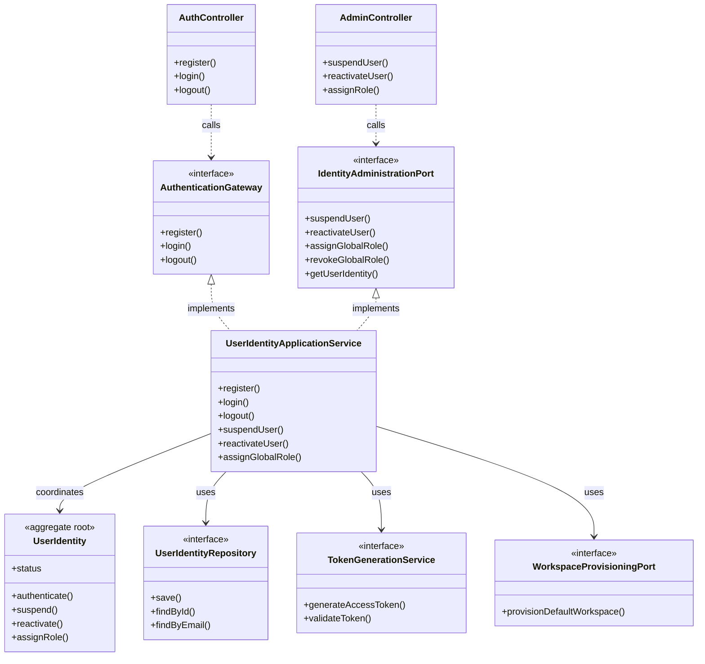

# Application Model Specification — Auth Bounded Context

## Document Metadata
- **Version**: 2.1.0
- **Status**: Updated per Review
- **Date**: August 2, 2026
- **Author**: Principal Clean Architect
- **References**: 
  - [`domain-model.md`](file:///D:/VsCode/Java/ai_executive_assistant/docs/domain-model/auth/domain-model.md)
  - [`context-map.md`](file:///D:/VsCode/Java/ai_executive_assistant/docs/context-mapping/context-map.md)
  - [`architecture-v2.md`](file:///D:/VsCode/Java/ai_executive_assistant/docs/architecture/architecture-v2.md)
  - [`user-stories-v2.md`](file:///D:/VsCode/Java/ai_executive_assistant/docs/requirements/user-stories-v2.md)

---

## 1. Executive Summary

The **Auth Bounded Context** is the Identity & Access Management (IAM) domain of the system. It handles user registration, credentials validation, password hashing contracts, session token generation (JWT), global administrative role management, and failed-login lockouts.

This document defines the **Application Layer** for the Auth context, outlining the use cases, command inputs, query parameters, inbound API ports, and outbound infrastructure SPI ports. The design enforces the strict boundary between authentication rules and workspace tenancy, collaborating with the Workspace context via synchronous provisioning interfaces.

---

## 2. Use Case Catalog

### UC-AUTH-001: Register New User
- **ID**: `UC-AUTH-001`
- **Actor**: Guest / Anonymous User
- **Trigger**: User signs up with email and password.
- **Pre-conditions**:
  - The email address must not already exist in the user repository.
- **Post-conditions**:
  - A new `UserIdentity` is created in `ACTIVE` status with the `END_USER` global role.
  - A primary Workspace is synchronously provisioned for the user.
  - Event published: `UserRegistered`.
- **Normal Flow**:
  1. The application layer receives email address and password.
  2. The application validates that the email matches basic email formats.
  3. The application checks if the email already exists in the repository. If yes, throws `EmailAlreadyRegisteredException`.
  4. The application instantiates a `Password` value object (verifying password complexity requirements: min 8 chars, uppercase, lowercase, number, special character).
  5. The application calls `PasswordHashingService` to encrypt the password.
  6. Within a single database transaction:
     - The application creates the `UserIdentity` aggregate via `UserIdentityFactory.register(email, password, hashingService)`.
     - The identity is persisted to `UserIdentityRepository`.
     - The application calls the Workspace context's `WorkspaceProvisioningPort.provisionDefaultWorkspace(userId)` to set up the default user workspace.
     - The transaction is committed.
  7. The domain event `UserRegistered` is dispatched to the event bus.

### UC-AUTH-002: Authenticate User & Generate Token (Login)
- **ID**: `UC-AUTH-002`
- **Actor**: Guest / Registered User
- **Trigger**: User attempts to login.
- **Pre-conditions**:
  - The account is not suspended or locked.
- **Post-conditions**:
  - A signed JWT token is generated and returned to the caller on success.
  - Reset of failed login attempts on success.
  - Increment of failed login attempts on failure (lockout on 5th failure).
- **Normal Flow (Success)**:
  1. The application receives email and password.
  2. The application loads the `UserIdentity` from `UserIdentityRepository` by email.
  3. A transaction is opened:
     - The application invokes `UserIdentity.authenticate(password, hashingService)`.
     - The internal check succeeds. The failed login counter resets.
     - The session is saved, transaction commits, and `UserLoggedIn` event is published.
  4. The application calls `TokenGenerationService` (outbound port) to create and sign a JSON Web Token (JWT) containing the `UserId`, `email`, and `globalRoles`.
  5. The token DTO is returned to the user.
- **Normal Flow (Failed - Lockout)**:
  1. The authentication check fails.
  2. A transaction is opened:
     - `UserIdentity.authenticate` increments the failure count.
     - If count reaches 5, account status is set to `LOCKED` and `AccountLocked` event is published.
     - The identity is updated in the repository, and transaction commits.
  3. A `BadCredentialsException` or `AccountLockedException` is thrown.

### UC-AUTH-003: Change Password
- **ID**: `UC-AUTH-003`
- **Actor**: Authenticated User
- **Trigger**: User requests a password update.
- **Pre-conditions**:
  - The user is logged in and account status is `ACTIVE`.
- **Post-conditions**:
  - The password hash is updated.
- **Normal Flow**:
  1. The application receives `UserId`, old password, and new password.
  2. The application loads `UserIdentity` by `UserId`.
  3. A transaction is opened:
     - The application validates the old password by calling `UserIdentity.authenticate`.
     - The application applies the new password via `UserIdentity.changePassword(newPassword, hashingService)`.
     - The identity is saved, transaction commits, and `PasswordChanged` is published.

### UC-AUTH-004: Unlock Account
- **ID**: `UC-AUTH-004`
- **Actor**: System Operator
- **Trigger**: Administrative unlock request.
- **Pre-conditions**:
  - The operator is authenticated with the `SYSTEM_OPERATOR` role.
  - Target user is in `LOCKED` status.
- **Normal Flow**:
  1. Operator submits the target `UserId`.
  2. A transaction is opened:
     - The application loads the target `UserIdentity`.
     - It calls `UserIdentity.unlock()`. Status becomes `ACTIVE`.
     - Saves the identity and commits.
  3. Event `AccountUnlocked` is dispatched.

### UC-AUTH-005: Invalidate Session (Logout)
- **ID**: `UC-AUTH-005`
- **Actor**: Authenticated User
- **Trigger**: User requests logout.
- **Pre-conditions**:
  - User has an active JWT token.
- **Post-conditions**:
  - The token reference is recorded in `SessionRevocationRegistry`.
  - Subsequent requests using the same token are rejected.
- **Normal Flow**:
  1. The application receives the token string and `UserId`.
  2. After the current request completes, the application records the token in `SessionRevocationRegistry.revoke(token)`.
  3. Event `SessionInvalidated` is published.

### UC-AUTH-006: Suspend User Account
- **ID**: `UC-AUTH-006`
- **Actor**: System Operator
- **Trigger**: Administrative suspension request.
- **Pre-conditions**:
  - The operator is authenticated with the `SYSTEM_OPERATOR` role.
  - Target user is in `ACTIVE` or `LOCKED` status.
- **Post-conditions**:
  - `UserIdentity` status transitions to `SUSPENDED`.
- **Normal Flow**:
  1. Operator submits the target `UserId` via `SuspendUserCommand`.
  2. A transaction is opened:
     - The application loads the target `UserIdentity`.
     - Calls `UserIdentity.suspend()`. Status transitions to `SUSPENDED`.
     - Saves the identity and commits.
  3. Event `AccountSuspended` is dispatched.

### UC-AUTH-007: Reactivate Suspended Account
- **ID**: `UC-AUTH-007`
- **Actor**: System Operator
- **Trigger**: Administrative reactivation request.
- **Pre-conditions**:
  - The operator is authenticated with the `SYSTEM_OPERATOR` role.
  - Target user is in `SUSPENDED` status.
- **Post-conditions**:
  - `UserIdentity` status transitions to `ACTIVE`.
- **Normal Flow**:
  1. Operator submits the target `UserId` via `ReactivateUserCommand`.
  2. A transaction is opened:
     - The application loads the target `UserIdentity`.
     - Calls `UserIdentity.reactivate()`. Status transitions to `ACTIVE`.
     - Saves the identity and commits.
  3. Event `AccountReactivated` is dispatched.

### UC-AUTH-008: Assign / Revoke Global Role
- **ID**: `UC-AUTH-008`
- **Actor**: System Operator
- **Trigger**: Operator assigns or revokes a global role on a user account.
- **Pre-conditions**:
  - Operator holds `SYSTEM_OPERATOR` role.
- **Normal Flow**:
  1. Operator submits `AssignGlobalRoleCommand` or `RevokeGlobalRoleCommand` with target `UserId` and `roleName`.
  2. A transaction is opened:
     - The application loads `UserIdentity`.
     - Calls `UserIdentity.assignRole(role)` or `UserIdentity.revokeRole(role)`.
     - Saves and commits.
  3. Event `GlobalRoleAssigned` or `GlobalRoleRevoked` is dispatched.

### UC-AUTH-009: Load Identity for Administration
- **ID**: `UC-AUTH-009`
- **Actor**: System Operator
- **Trigger**: Operator inspects an account's current status and roles.
- **Pre-conditions**:
  - Operator holds `SYSTEM_OPERATOR` role.
- **Normal Flow**:
  1. The application receives `GetUserIdentityQuery` with the target `UserId` or email.
  2. The application loads `UserIdentity` from `UserIdentityRepository` and maps to `UserIdentityDTO`.
  3. Returns `UserIdentityDTO` (status, roles, lock count) — no mutation.

---

## 3. Command Catalog

### RegisterUserCommand
```typescript
interface RegisterUserCommand {
  email: string;
  password: string;
}
```

### LoginUserCommand
```typescript
interface LoginUserCommand {
  email: string;
  password: string;
}
```

### ChangePasswordCommand
```typescript
interface ChangePasswordCommand {
  userId: string;
  oldPassword: string;
  newPassword: string;
}
```

### UnlockUserCommand
```typescript
interface UnlockUserCommand {
  operatorId: string;
  targetUserId: string;
}
```

### SuspendUserCommand
```typescript
interface SuspendUserCommand {
  operatorId: string;
  targetUserId: string;
}
```

### ReactivateUserCommand
```typescript
interface ReactivateUserCommand {
  operatorId: string;
  targetUserId: string;
}
```

### LogoutCommand
```typescript
interface LogoutCommand {
  userId: string;
  token: string;
}
```

### AssignGlobalRoleCommand
```typescript
interface AssignGlobalRoleCommand {
  operatorId: string;
  targetUserId: string;
  roleName: string;
}
```

### RevokeGlobalRoleCommand
```typescript
interface RevokeGlobalRoleCommand {
  operatorId: string;
  targetUserId: string;
  roleName: string;
}
```

---

## 4. Query Catalog

### VerifyTokenQuery
- **Parameters**: `token: string`
- **Return Type**: `AccessTokenClaims`
  ```typescript
  interface AccessTokenClaims {
    userId: string;
    email: string;
    globalRoles: string[];
    expiresAt: number;
  }
  ```

### GetUserIdentityQuery
- **Parameters**: `userId?: string`, `email?: string`
- **Return Type**: `UserIdentityDTO`
  ```typescript
  interface UserIdentityDTO {
    userId: string;
    email: string;
    status: string;
    globalRoles: string[];
    failedLoginCount: number;
  }
  ```

---

## 5. Inbound Ports

### `AuthenticationGateway`
```java
package com.assistant.auth.application.ports.in;

public interface AuthenticationGateway {
    void register(RegisterUserCommand command);
    TokenResponse login(LoginUserCommand command);
    void changePassword(ChangePasswordCommand command);
    void logout(LogoutCommand command);
}
```

### `IdentityAdministrationPort`
```java
package com.assistant.auth.application.ports.in;

import com.assistant.shared.UserId;

public interface IdentityAdministrationPort {
    void unlockUser(UnlockUserCommand command);
    void suspendUser(SuspendUserCommand command);
    void reactivateUser(ReactivateUserCommand command);
    void assignGlobalRole(AssignGlobalRoleCommand command);
    void revokeGlobalRole(RevokeGlobalRoleCommand command);
    UserIdentityDTO getUserIdentity(GetUserIdentityQuery query);
}
```

---

## 6. Outbound Ports

### `UserIdentityRepository`
```java
package com.assistant.auth.application.ports.out;

import com.assistant.auth.domain.model.UserIdentity;
import com.assistant.shared.UserId;
import java.util.Optional;

public interface UserIdentityRepository {
    void save(UserIdentity identity);
    Optional<UserIdentity> findById(UserId userId);
    Optional<UserIdentity> findByEmail(String email);
    boolean existsByEmail(String email);
}
```

### `TokenGenerationService`
```java
package com.assistant.auth.application.ports.out;

import com.assistant.auth.domain.model.UserIdentity;

public interface TokenGenerationService {
    String generateAccessToken(UserIdentity identity);
    boolean validateToken(String token);
    AccessTokenClaims extractClaims(String token);
}
```

### Cross-Context Outbound Dependency
- **`WorkspaceProvisioningPort`** (owned by `Workspace` Context): Called synchronously during UC-AUTH-001 within the registration transaction to provision the default workspace for a newly registered user.

---

## 7. Dependency Diagram


