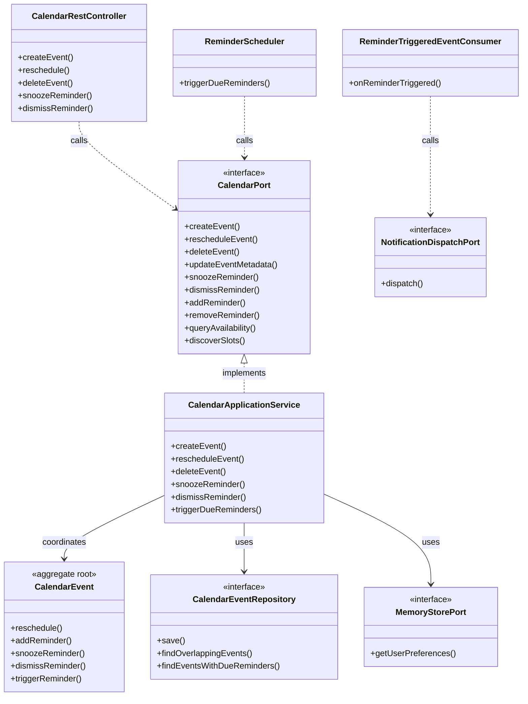

# Application Model Specification — Calendar Bounded Context

## Document Metadata
- **Version**: 2.1.0
- **Status**: Updated per Review
- **Date**: August 2, 2026
- **Author**: Principal Clean Architect
- **References**: 
  - [`domain-model.md`](file:///D:/VsCode/Java/ai_executive_assistant/docs/domain-model/calendar/domain-model.md)
  - [`context-map.md`](file:///D:/VsCode/Java/ai_executive_assistant/docs/context-mapping/context-map.md)
  - [`architecture-v2.md`](file:///D:/VsCode/Java/ai_executive_assistant/docs/architecture/architecture-v2.md)
  - [`user-stories-v2.md`](file:///D:/VsCode/Java/ai_executive_assistant/docs/requirements/user-stories-v2.md)

---

## 1. Executive Summary

The **Calendar Bounded Context** is the system of record for schedule commitments, appointment blocks, chronological overlap checks, and event reminder scheduling.

This document outlines the **Application Layer** for the Calendar context. It covers event creation under overlap constraints, rescheduling flows, reminder state machines, query structures, and the inbound `CalendarPort` used by AI Agent tools and workflow engines.

---

## 2. Use Case Catalog

### UC-CAL-001: Create Calendar Event
- **ID**: `UC-CAL-001`
- **Actor**: User / Agent Tool / Connector
- **Trigger**: Request to schedule a new event.
- **Pre-conditions**:
  - Valid `WorkspaceId` and `UserId` context.
  - End time is chronologically after start time.
- **Post-conditions**:
  - A new `CalendarEvent` aggregate is created and saved.
  - Initial reminder structures are calculated and scheduled.
  - Event published: `CalendarEventCreated`.
- **Normal Flow**:
  1. The application layer receives event details (title, description, start time, end time, initial reminder lead times).
  2. The application checks user preferences via `MemoryStorePort` (Memory context) to fetch the `preventCalendarOverlap` preference.
  3. If overlap prevention is enabled:
     - The application queries the repository for active events overlapping the proposed start/end time in this workspace.
     - If any active overlapping events exist, it throws `CalendarEventConflictException`.
  4. A database transaction is opened:
     - The application instantiates the `CalendarEvent` aggregate.
     - Saves it to `CalendarEventRepository`.
     - Transaction commits.
  5. The domain event `CalendarEventCreated` is published.

### UC-CAL-002: Reschedule Event
- **ID**: `UC-CAL-002`
- **Actor**: User / Agent Tool / Connector
- **Trigger**: Request to change event timing.
- **Pre-conditions**:
  - The event exists and status is `Scheduled`.
- **Normal Flow**:
  1. The application loads the event.
  2. If overlap prevention is enabled, checks conflicts in the repository for the new time window.
  3. A transaction is opened:
     - The application calls `CalendarEvent.reschedule(newTimeRange, currentTime)`.
     - The aggregate re-calculates all its reminder trigger times based on the new start time.
     - Saves the aggregate and commits transaction.
  4. Event `CalendarEventUpdated` is published.

### UC-CAL-003: Delete Event
- **ID**: `UC-CAL-003`
- **Actor**: User / Agent Tool
- **Trigger**: Request to cancel/delete a calendar event.
- **Post-conditions**:
  - Event status is updated to `Deleted`.
  - All reminders are deactivated (`Dismissed`).
- **Normal Flow**:
  1. The application loads the event.
  2. A transaction is opened:
     - Calls `CalendarEvent.delete()`.
     - Saves changes and commits transaction.
  3. Event `CalendarEventDeleted` is published.

### UC-CAL-004: Manage Reminders (Snooze or Dismiss)
- **ID**: `UC-CAL-004`
- **Actor**: User
- **Trigger**: User interacts with a triggered reminder alert.
- **Normal Flow (Snooze)**:
  1. The application loads the parent `CalendarEvent`.
  2. A transaction is opened:
     - Calls `CalendarEvent.snoozeReminder(reminderId, snoozeDuration, currentTime)`.
     - Updates the reminder trigger time to `currentTime + snoozeDuration`.
     - Saves aggregate and commits.
- **Normal Flow (Dismiss)**:
  1. The application loads the parent `CalendarEvent`.
  2. A transaction is opened:
     - Calls `CalendarEvent.dismissReminder(reminderId)`.
     - Sets reminder status to `Dismissed`.
     - Saves aggregate and commits.

### UC-CAL-005: Trigger Due Reminders
- **ID**: `UC-CAL-005`
- **Actor**: System (Polling Scheduler)
- **Trigger**: Execution timer tick (e.g. every minute).
- **Normal Flow**:
  1. A background worker queries `CalendarEventRepository` for active events containing pending reminders whose trigger time is <= `currentTime`.
  2. For each due reminder:
     - A transaction is opened:
       - Loads the `CalendarEvent` aggregate.
       - Calls `CalendarEvent.triggerReminder(reminderId, currentTime)`.
       - Saves the aggregate and commits the transaction.
     - Publishes the `ReminderTriggered` event (which is consumed by the Notification context to dispatch email/Slack alerts).

### UC-CAL-006: Update Event Metadata
- **ID**: `UC-CAL-006`
- **Actor**: User / Agent Tool
- **Trigger**: Request to change event title or description without altering the time window.
- **Pre-conditions**:
  - The event exists and status is `Scheduled`.
- **Post-conditions**:
  - Event title and/or description are updated.
  - Event published: `CalendarEventUpdated`.
- **Normal Flow**:
  1. The application loads the event.
  2. A transaction is opened:
     - The application calls `CalendarEvent.updateMetadata(title, description)`.
     - Saves the aggregate and commits.
  3. Event `CalendarEventUpdated` is published.
- **Notes**: Distinct from UC-CAL-002 (reschedule) — no overlap check is performed.

### UC-CAL-007: Add / Remove Reminder
- **ID**: `UC-CAL-007`
- **Actor**: User
- **Trigger**: User modifies the reminder configuration for an existing event (CAL-002 "multiple reminders").
- **Pre-conditions**:
  - The event exists and status is `Scheduled`.
- **Post-conditions**:
  - A new `Reminder` is added, or an existing one is removed from the event.
- **Normal Flow (Add)**:
  1. The application loads the `CalendarEvent`.
  2. A transaction is opened:
     - Calls `CalendarEvent.addReminder(leadTimeMinutes)`.
     - Saves the aggregate and commits.
- **Normal Flow (Remove)**:
  1. The application loads the `CalendarEvent`.
  2. A transaction is opened:
     - Calls `CalendarEvent.removeReminder(reminderId)`.
     - Saves the aggregate and commits.

### UC-CAL-008: Notify on Reminder Triggered
- **ID**: `UC-CAL-008`
- **Actor**: System (ReminderTriggeredEventConsumer)
- **Trigger**: `ReminderTriggered` domain event published by UC-CAL-005.
- **Pre-conditions**:
  - Valid `WorkspaceId` and `UserId` available in event payload.
- **Post-conditions**:
  - A notification is dispatched to the user via `NotificationDispatchPort`.
- **Normal Flow**:
  1. The event consumer receives `ReminderTriggered`.
  2. Builds a `DispatchNotificationCommand` referencing the event title and trigger time, with urgency `Normal`.
  3. Calls `NotificationDispatchPort.dispatch(command)`.

### UC-CAL-009: Bootstrap Default Reminders from Preferences
- **ID**: `UC-CAL-009`
- **Actor**: System (UC-CAL-001 internal step)
- **Trigger**: Event creation when no explicit `reminderOffsets` are provided in `CreateEventCommand`.
- **Pre-conditions**:
  - User preferences include a default `leadTimeMinutes` value in `MemoryStorePort`.
- **Post-conditions**:
  - Event is created with reminder(s) calculated from the user's default lead-time preference.
- **Normal Flow**:
   1. During UC-CAL-001, if `reminderOffsets` is empty/absent in the command:
      - The application fetches `PreferencesDTO` via `MemoryStorePort.getUserPreferences(workspaceId, userId)`.
      - Uses `defaultLeadTimeMinutes` as the reminder offset.
   2. The event is created with the bootstrapped reminder configuration.

### UC-CAL-010: Query Availability Windows
- **ID**: `UC-CAL-010`
- **Actor**: AI Agent / User
- **Trigger**: Request to find free time windows in a date range.
- **Pre-conditions**:
  - Valid `WorkspaceId` context.
- **Post-conditions**:
  - A list of **AvailabilityWindow** values is returned.
- **Normal Flow**:
  1. The application receives a `QueryAvailabilityCommand` containing `rangeStart`, `rangeEnd`, and optional `SchedulingConstraint`.
  2. The application calls `AvailabilityQueryService.computeAvailability(workspaceId, rangeStart, rangeEnd, constraints)`.
  3. The service queries `CalendarEventRepository` for active events in the range, computes gaps between consecutive events, and filters against working-hour bounds and minimum-notice constraints.
  4. The application returns the ordered list of availability windows.

### UC-CAL-011: Discover Available Time Slots
- **ID**: `UC-CAL-011`
- **Actor**: AI Agent
- **Trigger**: Request to find concrete meeting slots of a specific duration.
- **Pre-conditions**:
  - Valid `WorkspaceId` context.
  - `desiredDuration` is a positive duration.
- **Post-conditions**:
  - A list of **TimeSlot** candidates is returned.
- **Normal Flow**:
  1. The application receives a `DiscoverSlotsCommand` containing `rangeStart`, `rangeEnd`, `desiredDuration`, and optional `SchedulingConstraint`.
  2. The application calls `AvailabilityQueryService.discoverSlots(workspaceId, rangeStart, rangeEnd, desiredDuration, constraints)`.
  3. The service first computes availability windows (reusing UC-CAL-010 logic), then subdivides each window into candidate slots of the requested duration, respecting working hours and minimum notice.
  4. The application returns the ordered list of candidate slots.
  5. **Important**: Calendar returns candidate slots only. The AI Agent makes the final scheduling decision and invokes `CalendarPort.createEvent` if a slot is chosen.

---

## 3. Command Catalog

### CreateEventCommand
```typescript
interface CreateEventCommand {
  workspaceId: string;
  userId: string;
  title: string;
  description?: string;
  startTime: string; // ISO date-time
  endTime: string;   // ISO date-time
  reminderOffsets?: number[]; // In minutes
}
```

### RescheduleEventCommand
```typescript
interface RescheduleEventCommand {
  workspaceId: string;
  eventId: string;
  startTime: string;
  endTime: string;
}
```

### SnoozeReminderCommand
```typescript
interface SnoozeReminderCommand {
  workspaceId: string;
  eventId: string;
  reminderId: string;
  snoozeMinutes: number;
}
```

### DeleteEventCommand
```typescript
interface DeleteEventCommand {
  workspaceId: string;
  eventId: string;
}
```

### DismissReminderCommand
```typescript
interface DismissReminderCommand {
  workspaceId: string;
  eventId: string;
  reminderId: string;
}
```

### UpdateEventMetadataCommand
```typescript
interface UpdateEventMetadataCommand {
  workspaceId: string;
  eventId: string;
  title?: string;
  description?: string;
}
```

### AddReminderCommand
```typescript
interface AddReminderCommand {
  workspaceId: string;
  eventId: string;
  leadTimeMinutes: number;
}
```

### RemoveReminderCommand
```typescript
interface RemoveReminderCommand {
  workspaceId: string;
  eventId: string;
  reminderId: string;
}
```

### TriggerDueRemindersCommand
```typescript
interface TriggerDueRemindersCommand {
  asOf: string; // ISO date-time; supplied by scheduler
}
```

### QueryAvailabilityCommand
```typescript
interface QueryAvailabilityCommand {
  workspaceId: string;
  rangeStart: string; // ISO date-time
  rangeEnd: string;   // ISO date-time
  constraints?: {
    workingHoursStart?: string; // ISO date-time (time-of-day)
    workingHoursEnd?: string;   // ISO date-time (time-of-day)
    minimumNoticeMinutes?: number;
  };
}
```

### DiscoverSlotsCommand
```typescript
interface DiscoverSlotsCommand {
  workspaceId: string;
  rangeStart: string; // ISO date-time
  rangeEnd: string;   // ISO date-time
  desiredDurationMinutes: number;
  constraints?: {
    workingHoursStart?: string;
    workingHoursEnd?: string;
    minimumNoticeMinutes?: number;
  };
}
```

---

## 4. Query Catalog

### GetEventQuery
- **Parameters**: `workspaceId: string`, `eventId: string`
- **Return Type**: `EventDTO`

### ListEventsQuery
- **Parameters**: `workspaceId: string`, `startTime: string`, `endTime: string`
- **Return Type**: `List<EventDTO>`

### QueryAvailabilityQuery
- **Parameters**: `workspaceId: string`, `rangeStart: string`, `rangeEnd: string`, `constraints?: SchedulingConstraintDTO`
- **Return Type**: `List<AvailabilityWindowDTO>`
  ```typescript
  interface AvailabilityWindowDTO {
    startTime: string;
    endTime: string;
  }
  ```

### DiscoverSlotsQuery
- **Parameters**: `workspaceId: string`, `rangeStart: string`, `rangeEnd: string`, `desiredDurationMinutes: number`, `constraints?: SchedulingConstraintDTO`
- **Return Type**: `List<TimeSlotDTO>`
  ```typescript
  interface TimeSlotDTO {
    startTime: string;
    endTime: string;
    durationMinutes: number;
  }
  ```

### SchedulingConstraintDTO
```typescript
interface SchedulingConstraintDTO {
  workingHoursStart?: string; // ISO date-time time-of-day
  workingHoursEnd?: string;   // ISO date-time time-of-day
  minimumNoticeMinutes?: number;
}
```

---

## 5. Inbound Ports

### `CalendarPort`
```java
package com.assistant.calendar.application.ports.in;

import com.assistant.shared.WorkspaceId;
import com.assistant.shared.EventId;
import java.util.List;

public interface CalendarPort {
    // --- Write operations ---
    EventId createEvent(CreateEventCommand command);
    void rescheduleEvent(RescheduleEventCommand command);
    void deleteEvent(DeleteEventCommand command);
    void updateEventMetadata(UpdateEventMetadataCommand command);
    void snoozeReminder(SnoozeReminderCommand command);
    void dismissReminder(DismissReminderCommand command);
    void addReminder(AddReminderCommand command);
    void removeReminder(RemoveReminderCommand command);

    // --- Read operations ---
    EventDTO getEvent(WorkspaceId workspaceId, EventId eventId);
    List<EventDTO> listEvents(ListEventsQuery query);
    List<AvailabilityWindowDTO> queryAvailability(QueryAvailabilityCommand command);
    List<TimeSlotDTO> discoverSlots(DiscoverSlotsCommand command);
}
```

---

## 6. Outbound Ports

### `CalendarEventRepository`
```java
package com.assistant.calendar.application.ports.out;

import com.assistant.calendar.domain.model.CalendarEvent;
import com.assistant.shared.WorkspaceId;
import com.assistant.shared.EventId;
import java.time.Instant;
import java.util.List;
import java.util.Optional;

public interface CalendarEventRepository {
    void save(CalendarEvent event);
    Optional<CalendarEvent> findById(EventId eventId, WorkspaceId workspaceId);
    List<CalendarEvent> findOverlappingEvents(WorkspaceId workspaceId, Instant start, Instant end, EventId excludeEventId);
    List<CalendarEvent> findEventsWithDueReminders(Instant now);
    List<CalendarEvent> findActiveEvents(WorkspaceId workspaceId, Instant start, Instant end);
}
```

### Cross-Context Outbound Dependencies

- **`MemoryStorePort`** (owned by `Memory` Context): Called in UC-CAL-001 and UC-CAL-009 to fetch the user's `preventCalendarOverlap` preference and default `leadTimeMinutes` before the write transaction opens.
- **`NotificationDispatchPort`** (owned by `Notification` Context): Called in UC-CAL-008 (`ReminderTriggeredEventConsumer`) after commit to dispatch reminder alerts to the user.

---

## 8. Dependency Diagram

## 7. Dependency Diagram


