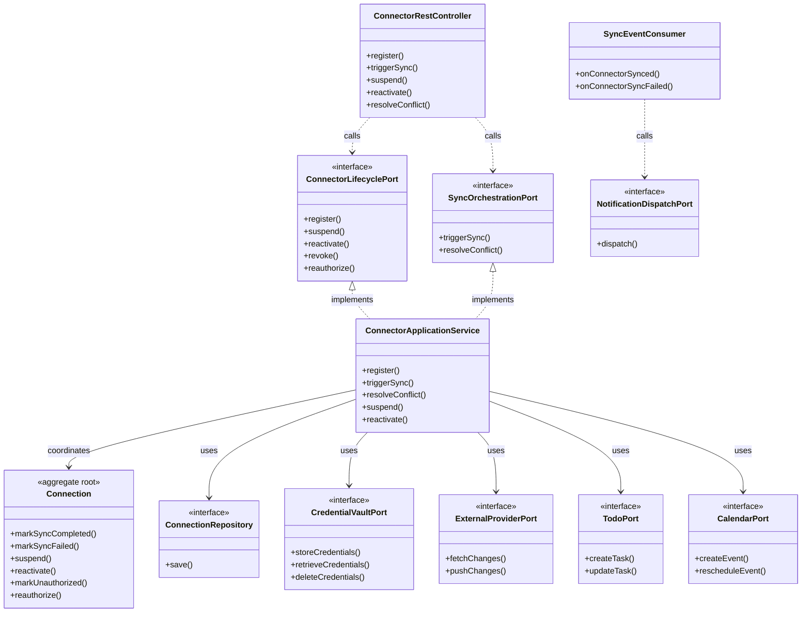

# Application Model Specification — Connector Bounded Context

## Document Metadata
- **Version**: 2.1.0
- **Status**: Updated per Review
- **Date**: August 2, 2026
- **Author**: Principal Clean Architect
- **References**: 
  - [`domain-model.md`](file:///D:/VsCode/Java/ai_executive_assistant/docs/domain-model/connector/domain-model.md)
  - [`context-map.md`](file:///D:/VsCode/Java/ai_executive_assistant/docs/context-mapping/context-map.md)
  - [`architecture-v2.md`](file:///D:/VsCode/Java/ai_executive_assistant/docs/architecture/architecture-v2.md)
  - [`user-stories-v2.md`](file:///D:/VsCode/Java/ai_executive_assistant/docs/requirements/user-stories-v2.md)

---

## 1. Executive Summary

The **Connector Bounded Context** (Connector Hub) coordinates integrations with external third-party systems. Acting as the system's Anti-Corruption Layer (ACL), it adapts external data structures (Google Calendar, Slack, GitHub, TickTick, Notion, Jira) to internal business ports.

This document defines the **Application Layer** for the Connector context, outlining connection registration, sync scheduling orchestration, conflict resolution workflows, command/query definitions, and the outbound SPI ports (`CredentialVaultPort`, `ExternalProviderPort`).

---

## 2. Use Case Catalog

### UC-CON-001: Register & Authorize Connection
- **ID**: `UC-CON-001`
- **Actor**: User
- **Trigger**: User links an external service (e.g. Google Calendar) from their dashboard.
- **Pre-conditions**:
  - User holds valid workspace membership.
- **Post-conditions**:
  - Connection profile is created and marked active.
  - Plaintext credentials are encrypted and stored in the secure Vault.
- **Normal Flow**:
  1. The application receives the registration command containing the provider type, sync mode, and raw API key or OAuth tokens.
  2. The application calls `CredentialVaultPort.storeCredentials(credentials)` to encrypt the tokens, receiving a secure reference ID.
  3. A transaction is opened:
     - The application instantiates the `Connection` aggregate.
     - Saves it to `ConnectionRepository`.
     - Transaction commits.
  4. Event `ConnectionRegistered` is published. A bootstrap sync run is scheduled separately via `TriggerSyncCommand`.

### UC-CON-002: Orchestrate Synchronization (Sync Run)
- **ID**: `UC-CON-002`
- **Actor**: System (Cron trigger or manual request)
- **Trigger**: Schedule interval tick.
- **Pre-conditions**:
  - The target connection is `ACTIVE` and not locked in rate-limiting backoff.
- **Post-conditions**:
  - Sync updates are applied internally or exported externally.
  - Connection status health metrics are updated.
- **Normal Flow (Import sync)**:
  1. The application loads the `Connection` aggregate.
  2. The application checks rate-limit backoff status.
  3. The application fetches the encrypted API credentials via `CredentialVaultPort` using the vault reference.
  4. The application calls `ExternalProviderPort.fetchChanges(connection, lastSuccessfulSync, credentials)`.
  5. For each changed external item:
     - The application translates the external model to local DTO structures (ACL translation).
     - Checks if a sync conflict exists (local modification timestamp > last sync timestamp).
       - If yes: opens a transaction, instantiates a `SyncConflict` aggregate, saves, and continues.
       - If no: invokes the appropriate local port (e.g., `TodoPort` or `CalendarPort`) to write changes.
  6. A transaction is opened:
     - Updates connection state via `Connection.markSyncCompleted(currentTime)`.
     - Saves the connection aggregate and commits the transaction.
  7. Event `ConnectorSynced` is published.

### UC-CON-003: Resolve Sync Conflict
- **ID**: `UC-CON-003`
- **Actor**: User
- **Trigger**: User selects a conflict resolution strategy on their dashboard.
- **Pre-conditions**:
  - The `SyncConflict` aggregate status is `PENDING`.
- **Post-conditions**:
  - The conflict transitions to `RESOLVED`.
  - The chosen entity state is applied to the local repository or exported.
- **Normal Flow**:
  1. The application receives the conflict ID and resolution strategy (`UseLocal`, `UseRemote`, or `ManualMerge`).
  2. A transaction is opened:
     - Loads the `SyncConflict` aggregate.
     - Invokes `SyncConflict.resolve(strategy, actorId)`.
     - Updates target entity via local port (e.g., `TodoPort.updateTask` if `UseRemote` is selected).
     - Saves the conflict aggregate and commits.

### UC-CON-004: Enable / Disable Connection
- **ID**: `UC-CON-004`
- **Actor**: User
- **Trigger**: User toggles a connection on or off from their dashboard.
- **Pre-conditions**:
  - The `Connection` aggregate exists.
- **Post-conditions**:
  - Connection status transitions to `SUSPENDED` or back to `ACTIVE`.
- **Normal Flow (Suspend)**:
  1. The application receives `SuspendConnectionCommand`.
  2. A transaction is opened:
     - Loads `Connection`, calls `Connection.suspend()`.
     - Saves and commits.
  3. Event `ConnectionSuspended` is published; sync scheduler skips suspended connections.
- **Normal Flow (Reactivate)**:
  1. The application receives `ReactivateConnectionCommand`.
  2. A transaction is opened:
     - Loads `Connection`, calls `Connection.reactivate()`.
     - Saves and commits.
  3. Event `ConnectionReactivated` is published.

### UC-CON-005: Revoke / Reauthorize Connection
- **ID**: `UC-CON-005`
- **Actor**: User
- **Trigger**: User revokes a connection or re-enters credentials after an authorization failure.
- **Pre-conditions**:
  - The `Connection` aggregate exists.
- **Post-conditions (Revoke)**:
  - Connection transitions to `UNAUTHORIZED`; stored credentials are cleared from vault.
- **Post-conditions (Reauthorize)**:
  - New credentials stored; connection returns to `ACTIVE`.
- **Normal Flow (Revoke)**:
  1. Receives `RevokeConnectionCommand`.
  2. Calls `CredentialVaultPort.deleteCredentials(vaultRef)` outside transaction.
  3. Transaction: loads `Connection`, calls `Connection.markUnauthorized()`, saves.
- **Normal Flow (Reauthorize)**:
  1. Receives `ReauthorizeConnectionCommand` with new raw credentials.
  2. Calls `CredentialVaultPort.storeCredentials(newCreds)` outside transaction, receives new vault ref.
  3. Transaction: loads `Connection`, calls `Connection.reauthorize(newVaultRef)`, saves.

### UC-CON-006: Notify on Sync Completion / Failure
- **ID**: `UC-CON-006`
- **Actor**: System (ConnectorSyncedEventConsumer / ConnectorSyncFailedEventConsumer)
- **Trigger**: `ConnectorSynced` or `ConnectorSyncFailed` domain event published after UC-CON-002.
- **Pre-conditions**:
  - Valid `WorkspaceId` and `UserId` in event payload.
- **Post-conditions**:
  - A summary notification is dispatched to the user.
- **Normal Flow**:
  1. Event consumer receives `ConnectorSynced` or `ConnectorSyncFailed`.
  2. Builds `DispatchNotificationCommand` (urgency `Normal` for success, `Urgent` for failure).
  3. Calls `NotificationDispatchPort.dispatch(command)`.

### UC-CON-007: Export Local Changes (Outbound Sync)
- **ID**: `UC-CON-007`
- **Actor**: System (UC-CON-002 internal step for bidirectional / OneWayExport mode)
- **Trigger**: Local entity change detected during sync run with `Bidirectional` or `OneWayExport` sync mode.
- **Pre-conditions**:
  - The `Connection` sync mode is `Bidirectional` or `OneWayExport`.
- **Post-conditions**:
  - The local change is pushed to the external provider.
- **Normal Flow**:
  1. During UC-CON-002, when the sync mode includes export and a locally-modified item is detected:
     - The application calls `ExternalProviderPort.pushChanges(connection, items, decryptedToken)`.
  2. On success, the item's export timestamp is updated.
  3. On failure, a `SyncConflict` aggregate is created for manual resolution (UC-CON-003).

---

## 3. Command Catalog

### RegisterConnectionCommand
```typescript
interface RegisterConnectionCommand {
  workspaceId: string;
  userId: string;
  providerType: "GoogleCalendar" | "Slack" | "GitHub" | "TickTick" | "Notion" | "Jira";
  syncMode: "Bidirectional" | "OneWayImport" | "OneWayExport";
  rawCredentials: Record<string, any>;
}
```

### TriggerSyncCommand
```typescript
interface TriggerSyncCommand {
  workspaceId: string;
  connectionId: string;
}
```

### ResolveConflictCommand
```typescript
interface ResolveConflictCommand {
  workspaceId: string;
  connectionId: string;
  conflictId: string;
  strategy: "UseLocal" | "UseRemote" | "ManualMerge";
  actorId: string;
}
```

### SuspendConnectionCommand
```typescript
interface SuspendConnectionCommand {
  workspaceId: string;
  connectionId: string;
}
```

### ReactivateConnectionCommand
```typescript
interface ReactivateConnectionCommand {
  workspaceId: string;
  connectionId: string;
}
```

### RevokeConnectionCommand
```typescript
interface RevokeConnectionCommand {
  workspaceId: string;
  connectionId: string;
}
```

### ReauthorizeConnectionCommand
```typescript
interface ReauthorizeConnectionCommand {
  workspaceId: string;
  connectionId: string;
  rawCredentials: Record<string, any>;
}
```

---

## 4. Query Catalog

### GetConnectionsQuery
- **Parameters**: `workspaceId: string`
- **Return Type**: `List<ConnectionDTO>`

### GetSyncConflictsQuery
- **Parameters**: `workspaceId: string`, `connectionId: string`
- **Return Type**: `List<ConflictDTO>`

### GetConnectionHealthQuery
- **Parameters**: `workspaceId: string`, `connectionId: string`
- **Return Type**: `ConnectionHealthDTO`
  ```typescript
  interface ConnectionHealthDTO {
    connectionId: string;
    status: string;
    lastSuccessfulSync?: string;
    lastError?: string;
    isInBackoff: boolean;
  }
  ```

---

## 5. Inbound Ports

### `ConnectorLifecyclePort`
```java
package com.assistant.connector.application.ports.in;

import com.assistant.shared.WorkspaceId;
import com.assistant.shared.ConnectionId;

public interface ConnectorLifecyclePort {
    ConnectionId register(RegisterConnectionCommand command);
    void suspend(SuspendConnectionCommand command);
    void reactivate(ReactivateConnectionCommand command);
    void revoke(RevokeConnectionCommand command);
    void reauthorize(ReauthorizeConnectionCommand command);
}
```

### `SyncOrchestrationPort`
```java
package com.assistant.connector.application.ports.in;

import com.assistant.shared.WorkspaceId;
import com.assistant.shared.ConnectionId;

public interface SyncOrchestrationPort {
    void triggerSync(TriggerSyncCommand command);
    void resolveConflict(ResolveConflictCommand command);
}
```

---

## 6. Outbound Ports

### `ConnectionRepository`
```java
package com.assistant.connector.application.ports.out;

import com.assistant.connector.domain.model.Connection;
import com.assistant.shared.WorkspaceId;
import com.assistant.shared.ConnectionId;
import java.util.Optional;
import java.util.List;

public interface ConnectionRepository {
    void save(Connection connection);
    Optional<Connection> findById(ConnectionId id, WorkspaceId workspaceId);
    List<Connection> findActiveConnections();
}
```

### `CredentialVaultPort`
```java
package com.assistant.connector.application.ports.out;

public interface CredentialVaultPort {
    String storeCredentials(RecordCredentials creds);
    RecordCredentials retrieveCredentials(String referenceId);
}
```

### `ExternalProviderPort` (Plugin SPI)
```java
package com.assistant.connector.application.ports.out;

import com.assistant.connector.domain.model.Connection;
import java.time.Instant;
import java.util.List;

public interface ExternalProviderPort {
    /**
     * SPI implemented by provider plugins to pull changes from vendor APIs.
     */
    List<ExternalItemPayload> fetchChanges(Connection connection, Instant lastSync, String decryptedToken);

    /**
     * SPI implemented by provider plugins to push local changes to vendor APIs.
     */
    void pushChanges(Connection connection, List<ExternalItemPayload> items, String decryptedToken);
}
```

### Cross-Context Outbound Dependencies

- **`TodoPort`** (owned by `Todo` Context): Called in UC-CON-002 to write imported task changes into the Todo context.
- **`CalendarPort`** (owned by `Calendar` Context): Called in UC-CON-002 to write imported event changes into the Calendar context.
- **`NotificationDispatchPort`** (owned by `Notification` Context): Called in UC-CON-006 to dispatch sync completion and failure alerts to the user.

---

## 7. Dependency Diagram


