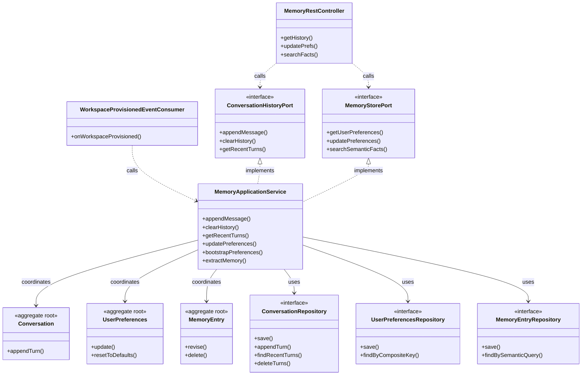

# Application Model Specification — Memory Bounded Context

## Document Metadata
- **Version**: 2.1.0
- **Status**: Updated per Review
- **Date**: August 2, 2026
- **Author**: Principal Clean Architect
- **References**: 
  - [`domain-model.md`](file:///D:/VsCode/Java/ai_executive_assistant/docs/domain-model/memory/domain-model.md)
  - [`context-map.md`](file:///D:/VsCode/Java/ai_executive_assistant/docs/context-mapping/context-map.md)
  - [`architecture-v2.md`](file:///D:/VsCode/Java/ai_executive_assistant/docs/architecture/architecture-v2.md)
  - [`user-stories-v2.md`](file:///D:/VsCode/Java/ai_executive_assistant/docs/requirements/user-stories-v2.md)

---

## 1. Executive Summary

The **Memory Bounded Context** acts as the system of record for chat logs, personalized user defaults, scheduling overlap constraints, and long-term semantic user facts.

This document outlines the **Application Layer** for the Memory context, describing the conversation logging use cases, user preferences storage, semantic memory ingestion pathways, command/query definitions, and the public ports (`ConversationHistoryPort` and `MemoryStorePort`) queried by the AI Agent reasoner.

---

## 2. Use Case Catalog

### UC-MEM-001: Append Conversation Turn
- **ID**: `UC-MEM-001`
- **Actor**: Agent / User
- **Trigger**: New message is sent or generated in the chat window.
- **Pre-conditions**:
  - The `Conversation` aggregate exists in an active status.
- **Post-conditions**:
  - A new `ConversationTurn` is appended.
  - The conversation's `lastTurnTimestamp` is updated.
- **Normal Flow**:
  1. The application layer receives the conversation ID, sender role (User or Agent), and message content.
  2. The application loads the `Conversation` aggregate.
  3. A transaction is opened:
     - The application validates that the new turn's timestamp is chronologically after the `lastTurnTimestamp` (INV-MEM-01).
     - The application appends the turn via the repository's fast-path query `appendTurn` (writing the turn directly and updating the root timestamp, avoiding loading the entire message history into memory).
     - Transaction commits.
  4. Event `MemoryUpdated` is published.

### UC-MEM-002: Fetch Recent Conversation History
- **ID**: `UC-MEM-002`
- **Actor**: Agent (Reasoning Loop)
- **Trigger**: AI Agent needs context to answer or plan.
- **Pre-conditions**:
  - Workspace and conversation are active.
- **Normal Flow**:
  1. The application receives conversation ID and a `maxTurns` parameter.
  2. The application queries the repository for the last `N` turns ordered chronologically.
  3. Returns the list of `TurnDTO` entities.

### UC-MEM-003: Update User Preferences
- **ID**: `UC-MEM-003`
- **Actor**: User
- **Trigger**: User changes settings in their profile dashboard.
- **Normal Flow**:
  1. The application receives preference updates (timezone, priority defaults, overlap constraints, channel alerts).
  2. A transaction is opened:
     - The application loads the `UserPreferences` aggregate by the composite key `(workspaceId, userId)`.
     - Invokes `UserPreferences.update(fields)` with validation.
     - Saves the updated aggregate.
     - Transaction commits.
  3. Event `MemoryUpdated` is published (allowing Calendar or Notifications context to react to changes).
- **Preference Boundary Note**: Memory owns scheduling and task defaults — timezone, defaultPriority, preventCalendarOverlap, leadTimeMinutes. Channel routing, email/Slack references, and digest schedules are owned by the Notification context (`NotificationProfile`).

### UC-MEM-004: Start Conversation
- **ID**: `UC-MEM-004`
- **Actor**: Agent / User
- **Trigger**: First message in a new chat session; no existing `Conversation` aggregate for the session.
- **Pre-conditions**:
  - No active `Conversation` exists for the given `(workspaceId, sessionId)`.
- **Post-conditions**:
  - A new `Conversation` aggregate is created in `Active` status.
- **Normal Flow**:
  1. The application checks `ConversationRepository.findById(sessionId, workspaceId)`.
  2. If absent, opens a transaction:
     - Instantiates `Conversation` via factory with `(workspaceId, sessionId)`.
     - Saves to `ConversationRepository` and commits.

### UC-MEM-005: Clear Conversation History
- **ID**: `UC-MEM-005`
- **Actor**: User
- **Trigger**: User requests to wipe chat history for a session (MEM-001 AC).
- **Pre-conditions**:
  - `Conversation` aggregate exists.
- **Post-conditions**:
  - All `ConversationTurn` records are deleted; conversation is reset.
- **Normal Flow**:
  1. Receives `ClearConversationCommand`.
  2. A transaction is opened:
     - Calls `ConversationRepository.deleteTurns(conversationId)`.
     - Commits.
  3. Event `MemoryUpdated` is published.

### UC-MEM-006: List Conversations for User
- **ID**: `UC-MEM-006`
- **Actor**: User
- **Trigger**: User opens the history panel to browse past sessions.
- **Normal Flow**:
  1. Receives `ListConversationsQuery`.
  2. Queries `ConversationRepository.findByWorkspace(workspaceId, userId)`.
  3. Returns `List<ConversationSummaryDTO>` (id, title, lastTurnTimestamp).

### UC-MEM-007: Bootstrap Default Preferences
- **ID**: `UC-MEM-007`
- **Actor**: System (WorkspaceProvisionedEventConsumer)
- **Trigger**: `WorkspaceProvisioned` event received from Workspace context.
- **Pre-conditions**:
  - No `UserPreferences` record exists for `(workspaceId, userId)`.
- **Post-conditions**:
  - A `UserPreferences` aggregate with system defaults is created.
- **Normal Flow**:
  1. Consumer receives `WorkspaceProvisioned` event.
  2. Checks `UserPreferencesRepository.findByCompositeKey(workspaceId, userId)`.
  3. If absent, opens a transaction:
     - Instantiates `UserPreferences` with system defaults (timezone=UTC, priority=Medium, overlap=false, leadTime=15).
     - Saves and commits.

### UC-MEM-008: Extract Semantic Memory (Async)
- **ID**: `UC-MEM-008`
- **Actor**: System (post-conversation analysis worker)
- **Trigger**: Periodic or event-driven extraction after conversation completion (MEM-003).
- **Normal Flow**:
  1. Worker receives `ExtractMemoryCommand` referencing a conversationId.
  2. Loads recent turns via `ConversationRepository.findRecentTurns`.
  3. Passes turn text through `SensitiveFactScreeningService` to filter PII/unsafe content.
  4. Persists extracted facts as `MemoryEntry` aggregates via `MemoryEntryRepository`.
  5. Publishes `MemoryUpdated`.

### UC-MEM-009: Manage Memory Entry (View / Edit / Delete)
- **ID**: `UC-MEM-009`
- **Actor**: User
- **Trigger**: User inspects, edits, or removes a stored semantic fact (MEM-003 AC).
- **Normal Flow (View)**:
  1. Receives `ListMemoryEntriesQuery` or `GetMemoryEntryQuery`.
  2. Returns `List<MemoryEntryDTO>` or single `MemoryEntryDTO`.
- **Normal Flow (Revise)**:
  1. Receives `ReviseMemoryEntryCommand`.
  2. Transaction: loads `MemoryEntry`, calls `MemoryEntry.revise(newContent)`, saves.
- **Normal Flow (Delete)**:
  1. Receives `DeleteMemoryEntryCommand`.
  2. Transaction: loads `MemoryEntry`, calls `MemoryEntry.delete()`, saves (soft-removed).

### UC-MEM-010: Apply Retention Policy
- **ID**: `UC-MEM-010`
- **Actor**: System (Cleanup Scheduler)
- **Trigger**: Periodic cron execution.
- **Normal Flow**:
  1. Queries `ConversationRepository` for conversations whose last turn is older than the retention threshold from user preferences.
  2. For each eligible conversation, calls `ConversationRepository.deleteTurns(conversationId)`.
  3. Publishes `MemoryUpdated` per workspace.

---

## 3. Command Catalog

### AppendTurnCommand
```typescript
interface AppendTurnCommand {
  workspaceId: string;
  conversationId: string;
  senderRole: "User" | "Agent";
  messageContent: string;
}
```

### UpdatePreferencesCommand
```typescript
interface UpdatePreferencesCommand {
  workspaceId: string;
  userId: string;
  timezone: string;
  defaultPriority: "High" | "Medium" | "Low";
  overlapPref: boolean;
  leadTimeMinutes: number;
}
```

### CreateConversationCommand
```typescript
interface CreateConversationCommand {
  workspaceId: string;
  sessionId: string;
  userId: string;
}
```

### ClearConversationCommand
```typescript
interface ClearConversationCommand {
  workspaceId: string;
  conversationId: string;
}
```

### ResetPreferencesCommand
```typescript
interface ResetPreferencesCommand {
  workspaceId: string;
  userId: string;
}
```

### ExtractMemoryCommand
```typescript
interface ExtractMemoryCommand {
  workspaceId: string;
  conversationId: string;
}
```

### ReviseMemoryEntryCommand
```typescript
interface ReviseMemoryEntryCommand {
  workspaceId: string;
  memoryEntryId: string;
  newContent: string;
}
```

### DeleteMemoryEntryCommand
```typescript
interface DeleteMemoryEntryCommand {
  workspaceId: string;
  memoryEntryId: string;
}
```

---

## 4. Query Catalog

### GetConversationHistoryQuery
- **Parameters**: `workspaceId: string`, `conversationId: string`, `limit: number`
- **Return Type**: `List<TurnDTO>`

### GetUserPreferencesQuery
- **Parameters**: `workspaceId: string`, `userId: string`
- **Return Type**: `PreferencesDTO`

### ListConversationsQuery
- **Parameters**: `workspaceId: string`, `userId: string`
- **Return Type**: `List<ConversationSummaryDTO>`

### GetMemoryEntryQuery
- **Parameters**: `workspaceId: string`, `memoryEntryId: string`
- **Return Type**: `MemoryEntryDTO`

### ListMemoryEntriesQuery
- **Parameters**: `workspaceId: string`, `userId: string`, `page: number`, `pageSize: number`
- **Return Type**: `List<MemoryEntryDTO>`

### SearchSemanticFactsQuery
- **Parameters**: `workspaceId: string`, `queryText: string`, `limit: number`, `confidenceThreshold?: number`
- **Return Type**: `List<MemoryEntryDTO>`

---

## 5. Inbound Ports

### `ConversationHistoryPort`
```java
package com.assistant.memory.application.ports.in;

import com.assistant.shared.WorkspaceId;
import com.assistant.shared.SessionId;
import java.util.List;

public interface ConversationHistoryPort {
    void appendMessage(AppendTurnCommand command);
    void clearHistory(WorkspaceId workspaceId, SessionId conversationId);
    List<TurnDTO> getRecentTurns(WorkspaceId workspaceId, SessionId conversationId, int limit);
}
```

### `MemoryStorePort`
```java
package com.assistant.memory.application.ports.in;

import com.assistant.shared.WorkspaceId;
import com.assistant.shared.UserId;

public interface MemoryStorePort {
    PreferencesDTO getUserPreferences(WorkspaceId workspaceId, UserId userId);
    void updatePreferences(UpdatePreferencesCommand command);
    List<MemoryEntryDTO> searchSemanticFacts(WorkspaceId workspaceId, String queryText);
}
```

---

## 6. Outbound Ports

### `ConversationRepository`
```java
package com.assistant.memory.application.ports.out;

import com.assistant.memory.domain.model.Conversation;
import com.assistant.memory.domain.model.ConversationTurn;
import com.assistant.shared.WorkspaceId;
import com.assistant.shared.SessionId;
import java.util.Optional;
import java.util.List;

public interface ConversationRepository {
    void save(Conversation conversation);
    void appendTurn(SessionId conversationId, ConversationTurn turn);
    Optional<Conversation> findById(SessionId conversationId, WorkspaceId workspaceId);
    List<ConversationTurn> findRecentTurns(SessionId conversationId, int limit);
    void deleteTurns(SessionId conversationId);
}
```

### `UserPreferencesRepository`
```java
package com.assistant.memory.application.ports.out;

import com.assistant.memory.domain.model.UserPreferences;
import com.assistant.shared.WorkspaceId;
import com.assistant.shared.UserId;
import java.util.Optional;

public interface UserPreferencesRepository {
    void save(UserPreferences preferences);
    Optional<UserPreferences> findByCompositeKey(WorkspaceId workspaceId, UserId userId);
}
```

### `MemoryEntryRepository`
```java
package com.assistant.memory.application.ports.out;

import com.assistant.memory.domain.model.MemoryEntry;
import com.assistant.shared.WorkspaceId;
import com.assistant.shared.UserId;
import java.util.Optional;
import java.util.List;

public interface MemoryEntryRepository {
    void save(MemoryEntry entry);
    Optional<MemoryEntry> findById(String memoryEntryId, WorkspaceId workspaceId);
    List<MemoryEntry> findByUser(WorkspaceId workspaceId, UserId userId, int page, int pageSize);
    List<MemoryEntry> findBySemanticQuery(WorkspaceId workspaceId, String queryText, int limit, double confidenceThreshold);
    void delete(String memoryEntryId, WorkspaceId workspaceId);
}
```

---

## 8. Domain Event Publications

| Event | Published by | Trigger |
| :--- | :--- | :--- |
| `MemoryUpdated` | `MemoryApplicationService` | After UC-MEM-001 (append), UC-MEM-003 (preferences), UC-MEM-005 (clear), UC-MEM-008 (extract) |

### Domain Event Consumers

#### `WorkspaceProvisionedEventConsumer`
- **Listens to**: `WorkspaceProvisioned` (from Workspace context)
- **Behavior**: Calls UC-MEM-007 bootstrap logic to create default `UserPreferences` if none exist.

---

## 9. Dependency Diagram


