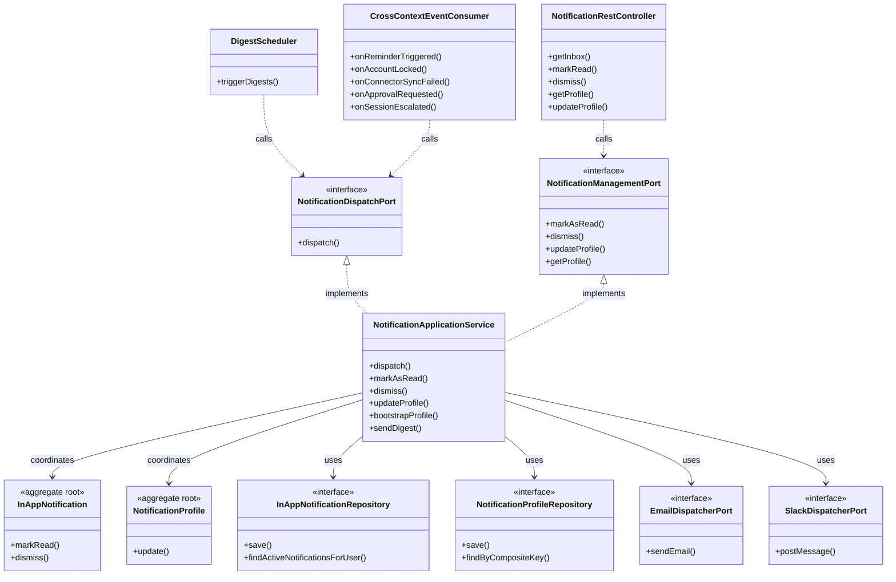

# Application Model Specification — Notification Bounded Context

## Document Metadata
- **Version**: 2.1.0
- **Status**: Updated per Review
- **Date**: August 2, 2026
- **Author**: Principal Clean Architect
- **References**: 
  - [`domain-model.md`](file:///D:/VsCode/Java/ai_executive_assistant/docs/domain-model/notification/domain-model.md)
  - [`context-map.md`](file:///D:/VsCode/Java/ai_executive_assistant/docs/context-mapping/context-map.md)
  - [`architecture-v2.md`](file:///D:/VsCode/Java/ai_executive_assistant/docs/architecture/architecture-v2.md)
  - [`user-stories-v2.md`](file:///D:/VsCode/Java/ai_executive_assistant/docs/requirements/user-stories-v2.md)

---

## 1. Executive Summary

The **Notification Bounded Context** (Notification Dispatch) is the system of record for routing, rendering, buffering, and dispatching multi-channel user alerts (In-App, Email, and Slack).

This document outlines the **Application Layer** for the Notification context. It covers the notification dispatch use cases, in-app notification state transitions (read/unread/dismissed), preference management, command/query definitions, and the inbound `NotificationDispatchPort` interface used by other contexts (such as Calendar reminders or Connector hub sync alerts).

---

## 2. Use Case Catalog

### UC-NOTIF-001: Dispatch Notification
- **ID**: `UC-NOTIF-001`
- **Actor**: System (Event Handler / Calendar Reminder / Workflow Action)
- **Trigger**: System requests to send a user notification.
- **Pre-conditions**:
  - Valid `WorkspaceId` and `UserId` context.
- **Post-conditions**:
  - The notification is evaluated against user preferences and dispatched to eligible channels.
- **Normal Flow**:
  1. The application receives the notification request (workspaceId, userId, title, content, urgency level, parameters).
  2. The application loads the `NotificationProfile` for the target user. If none exists, uses system-wide default mapping.
  3. The application determines the target delivery channels from the profile's routing map based on the notification's `UrgencyLevel` (e.g. Critical dispatches to In-App, Email, and Slack, while Low dispatches to In-App only).
  4. For each target channel:
     - **In-App**: Opens a transaction:
       - Instantiates `InAppNotification` in `UNREAD` status.
       - Saves to `InAppNotificationRepository` and commits.
       - Publishes `InAppNotificationCreated` to stream the update to the user interface.
     - **Email**: Renders the notification text using templates and invokes `EmailDispatcherPort` asynchronously.
     - **Slack**: Resolves the webhook reference, formats the message block, and invokes `SlackDispatcherPort` asynchronously.

### UC-NOTIF-002: Mark Notification Read / Dismissed
- **ID**: `UC-NOTIF-002`
- **Actor**: User
- **Trigger**: User clicks read or dismiss on their in-app inbox.
- **Pre-conditions**:
  - The target `InAppNotification` exists and belongs to the user.
- **Normal Flow (Mark Read)**:
  1. The application loads the `InAppNotification`.
  2. A transaction is opened:
     - Calls `InAppNotification.markRead()`. Status transitions to `READ`.
     - Saves aggregate and commits.
- **Normal Flow (Dismiss)**:
  1. The application loads the `InAppNotification`.
  2. A transaction is opened:
     - Calls `InAppNotification.dismiss()`. Status transitions to `DISMISSED` (soft-deleted from active views).
     - Saves aggregate and commits.

### UC-NOTIF-003: Update Notification Profile
- **ID**: `UC-NOTIF-003`
- **Actor**: User
- **Trigger**: User updates alert routes or schedules.
- **Normal Flow**:
  1. The application receives profile configuration updates.
  2. A transaction is opened:
     - Loads `NotificationProfile` by `(workspaceId, userId)`.
     - Calls `NotificationProfile.update(channelRoutingMap, emailAddress, slackWebhookRef, digestSchedule, consentPolicy)`.
     - Saves aggregate and commits.
- **Preference Boundary Note**: `NotificationProfile` owns channel routing map, email/Slack references, digest schedule, and consent policy. Timezone, defaultPriority, preventCalendarOverlap, and leadTimeMinutes are owned by `UserPreferences` in the Memory context.

### UC-NOTIF-004: Bootstrap Notification Profile
- **ID**: `UC-NOTIF-004`
- **Actor**: System (WorkspaceProvisionedEventConsumer)
- **Trigger**: `WorkspaceProvisioned` event received from Workspace context, or first call to `dispatch` when no profile exists.
- **Pre-conditions**:
  - No `NotificationProfile` record exists for `(workspaceId, userId)`.
- **Post-conditions**:
  - A `NotificationProfile` with system defaults is created (in-app only, no email/Slack).
- **Normal Flow**:
  1. Consumer receives `WorkspaceProvisioned` (or dispatch detects missing profile).
  2. Checks `NotificationProfileRepository.findByCompositeKey(workspaceId, userId)`.
  3. If absent, opens a transaction:
     - Instantiates `NotificationProfile` with defaults.
     - Saves and commits.

### UC-NOTIF-005: Apply Channel Fallback Policy
- **ID**: `UC-NOTIF-005`
- **Actor**: System (internal step within UC-NOTIF-001)
- **Trigger**: A delivery channel (Email or Slack) fails during UC-NOTIF-001.
- **Post-conditions**:
  - Notification is re-delivered to the in-app channel as fallback.
- **Normal Flow**:
  1. During UC-NOTIF-001, if `EmailDispatcherPort` or `SlackDispatcherPort` throws an exception:
     - The application logs the channel failure.
     - Falls back to creating an `InAppNotification` (if not already created for that channel combination).

### UC-NOTIF-006: Suppress Duplicate In-App Alerts
- **ID**: `UC-NOTIF-006`
- **Actor**: System (internal step within UC-NOTIF-001)
- **Trigger**: A `DispatchNotificationCommand` arrives for a notification already acknowledged by the user.
- **Post-conditions**:
  - Duplicate in-app notification is not created.
- **Normal Flow**:
  1. Before creating an `InAppNotification`, the application queries `InAppNotificationRepository` for a recent notification with the same `(workspaceId, userId, title, content)` within a deduplication window.
  2. If a match is found and its status is `READ` or `DISMISSED`, the in-app creation step is skipped.

### UC-NOTIF-007: Generate and Send Email Report (Digest)
- **ID**: `UC-NOTIF-007`
- **Actor**: System (DigestScheduler)
- **Trigger**: Digest schedule tick for a user whose `NotificationProfile` has digest consent enabled.
- **Pre-conditions**:
  - User's `NotificationProfile` has `digestConsentPolicy = ENABLED` and a configured `digestSchedule`.
- **Post-conditions**:
  - A digest email summarising recent in-app notifications is sent via `EmailDispatcherPort`.
- **Normal Flow**:
  1. Scheduler triggers `SendDigestCommand` for each eligible user.
  2. Application loads `NotificationProfile` and verifies consent.
  3. Queries `InAppNotificationRepository.findActiveNotificationsForUser` for unread items since last digest.
  4. Renders digest using notification templates.
  5. Calls `EmailDispatcherPort.sendEmail(emailAddress, subject, renderedBody)` outside transaction.
  6. Updates `NotificationProfile.lastDigestSentAt` in a transaction.

### UC-NOTIF-008: Schedule Digest Execution
- **ID**: `UC-NOTIF-008`
- **Actor**: System (Cron)
- **Trigger**: Periodic cron execution (e.g. every hour).
- **Normal Flow**:
  1. Background worker queries `NotificationProfileRepository` for profiles with digest enabled and `nextDigestAt <= now`.
  2. For each matching profile, dispatches `SendDigestCommand` (UC-NOTIF-007).

### UC-NOTIF-009: Consume Cross-Context Dispatch Requests
- **ID**: `UC-NOTIF-009`
- **Actor**: System (Event Consumers)
- **Trigger**: Domain events from other bounded contexts that require user notification.
- **Consumed Events**:
  - `ReminderTriggered` (Calendar) → dispatch reminder alert via UC-NOTIF-001.
  - `AccountLocked` (Auth) → dispatch security alert via UC-NOTIF-001.
  - `ConnectorSyncFailed` (Connector) → dispatch error alert via UC-NOTIF-001.
  - `ApprovalRequested` (AI Agent) → dispatch approval request alert via UC-NOTIF-001.
  - `SessionEscalated` (AI Agent) → dispatch escalation alert via UC-NOTIF-001.
- **Normal Flow** (same for all):
  1. Event consumer maps event payload to `DispatchNotificationCommand`.
  2. Calls `NotificationDispatchPort.dispatch(command)`.

---

## 3. Command Catalog

### DispatchNotificationCommand
```typescript
interface DispatchNotificationCommand {
  workspaceId: string;
  userId: string;
  title: string;
  content: string;
  urgencyLevel: "Low" | "Normal" | "Urgent" | "Critical";
  parameters?: Record<string, any>;
}
```

### MarkNotificationReadCommand
```typescript
interface MarkNotificationReadCommand {
  workspaceId: string;
  userId: string;
  notificationId: string;
}
```

### DismissNotificationCommand
```typescript
interface DismissNotificationCommand {
  workspaceId: string;
  userId: string;
  notificationId: string;
}
```

### UpdateNotificationProfileCommand
```typescript
interface UpdateNotificationProfileCommand {
  workspaceId: string;
  userId: string;
  channelRoutingMap: Record<string, string[]>;
  emailAddress?: string;
  slackWebhookRef?: string;
  digestSchedule?: string;
  consentPolicy: "ENABLED" | "DISABLED";
}
```

### SendDigestCommand
```typescript
interface SendDigestCommand {
  workspaceId: string;
  userId: string;
}
```

---

## 4. Query Catalog

### GetInAppNotificationsQuery
- **Parameters**: `workspaceId: string`, `userId: string`, `statusFilter: "Unread" | "Read" | "All"`
- **Return Type**: `List<InAppNotificationDTO>`

### GetNotificationProfileQuery
- **Parameters**: `workspaceId: string`, `userId: string`
- **Return Type**: `NotificationProfileDTO`
  ```typescript
  interface NotificationProfileDTO {
    workspaceId: string;
    userId: string;
    channelRoutingMap: Record<string, string[]>;
    emailAddress?: string;
    slackWebhookRef?: string;
    digestSchedule?: string;
    consentPolicy: string;
  }
  ```

---

## 5. Inbound Ports

### `NotificationDispatchPort`
```java
package com.assistant.notification.application.ports.in;

public interface NotificationDispatchPort {
    /**
     * Entry point to dispatch a notification via routing rules.
     */
    void dispatch(DispatchNotificationCommand command);
}
```

### `NotificationManagementPort`
```java
package com.assistant.notification.application.ports.in;

import com.assistant.shared.WorkspaceId;
import com.assistant.shared.UserId;
import com.assistant.shared.NotificationId;

public interface NotificationManagementPort {
    void markAsRead(MarkNotificationReadCommand command);
    void dismiss(DismissNotificationCommand command);
    void updateProfile(UpdateNotificationProfileCommand command);
    NotificationProfileDTO getProfile(GetNotificationProfileQuery query);
}
```

---

## 6. Outbound Ports

### `InAppNotificationRepository`
```java
package com.assistant.notification.application.ports.out;

import com.assistant.notification.domain.model.InAppNotification;
import com.assistant.shared.WorkspaceId;
import com.assistant.shared.UserId;
import com.assistant.shared.NotificationId;
import java.util.Optional;
import java.util.List;

public interface InAppNotificationRepository {
    void save(InAppNotification notification);
    Optional<InAppNotification> findById(NotificationId id, WorkspaceId workspaceId);
    List<InAppNotification> findActiveNotificationsForUser(WorkspaceId workspaceId, UserId userId);
}
```

### `NotificationProfileRepository`
```java
package com.assistant.notification.application.ports.out;

import com.assistant.notification.domain.model.NotificationProfile;
import com.assistant.shared.WorkspaceId;
import com.assistant.shared.UserId;
import java.util.Optional;

public interface NotificationProfileRepository {
    void save(NotificationProfile profile);
    Optional<NotificationProfile> findByCompositeKey(WorkspaceId workspaceId, UserId userId);
}
```

### `EmailDispatcherPort`
```java
package com.assistant.notification.application.ports.out;

public interface EmailDispatcherPort {
    void sendEmail(String toEmail, String subject, String renderedBody);
}
```

### `SlackDispatcherPort`
```java
package com.assistant.notification.application.ports.out;

public interface SlackDispatcherPort {
    void postMessage(String slackWebhookRef, String textMessage);
}
```

---

## 7. Dependency Diagram


