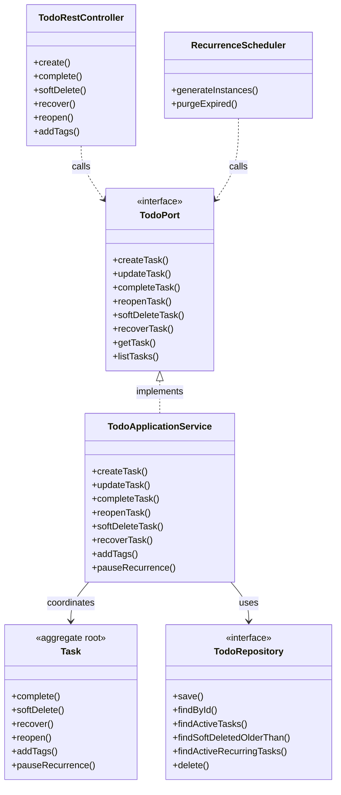

# Application Model Specification — Todo Bounded Context

## Document Metadata
- **Version**: 2.1.0
- **Status**: Updated per Review
- **Date**: August 2, 2026
- **Author**: Principal Clean Architect
- **References**: 
  - [`domain-model.md`](file:///D:/VsCode/Java/ai_executive_assistant/docs/domain-model/todo/domain-model.md)
  - [`context-map.md`](file:///D:/VsCode/Java/ai_executive_assistant/docs/context-mapping/context-map.md)
  - [`architecture-v2.md`](file:///D:/VsCode/Java/ai_executive_assistant/docs/architecture/architecture-v2.md)
  - [`user-stories-v2.md`](file:///D:/VsCode/Java/ai_executive_assistant/docs/requirements/user-stories-v2.md)

---

## 1. Executive Summary

The **Todo Bounded Context** is the system of record for task lifecycle management, priority classification, tagging, and automated recurrence scheduling.

This document outlines the **Application Layer** for the Todo context, detailing the task CRUD use cases, soft-deletion recovery flows, async recurrence instance generation, command and query catalogs, and inbound port interfaces used by the AI Agent tools and Connector Hub.

---

## 2. Use Case Catalog

### UC-TODO-001: Create Task
- **ID**: `UC-TODO-001`
- **Actor**: User / Agent Tool / Connector
- **Trigger**: Request to create a new task.
- **Pre-conditions**:
  - Valid `WorkspaceId` context.
- **Post-conditions**:
  - A new `Task` aggregate is persisted in `ACTIVE` status.
  - Event published: `TaskCreated`.
- **Normal Flow**:
  1. The application layer receives the task details (title, description, priority, due date, tags).
  2. The application validates the required `Title` constraint (non-empty).
  3. A transaction is opened:
     - The application instantiates the `Task` aggregate.
     - Enforces default priority to `Medium` if omitted.
     - Saves the task to `TodoRepository`.
     - Transaction commits.
  4. Event `TaskCreated` is published.

### UC-TODO-002: Update Task
- **ID**: `UC-TODO-002`
- **Actor**: User / Agent Tool / Connector
- **Trigger**: Request to edit task details.
- **Pre-conditions**:
  - The task exists and is not soft-deleted.
- **Normal Flow**:
  1. The application loads the `Task` by `TaskId` and verifies the `WorkspaceId` matches.
  2. A transaction is opened:
     - The application invokes `Task.update(title, description, priority, dueDate)`.
     - Saves the updated aggregate.
     - Transaction commits.

### UC-TODO-003: Soft-Delete Task
- **ID**: `UC-TODO-003`
- **Actor**: User / Agent Tool / Connector
- **Trigger**: Request to delete a task.
- **Post-conditions**:
  - Task transitions to `SoftDeleted` status.
  - Soft-delete timestamp is recorded.
- **Normal Flow**:
  1. The application loads the task.
  2. A transaction is opened:
     - The application invokes `Task.softDelete(currentTime)`.
     - Saves the aggregate and commits.
  3. The task is no longer visible in active queries but remains in the database for a 2-hour recovery window.

### UC-TODO-004: Recover Soft-Deleted Task
- **ID**: `UC-TODO-004`
- **Actor**: User
- **Trigger**: Request to recover a deleted task.
- **Pre-conditions**:
  - Task status is `SoftDeleted`.
  - Elapsed time since soft-delete is <= 2 hours.
- **Normal Flow**:
  1. The application loads the task.
  2. A transaction is opened:
     - The application verifies the timestamp does not exceed the 2-hour window.
     - Invokes `Task.recover()`. Status is restored to `ACTIVE`.
     - Saves the aggregate and commits.
  3. Event `TaskRecovered` is published.

### UC-TODO-005: Complete Task
- **ID**: `UC-TODO-005`
- **Actor**: User / Agent Tool
- **Trigger**: Request to mark a task as completed.
- **Post-conditions**:
  - Task lifecycle status is updated to `Completed`.
  - Event published: `TaskCompleted`.
- **Normal Flow**:
  1. The application loads the task.
  2. A transaction is opened:
     - The application invokes `Task.complete()`.
     - Saves the aggregate and commits.
  3. Event `TaskCompleted` is published (Memory context consumes this to update user history).

### UC-TODO-006: Generate Recurring Task Instances
- **ID**: `UC-TODO-006`
- **Actor**: System (Cron/Scheduler)
- **Trigger**: Scheduled execution tick.
- **Normal Flow**:
  1. A background worker queries the repository for active parent tasks with recurrence rules.
  2. For each parent task:
     - Outside the parent transaction, calculates if a new occurrence is due based on the recurrence pattern.
     - If due, opens a transaction:
       - Instantiates a new child `Task` aggregate (inheriting title, description, priority, and tags from parent).
       - Updates the parent's `lastGeneratedOccurrence` field.
       - Saves both child task and parent template (using optimistic version locking to prevent double generation).
       - Commits transaction and publishes `TaskCreated` for the new child instance.

### UC-TODO-007: Purge Soft-Deleted Tasks
- **ID**: `UC-TODO-007`
- **Actor**: System (Cleanup Cron)
- **Trigger**: Periodic cron execution (e.g. daily).
- **Normal Flow**:
  1. The background process queries `TodoRepository` for tasks in `SoftDeleted` status where soft-delete timestamp is older than 30 days.
  2. For each matching task, opens a transaction:
     - The database record is physically removed.
     - Commits the transaction.
  3. Event `TaskPurged` is published per removed task.

### UC-TODO-008: Manage Task Tags
- **ID**: `UC-TODO-008`
- **Actor**: User / Agent Tool
- **Trigger**: User adds or removes a tag on a task (TODO-002 AC).
- **Pre-conditions**:
  - Task exists and is not soft-deleted.
- **Normal Flow (Add Tags)**:
  1. Receives `AddTaskTagsCommand`.
  2. Transaction: loads `Task`, calls `Task.addTags(tags)`, saves.
- **Normal Flow (Remove Tag)**:
  1. Receives `RemoveTaskTagCommand`.
  2. Transaction: loads `Task`, calls `Task.removeTag(tag)`, saves.

### UC-TODO-009: Pause / Resume / Stop Recurrence
- **ID**: `UC-TODO-009`
- **Actor**: User
- **Trigger**: User modifies recurrence behaviour on a parent task (TODO-003 AC).
- **Pre-conditions**:
  - Task has an active `RecurrenceSchedule`.
- **Normal Flow (Pause)**:
  1. Receives `PauseRecurrenceCommand`.
  2. Transaction: loads `Task`, calls `Task.pauseRecurrence()`, saves.
  3. Event `RecurrencePaused` is published.
- **Normal Flow (Resume)**:
  1. Receives `ResumeRecurrenceCommand`.
  2. Transaction: loads `Task`, calls `Task.resumeRecurrence()`, saves.
  3. Event `RecurrenceResumed` is published.
- **Normal Flow (Stop)**:
  1. Receives `StopRecurrenceCommand`.
  2. Transaction: loads `Task`, calls `Task.stopRecurrence()`, saves.
  3. Event `RecurrenceStopped` is published.

### UC-TODO-010: Reopen Completed Task
- **ID**: `UC-TODO-010`
- **Actor**: User / Agent Tool
- **Trigger**: User reactivates a previously completed task.
- **Pre-conditions**:
  - Task status is `Completed`.
- **Post-conditions**:
  - Task status returns to `ACTIVE`.
  - Event published: `TaskReopened`.
- **Normal Flow**:
  1. Receives `ReopenTaskCommand`.
  2. Transaction: loads `Task`, calls `Task.reopen()`, saves.
  3. Event `TaskReopened` is published.

### UC-TODO-011: List / Filter Tasks
- **ID**: `UC-TODO-011`
- **Actor**: User / Agent Tool
- **Trigger**: User opens the task list view (TODO-001 AC).
- **Normal Flow**:
  1. Receives `ListTasksQuery` with optional filters (tag, priority, includeCompleted, sortBy, sortOrder).
  2. Queries `TodoRepository` — excludes soft-deleted tasks by default.
  3. Returns `List<TaskDTO>` sorted and filtered per query parameters.

---

## 3. Command Catalog

### CreateTaskCommand
```typescript
interface CreateTaskCommand {
  workspaceId: string;
  title: string;
  description?: string;
  priority?: "High" | "Medium" | "Low";
  dueDate?: string;
  tags?: string[];
}
```

### UpdateTaskCommand
```typescript
interface UpdateTaskCommand {
  workspaceId: string;
  taskId: string;
  title: string;
  description?: string;
  priority: "High" | "Medium" | "Low";
  dueDate?: string;
}
```

### ConfigureRecurrenceCommand
```typescript
interface ConfigureRecurrenceCommand {
  workspaceId: string;
  taskId: string;
  pattern: "DAILY" | "WEEKLY" | "MONTHLY";
  interval?: number;
}
```

### SoftDeleteTaskCommand
```typescript
interface SoftDeleteTaskCommand {
  workspaceId: string;
  taskId: string;
}
```

### RecoverTaskCommand
```typescript
interface RecoverTaskCommand {
  workspaceId: string;
  taskId: string;
}
```

### CompleteTaskCommand
```typescript
interface CompleteTaskCommand {
  workspaceId: string;
  taskId: string;
}
```

### ReopenTaskCommand
```typescript
interface ReopenTaskCommand {
  workspaceId: string;
  taskId: string;
}
```

### AddTaskTagsCommand
```typescript
interface AddTaskTagsCommand {
  workspaceId: string;
  taskId: string;
  tags: string[];
}
```

### RemoveTaskTagCommand
```typescript
interface RemoveTaskTagCommand {
  workspaceId: string;
  taskId: string;
  tag: string;
}
```

### PauseRecurrenceCommand
```typescript
interface PauseRecurrenceCommand {
  workspaceId: string;
  taskId: string;
}
```

### ResumeRecurrenceCommand
```typescript
interface ResumeRecurrenceCommand {
  workspaceId: string;
  taskId: string;
}
```

### StopRecurrenceCommand
```typescript
interface StopRecurrenceCommand {
  workspaceId: string;
  taskId: string;
}
```

---

## 4. Query Catalog

### GetTaskQuery
- **Parameters**: `workspaceId: string`, `taskId: string`
- **Return Type**: `TaskDTO`

### ListTasksQuery
- **Parameters**: 
  - `workspaceId: string`
  - `tag?: string`
  - `priority?: string`
  - `includeCompleted: boolean`
  - `sortBy?: "priority" | "dueDate" | "createdAt"`
  - `sortOrder?: "asc" | "desc"`
- **Return Type**: `List<TaskDTO>`
- **Notes**: Excludes soft-deleted tasks by default (TODO-001 AC).

### ListDeletedTasksQuery
- **Parameters**: `workspaceId: string`, `userId: string`
- **Return Type**: `List<TaskDTO>` (only `SoftDeleted` tasks within the 2-hour recovery window)

### GetRecurrenceTemplateQuery
- **Parameters**: `workspaceId: string`, `taskId: string`
- **Return Type**: `RecurrenceTemplateDTO`
  ```typescript
  interface RecurrenceTemplateDTO {
    taskId: string;
    recurrenceRule: string;
    lastGeneratedOccurrence?: string;
    recurrenceStatus: "Active" | "Paused" | "Stopped";
  }
  ```

---

## 5. Inbound Ports

### `TodoPort`
```java
package com.assistant.todo.application.ports.in;

import com.assistant.shared.WorkspaceId;
import com.assistant.shared.TaskId;
import java.util.List;

public interface TodoPort {
    TaskId createTask(CreateTaskCommand command);
    void updateTask(UpdateTaskCommand command);
    void completeTask(WorkspaceId workspaceId, TaskId taskId);
    void reopenTask(WorkspaceId workspaceId, TaskId taskId);
    void softDeleteTask(WorkspaceId workspaceId, TaskId taskId);
    void recoverTask(WorkspaceId workspaceId, TaskId taskId);
    
    TaskDTO getTask(WorkspaceId workspaceId, TaskId taskId);
    List<TaskDTO> listTasks(ListTasksQuery query);
}
```

---

## 6. Outbound Ports

### `TodoRepository`
> **Naming note**: The domain model uses `TaskRepository`. `TodoRepository` is the application-layer name used in this bounded context. Infrastructure adapters must bridge this name to the domain's `TaskRepository` contract to avoid confusion.

```java
package com.assistant.todo.application.ports.out;

import com.assistant.todo.domain.model.Task;
import com.assistant.shared.WorkspaceId;
import com.assistant.shared.TaskId;
import java.util.Optional;
import java.util.List;
import java.time.Instant;

public interface TodoRepository {
    void save(Task task);
    Optional<Task> findById(TaskId taskId, WorkspaceId workspaceId);
    List<Task> findActiveTasks(WorkspaceId workspaceId);
    List<Task> findSoftDeletedOlderThan(Instant threshold);
    List<Task> findActiveRecurringTasks();
    void delete(TaskId taskId, WorkspaceId workspaceId);
}
```

---

## 7. Dependency Diagram


