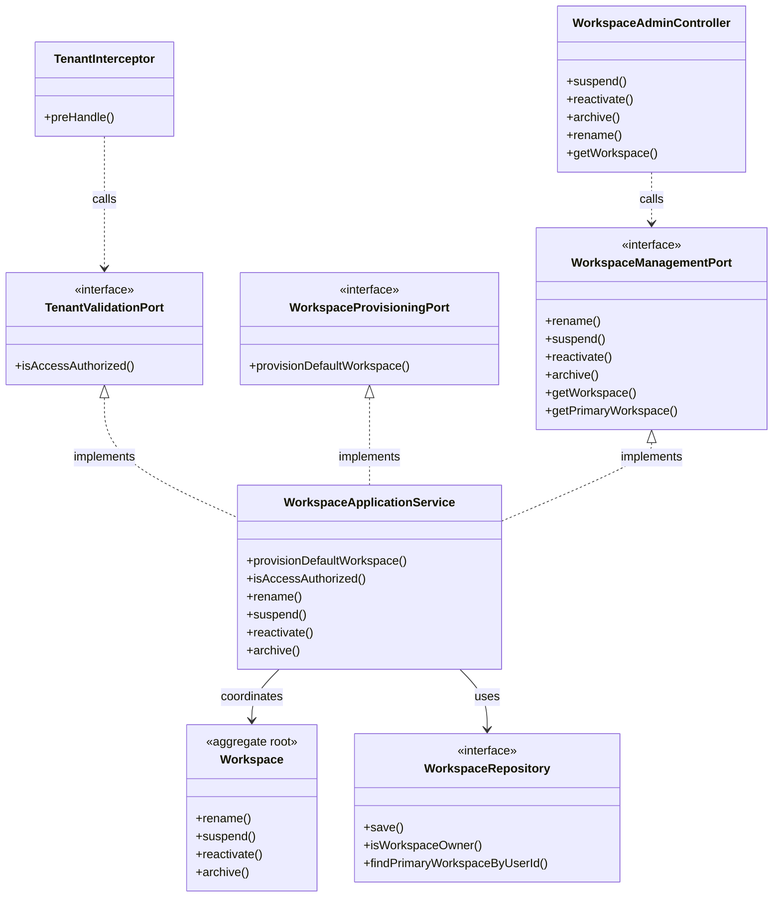

# Application Model Specification — Workspace Bounded Context

## Document Metadata
- **Version**: 2.1.0
- **Status**: Updated per Review
- **Date**: August 2, 2026
- **Author**: Principal Clean Architect
- **References**: 
  - [`domain-model.md`](file:///D:/VsCode/Java/ai_executive_assistant/docs/domain-model/workspace/domain-model.md)
  - [`context-map.md`](file:///D:/VsCode/Java/ai_executive_assistant/docs/context-mapping/context-map.md)
  - [`architecture-v2.md`](file:///D:/VsCode/Java/ai_executive_assistant/docs/architecture/architecture-v2.md)
  - [`user-stories-v2.md`](file:///D:/VsCode/Java/ai_executive_assistant/docs/requirements/user-stories-v2.md)

---

## 1. Executive Summary

The **Workspace Bounded Context** is the foundation of multi-tenancy and data isolation in the AI Executive Assistant application. It enforces logical database boundaries, manages workspace status, and exposes the gateway validation port to authenticate tenancy scopes across all other bounded contexts.

This document defines the **Application Layer** for the Workspace context, detailing the use cases, command inputs, query DTOs, inbound ports (such as tenancy validation), and outbound repository ports.

---

## 2. Use Case Catalog

### UC-WS-001: Provision Default Workspace
- **ID**: `UC-WS-001`
- **Actor**: System (Auth registration process)
- **Trigger**: User account registration (via `WorkspaceProvisioningPort` call).
- **Pre-conditions**:
  - A valid `UserId` has been created.
- **Post-conditions**:
  - A new `Workspace` aggregate is created in `ACTIVE` status.
  - Event published: `WorkspaceProvisioned`.
- **Normal Flow**:
  1. The application layer receives the user registration signal containing the `UserId`.
  2. Within the active transaction:
     - The application invokes `WorkspaceFactory` to instantiate a new `Workspace` (primary = true, status = ACTIVE, owner = userId).
     - The workspace is persisted via `WorkspaceRepository`.
  3. The domain event `WorkspaceProvisioned` is published.

### UC-WS-002: Validate Tenancy Access
- **ID**: `UC-WS-002`
- **Actor**: System (API gateway / interceptors / other bounded contexts)
- **Trigger**: Incoming API request or cross-context port call.
- **Pre-conditions**:
  - The request provides a `WorkspaceId` and `UserId`.
- **Post-conditions**:
  - Returns whether access is granted or denied.
- **Normal Flow**:
  1. The application layer receives `workspaceId` and `userId`.
  2. The application checks the fast-path validation query: `WorkspaceRepository.isWorkspaceOwner(workspaceId, userId)`.
  3. If true, access is granted. If false, access is denied (throws `TenantAccessDeniedException`).

### UC-WS-003: Rename Workspace
- **ID**: `UC-WS-003`
- **Actor**: Workspace Owner
- **Trigger**: User requests a change to the workspace name.
- **Pre-conditions**:
  - Workspace status is `ACTIVE`.
  - Requester holds the `OWNER` role.
- **Post-conditions**:
  - Workspace name is updated.
- **Normal Flow**:
  1. The application receives `WorkspaceId`, new name, and requester `UserId`.
  2. A transaction is opened:
     - The application loads the `Workspace` aggregate.
     - The application validates that the requester is the owner of the workspace.
     - The application Renames the workspace via `Workspace.rename(newName)`.
     - Saves changes and commits transaction.
  3. Event `WorkspaceRenamed` is published.

### UC-WS-004: Suspend Workspace
- **ID**: `UC-WS-004`
- **Actor**: System Operator
- **Trigger**: Administrative suspension request.
- **Pre-conditions**:
  - Operator holds `SYSTEM_OPERATOR` role.
  - Workspace status is `ACTIVE`.
- **Post-conditions**:
  - `Workspace` status transitions to `SUSPENDED`.
  - Write operations from other contexts are blocked (INV-WS-08); reads remain allowed.
- **Normal Flow**:
  1. Receives `SuspendWorkspaceCommand`.
  2. A transaction is opened:
     - Loads `Workspace`, calls `Workspace.suspend()`.
     - Saves and commits.
  3. Event `WorkspaceSuspended` is published.

### UC-WS-005: Reactivate Workspace
- **ID**: `UC-WS-005`
- **Actor**: System Operator
- **Trigger**: Suspension reversal request.
- **Pre-conditions**:
  - Workspace status is `SUSPENDED`.
- **Post-conditions**:
  - `Workspace` status returns to `ACTIVE`.
- **Normal Flow**:
  1. Receives `ReactivateWorkspaceCommand`.
  2. A transaction is opened:
     - Loads `Workspace`, calls `Workspace.reactivate()`.
     - Saves and commits.
  3. Event `WorkspaceReactivated` is published.

### UC-WS-006: Archive Workspace
- **ID**: `UC-WS-006`
- **Actor**: System Operator
- **Trigger**: Terminal decommission request.
- **Pre-conditions**:
  - Workspace status is `SUSPENDED`.
- **Post-conditions**:
  - `Workspace` transitions to `ARCHIVED` (terminal state; no further mutations permitted).
- **Normal Flow**:
  1. Receives `ArchiveWorkspaceCommand`.
  2. A transaction is opened:
     - Loads `Workspace`, calls `Workspace.archive()`.
     - Saves and commits.
  3. Event `WorkspaceArchived` is published.

### UC-WS-007: Resolve Primary Workspace for User
- **ID**: `UC-WS-007`
- **Actor**: System (Auth login / bootstrap flows)
- **Trigger**: Login or session initialisation requiring the primary workspace identity.
- **Normal Flow**:
  1. Receives `GetPrimaryWorkspaceQuery` with `UserId`.
  2. Calls `WorkspaceRepository.findPrimaryWorkspaceByUserId(userId)`.
  3. Returns `WorkspaceDTO` or throws `WorkspaceNotFoundException` if none found.

### UC-WS-008: Consume UserRegistered for Provisioning
- **ID**: `UC-WS-008`
- **Actor**: System (synchronous call from Auth — `WorkspaceProvisioningPort`)
- **Trigger**: Auth context calls `WorkspaceProvisioningPort.provisionDefaultWorkspace(userId)` during user registration.
- **Notes**: This use case is the implementation backing `UC-WS-001`. The provisioning path is synchronous port call (not an event), in alignment with the Auth model. This document records the provisioning contract as the sole path — no separate async `UserRegistered` consumer is wired at this time.

---

## 3. Command Catalog

### ProvisionWorkspaceCommand
```typescript
interface ProvisionWorkspaceCommand {
  userId: string;
}
```

### RenameWorkspaceCommand
```typescript
interface RenameWorkspaceCommand {
  workspaceId: string;
  userId: string;
  newName: string;
}
```

### SuspendWorkspaceCommand
```typescript
interface SuspendWorkspaceCommand {
  workspaceId: string;
  operatorId: string;
}
```

### ReactivateWorkspaceCommand
```typescript
interface ReactivateWorkspaceCommand {
  workspaceId: string;
  operatorId: string;
}
```

### ArchiveWorkspaceCommand
```typescript
interface ArchiveWorkspaceCommand {
  workspaceId: string;
  operatorId: string;
}
```

---

## 4. Query Catalog

### ValidateTenantQuery
- **Parameters**: `workspaceId: string`, `userId: string`
- **Return Type**: `boolean`
- **Notes**: `TenantValidationPort.isAccessAuthorized` throws `TenantAccessDeniedException` on denial rather than returning false — use case documents exception as the contract.

### GetWorkspaceDetailsQuery
- **Parameters**: `workspaceId: string`
- **Return Type**: `WorkspaceDTO`
  ```typescript
  interface WorkspaceDTO {
    workspaceId: string;
    name: string;
    status: string;
    ownerId: string;
  }
  ```

### GetPrimaryWorkspaceQuery
- **Parameters**: `userId: string`
- **Return Type**: `WorkspaceDTO`
- **Notes**: Used during login and bootstrapping to resolve the user's primary workspace. MVP enforces single-workspace-per-user invariant (expect exactly one result).

---

## 5. Inbound Ports

### `WorkspaceProvisioningPort`
```java
package com.assistant.workspace.application.ports.in;

import com.assistant.shared.UserId;
import com.assistant.shared.WorkspaceId;

public interface WorkspaceProvisioningPort {
    /**
     * Called by Auth to provision the default workspace.
     */
    WorkspaceId provisionDefaultWorkspace(UserId userId);
}
```

### `TenantValidationPort`
```java
package com.assistant.workspace.application.ports.in;

import com.assistant.shared.UserId;
import com.assistant.shared.WorkspaceId;

public interface TenantValidationPort {
    /**
     * Validates that the user is the owner of the active workspace.
     * Throws TenantAccessDeniedException if access is denied.
     */
    boolean isAccessAuthorized(WorkspaceId workspaceId, UserId userId);
}
```

### `WorkspaceManagementPort`
```java
package com.assistant.workspace.application.ports.in;

import com.assistant.shared.WorkspaceId;

public interface WorkspaceManagementPort {
    void rename(RenameWorkspaceCommand command);
    void suspend(SuspendWorkspaceCommand command);
    void reactivate(ReactivateWorkspaceCommand command);
    void archive(ArchiveWorkspaceCommand command);
    WorkspaceDTO getWorkspace(GetWorkspaceDetailsQuery query);
    WorkspaceDTO getPrimaryWorkspace(GetPrimaryWorkspaceQuery query);
}
```

---

## 6. Outbound Ports

### `WorkspaceRepository`
```java
package com.assistant.workspace.application.ports.out;

import com.assistant.workspace.domain.model.Workspace;
import com.assistant.shared.WorkspaceId;
import com.assistant.shared.UserId;
import java.util.Optional;

public interface WorkspaceRepository {
    void save(Workspace workspace);
    Optional<Workspace> findById(WorkspaceId workspaceId);
    Optional<Workspace> findPrimaryWorkspaceByUserId(UserId userId);
    boolean isWorkspaceOwner(WorkspaceId workspaceId, UserId userId);
}
```

---

## 7. Dependency Diagram


