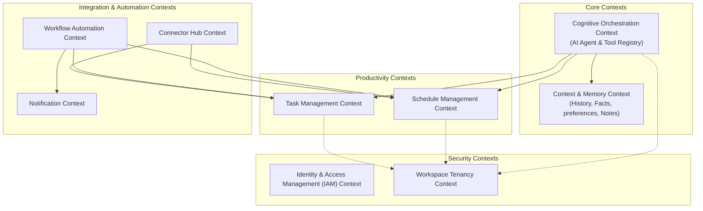

# Domain Boundaries

This document defines the strategic Domain-Driven Design (DDD) boundaries for the **AI Executive Assistant**. The system is categorized into Core, Supporting, and Generic Domains to guide architectural decisions, module isolation, and development priorities.

---

# Core Domain

The Core Domains represent the primary business value and competitive advantage of the AI Executive Assistant. These domains contain the proprietary logic that distinguishes the assistant from standard productivity tools.

## Cognitive Agent & Orchestration Domain (AI Agent)

### Purpose
To act as the autonomous reasoning engine of the assistant. It translates human goals into sequenced steps, executing actions through a secure toolset, and reflecting on outcomes to safely fulfill user intentions.

### Why it Exists
Without this domain, the system is simply a passive suite of task and calendar managers. This domain exists to provide the proactive, goal-seeking reasoning capability that makes the assistant truly "agentic."

### Responsibilities
- Parsing user intent and natural language inputs into actionable objectives.
- Decomposing high-level goals into dependency-aware, ordered plans.
- Selecting, parameterizing, and safely invoking tools via a secure registry.
- Detecting execution failures, reflecting on errors, and executing adaptive recovery loops.
- Halting execution and coordinating human-in-the-loop approvals for high-risk actions.

### Owned Concepts
- **Goal**: A natural language request or objective submitted by the user.
- **Plan**: A collection of sequential steps created to fulfill a Goal.
- **Step**: An individual instruction within a plan mapping to a registered Tool.
- **Tool**: A wrapper around system capabilities with explicit security, workspace, and input constraints.
- **Approval Request**: A structured request capturing proposed changes and their risk assessments for user sign-off.

### Dependencies
- **Context & Semantic Memory Domain**: To retrieve personal details, history, and preferences for plan customization.
- **Workspace & Tenant Management Domain**: To enforce tenancy isolation during planning and execution.
- **Shared Kernel**: For domain event patterns, value objects, and unique identifiers.

### Public Capabilities
- Accept and execute user goals.
- Register capabilities as secure Tools.
- Resolve pending approvals.
- Retrieve the active plan execution status and trace history.

---

## Context & Semantic Memory Domain (Memory)

### Purpose
To provide the assistant with a personalized, contextual understanding of the user. It acts as the cognitive grounding mechanism, ensuring that interactions are personalized and accurate.

### Why it Exists
An agent without memory is stateless and context-deaf. This domain exists to give the assistant a "brain" that remembers who the user is, what they did, and how they prefer things to be done.

### Responsibilities
- Recording, structuring, and indexing conversation histories.
- Extracting long-term semantic facts and habits from user interactions.
- Scoring semantic facts with confidence metrics and relevance weights.
- Storing and updating user scheduling, notification, and behavioral preferences.
- Powering vector-based semantic retrieval to feed context into the AI Agent.

### Owned Concepts
- **Conversation Session & Turn**: The chronological log of user-agent interactions.
- **Semantic Fact**: An extracted statement of truth or habit about the user with a confidence level.
- **User Preference**: Specific runtime preferences (e.g., quiet hours, default lead times).

### Dependencies
- **Workspace & Tenant Management Domain**: To isolate memories strictly to the owning workspace.
- **Shared Kernel**: For base structures and identifiers.

### Public Capabilities
- Query context-grounding facts based on semantic similarity.
- Append conversation turns.
- Retrieve structured preferences.
- Store and updates preferences and habits.

---

# Supporting Domains

Supporting Domains are essential to the product's operation but represent standard business capabilities rather than proprietary competitive advantages. They can be built in-house or integrated, but are shaped to support the Core Domain.

## Task Management Domain (Todo)

### Purpose
To serve as the system of record for actionable tasks, lists, and checklists.

### Why it Exists
To provide a native, structured storage mechanism for things that need to be accomplished, allowing the AI Agent and automated workflows to track execution states.

### Responsibilities
- Creating, reading, updating, and deleting tasks.
- Managing task taxonomy (priorities, tags, and category lists).
- Evaluating recurrence patterns based on standard calendar patterns (e.g., RFC 5545).
- Publishing task lifecycle events to trigger automation or notifications.

### Owned Concepts
- **Task**: An actionable item with status, due date, priority, tags, and lists.
- **Recurrence Pattern**: The schedule description defining how and when a task repeats.

### Dependencies
- **Workspace & Tenant Management Domain**: For workspace boundaries.
- **Shared Kernel**: For shared identifiers and recurrence structures.

### Public Capabilities
- Create and modify tasks.
- Toggle task completion status.
- Retrieve task queries (filtering by tags, lists, or deadlines).

---

## Schedule Management Domain (Calendar)

### Purpose
To organize time allocations and manage scheduling.

### Why it Exists
To provide a native model of time-bound events, enabling the agent to schedule meetings, check availability, and guard against scheduling conflicts.

### Responsibilities
- Creating, updating, and cancelling schedule events.
- Enforcing schedule sanity (conflict/overlap prevention).
- Calculating reminders based on event times and user preferences.
- Projects recurrences and schedules meetings based on slot queries.

### Owned Concepts
- **Event**: A scheduled entry with a duration, participants, and location.
- **Scheduling Collision**: A validation representation of conflicting events.
- **Reminder Schedule**: Precalculated notification moments relative to event times.

### Dependencies
- **Workspace & Tenant Management Domain**: For tenancy enforcement.
- **Shared Kernel**: For standard temporal structures and value objects.

### Public Capabilities
- Schedule and reschedule events.
- Verify user availability / query free-busy slots.
- List events in time-range buckets.

---

## Knowledge Management Domain (Notes)

### Purpose
To manage unstructured text and documents, powering Retrieval-Augmented Generation (RAG).

### Why it Exists
The AI Agent needs access to business documents, documentation, and user notes to answer context-dependent questions accurately. This domain provides the indexable content.

### Responsibilities
- Managing markdown document storage and organization.
- Indexing document sections for vector search.
- Performing similarity search across workspace documents.

### Owned Concepts
- **Note / Document**: A markdown file with content and metadata.
- **Knowledge Segment**: A chunk of document text prepared for embedding.

### Dependencies
- **Workspace & Tenant Management Domain**: For tenancy boundaries.
- **Shared Kernel**: For base structures.

### Public Capabilities
- Document CRUD operations.
- Semantic search of knowledge bases.

---

## Workflow Automation Domain (Workflow)

### Purpose
To evaluate and run rule-based automation triggers and actions.

### Why it Exists
To offload deterministic, repetitive automation flows from the AI Agent, executing actions reliably based on schedules or events.

### Responsibilities
- Creating and managing trigger-action rules.
- Monitoring internal domain events and checking rules.
- Executing action sequences and verifying loop prevention (circular workflows).
- Recording execution histories and failure audits.

### Owned Concepts
- **Workflow Rule**: The declaration binding a trigger criteria to one or more actions.
- **Trigger**: The event condition or cron schedule that runs the workflow.
- **Action**: The action payload targeting a public system capability.
- **Execution Log**: The tracking record of an automated execution.

### Dependencies
- **Workspace & Tenant Management Domain**: For workspace isolation.
- **Task Management Domain (Todo)**: To create/update tasks as actions.
- **Schedule Management Domain (Calendar)**: To schedule events as actions.
- **Notification Dispatch Domain**: To send notifications as actions.
- **Shared Kernel**: For common events and value objects.

### Public Capabilities
- Register and configure automation rules.
- Execute actions programmatically.
- Fetch workflow execution histories.

---

## External Connector Integration Domain (Connector Hub)

### Purpose
To interface with external calendars, task trackers, and messaging systems.

### Why it Exists
Users do not work in isolation. This domain exists to synchronize the assistant with the user's external digital tools (Google, Outlook, Slack, Jira, etc.) without polluting internal domains with third-party details.

### Responsibilities
- Exposing a framework to map and connect third-party platforms.
- Coordinating data synchronization, throttling, and polling.
- Mapping third-party API payloads into internal domain models and events.
- Handling external rate limits and authentication renewals.

### Owned Concepts
- **Connector Profile**: Configuration for a specific integration.
- **Sync History**: Audit details of synchronization cycles.
- **Translation Map**: Transformation rules mapping external payloads to internal domains.

### Dependencies
- **Workspace & Tenant Management Domain**: To partition credentials.
- **Task Management (Todo) / Schedule (Calendar) / Knowledge (Notes) / Notification Domains**: To sync data and dispatch alerts.
- **Shared Kernel**: For domain events and IDs.

### Public Capabilities
- Initialize and authenticate integration connections.
- Dispatch manual sync actions.
- Process inbound third-party webhook events.

---

# Generic Domains

Generic Domains are standard industry problems with no custom specialization. They are typically handled by standard libraries, frameworks, or identity providers, but require integration boundaries.

## Workspace & Tenant Management Domain (Workspace)

### Purpose
To manage tenant boundaries and define user access scopes.

### Why it Exists
To guarantee strict multi-tenancy isolation. It ensures no user can view or alter data outside their authorized workspace boundaries.

### Responsibilities
- Creating and archiving workspaces.
- Tracking workspace memberships and user role assignments.
- Formulating the secure execution context consumed by all domains.

### Owned Concepts
- **Workspace**: The fundamental tenant partition.
- **Membership**: An association linking a User to a Workspace with specific privileges.

### Dependencies
- **Shared Kernel**: For basic identifier types.

### Public Capabilities
- Provision workspaces.
- Modify memberships and roles.
- Resolve tenant validation requests.

---

## Identity & Access Management Domain (Auth)

### Purpose
To authenticate users and verify identity claims.

### Why it Exists
To ensure that only registered and authenticated individuals can access system gateways and request workspace access.

### Responsibilities
- User account creation and configuration.
- Password hashing, verification, and policy enforcement.
- Session tokens generation (JWT) and verification.
- Enforcing Role-Based Access Control (RBAC) maps.

### Owned Concepts
- **Identity Credentials**: Secure authentication details for users.
- **Active Session**: Token representations of valid client sessions.
- **Global Role**: Roles defining global administrative actions.

### Dependencies
- **Workspace & Tenant Management Domain**: To map authenticated users to their accessible workspaces.
- **Shared Kernel**: For base structures.

### Public Capabilities
- Authenticate credentials and issue JWT tokens.
- Register new user profiles.
- Verify security claims at the application boundary.

---

## Notification Dispatch Domain (Notification)

### Purpose
To translate and dispatch communications to users across various channels.

### Why it Exists
To abstract channel delivery logic, templates, and delivery rules away from business modules, allowing simple notification requests to reach users on their preferred media.

### Responsibilities
- Formatting notifications from standard templates.
- Selecting appropriate delivery channels (email, Slack, in-app) using user preferences and urgency ratings.
- Aggregating and throttling outbound messages.

### Owned Concepts
- **Notification Message**: The content envelope, destination details, and urgency ranking.
- **Channel Rule**: User configuration determining where specific message types are sent.

### Dependencies
- **Workspace & Tenant Management Domain**: For routing rules mapping.
- **Shared Kernel**: For base formats.

### Public Capabilities
- Request notification dispatch (with message details and urgency).
- Modify user notification routing settings.

---

# Candidate Bounded Contexts

To maintain a strict modular monolith that can evolve toward microservices, the system is split into candidate **Bounded Contexts**. Each context contains a cohesive domain model and defines a boundary for data schema ownership.



### 1. Identity & Access Management (IAM) Context
- **Scope**: User profiles, credentials, global roles, and authentication sessions.
- **Justification**: Cross-cutting security concern that manages identity verification at the outermost gateway.

### 2. Workspace Tenancy Context
- **Scope**: Workspaces, workspace memberships, and workspace-specific roles.
- **Justification**: Defines the boundaries of data separation. Since workspace contexts govern every action in other contexts, separating this ensures that multi-tenancy rules are centralized and cannot be bypassed.

### 3. Cognitive Orchestration Context
- **Scope**: The AI Planner, Reasoner, Executor, and the Tool Registry.
- **Justification**: Houses the core intelligence pipeline. By isolating this context, we prevent AI-specific patterns (like prompt structures, agent steps, and reflections) from leaking into deterministic productivity modules.

### 4. Context & Memory Context
- **Scope**: Conversation logs, semantic facts, user preferences, and markdown documents (Notes).
- **Justification**: Groups semantic context vectors with file structures that ground the AI. Storing them together optimizes retrieval queries (RAG searches) and links user behavior logs directly to preference extraction.

### 5. Task Management (Todo) Context
- **Scope**: Tasks, task lists, tags, and recurrence engines.
- **Justification**: Focuses on managing list-based, state-driven action items.

### 6. Schedule Management (Calendar) Context
- **Scope**: Calendar events, calendars, conflicts, and availability.
- **Justification**: Focuses on temporal reasoning, time-slot allocation, and time conflict resolutions.

### 7. Workflow Automation Context
- **Scope**: Automation rules, action triggers, execution logs.
- **Justification**: Decouples event-driven automation rules from both standard database operations and cognitive agent runs.

### 8. Connector Hub Context
- **Scope**: External integrations, client credentials, import trackers, and credential vault mapping.
- **Justification**: Isolates external integration details. It forms the outermost boundary for external APIs, ensuring provider API churn does not force modifications inside native productivity domains.

### 9. Notification Context
- **Scope**: Notification envelopes, delivery channels, templates.
- **Justification**: Standardizes output formatting and alerts delivery.

---

# Shared Concepts

The following concepts cross Bounded Context boundaries and require careful modeling to avoid tight coupling:

| Shared Concept | Primary Owner | Consuming Contexts | Strategic Pattern / Integration |
| --- | --- | --- | --- |
| **Workspace ID** | Workspace Tenancy Context | All Contexts | Implemented as a Value Object in the `Shared Kernel` module. Restricts every DB query and API call. |
| **User ID** | IAM Context | Workspace, Memory, Notification | Represented strictly by ID value references. Attributes are queried via ports when needed. |
| **Task / Event** | Task & Calendar Contexts | AI Agent, Workflow, Connector | Translated into generic commands/events or exposed through abstract tool definitions in the Agent's Tool Registry. |
| **Recurrence Rule** | Shared Kernel | Task, Calendar Contexts | Defined as a standard RFC 5545 value object structure in the `Shared Kernel`, ensuring identical parsing behaviors. |
| **Domain Events** | Shared Kernel | All Contexts | Declared in the `Shared Kernel` module to act as integration contracts. Allows modules to trigger downstream work without knowing consumers. |

---

# Anti-Corruption Layers (ACLs)

Anti-Corruption Layers are essential to protect the internal domain models from API churn and semantic mismatch when dealing with external systems.

```
                  ┌──────────────────────────────────────────────────┐
                  │              INTERNAL DOMAIN CORE                │
                  └────────────────────────┬─────────────────────────┘
                                           │
                        Uses Ports & Inverted Interfaces
                                           │
                                           ▼
                  ┌──────────────────────────────────────────────────┐
                  │            ANTI-CORRUPTION LAYER                 │
                  │  (Translators, Adapters, Interface Impls)        │
                  └────────────────────────┬─────────────────────────┘
                                           │
                           Converts Schema & Integrations
                                           │
                                           ▼
                  ┌──────────────────────────────────────────────────┐
                  │                 EXTERNAL SYSTEM                  │
                  │       (Google APIs, Slack, LLMs, SMTP)           │
                  └──────────────────────────────────────────────────┘
```

### 1. External Integration ACL (Connector Hub Adapters)
- **External System**: Third-party APIs (Google Calendar, Outlook, Jira, TickTick, Slack, GitHub, Notion).
- **Implementation**: The Connector context implements the `ExternalProviderPort` interface. Inside each provider implementation (e.g., `GoogleCalendarAdapter`), incoming payloads (such as Google calendar sync JSONs) are parsed, validated, and translated into internal domain models (like `CalendarEvent` or `TaskCreated` events). Internal domains never import external provider library classes.

### 2. Cognitive Language ACL (LLM Adapter)
- **External System**: Third-party Large Language Model APIs (Gemini, OpenAI, Claude).
- **Implementation**: The AI Agent interacts with model endpoints exclusively through `LLMPort` interfaces. The adapter implements this port to translate the Agent's structured intents and tools into model-specific prompts, function-calling formats, or JSON schemas. This isolates the Agent's planning core from LLM API upgrades.

### 3. Outbound Message ACL (Notification Channel Adapters)
- **External System**: Messaging/SMTP systems (SendGrid, Slack webhooks, APNs).
- **Implementation**: The Notification context implements a `NotificationDispatchPort`. Adapters convert generic, template-rendered notification aggregates into target payloads (e.g., SMTP MIME messages or Slack Block Kit JSON objects).

### 4. Credential Vault ACL
- **External System**: Key management systems or local secure credential storages.
- **Implementation**: Managed by the `CredentialVaultPort`. Business domains do not retrieve OAuth keys directly; instead, they query the port, and the vault implementation decrypts and returns keys temporarily, wrapping details from standard storage files or KMS structures.
