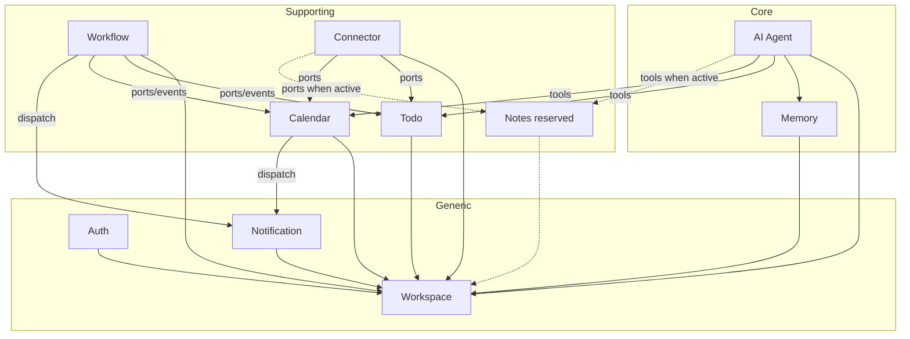

# Context Discovery

- **Document Version**: 1.0.0
- **Status**: Draft / Context Identification Only
- **Date**: 2026-08-01
- **Author**: Context Mapping Agent
- **Sources**: `docs/requirements/user-stories-v2.md`, `docs/architecture/architecture-v2.md`, `docs/architecture/domain-boundaries.md`

---

# Purpose

Identify all **bounded contexts** for the AI Executive Assistant.

This document does **not** perform domain modeling, define aggregates/entities/repositories, or invent business capabilities. Context names and classifications follow `architecture-v2.md`.

**Shared Kernel** is a shared code module (IDs, recurrence VO, domain-event contracts). It is **not** a bounded context.

---

# Context Catalog

| # | Context Name (canonical) | Classification | Phase |
| --- | --- | --- | --- |
| 1 | Auth | Generic | MVP |
| 2 | Workspace | Generic | MVP |
| 3 | AI Agent | Core | MVP (RAG post-MVP) |
| 4 | Memory | Core | MVP (semantic memory post-MVP) |
| 5 | Todo | Supporting | MVP (recurrence post-MVP) |
| 6 | Calendar | Supporting | MVP |
| 7 | Notes | Supporting | Reserved / inactive |
| 8 | Workflow | Supporting | Full |
| 9 | Connector | Supporting | MVP hub+SPI; providers Full |
| 10 | Notification | Generic | MVP (email reports Full) |

---

# Bounded Contexts

---

## 1. Auth

| Field | Content |
| --- | --- |
| **Context Name** | Auth |
| **Classification** | Generic |
| **Responsibility** | Authenticate users, manage identity credentials, issue/verify sessions (JWT), and enforce global RBAC claims at the application gateway. |
| **Business Capabilities Owned** | User registration with unique credentials and password policy (AUTH-001); credential verification; session issuance/refresh; global role claims. |
| **Explicitly Not Owned** | Workspace lifecycle and membership (Workspace); task/calendar/memory data; connector credentials; notification routing; agent planning. |
| **Upstream Contexts** | Workspace (primary-workspace binding on registration / tenancy mapping). |
| **Downstream Contexts** | All contexts consume authenticated identity at the gateway; Workspace consumes `UserId` for membership. |
| **Public Interfaces** | Registration and authentication APIs; JWT/session verification at the gateway; identity claim checks. |
| **Internal Concepts** | Identity Credentials; Active Session; Global Role; UserId (owner of the identifier). |
| **Future Evolution** | Remains generic; may later delegate to an external IdP without changing other contexts’ models. Session/idle semantics refined when soft-delete recovery requirements are finalized. |

---

## 2. Workspace

| Field | Content |
| --- | --- |
| **Context Name** | Workspace |
| **Classification** | Generic |
| **Responsibility** | Define the single-tenant security and data boundary; own workspace lifecycle, membership, and the secure execution context used by every other context. |
| **Business Capabilities Owned** | Primary workspace binding (AUTH-001); workspace isolation enforcement surface; membership and workspace-scoped role resolution; tenant validation. |
| **Explicitly Not Owned** | User credential authentication (Auth); domain data inside Todo/Calendar/Memory/etc.; connector OAuth secrets (Connector / vault). |
| **Upstream Contexts** | None among product contexts (depends only on Shared Kernel types). |
| **Downstream Contexts** | Auth, Todo, Calendar, Memory, AI Agent, Notification, Connector, Workflow, Notes (all are workspace-scoped). |
| **Public Interfaces** | Workspace provisioning; membership/role modification; tenant validation / security-context resolution used by other modules. |
| **Internal Concepts** | Workspace; Membership; WorkspaceId (owner of the identifier). |
| **Future Evolution** | Architecture assumes single primary workspace per user; multi-workspace membership remains out of scope unless requirements change. Extractable as a tenancy service if needed. |

---

## 3. AI Agent

| Field | Content |
| --- | --- |
| **Context Name** | AI Agent |
| **Classification** | Core |
| **Responsibility** | Cognitive orchestration: parse goals, plan, obtain approval, invoke tools exclusively via the Tool Registry, reflect on failures, and escalate to the user. |
| **Business Capabilities Owned** | Goal decomposition and planning (AI-001); dynamic tool invocation via Tool Registry (AI-002); self-reflection and re-planning with ≤3 attempts (AI-003); human-in-the-loop approval for plan execution; post-MVP RAG answering with citations (AI-004) when Notes/semantic retrieval are available. |
| **Explicitly Not Owned** | Task/calendar persistence (Todo/Calendar); conversation/preference storage (Memory); document storage (Notes); connector sync (Connector); workflow rule engine (Workflow); notification channel policy (Notification); direct DB access. |
| **Upstream Contexts** | Workspace; Memory (history/preferences/facts via ports); Todo and Calendar **via Tool Registry adapters** (not direct domain imports); Notes via tools when active; LLM provider behind `LLMPort` (external ACL). |
| **Downstream Contexts** | Notification (approval/escalation alerts); Workflow may resume on approval events (post-MVP); Audit consumers of `ToolExecuted` / approval events. |
| **Public Interfaces** | `AgentCommandPort` (chat/streaming entry); `ApprovalRequestPort`; Tool Registry registration surface; published events `ApprovalRequested`, `ApprovalResolved`, `ToolExecuted`. |
| **Internal Concepts** | Goal; Plan; Step; Tool; Tool Registry; Approval Request; reflection/re-plan attempt budget. |
| **Future Evolution** | MVP: AI-001..003 without RAG. Full: AI-004 grounded on Memory + Notes. May extract as a separate service using existing ports/events. |

---

## 4. Memory

| Field | Content |
| --- | --- |
| **Context Name** | Memory |
| **Classification** | Core |
| **Responsibility** | Provide personalized context: conversation history, user preferences, and (post-MVP) long-term semantic facts with confidence scores. |
| **Business Capabilities Owned** | Conversation history store/retrieve/clear (MEM-001); user preferences including notification-related defaults, timezone, calendar overlap prevention, default priority (MEM-002); long-term semantic memory extraction and CRUD (MEM-003, post-MVP). |
| **Explicitly Not Owned** | Notes/documents and RAG document index (Notes); agent planning/tools (AI Agent); task/event records; notification dispatch; does **not** depend on AI Agent (AD-014). |
| **Upstream Contexts** | Workspace. |
| **Downstream Contexts** | AI Agent (reads history/preferences/facts; may refresh on `MemoryUpdated`). |
| **Public Interfaces** | `ConversationHistoryPort`; `MemoryStorePort`; preference query/update; semantic fact query (when MEM-003 active); event `MemoryUpdated`. |
| **Internal Concepts** | Conversation Session & Turn; User Preference; Semantic Fact (confidence 0.0–1.0). |
| **Future Evolution** | MVP: MEM-001, MEM-002. Full: MEM-003 + vector retrieval via `SemanticSearchPort`. Remains separate from Notes. |

---

## 5. Todo

| Field | Content |
| --- | --- |
| **Context Name** | Todo |
| **Classification** | Supporting |
| **Responsibility** | System of record for actionable tasks: CRUD, priority, tags, filtering/sorting, soft-delete/recovery; recurring tasks post-MVP. |
| **Business Capabilities Owned** | Task creation/view/update/delete (TODO-001); priority and tags with filter/sort (TODO-002); recurring task scheduling per RFC 5545 (TODO-003, post-MVP). |
| **Explicitly Not Owned** | Calendar events (Calendar); workflow rule definitions (Workflow); external task sync translation (Connector); agent planning; notification delivery. |
| **Upstream Contexts** | Workspace. |
| **Downstream Contexts** | AI Agent (tools); Workflow (triggers/actions, post-MVP); Connector (task sync, post-MVP); Notification / Memory as event consumers. |
| **Public Interfaces** | `TodoPort`; domain events `TaskCreated`, `TaskCompleted`, `TaskRecovered`. |
| **Internal Concepts** | Task; Priority (High/Medium/Low); Tag; soft-delete recovery window; Recurrence Pattern (post-MVP, using Shared Kernel RFC 5545 VO). |
| **Future Evolution** | MVP: TODO-001, TODO-002. Full: TODO-003. TickTick/Jira sync remains in Connector, writing through `TodoPort`. |

---

## 6. Calendar

| Field | Content |
| --- | --- |
| **Context Name** | Calendar |
| **Classification** | Supporting |
| **Responsibility** | System of record for scheduled time blocks: event CRUD, optional overlap prevention, reminder lead-time signals that dispatch via Notification, availability window computation, and candidate time-slot discovery for AI Agent scheduling. |
| **Business Capabilities Owned** | Event create/view/update/delete with workspace scope (CAL-001); reminders with lead time, dismiss/snooze, dispatch through Notification (CAL-002); availability window computation; time-slot discovery respecting user constraints. |
| **Explicitly Not Owned** | External calendar sync (Connector CON-002); notification channel routing/urgency policy (Notification); task recurrence (Todo); calendar event recurrence (no approved story — not owned); AI planning decisions (AI Agent). |
| **Upstream Contexts** | Workspace; Notification (reminder delivery via `NotificationDispatchPort`); Memory (overlap preference and scheduling constraints). |
| **Downstream Contexts** | AI Agent (tools); Workflow (post-MVP); Connector (calendar sync, post-MVP); Notification as reminder/event consumer. |
| **Public Interfaces** | `CalendarPort`; domain events `CalendarEventCreated`, `CalendarEventUpdated`, `CalendarEventConflictDetected`. |
| **Internal Concepts** | Calendar Event; Scheduling Collision; Reminder Schedule (lead time relative to event); Availability Window; Time Slot; Scheduling Constraint. |
| **Future Evolution** | Availability querying and slot discovery (read-only primitives for AI Agent). Recurrence VO may be reused later only if requirements add Calendar recurrence. |

---

## 7. Notes

| Field | Content |
| --- | --- |
| **Context Name** | Notes |
| **Classification** | Supporting |
| **Responsibility** | **Reserved.** Own user-authored documents/knowledge for RAG grounding when Notes stories are approved. |
| **Business Capabilities Owned** | None active today. Reserved ownership for document CRUD and indexable knowledge segments referenced by AI-004, CON-006, NOTIF-002 (Pending Requirements). |
| **Explicitly Not Owned** | Conversation history and semantic facts (Memory); Notion sync mechanics (Connector); agent answering logic (AI Agent). |
| **Upstream Contexts** | Workspace (when activated). |
| **Downstream Contexts** | AI Agent (RAG tools, when activated); Connector Notion sync target (when activated); Memory may index on `NoteCreated` (when activated). |
| **Public Interfaces** | `NotesPort` (when activated); event `NoteCreated` (when activated). |
| **Internal Concepts** | Note / Document; Knowledge Segment (conceptual placeholders only — not modeled until stories exist). |
| **Future Evolution** | Inactive until Notes domain stories are written. Must not be merged into Memory (AD-013). |

---

## 8. Workflow

| Field | Content |
| --- | --- |
| **Context Name** | Workflow |
| **Classification** | Supporting |
| **Responsibility** | Deterministic automation: define trigger–action rules, prevent circular paths, run on cron or domain events, retain execution history. |
| **Business Capabilities Owned** | Automation rule definition enable/disable/edit/delete with cycle prevention (WF-001); cron-scheduled execution and history (WF-002); event-driven rule subscription with deterministic precedence (WF-003). |
| **Explicitly Not Owned** | Cognitive planning (AI Agent); ownership of Todo/Calendar data; notification channel policy (calls Notification port); connector sync. |
| **Upstream Contexts** | Workspace; Todo (ports + events); Calendar (ports + events); Notification (failure/action dispatch). |
| **Downstream Contexts** | Notification and Memory as consumers of `WorkflowExecuted` (when active). |
| **Public Interfaces** | `WorkflowExecutionPort`; rule configuration APIs; event `WorkflowExecuted`. |
| **Internal Concepts** | Workflow Rule / Automation Rule; Trigger; Action; Execution Log; user-defined precedence. |
| **Future Evolution** | Entire context is post-MVP. Collaborates only via ports/events (AD-015). |

---

## 9. Connector

| Field | Content |
| --- | --- |
| **Context Name** | Connector |
| **Classification** | Supporting |
| **Responsibility** | Anti-corruption integration hub: register plugins, translate external models to internal ports/events, orchestrate sync, isolate provider SDKs and credentials. |
| **Business Capabilities Owned** | Connector Hub plugin lifecycle and translation (CON-001); provider sync/import capabilities when delivered (CON-002 Google/Outlook calendar; CON-003 GitHub; CON-004 Email; CON-005 Slack as integration surface; CON-006 Notion; CON-007 TickTick/Jira). Credential vault access via port. |
| **Explicitly Not Owned** | Native Todo/Calendar/Notes domain rules; urgency/channel routing policy (Notification); agent Tool Registry; inventing connection-manager UX beyond `ConnectorLifecyclePort` / `CredentialVaultPort` (pending requirements). |
| **Upstream Contexts** | Workspace; Todo, Calendar, Notes (when active), Notification — **via their inbound ports**; external providers behind `ExternalProviderPort`. |
| **Downstream Contexts** | Notification / Audit as consumers of `ConnectorSynced`, `ConnectorSyncFailed`. |
| **Public Interfaces** | `ConnectorLifecyclePort`; `ExternalProviderPort` SPI; `CredentialVaultPort` (outbound); events `ConnectorSynced`, `ConnectorSyncFailed`. |
| **Internal Concepts** | Connector Profile; Sync History; Translation Map; sync direction (one-way / bidirectional); Sync Conflict (detection/reporting per stories). |
| **Future Evolution** | MVP: Hub + SPI only. Full: provider adapters CON-002..007 as plugins. Slack/email **delivery** for notifications is Notification channel adapters; Connector owns Slack/email where stories require sync/commands/ingest. |

---

## 10. Notification

| Field | Content |
| --- | --- |
| **Context Name** | Notification |
| **Classification** | Generic |
| **Responsibility** | Central dispatch: format messages, apply urgency and channel preferences, deliver in-app (fallback), and drive channel adapters (email/Slack). |
| **Business Capabilities Owned** | Multi-channel dispatch with in-app real-time delivery, dismiss/acknowledge, preference configuration (NOTIF-001); email report dispatch (NOTIF-002, post-MVP, with email connector). Urgency-gated Slack routing (Urgent/Critical) owned here (AD-012). |
| **Explicitly Not Owned** | Reminder lead-time calculation tied to events (Calendar); connector sync; agent planning; storing general user preferences master copy (Memory owns preference storage; Notification applies channel rules at dispatch). |
| **Upstream Contexts** | Workspace; channel adapters (in-app, email, Slack) as infrastructure; may use Connector-backed email/Slack transport when those providers exist. |
| **Downstream Contexts** | Calendar (reminders); Workflow (failure/actions); AI Agent (approval/escalation); Connector (sync failure alerts) — all as **dispatch requesters**. |
| **Public Interfaces** | `NotificationDispatchPort`; notification preference/channel configuration APIs; event `NotificationRendered`. |
| **Internal Concepts** | Notification Message; Urgency Level (Urgent, Critical, Normal, Low); Channel Rule; Notification Channel (in-app, email, Slack, …). |
| **Future Evolution** | MVP: NOTIF-001 in-app + dispatch hub. Full: NOTIF-002 and richer channel subscription model when pending requirements are specified. |

---

# Ownership Matrix (exactly one owner)

| Capability / concept | Owner context |
| --- | --- |
| Registration, credentials, JWT session | Auth |
| Workspace boundary, membership | Workspace |
| Goal, Plan, Tool Registry, Approval | AI Agent |
| Conversation history, preferences, semantic facts | Memory |
| Task, priority, tags, task recurrence | Todo |
| Calendar Event, reminders, overlap constraint | Calendar |
| Notes / documents (when specified) | Notes |
| Automation rules, cron/event execution | Workflow |
| External provider ACL, sync translation, connector lifecycle | Connector |
| Dispatch, urgency, channel routing, in-app alerts | Notification |

---

# Context Relationship Overview

Upstream → Downstream means the downstream context depends on the upstream context’s ports, identity, or published events.

---

# Discovery Notes

1. **Auth and Workspace are not merged** — AUTH-001 spans both, but architecture-v2 splits identity vs tenancy; each capability has one owner.
2. **Notes is not merged into Memory** — corrects domain-boundaries candidate diagram; Notes remains reserved (AD-013).
3. **No context split beyond architecture-v2** — Tool Registry stays inside AI Agent; Credential Vault is an infrastructure port of Connector, not a separate context.
4. **No invented capabilities** — connection-manager UX, Notes CRUD, privacy policy framework, and productivity-summary logic remain pending requirements, not new context owners.
5. **Next step** — context mapping relationships (partnership, ACL, OHS, conformist, etc.) and then domain modeling on MVP contexts.

---

**End of document.**
