# Context Map (Official Baseline)

- **Document Version**: 2.0.0
- **Status**: Approved / Ready for Domain Modeling
- **Date**: 2026-08-01
- **Author**: Lead Software Architect
- **Sources**: [`architecture-v2.md`](file:///D:/VsCode/Java/ai_executive_assistant/docs/architecture/architecture-v2.md), [`context-discovery.md`](file:///D:/VsCode/Java/ai_executive_assistant/docs/context-mapping/context-discovery.md), [`context-relationships.md`](file:///D:/VsCode/Java/ai_executive_assistant/docs/context-mapping/context-relationships.md), [`context-integration.md`](file:///D:/VsCode/Java/ai_executive_assistant/docs/context-mapping/context-integration.md), [`context-review.md`](file:///D:/VsCode/Java/ai_executive_assistant/docs/context-mapping/context-review.md)

---

## 1. Executive Summary

This document establishes the official, unified **Context Map** for the **AI Executive Assistant**. It serves as the single source of truth and the final baseline governing bounded context boundaries, classifications, responsibilities, integration ports, and domain events before the Domain Modeling phase begins.

The AI Executive Assistant is designed as a **Modular Monolith** applying **Hexagonal Architecture (Ports and Adapters)** per module and **DDD Lite** principles. The system partitions business logic into **10 Bounded Contexts** distributed across Core, Supporting, and Generic subdomains.

To maintain strict modularity, prevent dependency cycles, and ensure that the codebase remains "extraction-ready" for future microservices, all interactions between contexts are restricted to:

1. Synchronous calls via public **inbound ports** (acting as an Open Host Service).
2. Asynchronous messages via **in-process domain events** (acting as a Published Language) dispatched using after-commit transactional semantics.

This document integrates, resolves, and consolidates all findings, required corrections, and recommendations from the Architecture and Context Mapping reviews ([`context-review.md`](file:///D:/VsCode/Java/ai_executive_assistant/docs/context-mapping/context-review.md) and [`architecture-v2.md`](file:///D:/VsCode/Java/ai_executive_assistant/docs/architecture/architecture-v2.md)), ensuring a clean, cyclic-free, and mathematically consistent model of the system.

---

## 2. Context Overview

The codebase is structured around a modular monolith where each module maps to a single bounded context. All application processes, data stores, and service layers are strictly isolated and scoped by **Workspace Tenancy**. Downstream contexts never access another context's database schema; instead, they collaborate through public ports or domain events.

The system is phased into **MVP Contexts** (which are active and prioritize Domain Modeling) and **Full / Deferred Contexts** (which are reserved boundaries or inactive placeholders).

### Bounded Context Catalog

| #   | Bounded Context Name | Aliases Retired                   | Classification | Phasing / Status                    |
| --- | -------------------- | --------------------------------- | -------------- | ----------------------------------- |
| 1   | **Auth**             | IAM, Authentication               | Generic        | MVP                                 |
| 2   | **Workspace**        | Workspace Tenancy                 | Generic        | MVP                                 |
| 3   | **AI Agent**         | Cognitive Agent, Orchestration    | Core           | MVP (RAG post-MVP)                  |
| 4   | **Memory**           | Context & Memory, Semantic Memory | Core           | MVP (Semantic Memory post-MVP)      |
| 5   | **Todo**             | Task Management                   | Supporting     | MVP (Recurrence post-MVP)           |
| 6   | **Calendar**         | Schedule Management               | Supporting     | MVP                                 |
| 7   | **Notes**            | Knowledge, Knowledge Base         | Supporting     | **Reserved / Inactive Placeholder** |
| 8   | **Workflow**         | Workflow Automation               | Supporting     | Full / Post-MVP                     |
| 9   | **Connector**        | Connector Hub                     | Supporting     | MVP (Hub + SPI); Providers Full     |
| 10  | **Notification**     | Notification Dispatch             | Generic        | MVP (Email Reports Full)            |

---

## 3. Context Classification

To guide design priorities, resource allocation, and architectural rules, the bounded contexts are classified into three subdomains:

```
                            ┌─────────────────────────────────┐
                            │      AI Executive Assistant     │
                            └────────────────┬────────────────┘
                                             │
             ┌───────────────────────────────┼───────────────────────────────┐
             ▼                               ▼                               ▼
    ┌─────────────────┐             ┌─────────────────┐             ┌─────────────────┐
    │ Core Subdomains │             │   Supporting    │             │     Generic     │
    └────────┬────────┘             └────────┬────────┘             └────────┬────────┘
             │                               │                               │
             ├─ AI Agent                     ├─ Todo                         ├─ Auth
             └─ Memory                       ├─ Calendar                     ├─ Workspace
                                             ├─ Notes (Reserved)             └─ Notification
                                             ├─ Workflow
                                             └─ Connector
```

### 1. Core Subdomains (Cognitive Core & Personalization)

- **AI Agent**: Contains the reasoning engine, step-sequencing planner, tool invocation registry, and human-in-the-loop approval workflows. It represents the primary competitive advantage and proprietary intelligence of the product.
- **Memory**: Manages session-based conversation history, user preferences (overlap prevention, lead times, priority defaults), and long-term semantic facts. It enables personalized, context-aware assistance.

### 2. Supporting Subdomains (Productivity & Integrations)

- **Todo**: The system of record for task CRUD, prioritization, categorization, soft-deletion, and recurrence rules.
- **Calendar**: The system of record for schedule blocks, collision checks, and calendar event timelines.
- **Notes (Reserved)**: Placeholder for future document storage and knowledge base indexing (needed for post-MVP RAG).
- **Workflow**: Post-MVP automation rules mapping triggers (events/cron) to actions.
- **Connector**: The translation layer and integration engine (Anti-Corruption Layer) that adapts external APIs to internal productivity ports.

### 3. Generic Subdomains (Infrastructure & Core SaaS Operations)

- **Auth**: Manages user registration, credential validation, JWT sessions, and global role claims.
- **Workspace**: Dictates multi-tenant boundaries, workspace creation, membership, and security context verification.
- **Notification**: Centralizes message dispatch, template rendering, and channel-routing rules (Slack, Email, In-App).

---

## 4. Context Responsibilities

### 4.1 Auth Bounded Context

- **Responsibility**: Authenticate users, manage identity credentials, verify JWT session signatures, and enforce global access roles at the gateway.
- **Owned Capabilities**: Registration with credential policies (`AUTH-001`), verification, JWT generation, session invalidation.
- **Explicitly Not Owned**: Workspace lifecycles and membership validation; storage of task/calendar data; connector credentials; notification routing policy.
- **Future Evolution**: Remains generic. May be replaced with an external Identity Provider (OIDC/OAuth2 IdP) without polluting other modules.

### 4.2 Workspace Bounded Context

- **Responsibility**: Act as the absolute data boundary and security scope for all operations. Manage workspace entities, user memberships, and validate active tenancy.
- **Owned Capabilities**: Primary workspace provisioning during registration (`AUTH-001`), membership additions/deletions, workspace role checks.
- **Explicitly Not Owned**: Direct credential checking; domain entity management (tasks, events); encryption of provider secrets (owned by Connector/Vault).
- **Future Evolution**: Assumes single-workspace tenancy per user for MVP. Can support multi-tenancy expansion strictly within this context.

### 4.3 AI Agent Bounded Context

- **Responsibility**: Orchestrate goal-seeking execution. Parse user intents, build sequential plans, request human verification, run plans via the Tool Registry, reflect on errors, and escalate on failure.
- **Owned Capabilities**: Goal planning (`AI-001`), Tool Registry execution and audit (`AI-002`), reflection loop capped at 3 attempts (`AI-003`), human-in-the-loop approval management, post-MVP RAG grounding (`AI-004`).
- **Explicitly Not Owned**: Task/calendar persistence (Todo/Calendar); direct database reads/writes; conversation/preference storage (Memory); Notion/Slack sync (Connector).
- **Future Evolution**: Grounding plans with semantic search context and documents when Notes/semantic memory are active.

### 4.4 Memory Bounded Context

- **Responsibility**: Retain personalized user details, preferences, active chat streams, and semantic facts.
- **Owned Capabilities**: Conversation history persistence (`MEM-001`), preference defaults (notification settings, timezone, overlap rules) (`MEM-002`), semantic fact extraction (`MEM-003`).
- **Explicitly Not Owned**: Planning loops (Agent); document indexing (Notes); Slack/email message delivery details; database models for Todo/Calendar.
- **Future Evolution**: Moving from key-value database storage to vector database similarity indexing (`SemanticSearchPort`).

### 4.5 Todo Bounded Context

- **Responsibility**: Store, filter, update, and soft-delete user tasks.
- **Owned Capabilities**: Task CRUD (`TODO-001`), priorities and tags filtering (`TODO-002`), task recurrence per RFC 5545 (`TODO-003`).
- **Explicitly Not Owned**: Calendar scheduling; Notion task sync logic (Connector); email-to-task parsing; notification dispatching.
- **Future Evolution**: Addition of recurrence execution handler (post-MVP).

### 4.6 Calendar Bounded Context

- **Responsibility**: Record, check, and trigger alerts for calendar schedules. Compute availability windows and candidate time slots for AI Agent scheduling.
- **Owned Capabilities**: Event CRUD (`CAL-001`), overlap constraint enforcement, scheduling and dispatching reminders (`CAL-002`), availability window computation, time-slot discovery.
- **Explicitly Not Owned**: External Google/Outlook sync (Connector); channel routing rules; task recurrence models; AI planning decisions.
- **Future Evolution**: Synchronization conflict resolution when calendar connectors are active.

### 4.7 Notes Bounded Context (Reserved)

- **Responsibility**: Placeholder for user knowledge, wiki entries, and documents.
- **Owned Capabilities**: Deferred. Reserved for document CRUD and text chunking for RAG ingestion.
- **Explicitly Not Owned**: Conversation history (Memory); Agent reasoning; Notion API sync.
- **Future Evolution**: Remains inactive until Notes stories are formally approved.

### 4.8 Workflow Bounded Context (Post-MVP)

- **Responsibility**: Automate deterministic rules linking triggers to actions.
- **Owned Capabilities**: Rule definitions (`WF-001`), cron scheduler rule execution (`WF-002`), event-driven rule subscriptions (`WF-003`).
- **Explicitly Not Owned**: Conversational tool execution (Agent); notification rendering; direct productivity table access.
- **Future Evolution**: Fully deferred to Post-MVP.

### 4.9 Connector Bounded Context

- **Responsibility**: Hub for external service integrations. Model translation (ACL) and sync orchestration.
- **Owned Capabilities**: Plugin registration SPI (`CON-001`), provider adapters (Google/Outlook `CON-002`, GitHub `CON-003`, Email `CON-004`, Slack `CON-005`, Notion `CON-006`, Jira/TickTick `CON-007`).
- **Explicitly Not Owned**: User credential management (Auth); internal task rules; notification dispatch channel enforcement.
- **Future Evolution**: Providers (CON-002 through CON-007) are plugins implemented post-MVP.

### 4.10 Notification Bounded Context

- **Responsibility**: Formulate message alerts, evaluate channels, and dispatch notifications.
- **Owned Capabilities**: Routing preferences and channel execution (Email, Slack, In-App) (`NOTIF-001`), summary digest formatting (`NOTIF-002`).
- **Explicitly Not Owned**: Event timing calculation (Calendar); connection profiles (Connector).
- **Future Evolution**: Dynamic preference management based on user availability calendars.

---

## 5. Context Relationship Map

The relationship map details the dependency directions and integration models between the contexts. To resolve notation issues, the map utilizes three distinct semantics:

- **Solid arrows (`──>` or `-->` in Mermaid)** represent **Synchronous Port Calls** (flowing from the Downstream Caller to the Upstream Provider's Port).
- **Dashed arrows (`─ ─>` or `-.->` in Mermaid)** represent **Asynchronous Event Flow** (flowing from the Upstream Publisher to the Downstream Consumer).
- **Dotted arrows (`. . .>` or `-.->` in Mermaid)** represent **Passive Security Context Consumption** (downstream contexts conforming to the `UserId` propagated via thread-local context).

```mermaid
flowchart TD
  subgraph Generic Subdomains
    WS["Workspace Context"]
    AUTH["Auth Context"]
    NOTIF["Notification Context"]
  end

  subgraph Core Subdomains
    AGENT["AI Agent Context"]
    MEM["Memory Context"]
  end

  subgraph Supporting Subdomains
    TODO["Todo Context"]
    CAL["Calendar Context"]
    NOTES["Notes Context (Reserved)"]
    WF["Workflow Context"]
    CON["Connector Context"]
  end

  %% 1. Workspace Multi-Tenancy (OHS / Conformist)
  AUTH -->|Conformist| WS
  TODO -->|Conformist| WS
  CAL -->|Conformist| WS
  MEM -->|Conformist| WS
  AGENT -->|Conformist| WS
  NOTIF -->|Conformist| WS
  CON -->|Conformist| WS
  WF -->|Conformist| WS
  NOTES -.->|Conformist| WS

  %% 2. Auth Identity Gateway (Passive Security Context)
  AGENT -.->|Conformist| AUTH
  MEM -.->|Conformist| AUTH
  TODO -.->|Conformist| AUTH
  CAL -.->|Conformist| AUTH
  NOTIF -.->|Conformist| AUTH
  CON -.->|Conformist| AUTH
  WF -.->|Conformist| AUTH
  NOTES -.->|Conformist| AUTH

  %% 3. Auth to Workspace Provisioning (Customer/Supplier)
  AUTH -->|Customer / Provisioning| WS

  %% 4. Cognitive & Memory Core (OHS / Conformist)
  AGENT -->|Conformist / Memory Ports| MEM
  MEM -.->|Published Language Events| AGENT

  %% 5. Tool Registry Gateways (OHS / Conformist)
  AGENT -->|Conformist / TodoPort| TODO
  AGENT -->|Conformist / CalendarPort| CAL
  AGENT -.->|Conformist / NotesPort - deferred| NOTES

  %% 6. Productivity Sync & Automation (OHS / Conformist)
  WF -->|Conformist / TodoPort| TODO
  WF -->|Conformist / CalendarPort| CAL
  WF -->|Conformist / NotificationDispatchPort| NOTIF

  CON -->|Conformist / TodoPort| TODO
  CON -->|Conformist / CalendarPort| CAL
  CON -.->|Conformist / NotesPort - deferred| NOTES

  %% 7. Split Bidirectional Integrations (CR-01 & CR-06 Resolved)
  CAL -->|Conformist / NotificationDispatchPort| NOTIF
  CAL -.->|Published Language Events| NOTIF

  CON -->|Conformist / NotificationDispatchPort| NOTIF
  CON -.->|Published Language Events| NOTIF

  %% 8. Core Asynchronous Event Publications (PL -> Downstream Consumers)
  TODO -.->|Published Language Events| NOTIF
  TODO -.->|Published Language Events| MEM
  AGENT -.->|Published Language Events| NOTIF
  AGENT -.->|Published Language Events| WF
  WF -.->|Published Language Events| MEM
  NOTES -.->|Published Language Events - deferred| MEM
```



---

## 6. Context Communication

To guarantee isolation within the modular monolith, communication is strictly categorized into synchronous APIs and asynchronous event patterns.

### 6.1 Synchronous Communication (Open Host Service - OHS)

- **Mechanism**: Directly invoking public interfaces (inbound ports) declared in the target context's Application or Domain layer.
- **Rule**: Concrete service classes, JPA repositories, and domain aggregates are package-private. They are never imported across boundaries. Callers must program to the Port interface.
- **Workspace Scoping**: The security filter verifies the tenant `WorkspaceId` at the gateway and injects it into a thread-local context. Downstream contexts read this value synchronously to enforce database isolation.

### 6.2 Asynchronous Communication (Published Language - PL)

- **Mechanism**: The Spring framework's in-process event bus (`ApplicationEventPublisher`) dispatches messages to `@EventListener` targets.
- **Transaction Boundary**: Handlers execute **after commit** (`@TransactionalEventListener(phase = TransactionPhase.AFTER_COMMIT)`). This prevents database locks and ensures that failed integrations do not roll back the primary transaction.
- **Payload Boundary**: Domain event objects are declared in the `Shared Kernel` module. To prevent internal domain models from leaking, events carry only primitive identifiers (e.g., `TaskId`, `WorkspaceId`) and simple, immutable Value Objects (e.g., event timestamps).

---

## 7. Port Map

Every port in the system belongs to exactly one context and is defined in the Application or Domain layers of that context. This deduplicated map lists all public ports, their directions, owning contexts, and their verified downstream consumers.

### Public Port Registry

| Port Name                   | Direction | Owner Context  | Callers (Downstream)             | Purpose / Description                                                   |
| --------------------------- | --------- | -------------- | -------------------------------- | ----------------------------------------------------------------------- |
| `AuthenticationGateway`     | Inbound   | Auth           | Presentation (REST)              | Handles user login, session validation, and JWT decoding.               |
| `WorkspaceProvisioningPort` | Inbound   | Workspace      | Auth                             | Called by Auth during registration to set up the default workspace.     |
| `TenantValidationPort`      | Inbound   | Workspace      | Gateway / All Contexts           | Validates memberships and maps the current context tenant.              |
| `ConversationHistoryPort`   | Inbound   | Memory         | AI Agent                         | Appends chat turns, retrieves recent chat loops, clears history.        |
| `MemoryStorePort`           | Inbound   | Memory         | AI Agent                         | Fetches preferences and semantic facts used in planner grounding.       |
| `TodoPort`                  | Inbound   | Todo           | Agent Tools, Workflow, Connector | Handles task creation, priority updates, soft-deletion, and queries.    |
| `CalendarPort`              | Inbound   | Calendar       | Agent Tools, Workflow, Connector | Handles event scheduling, updates, and schedule collisions.             |
| `NotesPort`                 | Inbound   | Notes          | Agent Tools, Connector           | Document indexing and searches (inactive placeholder).                  |
| `WorkflowExecutionPort`     | Inbound   | Workflow       | Presentation, Cron               | Manually triggers rules, evaluates cron timers (post-MVP).              |
| `NotificationDispatchPort`  | Inbound   | Notification   | Calendar, Connector, Workflow    | Queues or immediately sends multi-channel user notifications.           |
| `ApprovalRequestPort`       | Inbound   | AI Agent       | Presentation                     | Entry point for users to approve or reject a plan (CR-09 resolved).     |
| `AgentCommandPort`          | Inbound   | AI Agent       | Presentation (SSE)               | Processes user messages, streams planner output and answers.            |
| `SemanticSearchPort`        | Outbound  | Memory / Notes | Memory, Notes                    | Infrastructure abstraction for vector database queries (e.g. pgvector). |
| `CredentialVaultPort`       | Outbound  | Connector      | Connector                        | Infrastructure interface wrapping encrypted key managers.               |
| `ExternalProviderPort`      | Outbound  | Connector      | Connector Plugins                | SPI implemented by provider plugins (Google, Slack, TickTick).          |
| `LLMPort`                   | Outbound  | AI Agent       | AI Agent Reasoner                | SPI implemented by LLM clients (OpenAI, Gemini).                        |

---

## 8. Domain Event Map

Domain events are published asynchronously after transaction commit. They are defined in the `Shared Kernel` as part of the system's Published Language.

### Event Catalog

| Event Name              | Producing Context | Asynchronous Consumers (After Commit) | Payload Content                             |
| ----------------------- | ----------------- | ------------------------------------- | ------------------------------------------- |
| `TaskCreated`           | Todo              | Workflow, Notification, Connector     | `TaskId`, `WorkspaceId`, `UserId`           |
| `TaskCompleted`         | Todo              | Workflow, Memory                      | `TaskId`, `WorkspaceId`, `CompletedAt`      |
| `TaskRecovered`         | Todo              | Notification, Connector               | `TaskId`, `WorkspaceId`                     |
| `CalendarEventCreated`  | Calendar          | Workflow, Notification, Connector     | `EventId`, `WorkspaceId`, `StartsAt`        |
| `CalendarEventUpdated`  | Calendar          | Notification, Connector               | `EventId`, `WorkspaceId`                    |
| `CalendarEventConflictDetected` | Calendar          | Notification, Connector               | `EventId`, `ConflictEventId`, `WorkspaceId` |
| `NoteCreated`           | Notes             | Memory                                | `NoteId`, `WorkspaceId` (reserved)          |
| `WorkflowExecuted`      | Workflow          | Notification, Memory                  | `WorkflowId`, `WorkspaceId`, `Status`       |
| `MemoryUpdated`         | Memory            | AI Agent                              | `UserId`, `WorkspaceId`, `UpdateType`       |
| `ApprovalRequested`     | AI Agent          | Notification, Workflow                | `ApprovalId`, `PlanId`, `WorkspaceId`       |
| `ApprovalResolved`      | AI Agent          | Notification, Workflow                | `ApprovalId`, `Resolution` (Approve/Reject) |
| `ToolExecuted`          | AI Agent          | Audit Logger                          | `AgentSessionId`, `ToolName`, `Status`      |
| `ConnectorSynced`       | Connector         | Notification, Audit Logger            | `ConnectorId`, `WorkspaceId`, `TasksCount`  |
| `ConnectorSyncFailed`   | Connector         | Notification, Audit Logger            | `ConnectorId`, `WorkspaceId`, `ErrorMsg`    |
| `NotificationRendered`  | Notification      | Audit Logger                          | `NotificationId`, `Channel`, `WorkspaceId`  |

---

## 9. Anti-Corruption Layer (ACL) Map

The monolith utilizes four explicit Anti-Corruption Layers to shield internal domain models from external API structures, vendor SDK models, and third-party schemas.

```
┌────────────────────────┐      ┌────────────────────────┐      ┌────────────────────────┐
│     Third-Party APIs   │ ───> │  Connector Hub (ACL)   │ ───> │ TodoPort / CalendarPort│
└────────────────────────┘      └────────────────────────┘      └────────────────────────┘
┌────────────────────────┐      ┌────────────────────────┐      ┌────────────────────────┐
│     LLM Providers      │ ───> │   LLM Adapter (ACL)    │ ───> │        LLMPort         │
└────────────────────────┘      └────────────────────────┘      └────────────────────────┘
┌────────────────────────┐      ┌────────────────────────┐      ┌────────────────────────┐
│    SMTP / Slack SDKs   │ ───> │ Notification Chan(ACL) │ ───> │NotifDispatchPort(Drive)│
└────────────────────────┘      └────────────────────────┘      └────────────────────────┘
┌────────────────────────┐      ┌────────────────────────┐      ┌────────────────────────┐
│   KMS / Vault Storage  │ ───> │  Vault Adapter (ACL)   │ ───> │   CredentialVaultPort  │
└────────────────────────┘      └────────────────────────┘      └────────────────────────┘
```

1.  **Connector Hub Adapters (ACL)**: Isolate the productivity domains (Todo, Calendar) from external SaaS payloads (Google Calendar events, TickTick tasks, Jira issues). The adapters parse external JSON objects and call standard ports like `TodoPort` using clean, native value objects.
2.  **LLM Adapter (ACL)**: Isolates the AI Agent's reasoner from specific provider API differences (OpenAI JSON format, Gemini API versions). It translates standard prompts into provider requests and converts response formats into internal tool selection structures.
3.  **Notification Channel Adapters (ACL)**: Convert generic Notification templates into delivery payloads (SMTP mime messages, Slack webhook JSON blocks, WebSocket alerts) without letting vendor channel SDK structures leak into the dispatch logic.
4.  **Credential Vault Adapter (ACL)**: Shields the Connector Hub from the specific storage implementations of HashiCorp Vault, AWS Secrets Manager, or local profiles behind the `CredentialVaultPort`.

---

## 10. Shared Kernel Usage

The `Shared Kernel` is **strictly a code library (JAR dependency)**. It is a leaf in the dependency graph (depends on nothing). It is **not** a bounded context, does not manage state, and does not own database schemas.

### 10.1 Shared Code Components

- **Global Identifiers**: Standard strongly typed IDs (`WorkspaceId`, `UserId`, `TaskId`, `EventId`, `NoteId`).
- **Recurrence Objects**: The `RecurrencePattern` Value Object implementing RFC 5545 recurrence values. This VO is owned by Todo for execution behavior but is stored in the Shared Kernel so that the Calendar context can reference it for future overlap evaluations.
- **Published Language Interfaces**: Integration event contracts (`TaskCreated`, `ApprovalRequested`, etc.) that act as the message schemas for the Spring event publisher.

### 10.2 Change Control Policy

- Because all modules depend compile-time on the Shared Kernel, changes to its classes must be kept to a minimum.
- Modifications require approval from the Lead Software Architect.
- All changes must preserve backward compatibility (e.g. adding optional fields rather than breaking constructors) to prevent compilation cascades across modules.

---

## 11. Dependency Rules

The following structural rules are strictly enforced and verified via automated ArchUnit tests in CI:

1.  **Strict Layering (Domain ← Infrastructure)**:
    Within every context, dependencies must point inward:
    $$\text{Presentation} \longrightarrow \text{Application} \longrightarrow \text{Domain} \longleftarrow \text{Infrastructure}$$
    The Domain layer must be completely framework-agnostic. It must not import Spring beans, JPA annotations, Hibernate objects, or serialization decorators.
2.  **Sideways Isolation**:
    Contexts must never import classes, services, or models of another context directly. Cross-context interactions must go through an inbound port interface or a Shared Kernel domain event.
3.  **Memory Cycle Prevention (Memory ↛ AI Agent)**:
    The Memory context has **no dependency** on the AI Agent. It must never import agent models. Conversation history is saved, and preferences are queried entirely via inbound calls to Memory ports.
4.  **Agent Tool Isolation**:
    The AI Agent must never directly import Todo or Calendar services. It interacts with them only through the **Tool Registry**. The tools are adapter classes inside the AI Agent module that invoke `TodoPort` or `CalendarPort`.
5.  **External SDK Leakage Prevention**:
    Third-party integration SDKs (Google API, Slack SDK, Spring Mail) must not be imported in core domain modules. They are restricted to the Infrastructure layer of the Connector Hub and Notification contexts.
6.  **No Database Sharing**:
    No context may read or write another context's database tables. Cross-context queries are handled at the Application layer using port calls or by listening to domain events to construct local, read-only cache projections.
7.  **Shared Kernel as a Leaf**:
    The Shared Kernel must never import packages from any other module.

---

## 12. Context Extraction Strategy

The strict application of Hexagonal seams and in-process Domain Events ensures that the system is fully prepared for future microservice extraction without requiring structural changes to the core business logic.

```
       [ Modular Monolith State ]                     [ Extracted Service State ]

┌──────────────┐         ┌──────────────┐      ┌──────────────┐         ┌──────────────┐
│  Downstream  │ ──In─►  │   Upstream   │      │  Downstream  │ ──Net─►  │   Upstream   │
│   Context    │  Proc   │   Context    │      │   Service    │  gRPC   │   Service    │
│  (App/Dom)   │  Port   │  (App/Dom)   │      │  (App/Dom)   │  REST   │  (App/Dom)   │
└──────┬───────┘         └──────────────┘      └──────┬───────┘         └──────────────┘
       │                                              │
    [Spring] (In-Process Event)                   [Kafka] (Broker Event)
       ▼                                              ▼
┌──────────────┐                               ┌──────────────┐
│ Event Handler│                               │ Event Handler│
└──────────────┘                               └──────────────┘
```

1.  **Extracting Synchronous Interactions**:
    If a target context (e.g. AI Agent) is extracted into a standalone service, the caller's driving adapter (which currently injects a local Spring bean implementing the Port interface) is replaced with an HTTP/REST or gRPC adapter calling the external microservice endpoint. The port interface definition and the domain logic remain unchanged.
2.  **Extracting Asynchronous Interactions**:
    To distribute events, the local Spring `@EventListener` is replaced. The publisher's adapter uses a message broker client (e.g., Kafka Template, RabbitMQ) to serialize and publish the Shared Kernel event payload. The consumer's driving adapter listens to the broker queue and forwards the payload back to the local application logic.
3.  **Preserving Domain Code**:
    Because the Domain layer is completely isolated from the Spring container and external networking libraries, service extraction does not require modifying domain logic.

---

## 13. Context Evolution

The evolution of the bounded contexts from MVP to the final production system is carefully mapped to avoid scope creep and preserve code boundaries.

### Phased Context Feature Matrix

| Bounded Context  | MVP Scope (Current Priority)                               | Full / Deferred Scope (Post-MVP)                                        |
| ---------------- | ---------------------------------------------------------- | ----------------------------------------------------------------------- |
| **Auth**         | Session verification, global roles, registration mapping.  | OAuth2 / OIDC OpenID Connect external IdP integration.                  |
| **Workspace**    | Workspace creation, single user primary membership.        | Multi-user memberships and granular RBAC.                               |
| **AI Agent**     | Goal planning, Tool Registry executions, ≤3 re-plans.      | Grounded RAG queries (`AI-004`) using vector searches.                  |
| **Memory**       | Chat logs, user preferences (overlaps, timezones).         | Long-term semantic fact extraction (`MEM-003`) with confidence ratings. |
| **Todo**         | Tasks CRUD, priorities, tags, soft-delete.                 | Recurrence parsing and background execution engines (`TODO-003`).       |
| **Calendar**     | Events CRUD, collision checks, lead-time triggers.         | Conflict negotiations and calendar sync conflict solvers.               |
| **Notes**        | **Deferred (Reserved boundary, no active logic).**         | Ingesting documents, Markdown parser, vector chunking.                  |
| **Workflow**     | **Deferred (Post-MVP rules automation).**                  | Event triggers, rule definition schemas, cyclic executions validator.   |
| **Connector**    | Connector SPI plugins definitions, credential vault ports. | Slack, Notion, GitHub, and email provider sync adapters.                |
| **Notification** | In-app alerts, Slack urgency-gated channel dispatching.    | Digest report rendering, channel fallback cascades.                     |

---

## 14. Architecture Consistency

This Context Map resolves all inconsistencies, naming drifts, and boundary conflicts identified in the architectural reviews:

1.  **Notes and Memory Boundary Resolution**:
    As resolved by [`architecture-v2.md`](file:///D:/VsCode/Java/ai_executive_assistant/docs/architecture/architecture-v2.md) AD-013, Notes (Knowledge Base) is structured as a separate, reserved supporting context rather than being merged into Memory. Memory owns conversation logs, preferences, and semantic facts only. This preserves clean boundaries and avoids schema pollution.
2.  **Memory $\leftrightarrow$ AI Agent Cycle Resolution**:
    Memory does not import the AI Agent (AD-014). The Agent calls Memory ports to retrieve history and facts. In-process updates occur asynchronously via the `MemoryUpdated` event.
3.  **Urgency Policy Routing Resolution**:
    Urgency classification and channel-routing logic (such as restricting Slack deliveries to Urgent/Critical messages) are owned by the **Notification** context (AD-012). The Connector Hub does not manage notification policies; its Slack connector serves as a driven execution channel.
4.  **Layering Direction Enforcement**:
    The layer rule is corrected to strictly follow hexagonal inversion (Domain $\leftarrow$ Infrastructure). Domain defines repository interfaces, and Infrastructure implements them (AD-002).
5.  **Deduplicated Matrix and Port Callers**:
    All bidirectional matrix cells are split into single-direction dependencies. Ports are declared exactly once by their owning context, detailing callers in the caller column.
6.  **Canonical Naming Conventions**:
    Aliases are retired. Auth represents identity; Workspace represents tenancy; AI Agent represents orchestration; and calendar events are named `CalendarEventCreated` / `CalendarEventUpdated` to prevent namespace clashes.

---

## 15. Domain Modeling Guidelines

When transitioning from Context Mapping to **Domain Modeling**, developers must follow these guidelines:

1.  **Prioritize MVP Contexts**:
    Focus modeling efforts on the MVP aggregates first: `Auth`, `Workspace`, `Todo` (excluding recurrence engine), `Calendar`, `Memory` (conversation and preferences), `Notification`, `AI Agent` (planner, registry, approvals), and `Connector` (hub SPI).
2.  **Declare Explicit Boundaries**:
    Ensure that each module has a clear root package. For example:
    - `com.assistant.auth`
    - `com.assistant.workspace`
    - `com.assistant.todo`
    - `com.assistant.calendar`
    - `com.assistant.agent`
    - `com.assistant.memory`
    - `com.assistant.notification`
    - `com.assistant.connector`
    - `com.assistant.kernel` (Shared Kernel leaf JAR)
3.  **Encapsulate Aggregates**:
    Keep all entity and aggregate root modifications package-private. Only expose application use cases via inbound ports.
4.  **Use Value Objects for Identity references**:
    Do not link entities across context boundaries. For instance, `Task` in the Todo context must not reference a `Workspace` entity object. Instead, it must store an immutable `WorkspaceId` Value Object from the Shared Kernel.
5.  **Enforce Seams with ArchUnit**:
    Establish package structure tests in CI to verify that no developer bypasses ports or writes direct sideways imports between modules.
