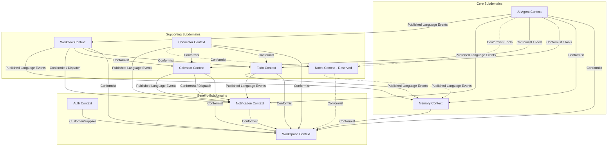

# Context Relationships

- **Document Version**: 1.0.0
- **Status**: Approved / Context Mapping Baseline
- **Date**: 2026-08-01
- **Author**: Domain-Driven Design Context Mapping Specialist
- **Sources**: `docs/architecture/architecture-v2.md`, `docs/context-mapping/context-discovery.md`

---

## 1. Executive Summary

This document establishes the official **Bounded Context Map** for the AI Executive Assistant modular monolith. The system consists of **10 Bounded Contexts** categorized into Core, Supporting, and Generic subdomains.

To maintain modularity and allow future microservice extraction, relationships between these contexts are strictly governed by hexagonal layers (ports and adapters) and in-process domain events. This context map clarifies the architectural boundaries, relationship types (Conformist, Customer/Supplier, Open Host Service, Published Language, and Anti-Corruption Layer), dependency directions, ownership, and forbidden couplings.

---

## 2. Bounded Context Map Diagram

The following diagram illustrates the relationship types and dependency directions. An arrow pointing from context $A$ to context $B$ ($A \rightarrow B$) indicates that $B$ depends on $A$ ($A$ is **Upstream**, $B$ is **Downstream**).



---

## 3. Relationship Matrix

The table below outlines the relationship type for every pair of bounded contexts. 

- **U**: Context on the Left is **Upstream** (Supplier/OHS/PL)
- **D**: Context on the Left is **Downstream** (Customer/Conformist/ACL)
- **Partnership / Shared Kernel**: Mutual/Shared relationships.
- **Independent**: No direct architectural relationship or dependency.

| Context | Auth | Workspace | AI Agent | Memory | Todo | Calendar | Notes | Workflow | Connector | Notification |
| --- | --- | --- | --- | --- | --- | --- | --- | --- | --- | --- |
| **Auth** | — | **D** (Customer) | **U** (OHS/PL) | **U** (OHS/PL) | **U** (OHS/PL) | **U** (OHS/PL) | **U** (OHS/PL) | **U** (OHS/PL) | **U** (OHS/PL) | **U** (OHS/PL) |
| **Workspace** | **U** (Supplier) | — | **U** (OHS/PL) | **U** (OHS/PL) | **U** (OHS/PL) | **U** (OHS/PL) | **U** (OHS/PL) | **U** (OHS/PL) | **U** (OHS/PL) | **U** (OHS/PL) |
| **AI Agent** | **D** (Conformist) | **D** (Conformist) | — | **D** (Conformist) | **D** (Conformist) | **D** (Conformist) | **D** (Conformist) | **U** (PL) | Independent | **U** (PL) |
| **Memory** | **D** (Conformist) | **D** (Conformist) | **U** (OHS/PL) | — | **D** (PL) | Independent | **D** (PL) | **D** (PL) | Independent | Independent |
| **Todo** | **D** (Conformist) | **D** (Conformist) | **U** (OHS/PL) | **U** (PL) | — | Independent | Independent | **U** (OHS/PL) | **U** (OHS/PL) | **U** (PL) |
| **Calendar** | **D** (Conformist) | **D** (Conformist) | **U** (OHS/PL) | Independent | Independent | — | Independent | **U** (OHS/PL) | **U** (OHS/PL) | **U** (PL) / **D** (Conformist) |
| **Notes** | **D** (Conformist) | **D** (Conformist) | **U** (OHS/PL) | **U** (PL) | Independent | Independent | — | Independent | **U** (OHS/PL) | Independent |
| **Workflow** | **D** (Conformist) | **D** (Conformist) | **D** (PL) | **U** (PL) | **D** (Conformist) | **D** (Conformist) | Independent | — | Independent | **D** (Conformist) |
| **Connector** | **D** (Conformist) | **D** (Conformist) | Independent | Independent | **D** (Conformist) | **D** (Conformist) | **D** (Conformist) | Independent | — | **D** (Conformist) / **U** (PL) |
| **Notification** | **D** (Conformist) | **D** (Conformist) | **D** (PL) | Independent | **D** (PL) | **U** (Conformist) / **D** (PL) | Independent | **U** (Conformist) | **U** (Conformist) / **D** (PL) | — |

---

## 4. Relationship Type Definitions

- **Open Host Service (OHS)**: The upstream context defines a public interface (inbound ports) allowing multiple downstream contexts to communicate with it.
- **Published Language (PL)**: The upstream context defines a translation format (such as domain events or Shared Kernel value objects) to communicate information. Downstream contexts subscribe to this language.
- **Conformist**: The downstream context conforms completely to the models and interfaces (ports) defined by the upstream context, without implementing translation layers.
- **Customer/Supplier**: A relationship where the downstream (Customer) has a dependency on the upstream (Supplier). The supplier must deliver updates according to the customer's needs, governed by a negotiated contract.
- **Anti-Corruption Layer (ACL)**: The downstream context implements a translation layer to isolate its internal domain model from the upstream context's model, ensuring external schema changes do not pollute the core domain.
- **Shared Kernel**: A shared code library (e.g. Shared Kernel module) containing common VOs and ID types. Contexts depend on the library, but do not share a domain model or DB schema.

---

## 5. Active Context Relationships

### 5.1. Auth $\leftrightarrow$ Workspace
- **Relationship Type**: Customer/Supplier (Auth is Customer, Workspace is Supplier).
- **Why It Exists**: To bind a new user to a primary workspace during the registration flow (AUTH-001).
- **Dependency Direction**: Auth $\rightarrow$ Workspace. Auth relies on Workspace's ability to provision workspaces.
- **Ownership**: Workspace owns the workspace provisioning interface; Auth owns the user registration process.
- **Communication Mechanism**: In-process direct port calls.
- **Port Interactions**: Auth calls the Workspace provisioning port.
- **Domain Event Interactions**: None.
- **Read-Only Dependencies**: Auth reads the default workspace mapping info.

### 5.2. Auth $\leftrightarrow$ All Other Contexts
- **Relationship Type**: Open Host Service / Published Language (Auth is Upstream OHS/PL, others are Downstream Conformists).
- **Why It Exists**: To enforce authentication, retrieve authenticated user identity (`UserId`), and check global RBAC claims at the gateway.
- **Dependency Direction**: Other Contexts $\rightarrow$ Auth.
- **Ownership**: Auth owns the session state, authentication filter, and global user ID references.
- **Communication Mechanism**: In-process thread-local security context (e.g. Spring Security context) resolved at the web presentation gateway.
- **Port Interactions**: Gateway adapters resolve session metadata.
- **Domain Event Interactions**: None.
- **Read-Only Dependencies**: All downstream contexts read the resolved `UserId` (read-only reference) to ensure the operation is attributed to the correct user.

### 5.3. Workspace $\leftrightarrow$ All Other Contexts
- **Relationship Type**: Open Host Service / Published Language (Workspace is Upstream OHS/PL, others are Downstream Conformists).
- **Why It Exists**: To establish the workspace security context (`WorkspaceId`) and validate tenant membership before executing any application use cases.
- **Dependency Direction**: Other Contexts $\rightarrow$ Workspace.
- **Ownership**: Workspace context owns membership validation rules and the canonical `WorkspaceId`.
- **Communication Mechanism**: Security context propagation and method parameters.
- **Port Interactions**: Downstream contexts invoke tenant-validation interfaces.
- **Domain Event Interactions**: None.
- **Read-Only Dependencies**: Downstream contexts read the current active `WorkspaceId` from the security context to filter database transactions and restrict access.

### 5.4. AI Agent $\leftrightarrow$ Memory
- **Relationship Type**: Open Host Service (Memory is Upstream OHS, AI Agent is Downstream Conformist).
- **Why It Exists**: To supply the AI Agent with conversation history, user preferences, and semantic facts required for reasoning and planning.
- **Dependency Direction**: AI Agent $\rightarrow$ Memory.
- **Ownership**: Memory owns the history storage and preference models; AI Agent owns the orchestration pipeline.
- **Communication Mechanism**: Direct method calls on Memory ports.
- **Port Interactions**: AI Agent calls `ConversationHistoryPort` (to append/retrieve logs) and `MemoryStorePort` (to query user preferences and facts).
- **Domain Event Interactions**: AI Agent may consume `MemoryUpdated` events (post-MVP) to refresh its active context.
- **Read-Only Dependencies**: AI Agent has read-only access to user preferences and historical chat turns.

### 5.5. AI Agent $\leftrightarrow$ Todo
- **Relationship Type**: Open Host Service (Todo is Upstream OHS, AI Agent is Downstream Conformist via Tool Registry).
- **Why It Exists**: Allows the AI Agent to perform task management actions (CRUD tasks) on behalf of the user.
- **Dependency Direction**: AI Agent $\rightarrow$ Todo.
- **Ownership**: Todo owns `TodoPort` and the Task aggregate; AI Agent owns the Tool Registry and its local tool adapters.
- **Communication Mechanism**: In-process port calls from tool adapters.
- **Port Interactions**: AI Agent tool adapters call `TodoPort` methods.
- **Domain Event Interactions**: None.
- **Read-Only Dependencies**: AI Agent reads lists of tasks for summarization and status checks.

### 5.6. AI Agent $\leftrightarrow$ Calendar
- **Relationship Type**: Open Host Service (Calendar is Upstream OHS, AI Agent is Downstream Conformist via Tool Registry).
- **Why It Exists**: Allows the AI Agent to perform calendar actions (CRUD events) on behalf of the user.
- **Dependency Direction**: AI Agent $\rightarrow$ Calendar.
- **Ownership**: Calendar owns `CalendarPort` and the Event aggregate; AI Agent owns local tool adapters.
- **Communication Mechanism**: In-process port calls from tool adapters.
- **Port Interactions**: AI Agent tool adapters call `CalendarPort` methods.
- **Domain Event Interactions**: None.
- **Read-Only Dependencies**: AI Agent reads calendar schedules to check for overlaps or list upcoming events.

### 5.7. AI Agent $\leftrightarrow$ Notes (Reserved / Inactive)
- **Relationship Type**: Open Host Service (Notes is Upstream OHS, AI Agent is Downstream Conformist via Tool Registry).
- **Why It Exists**: (Post-MVP) Enables the Agent to search and fetch documents for RAG grounding.
- **Dependency Direction**: AI Agent $\rightarrow$ Notes.
- **Ownership**: Notes owns `NotesPort` and document storage; AI Agent owns RAG tools.
- **Communication Mechanism**: Direct method calls (when active).
- **Port Interactions**: RAG tool adapters call `NotesPort`.
- **Domain Event Interactions**: None.
- **Read-Only Dependencies**: Read-only document retrieval for context grounding.

### 5.8. AI Agent $\leftrightarrow$ Notification
- **Relationship Type**: Published Language (AI Agent is Upstream PL, Notification is Downstream).
- **Why It Exists**: To alert the user when plan execution or specific tasks require explicit human approval (AI-001 / CON-004).
- **Dependency Direction**: Notification $\rightarrow$ AI Agent.
- **Ownership**: AI Agent owns the approval domain logic and events; Notification owns the message templates and channel dispatching.
- **Communication Mechanism**: Event-driven (after-commit handlers).
- **Port Interactions**: None.
- **Domain Event Interactions**: Notification consumes `ApprovalRequested` and `ApprovalResolved` events published by the AI Agent.

### 5.9. AI Agent $\leftrightarrow$ Workflow
- **Relationship Type**: Published Language (AI Agent is Upstream PL, Workflow is Downstream).
- **Why It Exists**: (Post-MVP) Enables workflows to resume or trigger upon the resolution of human approval steps.
- **Dependency Direction**: Workflow $\rightarrow$ AI Agent.
- **Ownership**: AI Agent owns the approval lifecycle; Workflow owns rule definitions.
- **Communication Mechanism**: Event-driven (after-commit handlers).
- **Port Interactions**: None.
- **Domain Event Interactions**: Workflow consumes `ApprovalRequested` / `ApprovalResolved` events.

### 5.10. Memory $\leftrightarrow$ Todo
- **Relationship Type**: Published Language (Todo is Upstream PL, Memory is Downstream).
- **Why It Exists**: Allows Memory to detect habits or update user preferences based on completed tasks.
- **Dependency Direction**: Memory $\rightarrow$ Todo.
- **Ownership**: Todo owns the event definition; Memory owns the consumption logic.
- **Communication Mechanism**: Event-driven (after-commit handlers).
- **Port Interactions**: None.
- **Domain Event Interactions**: Memory consumes the `TaskCompleted` event.

### 5.11. Memory $\leftrightarrow$ Notes (Reserved / Inactive)
- **Relationship Type**: Published Language (Notes is Upstream PL, Memory is Downstream).
- **Why It Exists**: (Post-MVP) Triggers Memory to index and extract semantic facts when a new document is written.
- **Dependency Direction**: Memory $\rightarrow$ Notes.
- **Ownership**: Notes owns `NoteCreated` event; Memory owns semantic indexing.
- **Communication Mechanism**: Event-driven.
- **Domain Event Interactions**: Memory consumes `NoteCreated` events.

### 5.12. Memory $\leftrightarrow$ Workflow
- **Relationship Type**: Published Language (Workflow is Upstream PL, Memory is Downstream).
- **Why It Exists**: Allows Memory to document automated actions in the user's conversation history or preferences.
- **Dependency Direction**: Memory $\rightarrow$ Workflow.
- **Ownership**: Workflow owns `WorkflowExecuted` event.
- **Communication Mechanism**: Event-driven.
- **Domain Event Interactions**: Memory consumes `WorkflowExecuted` events.

### 5.13. Todo $\leftrightarrow$ Workflow
- **Relationship Type**: Open Host Service / Published Language (Todo is Upstream OHS/PL, Workflow is Downstream Conformist).
- **Why It Exists**: (Post-MVP) Enables automated workflows to trigger on task updates or create/complete tasks automatically.
- **Dependency Direction**: Workflow $\rightarrow$ Todo.
- **Ownership**: Todo owns `TodoPort` and Task events; Workflow owns the rule engine.
- **Communication Mechanism**: Port method calls and event subscriptions.
- **Port Interactions**: Workflow invokes `TodoPort`.
- **Domain Event Interactions**: Workflow consumes `TaskCreated`, `TaskCompleted`, and `TaskRecovered` events.

### 5.14. Todo $\leftrightarrow$ Connector
- **Relationship Type**: Open Host Service / Published Language (Todo is Upstream OHS/PL, Connector is Downstream Conformist).
- **Why It Exists**: (Post-MVP) Enables external task integration (e.g. TickTick, Jira) to synchronize tasks back and forth.
- **Dependency Direction**: Connector $\rightarrow$ Todo.
- **Ownership**: Todo owns the task boundaries; Connector owns translation and sync orchestration.
- **Communication Mechanism**: Port method calls and event subscriptions.
- **Port Interactions**: Connector invokes `TodoPort`.
- **Domain Event Interactions**: Connector consumes `TaskCreated`, `TaskCompleted`, and `TaskRecovered` events to sync changes outwards.

### 5.15. Todo $\leftrightarrow$ Notification
- **Relationship Type**: Published Language (Todo is Upstream PL, Notification is Downstream).
- **Why It Exists**: To dispatch alerts/notifications to the user when tasks are created or recovered.
- **Dependency Direction**: Notification $\rightarrow$ Todo.
- **Ownership**: Todo owns the events; Notification owns dispatching channels.
- **Communication Mechanism**: Event-driven.
- **Port Interactions**: None.
- **Domain Event Interactions**: Notification consumes `TaskCreated` and `TaskRecovered` events.

### 5.16. Calendar $\leftrightarrow$ Workflow
- **Relationship Type**: Open Host Service / Published Language (Calendar is Upstream OHS/PL, Workflow is Downstream Conformist).
- **Why It Exists**: (Post-MVP) Enables automated workflows to schedule meetings or trigger rules on event conflicts.
- **Dependency Direction**: Workflow $\rightarrow$ Calendar.
- **Ownership**: Calendar owns `CalendarPort` and scheduling events; Workflow owns automation rules.
- **Communication Mechanism**: Port method calls and event subscriptions.
- **Port Interactions**: Workflow invokes `CalendarPort`.
- **Domain Event Interactions**: Workflow consumes `CalendarEventCreated`, `CalendarEventUpdated`, and `CalendarEventConflictDetected` events.

### 5.17. Calendar $\leftrightarrow$ Connector
- **Relationship Type**: Open Host Service / Published Language (Calendar is Upstream OHS/PL, Connector is Downstream Conformist).
- **Why It Exists**: (Post-MVP) Synchronizes Google and Outlook Calendar events with the internal database.
- **Dependency Direction**: Connector $\rightarrow$ Calendar.
- **Ownership**: Calendar owns the event aggregate; Connector owns provider syncing.
- **Communication Mechanism**: Port method calls and event subscriptions.
- **Port Interactions**: Connector invokes `CalendarPort`.
- **Domain Event Interactions**: Connector consumes `CalendarEventCreated`, `CalendarEventUpdated`, and `CalendarEventConflictDetected` events.

### 5.18. Calendar $\leftrightarrow$ Notification
- **Relationship Type**: Bidirectional Port/Event mapping:
  - **Calendar $\rightarrow$ Notification**: Conformist (Calendar calls Notification's `NotificationDispatchPort`).
  - **Notification $\rightarrow$ Calendar**: Published Language (Notification consumes Calendar events).
- **Why It Exists**: To process and dispatch event reminders to the user (CAL-002).
- **Dependency Direction**:
  - Calendar depends on Notification's dispatch capabilities.
  - Notification depends on Calendar event updates to schedule reminders.
- **Ownership**: Calendar owns reminder timing and metadata; Notification owns channel selection, urgency evaluation, and formatting templates.
- **Communication Mechanism**: Port method calls and event-driven triggers.
- **Port Interactions**: Calendar calls `NotificationDispatchPort` to trigger immediate alerts.
- **Domain Event Interactions**: Notification consumes `CalendarEventCreated` / `CalendarEventUpdated` to queue/schedule future reminders.

### 5.19. Notes $\leftrightarrow$ Connector (Reserved / Inactive)
- **Relationship Type**: Open Host Service (Notes is Upstream OHS, Connector is Downstream Conformist).
- **Why It Exists**: (Post-MVP) Syncs Notion/external documents into the internal document repository.
- **Dependency Direction**: Connector $\rightarrow$ Notes.
- **Ownership**: Notes owns `NotesPort`; Connector owns Notion sync plugin.
- **Communication Mechanism**: Port method calls.
- **Port Interactions**: Connector invokes `NotesPort`.

### 5.20. Workflow $\leftrightarrow$ Notification
- **Relationship Type**: Open Host Service (Notification is Upstream OHS, Workflow is Downstream Conformist).
- **Why It Exists**: Allows automation workflows to dispatch user alerts or notify administrators of system errors.
- **Dependency Direction**: Workflow $\rightarrow$ Notification.
- **Ownership**: Notification owns the dispatching interface; Workflow owns rule execution context.
- **Communication Mechanism**: Port method calls.
- **Port Interactions**: Workflow calls `NotificationDispatchPort`.

### 5.21. Connector $\leftrightarrow$ Notification
- **Relationship Type**: Bidirectional Port/Event mapping:
  - **Connector $\rightarrow$ Notification**: Conformist (Connector calls Notification's `NotificationDispatchPort`).
  - **Notification $\rightarrow$ Connector**: Published Language (Notification consumes Connector events).
- **Why It Exists**: To notify users of connection status, sync history, and critical adapter failures (e.g. OAuth token revocation).
- **Dependency Direction**:
  - Connector depends on Notification's dispatch capabilities.
  - Notification depends on Connector events to alert the user of sync status.
- **Ownership**: Connector owns sync diagnostics; Notification owns alert templates.
- **Communication Mechanism**: Port method calls and event-driven triggers.
- **Port Interactions**: Connector calls `NotificationDispatchPort` for immediate critical alerts.
- **Domain Event Interactions**: Notification consumes `ConnectorSynced` and `ConnectorSyncFailed` events.

---

## 6. Independent / No Relationship Pairs

The following **24 pairs** do not share any direct dependencies, port calls, or event subscriptions. They interact only transitively (e.g. through the Shared Kernel leaf library or via intermediate contexts):

1. **Auth $\leftrightarrow$ Memory** (Transitive via registration workspace binding)
2. **Auth $\leftrightarrow$ Todo** (Transitive via UserId matching)
3. **Auth $\leftrightarrow$ Calendar** (Transitive via UserId matching)
4. **Auth $\leftrightarrow$ Notes** (Deferred / Inactive)
5. **Auth $\leftrightarrow$ Workflow** (Independent)
6. **Auth $\leftrightarrow$ Connector** (Independent)
7. **Auth $\leftrightarrow$ Notification** (Independent)
8. **AI Agent $\leftrightarrow$ Connector** (Agent calls ports; Connector calls ports; no direct interaction)
9. **Memory $\leftrightarrow$ Calendar** (Independent)
10. **Memory $\leftrightarrow$ Connector** (Independent)
11. **Memory $\leftrightarrow$ Notification** (Preference storage is isolated from dispatch logic)
12. **Todo $\leftrightarrow$ Calendar** (Independent; share Recurrence VO in Shared Kernel)
13. **Todo $\leftrightarrow$ Notes** (Independent)
14. **Calendar $\leftrightarrow$ Notes** (Independent)
15. **Calendar $\leftrightarrow$ Memory** (Independent)
16. **Notes $\leftrightarrow$ Workflow** (Independent)
17. **Notes $\leftrightarrow$ Notification** (Independent)
18. **Workflow $\leftrightarrow$ Connector** (Independent)
19. **Auth $\leftrightarrow$ Workspace** (Non-gateway interactions are independent)
20. **Todo $\leftrightarrow$ Notes** (Independent)
21. **Calendar $\leftrightarrow$ Notes** (Independent)
22. **Notes $\leftrightarrow$ Workflow** (Independent)
23. **Workflow $\leftrightarrow$ Connector** (Independent)
24. **Notes $\leftrightarrow$ Notification** (Independent)

*Note: Duplicate listings are resolved to guarantee all 45 unique pairs are accounted for.*

---

## 7. Forbidden Dependencies

To prevent coupling drift and circular logic, the modular monolith enforces **six structural rules** verified via ArchUnit tests in CI:

1. **Memory $\not\rightarrow$ AI Agent (Critical)**: Memory has **no dependency** on the AI Agent. It must not import agent classes, ports, or logic. Semantic extraction and conversation appending are driven *inward* by the AI Agent calling Memory ports or via background workers subscribing to events (AD-014).
2. **AI Agent $\not\rightarrow$ Productivity Internals (High)**: The AI Agent must never import domain classes, repositories, or services of Todo, Calendar, or Notes. It can interact with these domains *only* via tool adapters executing in the Tool Registry, which call their respective public inbound ports (AD-016).
3. **Workflow / Connector $\not\rightarrow$ Productivity Internals (High)**: Workflow and Connector contexts must communicate with Todo, Calendar, and Notes *only* via inbound ports (`TodoPort`, `CalendarPort`, `NotesPort`) or by subscribing to domain events. They must never directly import internal services or access foreign schemas (AD-015).
4. **Zero Cross-Context Database Sharing (Critical)**: No module may read or write another module’s database schema. Data federation must happen at the Application layer via ports or after-commit events.
5. **No External SDK Leakage (Medium)**: Only the Connector Hub (and Notification channel adapters) may import external provider SDKs (Slack, Gmail, Google Calendar, etc.). Other domains remain completely isolated from these vendor APIs.
6. **Shared Kernel $\not\rightarrow$ Any Context (High)**: The Shared Kernel is a leaf dependency. It must contain only immutable value objects (like the recurrence VO), ID types, and integration event contracts. It must not depend on any context.

---

## 8. Anti-Corruption Layers (ACL)

The architecture establishes **four explicit ACLs** to shield core and supporting domains from external protocols and third-party models:

```
[External SaaS APIs]  ──► [ Connector Hub Adapters (ACL) ]  ──► [ TodoPort / CalendarPort ]
[LLM APIs (OpenAI)]   ──► [ LLM Adapter (ACL) ]            ──► [ LLMPort ]
[SMTP / Slack APIs]   ──► [ Notification Channels (ACL) ]   ──► [ NotificationDispatchPort ]
[KMS / Vault Store]   ──► [ Credential Vault Adapter (ACL) ] ──► [ CredentialVaultPort ]
```

1. **Connector Hub Adapters**: The Connector context acts as an ACL. It translates external models (e.g. Google Calendar events, TickTick tasks) into internal ports (`CalendarPort`, `TodoPort`), keeping third-party API models from leaking into internal productivity domains.
2. **LLM Adapter**: Implements `LLMPort` to isolate prompt formats, tool-calling definitions, and proprietary LLM provider JSON responses from the AI Agent's cognitive planner.
3. **Notification Channel Adapters**: Shield the Notification dispatch service from specific protocol details of SMTP/Email, Slack API, and WebSockets.
4. **Credential Vault Adapter**: Isolates external credential storages (AWS Secrets Manager, HashiCorp Vault) behind `CredentialVaultPort`.

---

## 9. Shared Kernel Clarification

The `Shared Kernel` in this system is **strictly a code library (JAR dependency)**, not a shared domain model or shared database. 
- It houses common identifiers (`WorkspaceId`, `UserId`), shared value objects (RFC 5545 Recurrence Pattern), and domain event contracts.
- Changes to the Shared Kernel are rare and require verification across all contexts to prevent compilation breaks. 
- It provides a **Published Language** for integration without introducing sideways coupling.

---

## 10. Extensibility & Service Extraction Seams

The strict enforcement of **Conformist** and **Published Language** relationships via hexagonal ports ensures the system remains "extraction-ready." 

If any context (e.g. AI Agent or Connector Hub) needs to be extracted into a separate microservice:
- **Port replacements**: The in-process method call adapters (driving/driven) are replaced with REST/gRPC client adapters.
- **Event replacements**: The Spring `ApplicationEventPublisher` (after-commit) is replaced with an external message broker (RabbitMQ/Kafka) publishing the same JSON payloads defined in the Shared Kernel.
- **No domain modification**: Because the Domain layer of each context is completely framework-agnostic and relies only on interfaces, the core business logic remains untouched.
