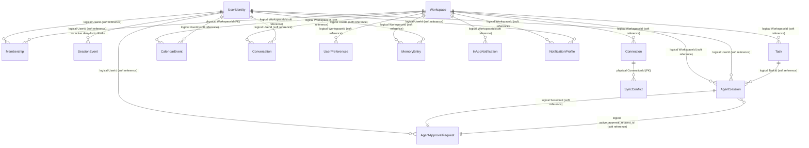

# Entity Relationship Diagram (ERD)

This document maps the physical tables, column schemas, primary/foreign keys, and cross-context logical relationships for the **AI Executive Assistant** database.

---

## 1. High-Level Context Relationship Diagram

This diagram shows how Bounded Contexts are isolated at the database level. Relationships across context boundaries are **logical ID-based references** (solid lines) with **no SQL Foreign Key constraints**. Relationships within context boundaries are **physical constraints** (double lines).

---

## 2. Complete Database ER Diagram

The following Mermaid diagram defines the tables, columns, keys, and constraints across all isolated schemas.

```mermaid
erDiagram
    %% --- SCHEMA: auth ---
    user_identities {
        uuid id PK
        varchar email UK "Normalized login identifier"
        varchar password_hash "Cryptographic password representation"
        varchar status "Active, Locked, Suspended"
        integer failed_login_attempts "lockout counter"
        varchar global_roles "Comma-separated list (EndUser, SystemOperator)"
        timestamp_tz created_at
        timestamp_tz updated_at
        integer version
    }

    session_events {
        uuid id PK
        uuid user_identity_id "Logical ref to user_identities(id)"
        varchar jti "JWT identifier invalidated by the event"
        varchar event_type "Logout, TokenRevoked, PasswordChanged, AccountSuspended"
        timestamp_tz occurred_at "When the event happened"
        jsonb metadata "IP / user agent / reason (optional)"
    }

    %% Active JWT deny-list is stored in Redis (key revoked:jti, TTL-scoped), not in Postgres.
    user_identities ||--o{ session_events : "audits"

    %% --- SCHEMA: workspace ---
    workspaces {
        uuid id PK
        varchar name "Workspace display label"
        varchar status "Active, Suspended, Archived"
        uuid owner_id "Logical ref to user_identities(id)"
        timestamp_tz created_at
        timestamp_tz updated_at
        integer version
    }

    memberships {
        uuid id PK
        uuid workspace_id FK "Refs workspaces(id)"
        uuid user_id "Logical ref to user_identities(id)"
        varchar role "Owner, Admin, Member"
        boolean is_primary "Primary workspace flag for the user"
        timestamp_tz created_at
        timestamp_tz updated_at
    }

    workspaces ||--o{ memberships : "has"

    %% --- SCHEMA: todo ---
    tasks {
        uuid id PK
        uuid workspace_id "Logical tenant boundary"
        uuid parent_task_id "Logical self-reference for recurrence instances"
        varchar title "Task name"
        text description "Optional detail"
        varchar priority "High, Medium, Low"
        varchar status "Active, Completed (soft-delete derived from deleted_at)"
        timestamp_tz due_date
        varchar recurrence_rule "RFC 5545 rule string"
        varchar recurrence_status "Active, Paused, Stopped"
        tsvector title_tsv "Generated to_tsvector('english', title)"
        timestamp_tz deleted_at "For soft delete recovery"
        timestamp_tz created_at
        timestamp_tz updated_at
        uuid created_by
        uuid updated_by
        integer version
    }

    tags {
        uuid id PK
        uuid task_id FK "Refs tasks(id) ON DELETE CASCADE"
        varchar name "Case-sensitive tag label"
    }

    tasks ||--o{ tags : "tagged_with"

    %% --- SCHEMA: calendar ---
    calendar_events {
        uuid id PK
        uuid workspace_id "Logical tenant boundary"
        uuid owner_id "Logical owner ref"
        varchar title "Event subject"
        text description
        timestamp_tz start_time
        timestamp_tz end_time
        varchar status "Scheduled, Deleted"
        timestamp_tz deleted_at "Soft delete marker"
        timestamp_tz created_at
        timestamp_tz updated_at
        uuid created_by
        uuid updated_by
        integer version
    }

    calendar_reminders {
        uuid id PK
        uuid event_id FK "Refs calendar_events(id) ON DELETE CASCADE"
        integer lead_time_minutes "Advance window in minutes"
        timestamp_tz trigger_time "Computed alert instant"
        varchar status "Scheduled, Triggered, Snoozed, Dismissed"
        timestamp_tz snoozed_until "Next fire time when snoozed"
        timestamp_tz created_at
        timestamp_tz updated_at
    }

    calendar_events ||--o{ calendar_reminders : "schedules"

    %% --- SCHEMA: memory ---
    conversations {
        uuid id PK
        uuid workspace_id "Logical tenant boundary"
        uuid user_id "Logical owner ref"
        uuid session_id "Optional logical ref to agent.sessions(id)"
        varchar title "Thread display label"
        varchar status "Active, Cleared, Archived"
        timestamp_tz last_turn_timestamp "Last turn time; retention marker"
        timestamp_tz created_at
        timestamp_tz updated_at
        integer version
    }

    conversation_turns {
        uuid id PK
        uuid conversation_id FK "Refs conversations(id) ON DELETE CASCADE"
        varchar sender_role "User, Agent"
        text content "Message body"
        timestamp_tz turn_timestamp "Sequence marker"
    }

    conversations ||--o{ conversation_turns : "contains"

    user_preferences {
        uuid id PK
        uuid workspace_id "Logical tenant boundary"
        uuid user_id "Logical owner ref"
        varchar timezone "IANA timezone code"
        varchar default_task_priority "High, Medium, Low"
        boolean prevent_calendar_overlap "Overlap flag"
        varchar preferred_notification_channels "Comma-separated list"
        integer default_reminder_lead_time_minutes "Default lead window in minutes"
        timestamp_tz created_at
        timestamp_tz updated_at
        integer version
    }

    memory_entries {
        uuid id PK
        uuid workspace_id "Logical tenant boundary"
        uuid user_id "Logical owner ref"
        text content "Fact text"
        real confidence_score "0.0 to 1.0"
        timestamp_tz created_at
        timestamp_tz updated_at
        integer version
    }

    %% --- SCHEMA: notification ---
    in_app_notifications {
        uuid id PK
        uuid workspace_id "Logical tenant boundary"
        uuid user_id "Logical recipient ref"
        varchar title
        text content
        varchar urgency_level "Low, Normal, Urgent, Critical"
        varchar status "Unread, Read, Dismissed"
        timestamp_tz read_at
        timestamp_tz dismissed_at
        timestamp_tz created_at
        timestamp_tz updated_at
        integer version
    }

    profiles {
        uuid id PK
        uuid workspace_id "Logical tenant boundary"
        uuid user_id "Logical owner ref"
        jsonb urgency_channels_map "JSON mapping of urgency-to-channels"
        varchar email_address "Address for email dispatch"
        varchar slack_webhook_reference "Vault key for Slack integration"
        varchar digest_schedule "Cron expression for email digests"
        varchar consent_policy "Enabled, Disabled"
        timestamp_tz last_digest_sent_at
        timestamp_tz next_digest_at
        timestamp_tz created_at
        timestamp_tz updated_at
        integer version
    }

    %% --- SCHEMA: agent ---
    sessions {
        uuid id PK
        uuid workspace_id "Logical tenant boundary"
        uuid user_id "Logical owner ref"
        text goal "Cognitive objective"
        varchar status "Planning, AwaitingApproval, Executing, Succeeded, Failed, Escalated"
        integer replan_attempt_count "Count 0..3, 4th triggers Escalated"
        uuid active_approval_request_id "Logical ref to approval request"
        timestamp_tz created_at
        timestamp_tz updated_at
        integer version
    }

    plan_steps {
        uuid id PK
        uuid session_id FK "Refs sessions(id) ON DELETE CASCADE"
        integer sequence_number "Order within the plan"
        varchar tool_reference "Registered tool name"
        jsonb tool_parameter_snapshot "Parameters passed to tool"
        varchar status "Pending, Running, Succeeded, Failed"
        uuid parent_step_id "Logical step dependency self-ref"
        text error_message "Failure reason for trace UI"
        timestamp_tz started_at
        timestamp_tz completed_at
        timestamp_tz created_at
        timestamp_tz updated_at
    }

    approval_requests {
        uuid id PK
        uuid workspace_id "Logical tenant boundary"
        uuid session_id "Logical ref to sessions(id)"
        jsonb plan_snapshot "Steps data for user view"
        varchar status "Pending, Approved, Rejected, Expired"
        timestamp_tz expiration_time "Approval timeout"
        uuid resolved_by_user_id "Logical ref to user_identities(id)"
        timestamp_tz resolved_at "Resolution instant"
        timestamp_tz created_at
        timestamp_tz updated_at
        integer version
    }

    sessions ||--o{ plan_steps : "coordinates"

    %% --- SCHEMA: connector ---
    connections {
        uuid id PK
        uuid workspace_id "Logical tenant boundary"
        varchar provider_type "GoogleCalendar, GitHub, Slack, TickTick, etc."
        varchar sync_mode "Bidirectional, OneWayImport, OneWayExport"
        jsonb sync_filter_rules "Criteria filters"
        varchar credential_vault_reference "Key for vault lookup"
        varchar status "Active, Suspended, Unauthorized, Syncing"
        boolean is_in_backoff "Rate-limit backoff active"
        timestamp_tz retry_after "Earliest next sync attempt"
        timestamp_tz last_successful_sync_at
        timestamp_tz last_failed_sync_at
        text last_sync_error_message
        timestamp_tz created_at
        timestamp_tz updated_at
        integer version
    }

    sync_conflicts {
        uuid id PK
        uuid workspace_id "Logical tenant boundary"
        uuid connection_id FK "Refs connections(id)"
        varchar entity_type "Task, Event"
        varchar local_entity_id "Logical ID of target task/event"
        varchar remote_entity_id "ID of provider resource"
        jsonb local_snapshot
        jsonb remote_snapshot
        varchar status "Pending, Resolved, Ignored"
        varchar resolution_strategy "UseLocal, UseRemote, ManualMerge"
        timestamp_tz resolved_at
        timestamp_tz created_at
        timestamp_tz updated_at
        integer version
    }

    connections ||--o{ sync_conflicts : "logs"
```

