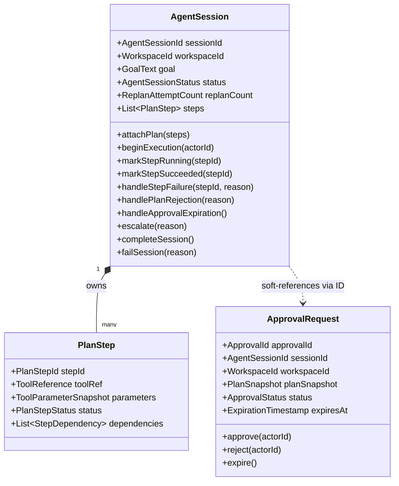
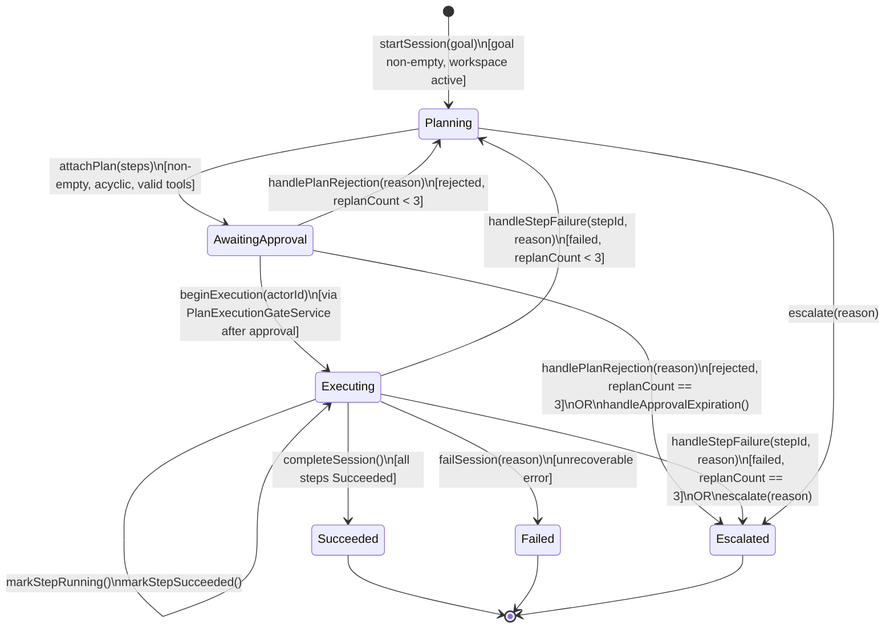
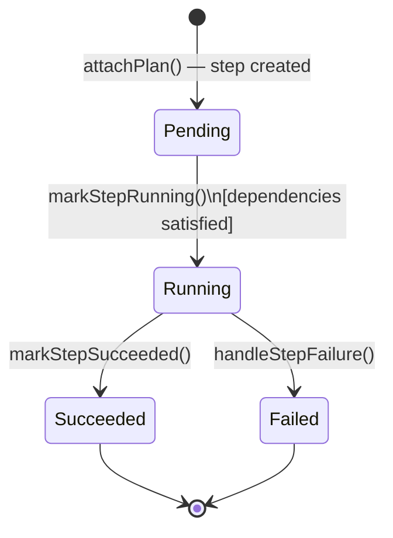
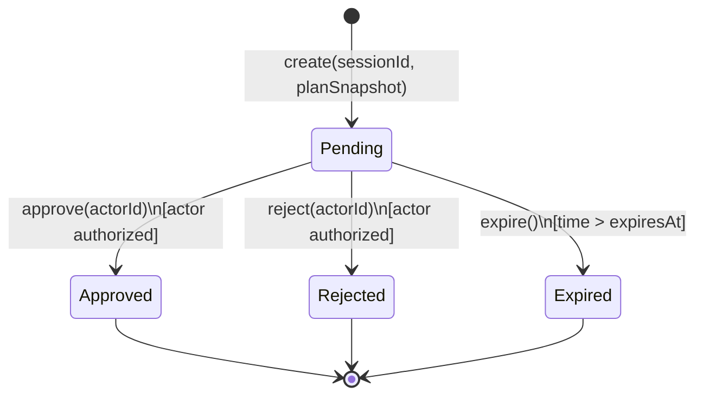
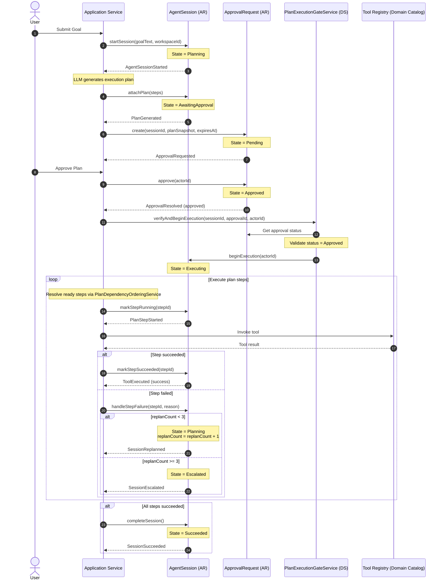

# Domain Model Specification — AI Agent Bounded Context

## Document Metadata

- **Version**: 2.0.0
- **Status**: Approved / Ready for Application Modeling
- **Date**: August 2, 2026
- **Author**: Principal Domain-Driven Design Architect

---

## Section 1: Executive Summary & Bounded Context Scope

The **AI Agent Bounded Context** (Cognitive Orchestration) is responsible for parsing high-level natural language user goals, decomposing them into dependency-aware execution plans, executing plans via structured capabilities (Tools), and evaluating execution results to autonomously recover from errors or escalate when needed.

### Core Responsibilities

- **Goal Decomposition & Planning**: Deconstructs user intents into a DAG (Directed Acyclic Graph) of executable plan steps.
- **Execution Lifecycle & State Tracking**: Coordinates step execution, records tool invocation outcomes, and manages retry loops.
- **Human-in-the-Loop Validation**: Manages asynchronous, non-blocking approval requests before executing sensitive or plan-level operations.
- **Self-Reflection & Recovery**: Evaluates step failure logs, increments re-planning counters (up to 3 times), and halts execution when limits are exceeded.
- **Grounding**: Ensures responses are derived strictly from retrieved workspace resources with appropriate citations.

### Boundary Definitions

- **What it Owns**:
  - The lifecycle and schema of the `AgentSession` and `ApprovalRequest` aggregates.
  - The validation of plan dependency orderings and cycles.
  - The registry definition of allowed tools (`Tool Registry` catalog).
- **What it DOES NOT Own**:
  - **Tool Implementation**: Other bounded contexts (e.g., Todo, Calendar, Mail) own the domain logic, schemas, and inbound ports that tools call.
  - **Productivity Data Persistence**: The agent does not read or write task/event database tables directly; it goes through ports/adapters.
  - **Chat Log Persistence**: Multi-turn chat conversation logs are owned and persisted by the `Memory` context.
  - **Notification Channels**: Delivering email, chat, or push notifications is delegated to the `Notification` context.

---

## Section 2: Ubiquitous Language

| Term                 | Synonyms                      | Context-Specific Meaning                                                                                                |
| :------------------- | :---------------------------- | :---------------------------------------------------------------------------------------------------------------------- |
| **Goal**             | User Goal, Intent, Request    | A high-level natural language objective submitted by the user. It is the entry point of the agent session.              |
| **Plan**             | Execution Plan, Step Sequence | A dependency-aware, ordered set of step entities generated by the planner to achieve a goal.                            |
| **Plan Step**        | Action, Plan Item             | A single, discrete action within a plan representing a slot for a specific tool invocation with configured parameters.  |
| **Tool**             | Function, Agent Capability    | A registered capability representing an internal domain capability or integration hook.                                 |
| **Tool Registry**    | Capability Catalog            | The secure, authorized directory containing metadata, schemas, and scopes of all callable tools.                        |
| **Reflection**       | Self-Reflection               | The evaluation of a tool's output to determine success, failure, and next steps in the planner loop.                    |
| **Re-planning**      | Plan Modification             | The process of generating a revised plan in response to a failed step. Limited to 3 attempts.                           |
| **Escalation**       | User Intervention Request     | Halting execution and prompting the user for manual help when a plan fails unrecoverably or hits the re-planning limit. |
| **Approval Request** | Human-in-the-Loop Check       | A formal, asynchronous checkpoint that blocks plan step execution until resolved by the user.                           |
| **Resolution**       | Approval Decision             | The user's decision to either `Approved` (resume execution) or `Rejected` (halt and replan).                            |
| **Grounding**        | Context Grounding             | The constraint that agent assertions must cite source documents. If empty, the agent must output "I do not know."       |
| **Actor**            | System User                   | The authenticated user (represented by `UserId`) who submits goals, resolves approvals, or interacts with the session.  |

---

## Section 3: Aggregate Discovery

The stateful cognitive process is modeled using two decoupled aggregates to optimize transactional boundaries and resource isolation:

### 1. Agent Session Aggregate

- **Root Entity**: `AgentSession`
- **Responsibilities**:
  - Tracks the original `GoalText`, execution status, and re-planning counts.
  - Manages the collection of `PlanStep` entities and enforces their execution dependencies.
  - Controls transitions between planning, execution, and terminal states.
- **Consistency Boundary**: A single `AgentSession` and its internal list of `PlanStep` entities.
- **Transaction Boundary**: Scoped to `AgentSessionId` and `WorkspaceId`.

### 2. Approval Request Aggregate

- **Root Entity**: `ApprovalRequest`
- **Responsibilities**:
  - Represents the long-lived, asynchronous human validation step.
  - Captures an immutable `PlanSnapshot` and tracks user resolution status (`Pending`, `Approved`, `Rejected`, `Expired`).
  - Guards resolution transitions against unauthorized access.
- **Consistency Boundary**: A single `ApprovalRequest` instance.
- **Transaction Boundary**: Scoped to `ApprovalId` and `WorkspaceId`.

---

## Section 4: Aggregate Structure & Entities

### Aggregate Root: `AgentSession`

- **Identity**: `AgentSessionId` + `WorkspaceId` (multi-tenant partition).
- **Attributes**:
  - `sessionId`: `AgentSessionId` (Immutable)
  - `workspaceId`: `WorkspaceId` (Immutable)
  - `goal`: `GoalText` (Immutable)
  - `status`: `AgentSessionStatus` (Mutable)
  - `replanCount`: `ReplanAttemptCount` (Mutable, initialized to 0)
  - `steps`: `List<PlanStep>` (Mutable collection)
- **Behaviors**:
  - `startSession(goal, workspaceId)`: Initializes session in `Planning` status.
  - `attachPlan(steps)`: Validates that the plan is non-empty, checks for tool existence, verifies the step dependency graph is acyclic (DAG), attaches steps in `Pending` state, and transitions status to `AwaitingApproval`.
  - `beginExecution(UserId actorId)`: Rejects execution if status is not `AwaitingApproval`. Transitions status to `Executing`. (Triggered by the `PlanExecutionGateService` after confirming approval status).
  - `markStepRunning(stepId)`: Verifies all prerequisites for the step have status `Succeeded`. Transitions step to `Running`.
  - `markStepSucceeded(stepId)`: Transitions step status to `Succeeded`. Checks if all steps are completed. If yes, transitions session status to `Succeeded`.
  - `handleStepFailure(stepId, reason)`: Transitions step status to `Failed`. Evaluates re-planning ceiling:
    - If `replanCount < 3`, increments `replanCount` by 1, clears all plan steps, and transitions session status to `Planning` (publishes `SessionReplanned`).
    - If `replanCount >= 3`, transitions session status to `Escalated` (publishes `SessionEscalated`).
  - `handlePlanRejection(reason)`: Evaluates re-planning ceiling on user rejection of proposed plan:
    - If `replanCount < 3`, increments `replanCount` by 1, clears all plan steps, and transitions session status to `Planning` (publishes `SessionReplanned`).
    - If `replanCount >= 3`, transitions session status to `Escalated` with reason "Plan rejection limit exceeded" (publishes `SessionEscalated`).
  - `handleApprovalExpiration()`: Unconditionally transitions session status to `Escalated` with reason "Approval request expired" (publishes `SessionEscalated`).
  - `escalate(reason)`: Transitions status to `Escalated` with the provided reason.
  - `completeSession()`: Transitions status to `Succeeded`.
  - `failSession(reason)`: Transitions status to `Failed`.

### Internal Entity: `PlanStep`

- **Identity**: `PlanStepId` (unique within its parent `AgentSession`).
- **Attributes**:
  - `stepId`: `PlanStepId` (Immutable)
  - `toolRef`: `ToolReference` (Immutable)
  - `parameters`: `ToolParameterSnapshot` (Immutable)
  - `status`: `PlanStepStatus` (Mutable: `Pending`, `Running`, `Succeeded`, `Failed`)
  - `dependencies`: `List<StepDependency>` (Immutable collection of prerequisite step references)

### Aggregate Root: `ApprovalRequest`

- **Identity**: `ApprovalId` + `WorkspaceId`.
- **Attributes**:
  - `approvalId`: `ApprovalId` (Immutable)
  - `sessionId`: `AgentSessionId` (Immutable soft reference)
  - `workspaceId`: `WorkspaceId` (Immutable)
  - `planSnapshot`: `PlanSnapshot` (Immutable copy of plan steps)
  - `status`: `ApprovalStatus` (Mutable: `Pending`, `Approved`, `Rejected`, `Expired`)
  - `expiresAt`: `ExpirationTimestamp` (Immutable, optional)
- **Behaviors**:
  - `approve(UserId actorId)`: Guards that status is `Pending`. Transitions status to `Approved` and logs the executing `actorId`.
  - `reject(UserId actorId)`: Guards that status is `Pending`. Transitions status to `Rejected` and logs the executing `actorId`.
  - `expire()`: Guards that status is `Pending` and current time is past `expiresAt`. Transitions status to `Expired`.

---

## Section 5: Value Object Catalog

All properties are modeled as immutable Value Objects. They validate their structure upon construction.

### 1. Identifiers

- **`AgentSessionId` / `ApprovalId` / `PlanStepId`**: Wrap UUIDs. Validate non-null, non-empty, and valid UUID formats.
- **`WorkspaceId` / `UserId`**: Represent tenant and actor identities. Validate non-empty and standard conformance.

### 2. `GoalText`

- **Fields**: `value: String`
- **Validation**: Cannot be blank after trimming. Enforces length constraints (minimum 5, maximum 1000 characters).

### 3. `AgentSessionStatus`

- **Fields**: `value: Enum` (`Planning`, `AwaitingApproval`, `Executing`, `Succeeded`, `Failed`, `Escalated`)

### 4. `PlanStepStatus`

- **Fields**: `value: Enum` (`Pending`, `Running`, `Succeeded`, `Failed`)

### 5. `ToolReference`

- **Fields**: `name: String`
- **Validation**: Must match alphanumeric and dot/dash naming patterns (`^[a-zA-Z0-9_\-\.]+$`).

### 6. `ToolParameterSnapshot`

- **Fields**: `payload: Map<String, Object>`
- **Validation**: Enforces deep immutability (defensive copy on construction). Must conform to tool schema metadata.

### 7. `StepDependency`

- **Fields**: `dependsOnStepId: PlanStepId`
- **Validation**: Checks that referenced step ID is non-null and is not self-referential.

### 8. `ReplanAttemptCount`

- **Fields**: `value: int`
- **Validation**: Must be an integer in the range `0..3` inclusive.

### 9. `ApprovalStatus`

- **Fields**: `value: Enum` (`Pending`, `Approved`, `Rejected`, `Expired`)

### 10. `PlanSnapshot`

- **Fields**: `steps: List<PlanStepSnapshot>`
- **Validation**: Non-empty step list. Encapsulates steps to prevent modifications after snapshotting.

### 11. `ExpirationTimestamp`

- **Fields**: `instant: Instant`
- **Validation**: Must represent a future point in time relative to the creation context (maximum 48 hours in the future).

### 12. `GroundingCitation`

- **Fields**: `documentId: String`, `sourceType: String`, `snippetText: String`
- **Validation**: Non-empty document reference, type, and source text.

### 13. `ToolRegistryEntry`

- **Fields**: `toolRef: ToolReference`, `description: String`, `paramSchema: JsonSchema`, `scope: Scope`
- **Validation**: Immutable schema definition.

### 14. `EscalationReason`

- **Fields**: `value: String`
- **Validation**: Non-blank, maximum length of 500 characters.

---

## Section 6: Domain Services & Factories

### 1. `PlanExecutionGateService`

- **Purpose**: Verify user authorization and plan approval status before launching the step executor loop.
- **Why it is a Domain Service**: Spans two aggregates. The `AgentSession` does not query the database for the `ApprovalRequest`. The service loads the `ApprovalRequest` status, confirms it is `Approved`, and triggers `beginExecution(actorId)` on the `AgentSession` to transition the session status to `Executing` atomically.

### 2. `PlanDependencyOrderingService`

- **Purpose**: Evaluates step states and identifies which steps are ready for concurrent execution.
- **Why it is a Domain Service**: Decouples graph-dependency algorithms (sorting, ready-node filtering) from state persistence logic, keeping them easily testable.
- **Responsibilities**: Returns the list of `Pending` steps whose prerequisite dependencies are all `Succeeded`.

### 3. `ToolRegistry` (Domain Catalog)

- **Purpose**: Serves as the read-only directory of valid tool declarations.
- **Responsibilities**: Validates that all tool references inside a proposed plan exist in the registry and conform to parameter schemas.

### 4. `GroundingValidatorService`

- **Purpose**: Validates generated text to ensure it does not hallucinate information.
- **Responsibilities**: Verifies that every claim in the response is backed by a valid `GroundingCitation`. If no matching retrieved resources exist, it enforces the "I do not know" response.

### 5. Factories

- **`AgentSessionFactory`**: Instantiates a new `AgentSession` with a generated ID, status set to `Planning`, and an empty step list.
- **`ApprovalRequestFactory`**: Instantiates an `ApprovalRequest` using the current plan steps from `AgentSession`, setting status to `Pending` and specifying an expiration timeline.

---

## Section 7: Repositories

Each Aggregate Root is managed by exactly one Repository interface:

### 1. `AgentSessionRepository`

- **Query Methods**:
  - `findById(AgentSessionId id, WorkspaceId tenantId): AgentSession`
  - `findActiveSessions(WorkspaceId tenantId): List<AgentSession>`
- **Behavior**: Saves state changes to the session and its constituent `PlanStep` entities atomically inside a single transaction.

### 2. `ApprovalRequestRepository`

- **Query Methods**:
  - `findById(ApprovalId id, WorkspaceId tenantId): ApprovalRequest`
  - `findBySessionId(AgentSessionId sessionId, WorkspaceId tenantId): ApprovalRequest`
  - `findPendingApprovals(WorkspaceId tenantId): List<ApprovalRequest>`
- **Behavior**: Persists approvals, resolution updates, and expiration status.

---

## Section 8: Domain Events

All domain events are published by Aggregate Roots as a result of business transitions and contain only simple properties or Value Objects.

| Event Name                | Publisher         | Consumers                        | Business Trigger                                                    | Payload                                                                                      |
| :------------------------ | :---------------- | :------------------------------- | :------------------------------------------------------------------ | :------------------------------------------------------------------------------------------- |
| **`AgentSessionStarted`** | `AgentSession`    | `Memory`, `Notification`         | A new goal is initialized in the workspace.                         | `sessionId`, `workspaceId`, `actorId`, `goalText`, `occurredAt`                              |
| **`PlanGenerated`**       | `AgentSession`    | Approval Service, `Notification` | Steps are attached; session transitions to `AwaitingApproval`.      | `sessionId`, `workspaceId`, `stepCount`, `occurredAt`                                        |
| **`ApprovalRequested`**   | `ApprovalRequest` | `Notification`, Audit            | An `ApprovalRequest` is successfully generated.                     | `approvalId`, `sessionId`, `workspaceId`, `planSnapshot`, `expiresAt`, `occurredAt`          |
| **`ApprovalResolved`**    | `ApprovalRequest` | `AgentSession`, `Notification`   | The user approves (`Approved`) or rejects (`Rejected`) the request. | `approvalId`, `sessionId`, `workspaceId`, `status` (ApprovalStatus), `actorId`, `occurredAt` |
| **`ApprovalExpired`**     | `ApprovalRequest` | `AgentSession`, `Notification`   | The user fails to resolve the approval request before the timeout.  | `approvalId`, `sessionId`, `workspaceId`, `occurredAt`                                       |
| **`PlanStepStarted`**     | `AgentSession`    | Audit, Monitoring                | A step transitions `Pending` -> `Running`.                          | `sessionId`, `stepId`, `toolRef`, `workspaceId`, `occurredAt`                                |
| **`ToolExecuted`**        | `AgentSession`    | `Memory`, Audit                  | A plan step's tool execution is recorded as completed.              | `sessionId`, `stepId`, `toolRef`, `workspaceId`, `success` (boolean), `occurredAt`           |
| **`SessionReplanned`**    | `AgentSession`    | `Notification`, Audit            | Re-planning is triggered (replan count incremented).                | `sessionId`, `workspaceId`, `replanAttempt` (int), `occurredAt`                              |
| **`SessionEscalated`**    | `AgentSession`    | `Notification`                   | Re-planning limit exceeded or unrecoverable error hit.              | `sessionId`, `workspaceId`, `replanCount`, `reason` (EscalationReason), `occurredAt`         |
| **`SessionSucceeded`**    | `AgentSession`    | `Memory`, `Notification`         | All steps transition to `Succeeded`.                                | `sessionId`, `workspaceId`, `goalText`, `occurredAt`                                         |
| **`SessionFailed`**       | `AgentSession`    | `Notification`, Audit            | Session halts due to unrecoverable failure.                         | `sessionId`, `workspaceId`, `reason`, `occurredAt`                                           |

---

## Section 9: Business Invariants & Validation Rules

### Invariant Catalog

| ID               | Category    | Rule Summary                                                                               | Enforcement point                                                                                                                               |
| :--------------- | :---------- | :----------------------------------------------------------------------------------------- | :---------------------------------------------------------------------------------------------------------------------------------------------- |
| **INV-AGENT-01** | Validation  | Execution cannot begin until ApprovalRequest status is `Approved`.                         | `PlanExecutionGateService` verifies `ApprovalStatus = Approved` on the approval request before invoking `AgentSession.beginExecution(actorId)`. |
| **INV-AGENT-02** | Validation  | Maximum of 3 automatic re-planning attempts. The 4th trigger must force an escalation.     | `AgentSession.handleStepFailure(stepId)` and `handlePlanRejection(reason)` check `replanCount`. If >= 3, they invoke `escalate()`.              |
| **INV-AGENT-03** | Validation  | Steps execute only when all prerequisite dependencies have status `Succeeded`.             | `AgentSession.markStepRunning(stepId)` evaluates prerequisite states before executing.                                                          |
| **INV-AGENT-04** | Validation  | Step dependency graph must be a Directed Acyclic Graph (DAG) with no cycles.               | `AgentSession.attachPlan(steps)` validates dependency ordering before accepting the plan.                                                       |
| **INV-AGENT-05** | Validation  | `GoalText` cannot be empty or blank.                                                       | `GoalText` constructor throws validation exception on empty strings.                                                                            |
| **INV-AGENT-06** | Validation  | A plan must contain at least one step.                                                     | `AgentSession.attachPlan(steps)` and `PlanSnapshot` reject empty lists.                                                                         |
| **INV-AGENT-07** | Consistency | All operations must respect the tenant boundary.                                           | `WorkspaceId` is immutable. Handlers verify matching IDs across sessions, approvals, and tools.                                                 |
| **INV-AGENT-08** | Consistency | Executor must only invoke capabilities defined in the `Tool Registry`.                     | `AgentSession.attachPlan` checks that all tool names are present in `ToolRegistry`.                                                             |
| **INV-AGENT-09** | Consistency | RAG responses must be grounded. Missing resources force an "I do not know" answer.         | `GroundingValidatorService` checks for presence of `GroundingCitation` values.                                                                  |
| **INV-AGENT-10** | Consistency | Resolved `ApprovalRequest` is immutable and cannot be re-resolved.                         | `ApprovalRequest` approve/reject/expire calls guard on `status = Pending`.                                                                      |
| **INV-AGENT-11** | Consistency | `GoalText` is immutable for the lifetime of the session.                                   | `AgentSession` provides no update modifier for the goal attribute.                                                                              |
| **INV-AGENT-12** | Consistency | Terminal session states (`Succeeded`, `Failed`, `Escalated`) accept no further operations. | All aggregate modifiers guard on `status not in {Succeeded, Failed, Escalated}`.                                                                |

---

## Section 10: Lifecycle & State Transitions

### AgentSession State Machine

### PlanStep State Machine (Internal Entity)

### ApprovalRequest State Machine

### Orchestration Sequence Diagram

This diagram shows how the application layer coordinates transactions across the decoupled aggregates using domain events and services.

