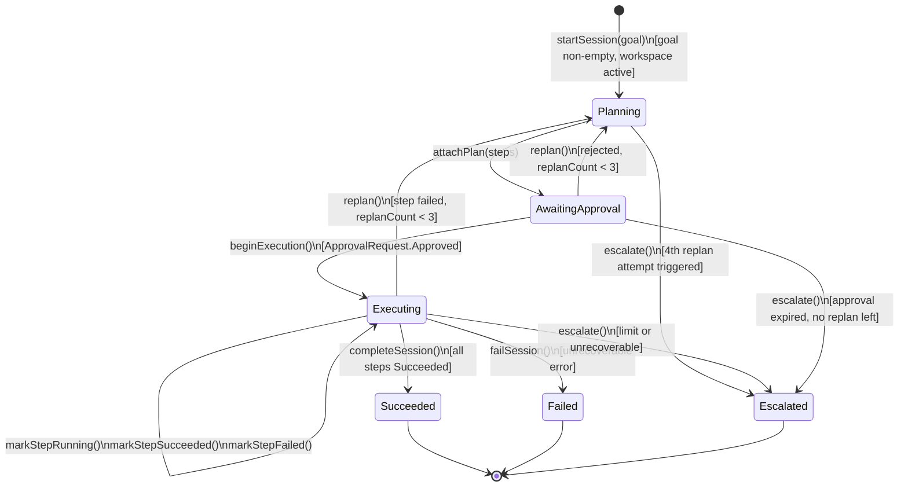
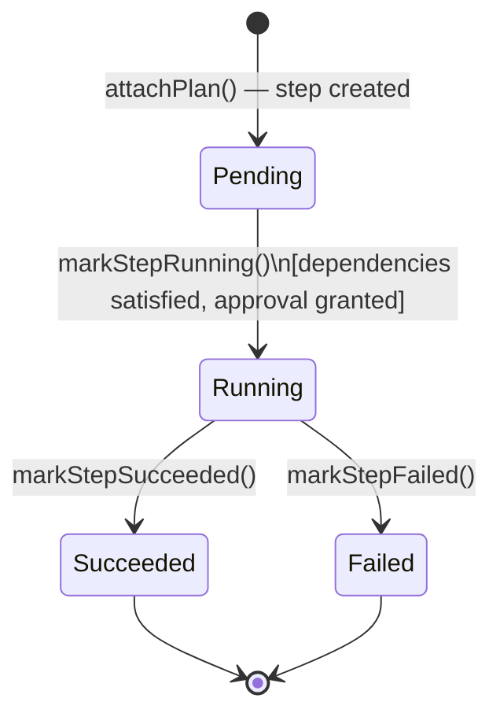
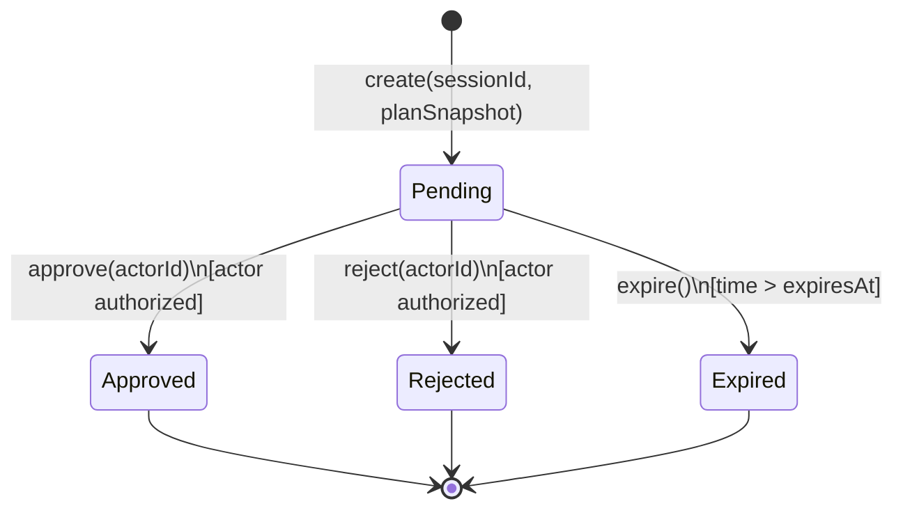

# Aggregate Lifecycle — AI Agent Bounded Context

---

## AgentSession Aggregate

### State Transitions

| From | To | Operation | Guard / Condition |
| --- | --- | --- | --- |
| _(none)_ | **Planning** | `startSession(goal, workspaceId)` | GoalText non-empty; workspace active |
| **Planning** | **AwaitingApproval** | `attachPlan(steps)` | At least one step; all steps have valid tool references |
| **AwaitingApproval** | **Executing** | `beginExecution(approvedBy)` | Linked `ApprovalRequest.status = Approved` |
| **AwaitingApproval** | **Planning** | `replan()` | `ApprovalRequest` rejected; replanCount < 3 |
| **Executing** | **Executing** | `markStepRunning(stepId)` | Step Pending; dependencies satisfied |
| **Executing** | **Executing** | `markStepSucceeded(stepId)` | Step Running |
| **Executing** | **Planning** | `replan()` | Step failed; replanCount < 3; `Planning` re-entered |
| **Executing** | **Succeeded** | `completeSession()` | All steps Succeeded |
| **Executing** | **Failed** | `failSession()` | Unrecoverable error; no replan path |
| **Planning** | **Escalated** | `escalate()` | replanCount would reach 4 (4th attempt triggers escalation) |
| **Executing** | **Escalated** | `escalate()` | replanCount would reach 4 or unrecoverable escalation condition |
| **AwaitingApproval** | **Escalated** | `escalate()` | Approval expired and no replan remaining |

### Business Operations

| Operation | Pre-condition | Post-condition | Events Raised |
| --- | --- | --- | --- |
| `startSession(goal, workspaceId)` | Goal non-empty; workspace active | Session Planning; replanCount = 0 | `AgentSessionStarted` |
| `attachPlan(steps)` | Status Planning | Plan attached; status AwaitingApproval | `PlanGenerated` |
| `beginExecution(approvedBy)` | Status AwaitingApproval; approval status Approved | Status Executing | _(none — execution events per step)_ |
| `markStepRunning(stepId)` | Status Executing; step Pending; deps satisfied | Step Running | `PlanStepStarted` |
| `markStepSucceeded(stepId)` | Step Running | Step Succeeded; if all done → `completeSession()` | `ToolExecuted` |
| `markStepFailed(stepId)` | Step Running | Step Failed | `ToolExecuted` (success=false) |
| `replan()` | replanCount < 3; status Executing or AwaitingApproval | replanCount++; status Planning; old plan cleared | `SessionReplanned` |
| `escalate()` | replanCount reaches 4 or unrecoverable error | Status Escalated | `SessionEscalated` |
| `completeSession()` | All steps Succeeded | Status Succeeded | `SessionSucceeded` |
| `failSession()` | Unrecoverable error | Status Failed | `SessionFailed` |

---

### AgentSession State Diagram

---

### PlanStep State Diagram

Applies to each `PlanStep` entity owned by the `AgentSession`.

---

## ApprovalRequest Aggregate

### State Transitions

| From | To | Operation | Guard / Condition |
| --- | --- | --- | --- |
| _(none)_ | **Pending** | `create(sessionId, planSnapshot, expiresAt?)` | Session exists and is AwaitingApproval |
| **Pending** | **Approved** | `approve(actorId)` | Actor is authorized member of workspace |
| **Pending** | **Rejected** | `reject(actorId)` | Actor is authorized member of workspace |
| **Pending** | **Expired** | `expire()` | Current time > `ExpirationTimestamp` |

### Business Operations

| Operation | Pre-condition | Post-condition | Events Raised |
| --- | --- | --- | --- |
| `create(sessionId, planSnapshot, expiresAt?)` | Session AwaitingApproval; plan non-empty | ApprovalRequest Pending | `ApprovalRequested` |
| `approve(actorId)` | Status Pending; actor authorized | Status Approved | `ApprovalResolved` (resolution=Approved) |
| `reject(actorId)` | Status Pending; actor authorized | Status Rejected | `ApprovalResolved` (resolution=Rejected) |
| `expire()` | Status Pending; time > expiresAt | Status Expired | `ApprovalExpired` |

---

### ApprovalRequest State Diagram

---

### Lifecycle Notes

- **Succeeded**, **Failed**, and **Escalated** are all terminal states on `AgentSession`. No further plan attachment or execution is possible.
- `replanCount` is incremented on each call to `replan()`. When the count would reach **4**, `escalate()` is called instead; no new plan is generated.
- `ApprovalRequest` is decoupled from `AgentSession` — they live in separate transactions. The session does not lock the approval aggregate; it reacts to `ApprovalResolved` via an event/command boundary.
- `PlanSnapshot` in the `ApprovalRequest` is an immutable copy — changes to the session plan after creation do not modify it.
- `beginExecution()` requires the resolved `ApprovalStatus = Approved` to be supplied as a command parameter (the session does not query the approval aggregate directly).
