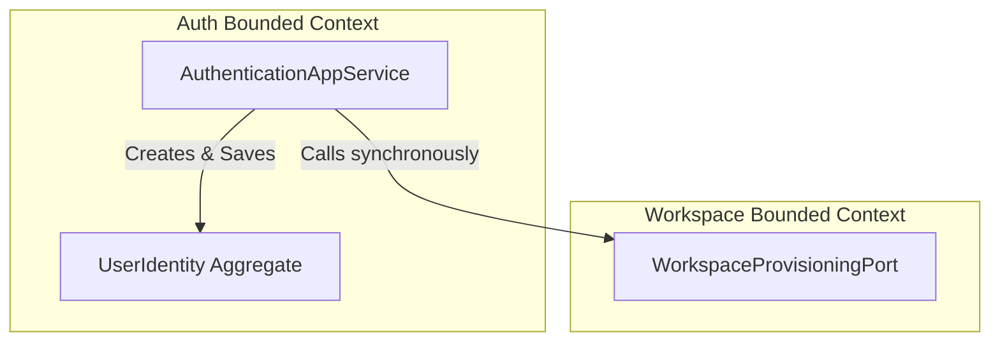
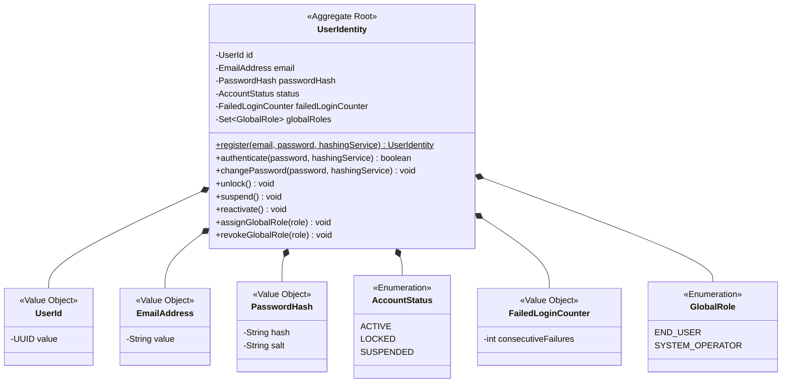
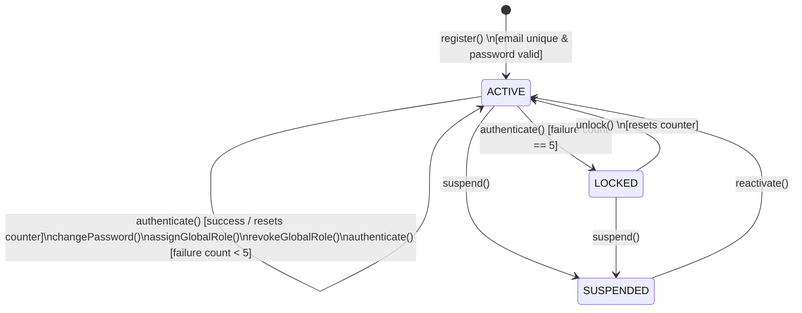
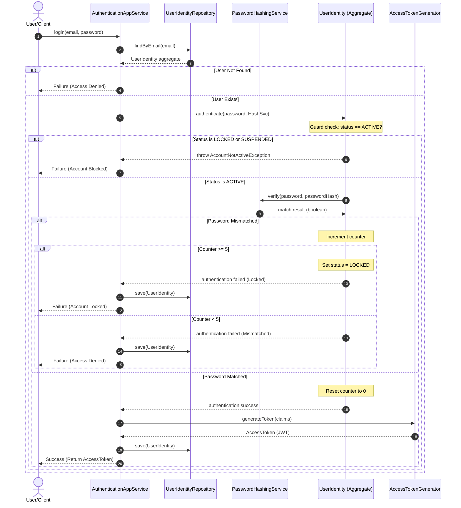
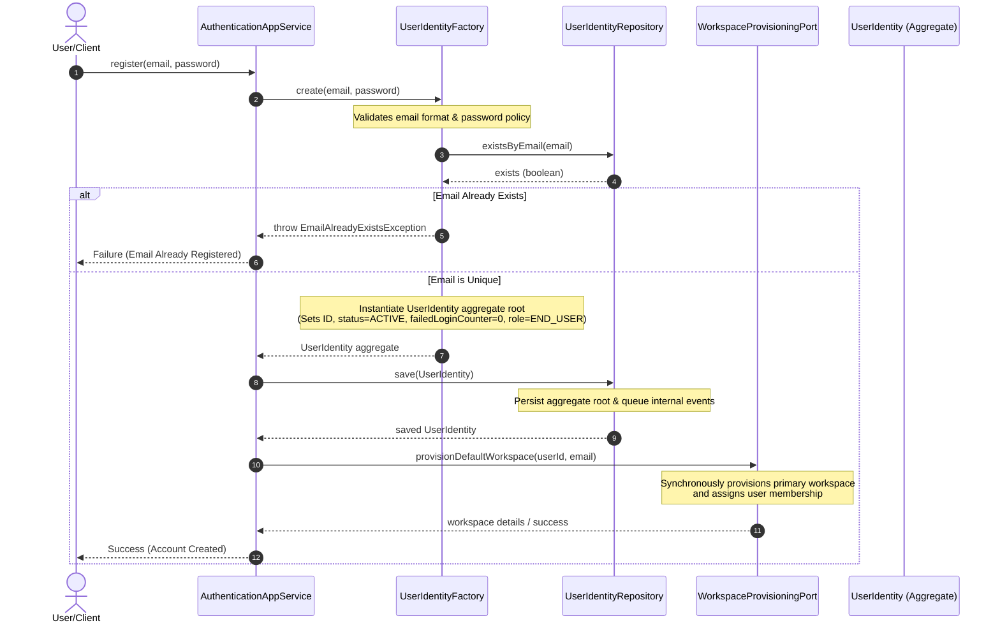

# Domain Model Specification — Auth Bounded Context

## Document Metadata
- **Version**: 2.0.0
- **Status**: Approved / Ready for Application Modeling
- **Date**: August 2, 2026
- **Author**: Principal DDD Reviewer

---

## Section 1: Executive Summary & Bounded Context Scope

The **Auth Bounded Context** is the Identity & Access Management (IAM) domain of the AI Executive Assistant. It is responsible for validating user identities, enforcing access policy rules at system entry, managing global administrative roles, and handling authentication session lifecycles.

### What the Auth Context Owns:
- Core credential definitions (usernames, email addresses, cryptographic hashes, and salts).
- The stateful security profile of users (account status, failed login history, and global platform roles).
- Password strength policies and password hashing/verification contracts.
- Defining tokens and verification interfaces representing active sessions.
- Publishing account lifecycle events (`UserRegistered`, `AccountLocked`, etc.).

### What the Auth Context DOES NOT Own:
- **Workspace Tenancy & Permissions**: CRUD operations on workspaces, workspace-specific user memberships, and workspace role verification are owned by the `Workspace` Bounded Context.
- **Data Authorization Filtering**: Individual business domains (e.g., productivity contexts) read tenancy claims from the security context to filter data; they do not call the Auth domain for local validation.
- **Direct Workspace Provisioning**: Creating workspaces during user registration is performed by the Workspace context reacting to the Auth context's events.
- **Session Cache Infrastructure**: Physical token blacklist stores (e.g., Redis databases) are infrastructure concerns.

---

## Section 2: Ubiquitous Language

| Term | Definition | Synonyms | Context-Specific Meaning |
| --- | --- | --- | --- |
| **User Identity** | The central security record representing a registered user account in the system. | Account, Identity, User | Identified by a system-wide unique `UserId`. Encapsulates security credentials, status, and global access roles. |
| **Credentials** | Security parameters used to prove identity during authentication. | Authentication Details, Login Credentials | Composed of a unique email address and a cryptographically salted password hash. |
| **Credential Policy** | The set of security rules governing password strength. | Password Complexity Policy | Requires passwords to be at least 8 characters long, containing at least one uppercase letter, one lowercase letter, one digit, and one special character. |
| **Session** | The period of authorized interaction for a successfully authenticated user. | Active Session, Authentication Session | Abstractly represented in the core domain; realized in infrastructure using tokens. |
| **Access Token** | A cryptographically signed token containing user identity and global role claims. | Access Token, Token | Standardized as a JSON Web Token (JWT) at the infrastructure layer, decoded at the API gateway to verify access. |
| **Session Signature** | Cryptographic signature applied to the Access Token to verify authenticity. | Token Signature | Signed using the Auth context's private keys and validated by all gateways/subsystems. |
| **Global Role** | System-wide authorization claims assigned to a User Identity. | System Role | System-level permissions: **End User** (default client access) and **System Operator** (platform-level manager). Distinct from Workspace-level roles. |
| **Session Invalidation** | The process of terminating a session, rendering subsequent API requests unauthorized. | Logout, Token Revocation | Marks token identifiers as revoked in infrastructure caches (e.g., Redis blacklist). |

---

## Section 3: Aggregate Discovery

### 1. User Identity Aggregate
The **User Identity** represents a registered user account. It serves as the transaction and consistency boundary for credentials, login history, and global platform privileges.

- **Aggregate Root**: `UserIdentity`
- **Responsibility**: Guards credential policy rules, manages login lockout thresholds, hashes raw passwords via domain services, and controls user activation state.
- **Consistency Boundary**: Scoped to the individual user record, including its login counters and global role collection.
- **Transaction Boundary**: Scoped to a single `UserId`.

### 2. Context Boundaries & Cross-Aggregate Relationships
The Auth context maintains strict isolation from other domains and integrates synchronously with the Workspace context during the registration flow, conforming to the official Context Map:



- **User Identity → Workspace (Synchronous Provisioning)**:
  - **Relationship Type**: Customer-Supplier (Synchronous Port call).
  - **Details**: When a new user registers, the Auth application layer service calls the Workspace context's `WorkspaceProvisioningPort` to provision a primary workspace for the new user synchronously within the registration transaction. This guarantees that every registered user immediately has a workspace, satisfying the system-wide invariant of multi-tenancy.

---

## Section 4: Aggregate Structure & Entities



### Aggregate Root: UserIdentity
- **Identity**: `UserId` (system-wide unique UUID).
- **Encapsulated State**:
  - `email`: `EmailAddress`
  - `passwordHash`: `PasswordHash`
  - `status`: `AccountStatus`
  - `failedLoginCounter`: `FailedLoginCounter`
  - `globalRoles`: `Set<GlobalRole>`

### Public Behaviors (Java-style pseudo-code):
```java
// UserIdentity manages its own internal domain events list, or extends a custom, framework-free domain base class
public class UserIdentity {
    private final List<DomainEvent> domainEvents = new ArrayList<>();
    private UserId id;
    private EmailAddress email;
    private PasswordHash passwordHash;
    private AccountStatus status;
    private FailedLoginCounter failedLoginCounter;
    private Set<GlobalRole> globalRoles;

    // Factory registration (internal instantiation)
    public static UserIdentity register(EmailAddress email, Password password, PasswordHashingService hashingService) {
        // Validation of password complexity is performed automatically by Password VO construction
        PasswordHash hash = hashingService.hash(password);
        UserIdentity user = new UserIdentity(UserId.generate(), email, hash);
        user.globalRoles.add(GlobalRole.END_USER);
        user.status = AccountStatus.ACTIVE;
        user.failedLoginCounter = FailedLoginCounter.zero();
        
        user.registerEvent(new UserRegistered(user.id, user.email, user.globalRoles));
        return user;
    }

    // Authenticate encapsulates password validation and status mutation
    public boolean authenticate(Password password, PasswordHashingService hashingService) {
        if (this.status == AccountStatus.LOCKED) {
            throw new AccountLockedException("Account is locked due to consecutive login failures.");
        }
        if (this.status == AccountStatus.SUSPENDED) {
            throw new AccountSuspendedException("Account has been administratively suspended.");
        }

        boolean matched = hashingService.verify(password, this.passwordHash);
        if (matched) {
            this.failedLoginCounter = this.failedLoginCounter.reset();
            this.registerEvent(new UserLoggedIn(this.id));
            return true;
        } else {
            this.failedLoginCounter = this.failedLoginCounter.increment();
            this.registerEvent(new LoginFailed(this.id, this.failedLoginCounter.getValue()));
            if (this.failedLoginCounter.getValue() >= 5) {
                this.status = AccountStatus.LOCKED;
                this.registerEvent(new AccountLocked(this.id, this.email));
            }
            return false;
        }
    }

    // Invariant INV-AUTH-05: updates are blocked on non-Active accounts (both Locked and Suspended)
    public void changePassword(Password newPassword, PasswordHashingService hashingService) {
        if (this.status != AccountStatus.ACTIVE) {
            throw new AccountNotActiveException("Password changes are only allowed on ACTIVE accounts.");
        }
        // Password constructor guarantees policy compliance
        this.passwordHash = hashingService.hash(newPassword);
        this.registerEvent(new PasswordChanged(this.id));
    }

    public void unlock() {
        if (this.status != AccountStatus.LOCKED) {
            throw new IllegalStateException("Only locked accounts can be unlocked.");
        }
        this.status = AccountStatus.ACTIVE;
        this.failedLoginCounter = FailedLoginCounter.zero();
        this.registerEvent(new AccountUnlocked(this.id));
    }

    public void suspend() {
        if (this.status == AccountStatus.SUSPENDED) return;
        this.status = AccountStatus.SUSPENDED;
        this.registerEvent(new AccountSuspended(this.id));
    }

    public void reactivate() {
        if (this.status != AccountStatus.SUSPENDED) {
            throw new IllegalStateException("Only suspended accounts can be reactivated.");
        }
        this.status = AccountStatus.ACTIVE;
        this.registerEvent(new AccountReactivated(this.id));
    }

    public void assignGlobalRole(GlobalRole role) {
        if (this.globalRoles.add(role)) {
            this.registerEvent(new GlobalRoleAssigned(this.id, role));
        }
    }

    public void revokeGlobalRole(GlobalRole role) {
        if (this.globalRoles.size() <= 1 && this.globalRoles.contains(role)) {
            throw new DomainRuleException("A user identity must maintain at least one global role.");
        }
        if (this.globalRoles.remove(role)) {
            this.registerEvent(new GlobalRoleRevoked(this.id, role));
        }
    }

    private void registerEvent(DomainEvent event) {
        this.domainEvents.add(event);
    }

    public List<DomainEvent> getDomainEvents() {
        return Collections.unmodifiableList(this.domainEvents);
    }

    public void clearDomainEvents() {
        this.domainEvents.clear();
    }
}
```

---

## Section 5: Value Object Catalog

### 1. `UserId`
- **Fields**: `UUID value`
- **Immutability**: Strict immutability.
- **Validation**: Cannot be null.

### 2. `EmailAddress`
- **Fields**: `String value`
- **Immutability**: Strict immutability.
- **Validation**: Enforces valid RFC-5322 email syntax. Normative conversion (lowercase strings) applied on construction.

### 3. `PasswordHash`
- **Fields**: `String hash`, `String salt`, `String algorithm`
- **Immutability**: Strict immutability.
- **Validation**: Values cannot be empty; stores no plaintext.

### 4. `Password`
- **Fields**: `String value`
- **Immutability**: Ephemeral/transient. Never persisted to databases or held in aggregate fields.
- **Validation**: Construction enforces `CredentialPolicy` rules:
  - Minimum 8 characters.
  - At least one uppercase letter.
  - At least one lowercase letter.
  - At least one numeric digit.
  - At least one special symbol.

### 5. `CredentialPolicy`
- **Fields**: Static complexity constants. Represents the business policy governing passwords.
- **Immutability**: Constant value object.

### 6. `AccountStatus`
- **Fields**: Enumeration with values: `ACTIVE`, `LOCKED`, `SUSPENDED`.
- **Immutability**: Replaced as value on Aggregate root using explicit transitions.

### 7. `GlobalRole`
- **Fields**: Enumeration with values: `END_USER`, `SYSTEM_OPERATOR`.
- **Immutability**: Collection values replaced.

### 8. `FailedLoginCounter`
- **Fields**: `int value`
- **Immutability**: Immutable; replaced via `increment()` or `reset()` returning a new instance.
- **Validation**: Non-negative integer.

### 9. `AccessTokenClaims` (Conceptual Payload)
- **Fields**: `UserId userId`, `Set<GlobalRole> roles`, `Instant issuedAt`, `Instant expiresAt`
- **Immutability**: Immutable. Represents token claims at issuance.
- **Validation**: Requires `userId` to refer to an active identity.

### 10. `RevokedTokenReference` (Conceptual Value Object)
- **Fields**: `String tokenSignatureId`, `Instant blacklistedAt`
- **Immutability**: Strict immutability. Used to flag invalidated tokens in security registries.

---

## Section 6: Domain Services & Factories

### 1. `PasswordHashingService`
- **Purpose**: Cryptographically hashes raw passwords using salts, and validates matches.
- **Rationale for Domain Service**: Cryptographic implementation details (e.g., bcrypt, argon2, salt rounds, pepper values) are external system dependencies. The domain specifies the contract interface, while the infrastructure layer implements the algorithm.
- **Contract**:
  - `PasswordHash hash(Password password)`
  - `boolean verify(Password password, PasswordHash hash)`

### 2. `AccessTokenGenerator` (formerly JwtIssuanceService)
- **Purpose**: Constructs session tokens from user identity facts.
- **Rationale for Domain Service**: Signing keys, signing libraries, and token structure formats (like JSON Web Tokens) are infrastructure details. The domain defines the generator contract.
- **Contract**:
  - `String generateToken(AccessTokenClaims claims)`

### 3. `SessionRevocationRegistry` (formerly SessionInvalidationService)
- **Purpose**: Infrastructure/Application interface to record logged-out or forced-inactivated session tokens.
- **Rationale**: Tracking token blacklists spans multiple servers/databases (e.g. Redis). This is an application-level infrastructure adapter coordinating the revocation list.
- **Contract**:
  - `void revoke(RevokedTokenReference tokenRef)`
  - `boolean isRevoked(String tokenSignatureId)`

### 4. Factories: `UserIdentityFactory`
- **Purpose**: Encapsulates initial setup of new identities.
- **Responsibilities**:
  - Performs system-wide check of `EmailAddress` uniqueness via repository before creating the entity.
  - Invokes `UserIdentity.register(...)` to instantiate the aggregate with default roles.
- **Contract & Implementation**:
```java
public class UserIdentityFactory {
    private final UserIdentityRepository repository;
    private final PasswordHashingService hashingService;

    public UserIdentityFactory(UserIdentityRepository repository, PasswordHashingService hashingService) {
        this.repository = repository;
        this.hashingService = hashingService;
    }

    public UserIdentity create(EmailAddress email, Password password) {
        if (repository.existsByEmail(email)) {
            throw new EmailAlreadyExistsException("An account with this email address already exists.");
        }
        return UserIdentity.register(email, password, hashingService);
    }
}
```

---

## Section 7: Repositories

### `UserIdentityRepository`
- **Target Aggregate**: `UserIdentity`
- **Responsibilities**:
  - `UserIdentity findById(UserId id)`: Retrieves a specific identity.
  - `UserIdentity findByEmail(EmailAddress email)`: Retrieves identity for login checks.
  - `boolean existsByEmail(EmailAddress email)`: Enforces uniqueness invariants on registration.
  - `void save(UserIdentity identity)`: Saves the new state or updates the entity.
- **Out of Scope**: 
  - Verification of access tokens.
  - Persisting workspace records.

---

## Section 8: Domain & Application Events

### 1. Domain Events (Published by `UserIdentity` Aggregate Root)

#### `UserRegistered`
- **Trigger**: New active account created.
- **Payload**: `userId`, `email`, `globalRoles`, `occurredAt`
- **Core Consumer**: Internal audit logger and security monitoring. (Note: Workspace provisioning is coordinated synchronously by the Application layer via `WorkspaceProvisioningPort` rather than via event subscription).

#### `UserLoggedIn`
- **Trigger**: Credentials verified during authentication.
- **Payload**: `userId`, `occurredAt`
- **Core Consumer**: Security audit logging.

#### `LoginFailed`
- **Trigger**: Mismatched credentials during authentication.
- **Payload**: `userId`, `failureCount`, `occurredAt`
- **Core Consumer**: Security monitoring, lockout evaluation.

#### `AccountLocked`
- **Trigger**: `FailedLoginCounter` reaches 5 consecutive failures.
- **Payload**: `userId`, `email`, `occurredAt`
- **Core Consumer**: `Notification` context (sends email alert), security audit logs.

#### `AccountUnlocked`
- **Trigger**: LOCKED account restored to ACTIVE.
- **Payload**: `userId`, `occurredAt`
- **Core Consumer**: `Notification` context (sends unlock notice).

#### `AccountSuspended`
- **Trigger**: Account administratively suspended.
- **Payload**: `userId`, `occurredAt`
- **Core Consumer**: `Workspace` context (blocks workspace calls), `Notification` context.

#### `AccountReactivated`
- **Trigger**: SUSPENDED account restored to ACTIVE.
- **Payload**: `userId`, `occurredAt`
- **Core Consumer**: `Notification` context.

#### `PasswordChanged`
- **Trigger**: Password hash rotated successfully.
- **Payload**: `userId`, `occurredAt`
- **Core Consumer**: `SessionRevocationRegistry` (invalidates current user sessions), `Notification` context.

#### `GlobalRoleAssigned` / `GlobalRoleRevoked`
- **Trigger**: Updates to global roles collection.
- **Payload**: `userId`, `role`, `occurredAt`
- **Core Consumer**: Security audit logging.

### 2. Application Events (Published by Application Layer Services)

#### `SessionInvalidated`
- **Trigger**: Active logout requested or forced session eviction.
- **Payload**: `userId`, `tokenSignatureId`, `occurredAt`
- **Core Consumer**: Security filters, API gateways (places token signature in the blacklist).

---

## Section 9: Business Invariants & Validation Rules

### Invariant Catalog

| ID | Category | Rule | Enforcement Mechanism |
| --- | --- | --- | --- |
| **INV-AUTH-01** | Validation | Email address must be unique system-wide. | Checked by `UserIdentityFactory` calling `UserIdentityRepository.existsByEmail()` prior to initialization. |
| **INV-AUTH-02** | Validation | Password must meet strength requirements (8+ chars, upper/lower/digit/special symbol). | Checked inside `Password` constructor; attempts to supply non-compliant strings fail instantiation. |
| **INV-AUTH-03** | Validation | Plaintext passwords must never be stored in persistent storage. | Enforced by modeling `Password` as a transient type. Only `PasswordHash` is stored on the aggregate root. |
| **INV-AUTH-04** | Validation | Account must lock after 5 consecutive failed login attempts. | Enforced by the aggregate root during `authenticate()`. When the failure count hits 5, the status changes to `LOCKED`. |
| **INV-AUTH-05** | Validation | Login/password updates are blocked on non-Active accounts. | Verified by guards at the beginning of `UserIdentity.authenticate()` and `changePassword()`. |
| **INV-AUTH-06** | Consistency | System-wide calls must require valid token verification. | Enforced by the infrastructure API gateway; users must have an active identity for token signatures to remain valid. |
| **INV-AUTH-07** | Consistency | User identity must have at least one global role. | Enforced during `revokeGlobalRole()`: operations that empty the role set are rejected. |
| **INV-AUTH-08** | Consistency | Failed login counter resets to 0 on successful login. | Enforced inside `UserIdentity.authenticate()`: successful matches reset the counter. |
| **INV-AUTH-09** | Consistency | Access tokens may only be generated for ACTIVE accounts. | Validated in the application flow when loading the aggregate prior to calling `AccessTokenGenerator`. |

---

## Section 10: Lifecycle & State Transitions

### State Transitions Table

| From State | To State | Operation | Guard / Condition |
| --- | --- | --- | --- |
| _(None)_ | **ACTIVE** | `register(...)` | Valid email format, unique email, and password policy satisfied. |
| **ACTIVE** | **ACTIVE** | `authenticate(...)` [Success] | Password matched; `FailedLoginCounter` is reset to 0. |
| **ACTIVE** | **ACTIVE** | `authenticate(...)` [Fail < 5] | Password mismatched; `FailedLoginCounter` increments. |
| **ACTIVE** | **LOCKED** | `authenticate(...)` [Fail >= 5] | Password mismatched; `FailedLoginCounter` reaches 5. |
| **LOCKED** | **ACTIVE** | `unlock()` | Executed by admin or lock expiry policy. Resets counter. |
| **ACTIVE** | **SUSPENDED** | `suspend()` | Administrative block action. |
| **LOCKED** | **SUSPENDED** | `suspend()` | Administrative block action on locked user. |
| **SUSPENDED** | **ACTIVE** | `reactivate()` | Administrative reactivation action. |

---

### State Transitions Diagram



---

### Sequence Diagram: User Authentication & State Checks

This diagram illustrates how the Application Service coordinates between the database, domain aggregate root, and cryptographic services to authenticate a user while respecting invariants.



---

### Sequence Diagram: User Registration & Workspace Provisioning

This diagram illustrates how the Application Service orchestrates registration, ensuring email uniqueness, password hashing, aggregate creation, persistence, and synchronous workspace provisioning.


```
