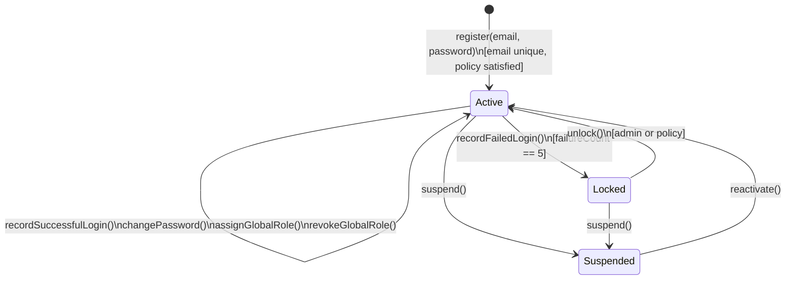

# Aggregate Lifecycle — Auth Bounded Context

---

## UserIdentity Aggregate

### State Transitions

| From | To | Operation | Guard / Condition |
| --- | --- | --- | --- |
| _(none)_ | **Active** | `register(email, password)` | Email unique; password satisfies `CredentialPolicy` |
| **Active** | **Locked** | `recordFailedLogin()` | `FailedLoginCounter` reaches 5 consecutive failures |
| **Locked** | **Active** | `unlock()` | Admin or automated unlock policy; counter reset |
| **Active** | **Suspended** | `suspend()` | Admin operation |
| **Locked** | **Suspended** | `suspend()` | Admin may also suspend a locked account |
| **Suspended** | **Active** | `reactivate()` | Admin operation |
| **Active** | **Active** | `recordSuccessfulLogin()` | Counter reset; no state change |
| **Active** | **Active** | `changePassword(new)` | New password satisfies `CredentialPolicy` |
| **Active** | **Active** | `assignGlobalRole(role)` | Role not already held |
| **Active** | **Active** | `revokeGlobalRole(role)` | Role currently held |

### Business Operations

| Operation | Pre-condition | Post-condition | Events Raised |
| --- | --- | --- | --- |
| `register(email, password)` | Email not already registered; password valid | Account created, status `Active`, role `EndUser` assigned | `UserRegistered` |
| `authenticate(email, password)` | Account exists | Counter reset on success; counter incremented on failure | `UserLoggedIn` or `LoginFailed` (+ `AccountLocked` if threshold) |
| `changePassword(newPassword)` | Status `Active`; new password satisfies policy | `PasswordHash` replaced | `PasswordChanged` |
| `recordFailedLogin()` | Any status that allows the call | Counter incremented; `Locked` if count = 5 | `LoginFailed`, optionally `AccountLocked` |
| `recordSuccessfulLogin()` | Status `Active` | Counter reset to 0 | `UserLoggedIn` |
| `lock()` (explicit or via counter) | Status `Active` | Status = `Locked` | `AccountLocked` |
| `unlock()` | Status `Locked` | Status = `Active`; counter reset | `AccountUnlocked` |
| `suspend()` | Status `Active` or `Locked` | Status = `Suspended` | `AccountSuspended` |
| `reactivate()` | Status `Suspended` | Status = `Active` | `AccountReactivated` |
| `assignGlobalRole(role)` | Role not already assigned | Role added to set | `GlobalRoleAssigned` |
| `revokeGlobalRole(role)` | Role currently assigned | Role removed from set | `GlobalRoleRevoked` |

---

### State Diagram

---

### Lifecycle Notes

- **Registration** is a single atomic operation: email uniqueness is checked, password is validated against `CredentialPolicy`, hashed (infrastructure concern), and the aggregate is persisted in `Active` state.
- **Authentication** is a read-then-write operation: credentials are verified, then either `recordSuccessfulLogin()` or `recordFailedLogin()` is called on the aggregate. The JWT is issued outside the aggregate by the application/infrastructure layer.
- **Locked** is a protective transitional state — it is not terminal. An administrator or an automated time-based policy can restore the account to `Active`.
- **Suspended** is an administrative terminal-like state. Only an admin can reactivate.
- The aggregate never stores a plaintext password. `Password` (transient VO) is discarded after hashing.
- Session tokens (`JwtClaims`, `SessionInvalidationToken`) are managed outside the aggregate by the application/infrastructure layer but their revocation is tracked via `SessionInvalidated` events.
