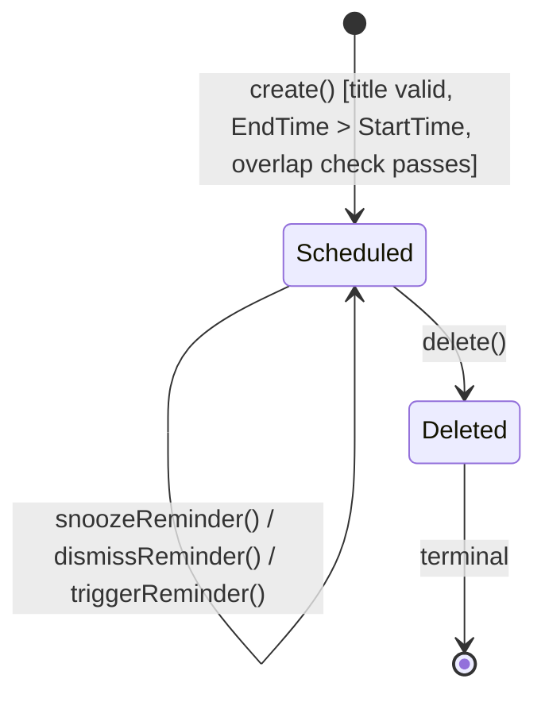
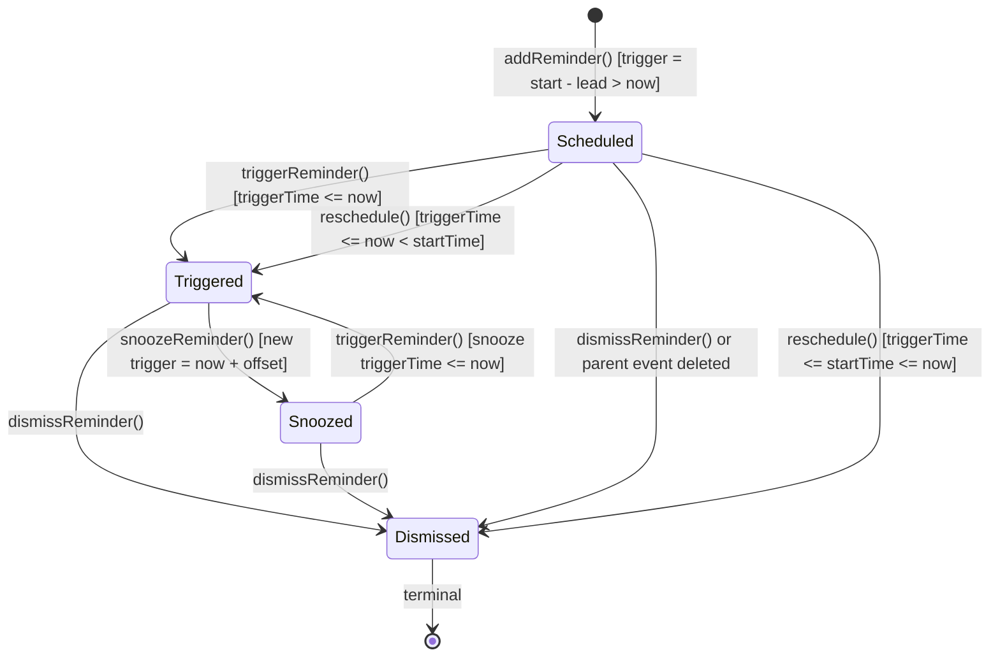
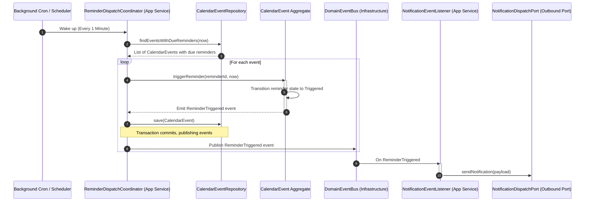

# Domain Model Specification — Calendar Bounded Context

## Document Metadata
- **Version**: 2.1.0
- **Status**: Approved / Ready for Application Modeling
- **Date**: August 2, 2026
- **Author**: Principal Domain-Driven Design Architect & Hexagonal Reviewer
- **Derived From**:
  - [ubiquitous-language.md](file:///D:/VsCode/Java/ai_executive_assistant/docs/domain-model/calendar/ubiquitous-language.md)
  - [aggregate-discovery.md](file:///D:/VsCode/Java/ai_executive_assistant/docs/domain-model/calendar/aggregate-discovery.md)
  - [entity-model.md](file:///D:/VsCode/Java/ai_executive_assistant/docs/domain-model/calendar/entity-model.md)
  - [value-object-model.md](file:///D:/VsCode/Java/ai_executive_assistant/docs/domain-model/calendar/value-object-model.md)
  - [domain-services.md](file:///D:/VsCode/Java/ai_executive_assistant/docs/domain-model/calendar/domain-services.md)
  - [repository-model.md](file:///D:/VsCode/Java/ai_executive_assistant/docs/domain-model/calendar/repository-model.md)
  - [domain-events.md](file:///D:/VsCode/Java/ai_executive_assistant/docs/domain-model/calendar/domain-events.md)
  - [invariants.md](file:///D:/VsCode/Java/ai_executive_assistant/docs/domain-model/calendar/invariants.md)
  - [lifecycle.md](file:///D:/VsCode/Java/ai_executive_assistant/docs/domain-model/calendar/lifecycle.md)

---

## Section 1: Executive Summary & Bounded Context Scope

The **Calendar Bounded Context** is responsible for managing the scheduled time commitments, calendar events, and reminders for users within the AI Executive Assistant system. It ensures that scheduling rules are strictly followed and provides capabilities to query schedule blocks securely within tenant-defined workspaces.

### What the Calendar Context Owns
- The state and database models of `CalendarEvent` aggregates and their associated `Reminder` entities.
- Validation of scheduling rules (e.g. chronological consistency and conditional overlap enforcement).
- Trigger time calculations for reminders (both on initial creation and rescheduling).
- Maintaining lifecycle states of events (Scheduled, Deleted) and reminders (Scheduled, Triggered, Snoozed, Dismissed).
- Restricting all operations within the strict tenant boundary defined by a `WorkspaceId`.

### What the Calendar Context DOES NOT Own
- **User Authentication & Identity**: Sourced from the `Auth` context (references `UserId` as a soft reference).
- **Workspace Tenancy & Memberships**: Managed by the `Workspace` context (references `WorkspaceId` as a soft reference).
- **User Preferences Storage**: Stored in the `Memory` context. The preference `preventCalendarOverlap` is queried from `Memory` and passed in as context to the Calendar domain operations.
- **Notification Delivery Channels & Prefs**: Managed by the `Notification` context. The Calendar context calculates *when* a reminder triggers and publishes the event; the `Notification` context handles the actual channel routing and delivery.
- **External Synchronization (Google Calendar, Outlook)**: Managed by the `Connector` context acting as an Anti-Corruption Layer (ACL).
- **Task Management**: Managed by the `Todo` context.
- **Goal planning and natural language processing**: Managed by the `AI Agent` context.

---

## Section 2: Ubiquitous Language

| Term | Synonyms | Context-Specific Definition |
| :--- | :--- | :--- |
| **Calendar Event** | Event, Appointment, Schedule Block | A scheduled block of time reserved for a specific activity, characterized by a title, start time, end time, and optional reminders, belonging strictly to a single workspace. |
| **Start Time** | Event Start, Start Date | The specific date-time when a Calendar Event is scheduled to begin. Must be non-null and precede the End Time. |
| **End Time** | Event End, End Date | The specific date-time when a Calendar Event is scheduled to conclude. Must occur chronologically after the Start Time. |
| **Reminder** | Event Alert, Notification Trigger | An alert configuration bound to a single Calendar Event, defined by a lead time offset relative to the event start time. |
| **Lead Time** | Advanced Notice, Alert Offset | The duration before the event's Start Time when a Reminder should trigger (e.g. 15 minutes, 1 hour). |
| **Snooze** | Delay Alert, Pause Reminder | The action of temporarily delaying a triggered Reminder notification by a short user-defined duration. |
| **Dismiss** | Acknowledge, Clear Reminder | The action of acknowledging a triggered or snoozed reminder, permanently deactivating it. |
| **Schedule Collision** | Overlap, Scheduling Conflict | An intersection between the time range of two or more active events within the same workspace. |
| **Overlap Constraint** | Overlap Prevention Policy | A user-defined preference. If enabled, the system rejects any event creation/rescheduling that would cause a Schedule Collision. |

---

## Section 3: Aggregate Discovery

The primary and only aggregate root in this bounded context is the **Calendar Event** aggregate.

### CalendarEvent Aggregate Boundary
- **Aggregate Root**: `CalendarEvent`
- **Internal Entities**: `Reminder` (lifecycle-bound to the event, managed exclusively through the root).
- **Consistency Boundary**: A single `CalendarEvent` instance and its child `Reminder` entities. Any modification to the event details or its reminders is saved as an atomic unit.
- **Transaction Boundary**: Scoped to a single `EventId` within a specific `WorkspaceId`. Operations on one event do not lock other events, except during validation of overlap constraints, which reads other active events in the same workspace.

### Aggregate Lifecycle State Transitions
- **Scheduled**: Created with valid invariants and actively visible on the calendar.
- **Deleted**: Terminal state where the event is removed/cancelled and all active reminders are cancelled.

---

## Section 4: Aggregate Structure & Entities

### Aggregate Root: `CalendarEvent`
- **Identity**: `EventId` (unique identifier) scoped to a tenant `WorkspaceId`.
- **Properties**:
  - `eventId`: EventId (Immutable)
  - `workspaceId`: WorkspaceId (Immutable)
  - `userId`: UserId (Immutable event owner reference)
  - `title`: EventTitle (Replace-on-change)
  - `description`: EventDescription (Replace-on-change)
  - `timeRange`: EventTimeRange (Replace-on-change)
  - `status`: EventStatus (Replace-on-change)
  - `reminders`: Collection of `Reminder` entities
- **Behaviors**:
  - `create(title, timeRange, description, workspaceId, userId, initialLeadTimes, now)`: Instantiates a new event, attaching initial reminders with trigger validations.
  - `updateMetadata(title, description)`: Updates text fields.
  - `reschedule(newTimeRange, now)`: Updates the time range and recomputes all scheduled reminder trigger times.
  - `delete()`: Transitions status to `Deleted` and transitions all reminders to `Dismissed`.
  - `addReminder(leadTime, now)`: Adds a new `Reminder` entity, calculating its trigger time and validating it is in the future.
  - `removeReminder(reminderId)`: Removes a pending scheduled reminder.
  - `snoozeReminder(reminderId, offset, now)`: Snoozes a triggered reminder by updating its trigger time.
  - `dismissReminder(reminderId)`: Permanently disables a reminder.
  - `triggerReminder(reminderId, now)`: Invoked when the trigger time is reached to update its status to `Triggered` and emit the corresponding domain event.

### Entity: `Reminder`
- **Identity**: `ReminderId` (unique within the parent `CalendarEvent` aggregate boundary).
- **Properties**:
  - `reminderId`: ReminderId (Immutable)
  - `leadTime`: LeadTime (Immutable)
  - `triggerTime`: ReminderTriggerTime (Mutable; recalculated on reschedule or snooze)
  - `status`: ReminderStatus (Scheduled, Triggered, Snoozed, Dismissed)
- **Behaviors**:
  - `trigger()`: Moves status from `Scheduled`/`Snoozed` to `Triggered`.
  - `snooze(offset, now)`: Moves status from `Triggered` to `Snoozed` and sets `triggerTime = now + offset`.
  - `dismiss()`: Moves status to `Dismissed` (terminal).
  - `recalculate(newStartTime, now)`: Computes `triggerTime = newStartTime - leadTime`. If the recalculated time is in the past:
    - If `newStartTime > now` (event is in the future), transitions status to `Triggered` immediately.
    - If `newStartTime <= now` (event has passed), transitions status to `Dismissed` (deactivated).

---

## Section 5: Value Object Catalog

### 1. `EventId`
- **Description**: Opaque unique identifier for the event.
- **Fields**: UUID / String value.
- **Validation**: Non-null.

### 2. `WorkspaceId`
- **Description**: Shared Kernel tenant identifier.
- **Fields**: UUID / String value.
- **Validation**: Non-null.

### 3. `UserId`
- **Description**: Identifier of the user who owns the event (soft reference to Auth context).
- **Fields**: UUID / String value.
- **Validation**: Non-null.

### 4. `EventTitle`
- **Description**: The title of the event.
- **Fields**: String value.
- **Validation**: Trimmed string must not be empty or whitespace.

### 5. `EventDescription`
- **Description**: Optional rich text description of the event.
- **Fields**: String value.
- **Validation**: Can be empty or null.

### 6. `EventTimeRange`
- **Description**: The date-time range representing the event's duration.
- **Fields**: `startTime` (Instant), `endTime` (Instant).
- **Validation**: `startTime` must be non-null; `endTime` must be strictly after `startTime`.

### 7. `LeadTime`
- **Description**: The duration offset prior to event start when a reminder should fire.
- **Fields**: Duration.
- **Validation**: Must be a positive, non-zero duration (e.g. 15 minutes, 1 hour). (Note: Temporal validity compared to system time is enforced by the aggregate root, not this value object).

### 8. `ReminderStatus`
- **Description**: Enum representing the current state of a reminder.
- **Fields**: `Scheduled`, `Triggered`, `Snoozed`, `Dismissed`.
- **Validation**: Restricts valid transitions (e.g., `Dismissed` is terminal).

### 9. `SnoozeOffset`
- **Description**: The duration to delay an alert when snoozed.
- **Fields**: Duration.
- **Validation**: Must be a positive duration (typically 5 to 30 minutes).

### 10. `ReminderTriggerTime`
- **Description**: The absolute date-time when a reminder fires.
- **Fields**: Instant.
- **Validation**: Non-null. (Note: Temporal validity compared to parent event times is enforced by the aggregate root, not this value object).

### 11. `OverlapPolicyContext`
- **Description**: Configured preferences governing overlap rules. Sourced from user settings at the application command boundary.
- **Fields**: `preventCalendarOverlap` (boolean).
- **Validation**: Primitive boolean encapsulation.

### 12. `EventStatus`
- **Description**: Enum representing the current lifecycle state of a calendar event.
- **Fields**: `Scheduled`, `Deleted`.
- **Validation**: Restricts valid transitions (`Deleted` is terminal).

---

## Section 6: Domain Services & Factories

### Domain Services

#### `ScheduleOverlapValidationService`
- **Purpose**: Checks whether a candidate time range collides with existing active events in a workspace.
- **Necessity**: A single `CalendarEvent` cannot query other event aggregates directly without violating aggregate isolation boundaries.
- **Responsibilities**:
  - Accepts a `WorkspaceId`, a target `EventTimeRange`, an optional `EventId` (to exclude when updating), and `OverlapPolicyContext`.
  - Queries `CalendarEventRepository` for overlapping active events.
  - Returns `true` if valid (or policy is disabled), and `false` if a collision occurs.
  - If a collision occurs and validation fails, it may publish `CalendarEventConflictDetected` domain event.

#### `AvailabilityQueryService`
- **Purpose**: Computes free time windows and candidate slots from active events in a workspace. Calendar exposes scheduling primitives; it does **not** make planning decisions.
- **Necessity**: Availability is a cross-aggregate query requiring scanning all active events and computing gaps. A single `CalendarEvent` cannot perform this without violating aggregate isolation.
- **Responsibilities**:
  - Accepts a `WorkspaceId`, a time `range`, and optional `SchedulingConstraint` preferences.
  - Queries `CalendarEventRepository` for active events in the range.
  - Computes `AvailabilityWindow` values (gaps between consecutive events).
  - Produces `TimeSlot` candidates of a requested `desiredDuration` that fit within availability windows, respecting working-hour bounds and minimum-notice constraints.
  - Returns an ordered list of slots; empty if no slot is available.

### Factories

#### `CalendarEventFactory`
- **Purpose**: Creates consistent and valid instances of the `CalendarEvent` aggregate.
- **Responsibilities**:
  - Instantiates `CalendarEvent` with a new `EventId`, validating title and time range.
  - Attaches initial `Reminder` entities in `Scheduled` state, enforcing that computed trigger times are in the future relative to the current clock time (`now`).

### Application Layer Services (Architectural Clarification)
- **`ReminderDispatchCoordinator`** (Reclassified from Domain Service to maintain Hexagonal Architecture purity):
  - **Purpose**: A background application service that orchestrates the execution of due reminders.
  - **Responsibilities**:
    - Queries `CalendarEventRepository` for events with due reminders: `findEventsWithDueReminders(now)`.
    - For each event and due reminder, invokes the domain behavior: `event.triggerReminder(reminderId, now)`.
    - Saves the modified aggregate to the repository in a transaction.
    - Transaction commits, publishing the `ReminderTriggered` domain event to the `DomainEventBus`.
    - A decoupled event listener `NotificationEventListener` consumes `ReminderTriggered` and handles dispatching to the `NotificationDispatchPort`.

---

## Section 7: Repositories

### `CalendarEventRepository`
- **Ownership**: Exactly one repository interface maps to the `CalendarEvent` aggregate root.
- **Contract Methods**:
  - `save(CalendarEvent event)`: Persists the entire aggregate state atomically.
  - `findById(EventId id, WorkspaceId workspaceId)`: Loads the event, including its internal collection of reminders, ensuring workspace tenancy.
  - `findOverlappingEvents(WorkspaceId workspaceId, EventTimeRange range, EventId excludeEventId)`: Returns active events in the workspace that overlap the range.
  - `findEventsInWindow(WorkspaceId workspaceId, EventTimeRange range)`: Queries events within a time range for rendering/visualization.
  - `findEventsWithDueReminders(Instant now)`: Loads events containing reminders with `status = Scheduled` or `Snoozed` and `triggerTime <= now`.
  - `findActiveEvents(WorkspaceId workspaceId, Instant rangeStart, Instant rangeEnd)`: Returns active, non-deleted events in the workspace within the given time range, sorted by start time. Used by `AvailabilityQueryService` for availability and slot discovery.
- **Out of Scope**: Direct notification routing, persistence of user settings/preferences, and external sync connector logic. Availability windows and slots are computed at query time; no availability tables are persisted.

---

## Section 8: Domain Events

All domain events (except conflict alerts when operations are aborted) are published by the `CalendarEvent` aggregate root.

### 1. `CalendarEventCreated`
- **Publisher**: `CalendarEvent` aggregate root.
- **Trigger**: New event successfully created and persisted.
- **Payload**:
  - `eventId`: EventId
  - `workspaceId`: WorkspaceId
  - `userId`: UserId
  - `title`: EventTitle
  - `timeRange`: EventTimeRange
  - `reminderCount`: integer
  - `occurredAt`: Instant

### 2. `CalendarEventUpdated`
- **Publisher**: `CalendarEvent` aggregate root.
- **Trigger**: Title or description updated (time range unchanged).
- **Payload**:
  - `eventId`: EventId
  - `workspaceId`: WorkspaceId
  - `changedFields`: string[]
  - `occurredAt`: Instant

### 3. `CalendarEventRescheduled`
- **Publisher**: `CalendarEvent` aggregate root.
- **Trigger**: Event time range updated; reminders successfully recalculated.
- **Payload**:
  - `eventId`: EventId
  - `workspaceId`: WorkspaceId
  - `previousTimeRange`: EventTimeRange
  - `newTimeRange`: EventTimeRange
  - `updatedReminderTriggers`: ReminderTriggerTime[]
  - `occurredAt`: Instant

### 4. `CalendarEventDeleted`
- **Publisher**: `CalendarEvent` aggregate root.
- **Trigger**: Event is deleted.
- **Payload**:
  - `eventId`: EventId
  - `workspaceId`: WorkspaceId
  - `occurredAt`: Instant

### 5. `CalendarEventConflictDetected`
- **Publisher**: `ScheduleOverlapValidationService` (Domain Service) or Application Layer.
- **Trigger**: An attempted create or reschedule failed because overlap prevention was enabled and a collision was detected. The transaction is aborted, and this event is published to notify the user.
- **Payload**:
  - `attemptedEventId`: EventId (optional)
  - `conflictingEventId`: EventId
  - `workspaceId`: WorkspaceId
  - `proposedTimeRange`: EventTimeRange
  - `occurredAt`: Instant

### 6. `ReminderTriggered`
- **Publisher**: `CalendarEvent` aggregate root.
- **Trigger**: The application-level scheduler executes a due reminder, and the aggregate root marks the reminder as triggered (`status = Triggered`).
- **Payload**:
  - `eventId`: EventId
  - `reminderId`: ReminderId
  - `workspaceId`: WorkspaceId
  - `userId`: UserId
  - `eventTitle`: EventTitle
  - `eventStartTime`: Instant
  - `triggeredAt`: Instant

### 7. `ReminderSnoozed`
- **Publisher**: `CalendarEvent` aggregate root.
- **Trigger**: User snoozes a triggered reminder.
- **Payload**:
  - `eventId`: EventId
  - `reminderId`: ReminderId
  - `workspaceId`: WorkspaceId
  - `newTriggerTime`: ReminderTriggerTime
  - `occurredAt`: Instant

### 8. `ReminderDismissed`
- **Publisher**: `CalendarEvent` aggregate root.
- **Trigger**: User dismisses a triggered or snoozed reminder.
- **Payload**:
  - `eventId`: EventId
  - `reminderId`: ReminderId
  - `workspaceId`: WorkspaceId
  - `occurredAt`: Instant

---

## Section 9: Business Invariants & Validation Rules

### INV-CAL-01: Mandatory Title
- **Rule**: Every `CalendarEvent` must have a non-empty, non-whitespace title.
- **Enforcement**: Validated within the `EventTitle` constructor. Rejected if invalid.

### INV-CAL-02: Mandatory Start Time
- **Rule**: Every `CalendarEvent` must have a valid, non-null `StartTime`.
- **Enforcement**: Validated within the `EventTimeRange` constructor.

### INV-CAL-03: Chronological Consistency
- **Rule**: `EndTime` must be strictly after `StartTime`.
- **Enforcement**: Validated within the `EventTimeRange` constructor.

### INV-CAL-04: Reminder Timing Constraint
- **Rule**: A reminder's trigger time (`StartTime - LeadTime`) must not be in the past relative to the system clock at the moment the reminder is configured.
- **Enforcement**: Employs current system time passed into `CalendarEvent.addReminder(leadTime, now)` or `CalendarEvent.create(..., now)`.

### INV-CAL-05: Reminder Association
- **Rule**: A `Reminder` cannot exist independently of a `CalendarEvent`.
- **Enforcement**: Structural rule. `Reminder` is an entity inside the `CalendarEvent` aggregate boundary, loaded and saved strictly through the event repository.

### INV-CAL-06: No-Overlap Enforcement (Conditional)
- **Rule**: If `preventCalendarOverlap` is enabled, the system must reject creation or rescheduling that overlaps active events in the same workspace.
- **Enforcement**: Executed via the `ScheduleOverlapValidationService` before committing transaction.

### INV-CAL-07: Workspace Tenant Boundary
- **Rule**: All events and reminders belong strictly to one `WorkspaceId`. Cross-workspace actions are blocked.
- **Enforcement**: Tenant checks enforced at application service boundaries and embedded in repository queries.

### INV-CAL-08: Reminder Cancellation on Deletion
- **Rule**: When an event is deleted, all its active reminders must be cancelled.
- **Enforcement**: The `delete()` method on the aggregate transitions all reminders to `Dismissed` before raising `CalendarEventDeleted`.

### INV-CAL-09: Reminder Recalculation on Reschedule
- **Rule**: When an event is rescheduled, trigger times for scheduled reminders must be recalculated.
- **Enforcement**: The `reschedule()` method recomputes `triggerTime = newStartTime - leadTime` for all reminders in `Scheduled` state.

### INV-CAL-09a: Reschedule Past-Trigger Handling
- **Rule**: During recalculation upon rescheduling, if a reminder's recalculated trigger time falls in the past:
  - If the new event start time is in the future, the reminder triggers immediately (transitioned to `Triggered` state).
  - If the new event start time has already passed, the reminder is automatically deactivated (transitioned to `Dismissed` state).
- **Enforcement**: Enforced within the `Reminder.recalculate(newStartTime, now)` state machine invocation.

### INV-CAL-10: Dismissed Reminder Terminal State
- **Rule**: A reminder in `Dismissed` state is terminal and cannot transition to any other state.
- **Enforcement**: Evaluated inside the `Reminder` entity state machine.

### INV-CAL-11: Availability Is Derived, Not Stored
- **Rule**: Calendar availability windows and time slots are computed from existing active events in a workspace. They are never persisted as duplicated state.
- **Enforcement**: `AvailabilityQueryService` queries `CalendarEventRepository` for active events and computes gaps in memory. No availability tables or cached rows are written by the Calendar domain.

### INV-CAL-12: Scheduling Constraints Are Enforced at Query Time
- **Rule**: When computing slots, working-hour bounds and minimum-notice constraints from `SchedulingConstraint` must be respected. Slots that fall outside working hours or violate minimum notice are excluded.
- **Enforcement**: `AvailabilityQueryService` filters candidate windows against `SchedulingConstraint` before returning `TimeSlot` results.

---

## Section 10: Lifecycle & State Transitions

### CalendarEvent State Transitions

### Reminder State Transitions

### Scheduled Reminder Execution Sequence

