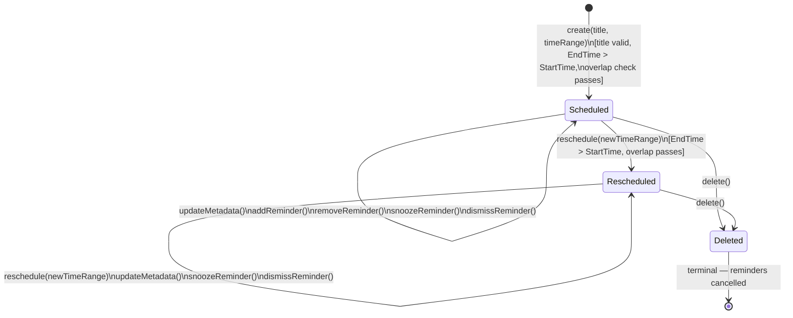
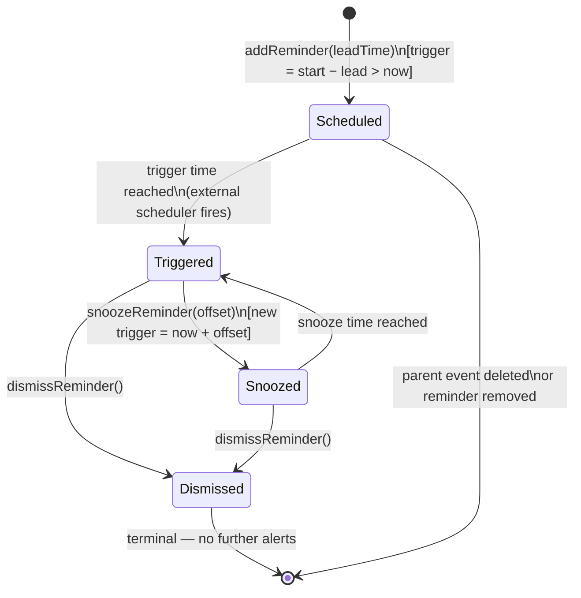

# Aggregate Lifecycle — Calendar Bounded Context

---

## CalendarEvent Aggregate

### State Transitions

| From | To | Operation | Guard / Condition |
| --- | --- | --- | --- |
| _(none)_ | **Scheduled** | `create(title, timeRange, ...)` | Title non-empty; StartTime present; EndTime after StartTime; overlap check passes (if policy enabled) |
| **Scheduled** | **Scheduled** | `updateMetadata(title, description)` | Event active |
| **Scheduled** | **Rescheduled** | `reschedule(newTimeRange)` | New EndTime after StartTime; overlap check passes |
| **Rescheduled** | **Rescheduled** | `reschedule(newTimeRange)` | Same guards; may reschedule multiple times |
| **Scheduled** | **Deleted** | `delete()` | Terminal; reminders cancelled |
| **Rescheduled** | **Deleted** | `delete()` | Terminal; reminders cancelled |
| **Scheduled** / **Rescheduled** | _(no change)_ | `addReminder(leadTime)` | Trigger time = start − lead > current time |
| **Scheduled** / **Rescheduled** | _(no change)_ | `removeReminder(reminderId)` | Reminder exists and not yet triggered |
| **Scheduled** / **Rescheduled** | _(no change)_ | `snoozeReminder(reminderId, offset)` | Reminder in Triggered state |
| **Scheduled** / **Rescheduled** | _(no change)_ | `dismissReminder(reminderId)` | Reminder in Triggered or Snoozed state |
| **Scheduled** / **Rescheduled** | _(no change)_ | `queryAvailability(rangeStart, rangeEnd, constraints?)` | Returns availability windows and candidate slots (read-only; no state mutation) |

### Business Operations

| Operation | Pre-condition | Post-condition | Events Raised |
| --- | --- | --- | --- |
| `create(title, timeRange, reminders?)` | Title valid; StartTime present; EndTime > StartTime; no overlap (if policy) | Event Scheduled; reminders attached | `CalendarEventCreated` |
| `updateMetadata(title, description)` | Status Scheduled or Rescheduled | Title/description updated | `CalendarEventUpdated` |
| `reschedule(newTimeRange)` | EndTime > StartTime; no overlap (if policy) | Status Rescheduled; reminder triggers recalculated | `CalendarEventRescheduled` |
| `delete()` | Status Scheduled or Rescheduled | Event removed (terminal); all reminders cancelled | `CalendarEventDeleted` |
| `addReminder(leadTime)` | Trigger time positive and not in past | Reminder entity added in Scheduled state | _(none — part of create or update)_ |
| `removeReminder(reminderId)` | Reminder exists | Reminder removed | _(none)_ |
| `snoozeReminder(reminderId, offset)` | Reminder triggered | Reminder re-enters Scheduled with new trigger time | `ReminderSnoozed` |
| `dismissReminder(reminderId)` | Reminder triggered or snoozed | Reminder Dismissed (terminal) | `ReminderDismissed` |
| `queryAvailability(rangeStart, rangeEnd, constraints?)` | Range valid; workspace active | Read-only availability windows and candidate slots returned | _(none — query operation)_ |

---

### CalendarEvent State Diagram

---

### Reminder State Diagram

Applies to each `Reminder` entity owned by the `CalendarEvent`.

---

### Lifecycle Notes

- **Rescheduled** is not a distinct final state; it reflects that a time change has occurred. The event remains fully active and mutable.
- **Deleted** is terminal. No recovery. All `Reminder` entities are cancelled in the same transaction.
- Overlap detection uses read-only repository queries before `create()` or `reschedule()`. The overlap check is conditional on `OverlapPolicyContext.preventCalendarOverlap = true`.
- Reminder trigger dispatch is handled by an external scheduler (infrastructure); it calls back into the domain to transition the reminder state and emit `ReminderTriggered`.
- `CalendarEvent` does not query the clock directly; `OverlapPolicyContext` and current time are supplied by the application layer at command time.
