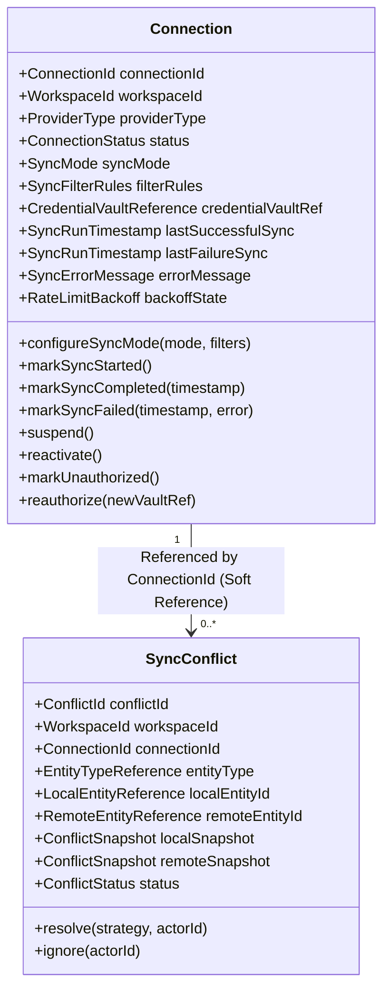
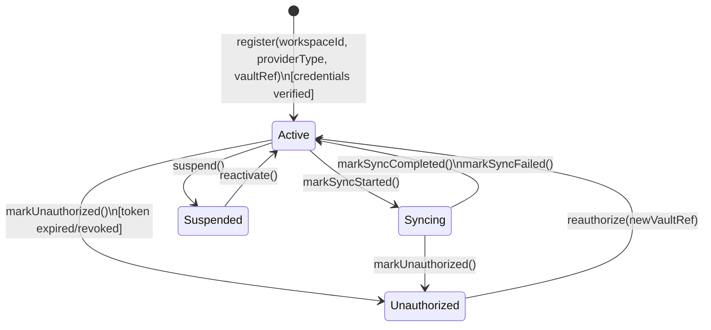
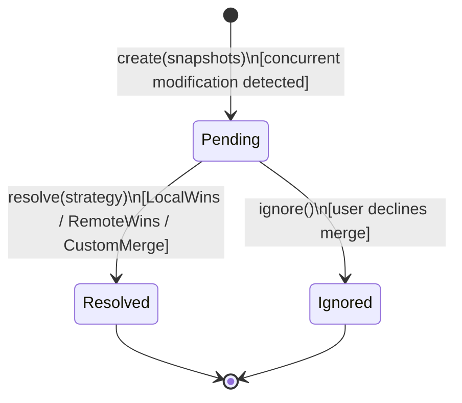
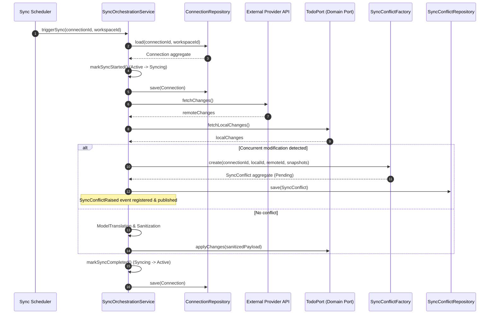
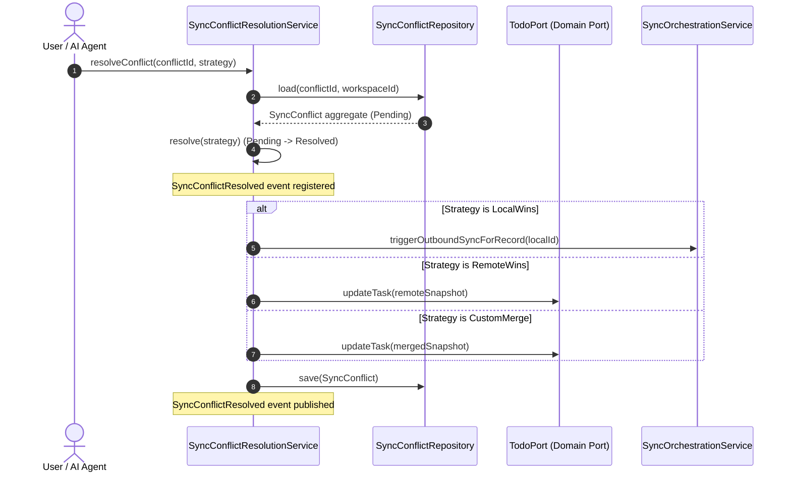

# Domain Model Specification — Connector Bounded Context

## Document Metadata
- **Version**: 2.1.0
- **Status**: Approved / Ready for Application Modeling
- **Date**: August 2, 2026
- **Author**: Principal DDD Architect & Hexagonal Reviewer

---

## Section 1: Executive Summary & Bounded Context Scope

The **Connector Bounded Context** (also referred to as the **Connector Hub**) orchestrates outbound and inbound integrations between the internal system and external third-party services. Acting as the system's Anti-Corruption Layer (ACL), it encapsulates vendor-specific data models and rate-limiting behaviors, providing clean, domain-agnostic abstractions to internal domains like Todo and Calendar.

### Domain Boundaries and Ownership
- **What it Owns**:
  - The persistence schemas for connection profiles, sync execution history, rate-limiting states, and sync conflicts.
  - The lifecycle, registration, scheduling, and execution state of connections.
  - Translation logic mapping external APIs (e.g., Google Calendar, GitHub Issues, Jira) to local schemas.
  - Flagging, recording, and resolving concurrent sync conflicts.
  - Emitting integration and connection lifecycle events.
- **What it DOES NOT Own**:
  - **Core Productivity Logic**: Business logic for tasks and events is owned strictly by the Todo and Calendar contexts.
  - **Credential Security**: Opaque storage and encryption of OAuth tokens or passwords are delegated to the security Vault via the `CredentialVaultPort`.
  - **User Authentication**: Handled by the Auth Bounded Context.
  - **Approval UI Workflows**: Surfaces extraction approval requests but delegates the user-approval aggregate state to the AI Agent context.

---

## Section 2: Ubiquitous Language

The following glossary defines the core terms and concepts in the Connector context. These definitions serve as the vocabulary for the database, application code, and system events.

1. **Connector**: An integration module that bridges the internal system to a specific external third-party service (e.g., Google Calendar, GitHub, Jira).
2. **Connector Plugin**: A concrete provider-specific implementation of the outbound integration SPI.
3. **Connection**: A configured, authorized instance of a Connector associated with a user workspace. It manages configuration parameters, sync status, and reference keys for credentials.
4. **Connector Hub**: The central engine coordinating sync scheduling, rate limiting, and Model Translation.
5. **Model Translation (ACL)**: The process of mapping external data formats to local domain values (and vice versa) to isolate core contexts from external API changes.
6. **Synchronization (Sync)**: The automated or manual process of aligning data between the local workspace database and an external service.
7. **SyncMode**: The configuration defining data direction:
   - **Bidirectional**: Updates flow in both directions (local-to-remote and remote-to-local).
   - **OneWayImport**: Updates flow only from the external provider to the local system (read-only locally).
   - **OneWayExport**: Updates flow only from the local system to the external provider (read-only externally).
8. **Sync Conflict**: A condition where a synchronized resource has been modified on both the local and remote sides since the last successful sync.
9. **Credential**: Security tokens or API keys used for authentication. They are referenced via opaque IDs; plaintext values are strictly handled by the `CredentialVaultPort`.
10. **Rate Limit & Backoff**: Standardized request throttling imposed by provider APIs. Throttling states are tracked on the Connection to control schedule timings.
11. **Sanitized External Payload**: An ACL-mapped Data Transfer Object (DTO) validated against local domain invariants before being passed to local ports.

---

## Section 3: Aggregate Discovery

The context defines two distinct Aggregate Roots to isolate long-lived configurations and conflict management states:

### 1. Connection Aggregate
- **Responsibility**: Manages the integration profile, credential references, sync scheduling configuration, and execution health metrics (including rate limiting).
- **Consistency Boundary**: A single Connection instance and its nested configuration parameters (e.g., filters, backoff state).
- **Transaction Boundary**: Scoped to `ConnectionId` within a specific `WorkspaceId`.

### 2. Sync Conflict Aggregate
- **Responsibility**: Tracks individual resource merge conflicts. Because conflict resolution is a human-in-the-loop task that can remain unresolved for long periods, it is decoupled into a separate aggregate to prevent blocking active sync runs.
- **Consistency Boundary**: A single SyncConflict instance.
- **Transaction Boundary**: Scoped to `ConflictId` within a specific `WorkspaceId`.

---

## Section 4: Aggregate Structure & Entities

### Aggregate Root: Connection

- **Identity**: `ConnectionId` + `WorkspaceId` (Tenancy key).
- **Properties**:
  - `connectionId`: ConnectionId (Immutable)
  - `workspaceId`: WorkspaceId (Immutable)
  - `providerType`: ProviderType (Immutable)
  - `status`: ConnectionStatus
  - `syncMode`: SyncMode (Bidirectional, OneWayImport, OneWayExport)
  - `filterRules`: SyncFilterRules (Replaceable)
  - `credentialVaultRef`: CredentialVaultReference (Replaceable)
  - `lastSuccessfulSync`: SyncRunTimestamp (Nullable)
  - `lastFailureSync`: SyncRunTimestamp (Nullable)
  - `errorMessage`: SyncErrorMessage (Nullable)
  - `backoffState`: RateLimitBackoff (Tracks throttling state)
- **Public Behaviors**:
  - `configureSyncMode(mode, filters)`: Re-configures how data is mapped.
  - `markSyncStarted()`: Validates status and flags transient sync active status.
  - `markSyncCompleted(timestamp)`: Updates `lastSuccessfulSync`, clears any `errorMessage`, and resets `backoffState` (consecutive failures to 0, retryAfter to null).
  - `markSyncFailed(timestamp, error)`: Updates failure details (`lastFailureSync`, `errorMessage`) and calculates the next retry delay using an exponential backoff algorithm on the `backoffState`.
  - `suspend()`: Suspends automatic execution.
  - `reactivate()`: Resumes execution.
  - `markUnauthorized()`: Transitions state to `Unauthorized` on credential expiration.
  - `reauthorize(newVaultRef)`: Saves new vault key, returns status to `Active`, and resets `backoffState`.

### Aggregate Root: SyncConflict

- **Identity**: `ConflictId` + `WorkspaceId`.
- **Properties**:
  - `conflictId`: ConflictId (Immutable)
  - `workspaceId`: WorkspaceId (Immutable)
  - `connectionId`: ConnectionId (Immutable soft reference)
  - `entityType`: EntityTypeReference (Task, Event)
  - `localEntityId`: LocalEntityReference (Immutable)
  - `remoteEntityId`: RemoteEntityReference (Immutable)
  - `localSnapshot`: ConflictSnapshot (Immutable DTO representation)
  - `remoteSnapshot`: ConflictSnapshot (Immutable DTO representation)
  - `status`: ConflictStatus (Pending, Resolved, Ignored)
- **Public Behaviors**:
  - `resolve(strategy, actorId)`: Records resolution choice (`LocalWins`, `RemoteWins`, `CustomMerge`). Transitions status to `Resolved` (Terminal).
  - `ignore(actorId)`: Records that the conflict is skipped. Transitions status to `Ignored` (Terminal).

---

## Section 5: Value Object Catalog

All aggregate attributes are modeled as immutable Value Objects (VOs) to protect integrity and ensure validation on instantiation:

1. **ConnectionId / ConflictId**: Immutable, non-null UUID wrappers.
2. **WorkspaceId**: Opaque tenant identifier. Enforces cross-tenant isolation.
3. **ProviderType**: Enum representing registered connector plugins (`GoogleCalendar`, `GitHub`, `Jira`, `Slack`, `TickTick`).
4. **ConnectionStatus**: Enum (`Active`, `Suspended`, `Unauthorized`, `Syncing`).
5. **SyncMode**: Enum (`Bidirectional`, `OneWayImport`, `OneWayExport`).
6. **SyncFilterRules**: JSON/Map containing provider-specific sync tags, directories, or criteria.
7. **CredentialVaultReference**: Key mapping to the external encrypted vault storage. Never holds plain text.
8. **SyncRunTimestamp**: LocalDateTime/Instant of execution runs.
9. **SyncErrorMessage**: Diagnostic message string (sanitized of token/secret data).
10. **EntityTypeReference**: Enum mapping to internal domain targets (`Task`, `Event`).
11. **LocalEntityReference / RemoteEntityReference**: Typed identifiers mapping local databases (`TaskId`, `EventId`) to external provider formats.
12. **ConflictSnapshot**: Key-value data capture representing local and remote fields at conflict time.
13. **ConflictStatus**: Enum (`Pending`, `Resolved`, `Ignored`).
14. **ConflictResolutionStrategy**: Enum (`LocalWins`, `RemoteWins`, `CustomMerge`).
15. **RateLimitBackoff**: Tracks delay duration and consecutive failures.
    - *Fields*: `retryAfter: Instant` (Nullable), `consecutiveFailures: int`.
    - *Invariants*: Non-negative values.
    - *Backoff Algorithm*:
      When updating backoff on sync failure:
      $$\text{delaySeconds} = \min(60 \times 2^{\text{consecutiveFailures}}, 86400)$$
      $$\text{retryAfter} = \text{currentInstant} + \text{delaySeconds}$$
      When resetting backoff (on sync success or re-authorization):
      $$\text{consecutiveFailures} = 0$$
      $$\text{retryAfter} = \text{null}$$
16. **SanitizedExternalPayload**: Transformed external representation ready to pass through target ports. Validates that tasks have non-empty titles and priority maps to local constraints (`High`, `Medium`, `Low`).

---

## Section 6: Domain Services & Factories

Domain Services implement stateless domain operations that interact with multiple aggregates or cross Bounded Context boundaries via ports.

1. **ModelTranslationService (ACL)**:
   - *Purpose*: Translates external API payloads into local `SanitizedExternalPayload` value objects and converts local aggregates back into outbound payloads.
   - *Design rationale*: Separating translation from the Connection aggregate keeps translation components highly pluggable and easily testable without loading aggregate persistence states.
2. **SyncOrchestrationService**:
   - *Purpose*: Drives the sync flow for an active connection (fetching remote changes, retrieving local modifications, performing change comparisons, writing to ports, and handling rate-limiting pauses).
   - *Design rationale*: Spans external API networks, transactional databases, and coordinates connection/conflict aggregate updates.
3. **SyncConflictResolutionService**:
   - *Purpose*: Orchestrates the execution of a conflict resolution strategy by applying the chosen state to target ports (`TodoPort` or `CalendarPort`) and calling `SyncConflict.resolve()`.
4. **ExternalTaskApprovalHoldService**:
   - *Purpose*: Intercepts automated task extractions from incoming email processing. Holds tasks in a pending state until an explicit agent approval command is received.
5. **DataSanitizationService**:
   - *Purpose*: Validates third-party payloads before passing them to the local application layer. Normalizes tags, categories, and field structures.

### Factories
- **ConnectionFactory**: Factory to register and initialize a Connection in an initial state, verifying provider plugin registration.
- **SyncConflictFactory**: Factory to instantiate a `SyncConflict` aggregate, packaging the local/remote state snapshots into immutable `ConflictSnapshot` objects.

---

## Section 7: Repositories

Each Repository is scoped strictly to a single Aggregate Root. Access to underlying records is restricted via these interfaces:

### 1. ConnectionRepository
- **Target**: `Connection` Aggregate Root
- **Methods**:
  - `findById(ConnectionId, WorkspaceId): Connection`
  - `save(Connection): void`
  - `findByProvider(WorkspaceId, ProviderType): Connection`
  - `findActiveConnectionsScheduledForSync(Instant currentInstant): List<Connection>`

### 2. SyncConflictRepository
- **Target**: `SyncConflict` Aggregate Root
- **Methods**:
  - `findById(ConflictId, WorkspaceId): SyncConflict`
  - `save(SyncConflict): void`
  - `findPendingByConnection(WorkspaceId, ConnectionId): List<SyncConflict>`
  - `hasPendingConflict(WorkspaceId, ConnectionId, LocalEntityReference): boolean`

---

## Section 8: Ports (Hexagonal Architecture Seams)

To enforce the Anti-Corruption Layer pattern and preserve domain purity, the Connector context defines explicit outbound ports. These ports isolate the domain from database technology, external HTTP clients, and other bounded contexts' repositories.

```mermaid
classDiagram
    class TodoPort {
        <<interface>>
        +fetchTask(WorkspaceId, LocalEntityReference) TaskDTO
        +createTask(WorkspaceId, SanitizedExternalPayload) LocalEntityReference
        +updateTask(WorkspaceId, LocalEntityReference, SanitizedExternalPayload) void
    }
    class CalendarPort {
        <<interface>>
        +fetchEvent(WorkspaceId, LocalEntityReference) EventDTO
        +createEvent(WorkspaceId, SanitizedExternalPayload) LocalEntityReference
        +updateEvent(WorkspaceId, LocalEntityReference, SanitizedExternalPayload) void
    }
    class CredentialVaultPort {
        <<interface>>
        +storeCredentials(WorkspaceId, ConnectionId, Map) CredentialVaultReference
        +retrieveCredentials(WorkspaceId, CredentialVaultReference) Map
        +removeCredentials(WorkspaceId, CredentialVaultReference) void
    }
    class ExternalIntegrationPort {
        <<interface>>
        +fetchRemoteChanges(WorkspaceId, CredentialVaultReference, SyncFilterRules, Instant) List
        +pushLocalChanges(WorkspaceId, CredentialVaultReference, List) PushResult
        +verifyCredentials(WorkspaceId, CredentialVaultReference) boolean
    }
```

### 1. TodoPort
Used by the sync orchestration and conflict resolution services to write and read tasks in the Todo context.
- `fetchTask(WorkspaceId, LocalEntityReference): TaskDTO`
- `createTask(WorkspaceId, SanitizedExternalPayload): LocalEntityReference`
- `updateTask(WorkspaceId, LocalEntityReference, SanitizedExternalPayload): void`

### 2. CalendarPort
Used by the sync orchestration and conflict resolution services to write and read events in the Calendar context.
- `fetchEvent(WorkspaceId, LocalEntityReference): EventDTO`
- `createEvent(WorkspaceId, SanitizedExternalPayload): LocalEntityReference`
- `updateEvent(WorkspaceId, LocalEntityReference, SanitizedExternalPayload): void`

### 3. CredentialVaultPort
Used to delegate the secure storage and retrieval of sensitive authentication keys/tokens.
- `storeCredentials(WorkspaceId, ConnectionId, Map<String, String>): CredentialVaultReference`
- `retrieveCredentials(WorkspaceId, CredentialVaultReference): Map<String, String>`
- `removeCredentials(WorkspaceId, CredentialVaultReference): void`

### 4. ExternalIntegrationPort (SPI)
The Service Provider Interface (SPI) implemented by specific connector plugins (e.g., Google Calendar, GitHub, Jira adapters) to communicate with external APIs.
- `fetchRemoteChanges(WorkspaceId, CredentialVaultReference, SyncFilterRules, Instant since): List<ExternalItemDTO>`
- `pushLocalChanges(WorkspaceId, CredentialVaultReference, List<ChangedItemDTO>): PushResult`
- `verifyCredentials(WorkspaceId, CredentialVaultReference): boolean`

---

## Section 9: Domain Events

Domain events represent business-significant transitions. The Aggregate Root records these events internally when state mutations occur. The infrastructure/application layer then dispatches them immediately after the aggregate is successfully saved to the database.

### Event Registration & Dispatching Pattern
The domain model enforces that aggregates do not publish events directly to message brokers. Instead:
1. The aggregate root calls `registerEvent(DomainEvent)` during state changes (e.g., `markSyncFailed()` registers `ConnectorSyncFailed`).
2. The application service calls the repository to save the aggregate.
3. The repository implementation publishes the registered events to the system bus (or Outbox table) as part of the database transaction commit, guaranteeing eventual consistency.

---

### Event Definitions

#### 1. ConnectionRegistered
- *Publisher*: `Connection` Aggregate Root
- *Trigger*: A new connection configuration is created.
- *Consumers*: `Notification` context, audit log
- *Business Meaning*: A new external integration is configured and ready for authorization.

**Payload**

| Field | Type | Description |
| --- | --- | --- |
| `connectionId` | ConnectionId | Unique identifier |
| `workspaceId` | WorkspaceId | Tenant boundary |
| `providerType` | ProviderType | Google Calendar / Jira / Slack etc. |
| `occurredAt` | Instant | Registration timestamp |

---

#### 2. ConnectionAuthorized
- *Publisher*: `Connection` Aggregate Root
- *Trigger*: OAuth/token verification completes; connection enters `Active` status.
- *Consumers*: `Notification` context, Sync scheduler
- *Business Meaning*: Credentials are valid; scheduled sync runs may now begin.

**Payload**

| Field | Type | Description |
| --- | --- | --- |
| `connectionId` | ConnectionId | Authorized connection |
| `workspaceId` | WorkspaceId | Tenant boundary |
| `providerType` | ProviderType | Provider |
| `occurredAt` | Instant | Authorization timestamp |

---

#### 3. ConnectionSuspended
- *Publisher*: `Connection` Aggregate Root
- *Trigger*: User/admin suspends the connection.
- *Consumers*: Sync scheduler, `Notification` context
- *Business Meaning*: Sync is paused by user choice. No new sync runs until reactivated.

**Payload**

| Field | Type | Description |
| --- | --- | --- |
| `connectionId` | ConnectionId | Suspended connection |
| `workspaceId` | WorkspaceId | Tenant boundary |
| `occurredAt` | Instant | Suspension timestamp |

---

#### 4. ConnectionReactivated
- *Publisher*: `Connection` Aggregate Root
- *Trigger*: Suspended connection returned to `Active`.
- *Consumers*: Sync scheduler, `Notification` context
- *Business Meaning*: Sync may resume from the last successful run.

**Payload**

| Field | Type | Description |
| --- | --- | --- |
| `connectionId` | ConnectionId | Reactivated connection |
| `workspaceId` | WorkspaceId | Tenant boundary |
| `occurredAt` | Instant | Reactivation timestamp |

---

#### 5. ConnectionUnauthorized
- *Publisher*: `Connection` Aggregate Root
- *Trigger*: API tokens expire or are revoked.
- *Consumers*: `Notification` context, sync scheduler
- *Business Meaning*: Credentials are no longer valid. All sync runs are blocked until the user re-authorizes.

**Payload**

| Field | Type | Description |
| --- | --- | --- |
| `connectionId` | ConnectionId | Unauthorized connection |
| `workspaceId` | WorkspaceId | Tenant boundary |
| `occurredAt` | Instant | Timestamp |

---

#### 6. ConnectorSynced
- *Publisher*: `Connection` Aggregate Root
- *Trigger*: Sync run completes successfully.
- *Consumers*: `Notification` context, audit log
- *Business Meaning*: Local data is up to date with the external provider.

**Payload**

| Field | Type | Description |
| --- | --- | --- |
| `connectionId` | ConnectionId | Synced connection |
| `workspaceId` | WorkspaceId | Tenant boundary |
| `syncedAt` | SyncRunTimestamp | Last successful sync instant |
| `recordsProcessed` | integer | Items imported/exported |

---

#### 7. ConnectorSyncFailed
- *Publisher*: `Connection` Aggregate Root
- *Trigger*: Sync run fails due to network/API issues.
- *Consumers*: `Notification` context, audit log, retry scheduler
- *Business Meaning*: Sync did not complete. Backoff retry will be scheduled.

**Payload**

| Field | Type | Description |
| --- | --- | --- |
| `connectionId` | ConnectionId | Failed connection |
| `workspaceId` | WorkspaceId | Tenant boundary |
| `failedAt` | SyncRunTimestamp | Failure instant |
| `errorMessage` | SyncErrorMessage | Diagnostic text (no secrets) |

---

#### 8. SyncConflictRaised
- *Publisher*: `SyncConflict` Aggregate Root
- *Trigger*: Concurrent edits are detected.
- *Consumers*: `Notification` context, `AI Agent` context
- *Business Meaning*: Divergent changes detected. Record is excluded from auto-sync until resolved.

**Payload**

| Field | Type | Description |
| --- | --- | --- |
| `conflictId` | ConflictId | Unique conflict identifier |
| `connectionId` | ConnectionId | Source connection |
| `workspaceId` | WorkspaceId | Tenant boundary |
| `entityType` | EntityTypeReference | Task / Event |
| `localEntityId` | LocalEntityReference | Local record id |
| `remoteEntityId` | RemoteEntityReference | Provider-native record id |
| `occurredAt` | Instant | Detection timestamp |

---

#### 9. SyncConflictResolved
- *Publisher*: `SyncConflict` Aggregate Root
- *Trigger*: User resolution strategy is applied.
- *Consumers*: Sync orchestration service, `Notification` context
- *Business Meaning*: The data divergence has been resolved. Sync for the record resumes.

**Payload**

| Field | Type | Description |
| --- | --- | --- |
| `conflictId` | ConflictId | Resolved conflict |
| `connectionId` | ConnectionId | Source connection |
| `workspaceId` | WorkspaceId | Tenant boundary |
| `strategy` | ConflictResolutionStrategy | LocalWins / RemoteWins / CustomMerge |
| `occurredAt` | Instant | Resolution timestamp |

---

#### 10. SyncConflictIgnored
- *Publisher*: `SyncConflict` Aggregate Root
- *Trigger*: User declines to merge a conflict.
- *Consumers*: `Notification` context, audit log
- *Business Meaning*: User ignored the conflict; auto-sync remains suspended for the record.

**Payload**

| Field | Type | Description |
| --- | --- | --- |
| `conflictId` | ConflictId | Ignored conflict |
| `connectionId` | ConnectionId | Source connection |
| `workspaceId` | WorkspaceId | Tenant boundary |
| `actorId` | String | User or AI agent who ignored the conflict |
| `occurredAt` | Instant | Ignore timestamp |

---

#### 11. ExternalTaskExtractionPending (Integration Event)
- *Publisher*: Sync Service (`ExternalTaskApprovalHoldService`)
- *Trigger*: Email extraction identifies a potential task.
- *Consumers*: `Notification` context, `AI Agent` context
- *Business Meaning*: Task extraction pending user approval before creation.

**Payload**

| Field | Type | Description |
| --- | --- | --- |
| `connectionId` | ConnectionId | Source connection |
| `workspaceId` | WorkspaceId | Tenant boundary |
| `extractedPayload` | SanitizedExternalPayload | Proposed task fields |
| `occurredAt` | Instant | Detection timestamp |

---

## Section 10: Business Invariants & Validation Rules

Business invariants are rules that must remain true within the Bounded Context. They are grouped into Validation Rules (always enforced) and Consistency Rules (enforced transactionally or scheduled).

| Invariant ID | Name | Type | Rule Description |
| :--- | :--- | :--- | :--- |
| **INV-CON-01** | Strict Seam Isolation | Validation | No direct writing to other contexts' DB tables. All actions must route through public domain ports (`TodoPort`, `CalendarPort`). |
| **INV-CON-02** | Credential Encryption Enclosure | Validation | No plaintext secrets stored. All API keys/tokens are stored in the Vault; the aggregate only holds `CredentialVaultReference`. |
| **INV-CON-03** | Workspace Tenancy Isolation | Validation | Connection and SyncConflict aggregates must belong to a single WorkspaceId. Cross-tenant sync is strictly prohibited. |
| **INV-CON-04** | Data Sanitization | Validation | All imported data must pass through the ACL to produce a `SanitizedExternalPayload` before application to local ports. |
| **INV-CON-05** | Conflict Interception | Validation | On concurrent modifications, automatic sync for that record must be suspended, and a `SyncConflict` must be created. |
| **INV-CON-06** | Extraction User Approval | Validation | Task creation from email extraction (CON-004) must hold in a pending state until approved. |
| **INV-CON-07** | Provider Type Immutability | Validation | `ProviderType` is immutable on a `Connection` after registration. |
| **INV-CON-08** | Active Sync Restriction | Consistency | Sync runs must not execute when `ConnectionStatus` is `Suspended` or `Unauthorized`. |
| **INV-CON-09** | Conflict Uniqueness | Consistency | Only one active `Pending` conflict may exist per `(ConnectionId, LocalEntityId)` combination. |
| **INV-CON-10** | Terminal Conflict State | Consistency | Once a `SyncConflict` transitions to `Resolved` or `Ignored`, its status cannot be modified. |
| **INV-CON-11** | Sanitized Failure Reporting | Consistency | Error messages stored in `SyncErrorMessage` or emitted in events must be sanitized of API secrets or tokens. |

---

## Section 11: Lifecycle & State Transitions

### 1. Connection Lifecycle

The connection lifecycle strictly follows the four states defined in the `ConnectionStatus` enum, collapsing any temporary states to ensure state machine reliability.

#### State Transition Matrix
| From State | To State | Operation | Guard / Condition |
| :--- | :--- | :--- | :--- |
| `_ (none)` | **Active** | `register(...)` | `providerType` is valid; `workspaceId` active; vault credentials verified. |
| **Active** | **Syncing** | `markSyncStarted()` | Status is `Active`; not currently running. |
| **Syncing** | **Active** | `markSyncCompleted(...)` | Sync run completed successfully. Resets `RateLimitBackoff`. |
| **Syncing** | **Active** | `markSyncFailed(...)` | Sync run failed with transient error. Calculates exponential backoff. |
| **Active** / **Syncing** | **Suspended** | `suspend()` | Explicit user/admin request to pause synchronization. |
| **Suspended** | **Active** | `reactivate()` | Explicit user/admin request to resume synchronization. |
| **Active** / **Syncing** | **Unauthorized** | `markUnauthorized()` | External API authorization failure detected (token expired/revoked). |
| **Unauthorized** | **Active** | `reauthorize(...)` | Token successfully refreshed and verified; resets `RateLimitBackoff`. |

#### Business Operations & Event Dispatching
| Operation | Pre-condition | Post-condition | Events Registered |
| :--- | :--- | :--- | :--- |
| `register(workspaceId, providerType, vaultRef)` | Workspace active; no connection exists for the same provider in this workspace. | Connection status is `Active`. | `ConnectionRegistered`, `ConnectionAuthorized` |
| `configureSyncMode(mode, filters)` | Status is `Active` or `Suspended`. | `syncMode` and `filterRules` are updated. | None |
| `markSyncStarted()` | Status is `Active`. | Status is `Syncing`. | None |
| `markSyncCompleted(timestamp)` | Status is `Syncing`. | Status is `Active`; `lastSuccessfulSync` updated; backoffState reset. | `ConnectorSynced` |
| `markSyncFailed(timestamp, error)` | Status is `Syncing`. | Status is `Active`; `lastFailureSync` and `errorMessage` updated; backoffState updated. | `ConnectorSyncFailed` |
| `suspend()` | Status is `Active` or `Syncing`. | Status is `Suspended`. | `ConnectionSuspended` |
| `reactivate()` | Status is `Suspended`. | Status is `Active`. | `ConnectionReactivated` |
| `markUnauthorized()` | Status is `Active` or `Syncing`. | Status is `Unauthorized`. | `ConnectionUnauthorized` |
| `reauthorize(newVaultRef)` | Status is `Unauthorized`. | Status is `Active`; `credentialVaultRef` updated; backoffState reset. | `ConnectionAuthorized` |

---

### 2. SyncConflict Lifecycle

`Resolved` and `Ignored` represent terminal states. Once a conflict transitions out of `Pending`, it cannot be mutated.

#### State Transition Matrix
| From State | To State | Operation | Guard / Condition |
| :--- | :--- | :--- | :--- |
| `_ (none)` | **Pending** | `create(...)` | Concurrent modification detected; no other `Pending` conflict for record. |
| **Pending** | **Resolved** | `resolve(...)` | Valid strategy provided; merge updates successfully sent to target ports. |
| **Pending** | **Ignored** | `ignore()` | User chooses to ignore; record remains excluded from synchronization. |

#### Business Operations & Event Dispatching
| Operation | Pre-condition | Post-condition | Events Registered |
| :--- | :--- | :--- | :--- |
| `create(connectionId, entityType, localId, remoteId, snapshots)` | No existing `Pending` conflict for the same record. | Status is `Pending`; snapshots stored; record excluded from auto-sync. | `SyncConflictRaised` |
| `resolve(strategy, actorId)` | Status is `Pending`; strategy is valid (LocalWins, RemoteWins, CustomMerge). | Status is `Resolved` (Terminal). | `SyncConflictResolved` |
| `ignore(actorId)` | Status is `Pending`. | Status is `Ignored` (Terminal); record remains excluded from auto-sync. | `SyncConflictIgnored` |

---

### 3. Integration Sequence Walkthroughs

#### A. Sync Orchestration with Conflict Interception

The following sequence details how the `SyncOrchestrationService` coordinates the sync run, including the detection and isolation of a concurrent conflict:

#### B. Conflict Resolution Walkthrough

The following sequence details how a manual merge strategy is applied and finalized via the `SyncConflictResolutionService`:

