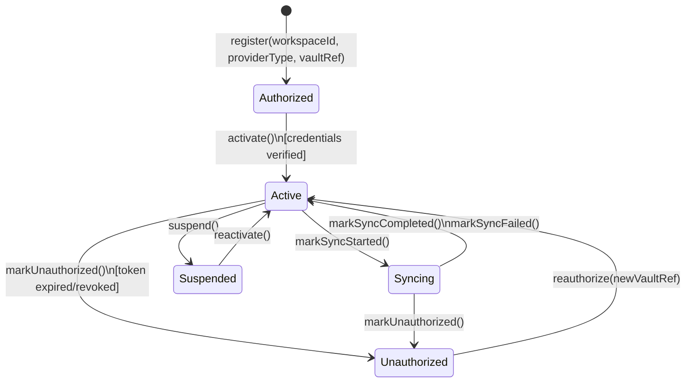
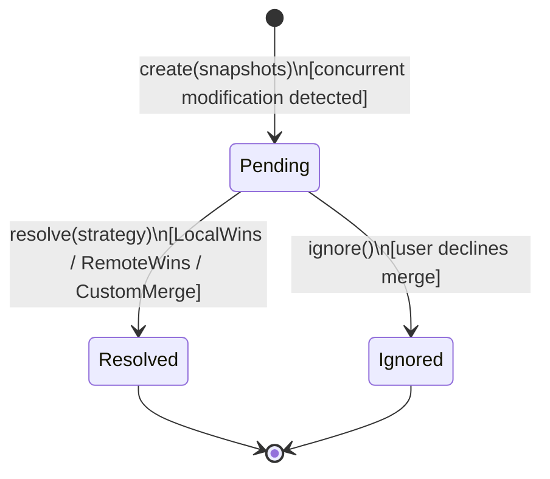

# Aggregate Lifecycle — Connector Bounded Context

---

## Connection Aggregate

### State Transitions

| From | To | Operation | Guard / Condition |
| --- | --- | --- | --- |
| _(none)_ | **Authorized** | `register(workspaceId, providerType, vaultRef)` | ProviderType valid; vaultRef non-null; workspace active |
| **Authorized** | **Active** | `activate()` | Credentials verified; ready for sync |
| **Active** | **Syncing** | `markSyncStarted()` | Status Active; not already Syncing |
| **Syncing** | **Active** | `markSyncCompleted(timestamp)` | Sync run succeeded |
| **Syncing** | **Active** | `markSyncFailed(timestamp, error)` | Sync run failed; backoff scheduled |
| **Active** | **Suspended** | `suspend()` | User/admin action |
| **Suspended** | **Active** | `reactivate()` | User/admin action |
| **Active** | **Unauthorized** | `markUnauthorized()` | Token expired or revoked |
| **Syncing** | **Unauthorized** | `markUnauthorized()` | Auth failure during sync run |
| **Unauthorized** | **Active** | `reauthorize(newVaultRef)` | Re-auth flow complete; new vault reference stored |

### Business Operations

| Operation | Pre-condition | Post-condition | Events Raised |
| --- | --- | --- | --- |
| `register(workspaceId, providerType, vaultRef)` | Workspace active; no duplicate for same (workspace, provider) | Connection Authorized | `ConnectionRegistered` |
| `activate()` | Status Authorized | Status Active | `ConnectionAuthorized` |
| `configureSyncMode(mode, filters)` | Status Active | SyncMode and SyncFilterRules updated | _(none)_ |
| `markSyncStarted()` | Status Active | Status Syncing | _(none)_ |
| `markSyncCompleted(timestamp)` | Status Syncing | Status Active; lastSuccessfulSync updated | `ConnectorSynced` |
| `markSyncFailed(timestamp, error)` | Status Syncing | Status Active; lastFailureSync + errorMessage updated | `ConnectorSyncFailed` |
| `suspend()` | Status Active or Syncing | Status Suspended | `ConnectionSuspended` |
| `reactivate()` | Status Suspended | Status Active | `ConnectionReactivated` |
| `markUnauthorized()` | Status Active or Syncing | Status Unauthorized | `ConnectionUnauthorized` |
| `reauthorize(newVaultRef)` | Status Unauthorized | Status Active; vault reference updated | `ConnectionAuthorized` |

---

### Connection State Diagram

---

## SyncConflict Aggregate

### State Transitions

| From | To | Operation | Guard / Condition |
| --- | --- | --- | --- |
| _(none)_ | **Pending** | `create(connectionId, entityType, snapshots)` | Concurrent modification detected; sync suspended for record |
| **Pending** | **Resolved** | `resolve(strategy, actorId)` | Strategy provided; merged data valid for target port |
| **Pending** | **Ignored** | `ignore(actorId)` | User declines to merge |

### Business Operations

| Operation | Pre-condition | Post-condition | Events Raised |
| --- | --- | --- | --- |
| `create(connectionId, entityType, localRef, remoteRef, snapshots)` | No existing Pending conflict for same (connectionId, localEntityId) | SyncConflict Pending; auto-sync suspended for record | `SyncConflictRaised` |
| `resolve(strategy, actorId)` | Status Pending; strategy valid; sanitized payload passes port validation | Status Resolved; resolution triggers port calls | `SyncConflictResolved` |
| `ignore(actorId)` | Status Pending | Status Ignored; sync remains suspended for record | `SyncConflictIgnored` |

---

### SyncConflict State Diagram

---

### Lifecycle Notes

- **Authorized** vs **Active**: a `Connection` is `Authorized` when credentials are first stored, and transitions to `Active` once the authorization is confirmed. In simpler implementations these two states may collapse into a single `Active` state.
- **Syncing** is an optional transient status. If the system does not track in-progress runs at the aggregate level, sync start/complete can be modeled purely as operations without a `Syncing` state.
- **Resolved** and **Ignored** are terminal states for a `SyncConflict`. If the user changes their mind after ignoring, a new conflict must be raised (or the record manually re-synced).
- The sync orchestration service (not the aggregate) is responsible for calling `TodoPort` or `CalendarPort` after a conflict is resolved. The `SyncConflict` aggregate only records the decision; it never writes to other domains directly.
- **ExternalTaskExtractionPending** is managed by the sync orchestration service (not an aggregate state). The pending item waits for user approval before a `create` call is made to `TodoPort`.
