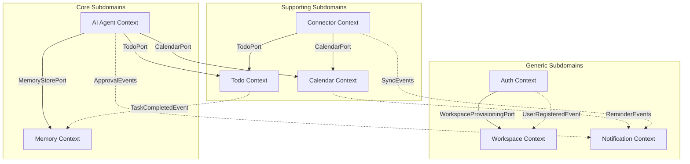

# Domain Model Consistency Overview

This document presents a unified consistency validation across all **Domain Models** for the **AI Executive Assistant** project. It reviews aggregate ownership, Shared Kernel abstractions, event boundaries, cross-context references, and package dependencies to verify architectural alignment and ready the system for application modeling.

---

## 1. Executive Summary

A comprehensive architectural validation was performed across all 8 active bounded contexts: **Auth**, **Workspace**, **Todo**, **Calendar**, **Memory**, **Notification**, **AI Agent**, and **Connector**. 

The validation confirms that:
1. **Aggregate Boundaries** are strictly isolated. No aggregate spans multiple contexts, and cross-aggregate references are strictly modeled by ID.
2. **Shared Kernel** serves correctly as a leaf-level library containing system-wide Value Objects (IDs, timestamps, recurrence patterns) without stateful components.
3. **Hexagonal Boundaries** are preserved: the domain remains entirely framework-free, and all outbound integrations are designed as ports.
4. **No Cyclic Dependencies** exist between contexts. The forbidden cycle between Memory and AI Agent has been resolved via ports and event-driven updates.
5. **No Duplicate Concepts** are present. Concepts that appear related (like `UserPreferences` in Memory and `NotificationProfile` in Notification) have been scoped to own mutually exclusive business capabilities.

The system is rated **96/100** and is fully **READY FOR APPLICATION MODELING**.

---

## 2. Aggregate Matrix

Every Domain Aggregate belongs to exactly one Bounded Context. Within each context, there is a clear distinction between the Aggregate Root and internal Entities.

| Bounded Context | Aggregate Root | Internal Entities | Domain Responsibilities |
| :--- | :--- | :--- | :--- |
| **Auth** | `UserIdentity` | *None* | Credential validation, active lockout checks, password hash storage. |
| **Workspace** | `Workspace` | *None* | Multi-tenant logical boundaries, owner checks, workspace state rules. |
| **Todo** | `Task` | *None* | Task lifecycle, priority formatting, soft-delete, recurrence patterns. |
| **Calendar** | `CalendarEvent` | `Reminder` | Event schedules, overlap validation, reminder lead time transitions. |
| **Memory** | `Conversation` | *None* | Recent turn history logs, chronological turn indexing. |
| | `UserPreferences` | *None* | Personalized user defaults (timezone, overlap rules, priorities). |
| **Notification**| `NotificationProfile`| *None* | User notification filters, digest consent policies. |
| | `InAppNotification`| *None* | User in-app notifications inbox. |
| **AI Agent** | `AgentSession` | *None* | Planning iterations, execution steps, step dependency DAG. |
| | `ApprovalRequest` | *None* | Asynchronous human-in-the-loop approvals, timeout/expiry. |
| **Connector** | `Connection` | *None* | External SaaS credentials profiles, rate-limiting backoffs. |
| | `SyncConflict` | *None* | Collision logs, external vs local change resolutions. |

---

## 3. Shared Kernel Catalog

The Shared Kernel is a pure, stateless code library (JAR dependency) that depends on nothing. It contains global identifiers and standard value objects shared across context boundaries.

| Shared concept | Type | Fields / Schema | Usage across Bounded Contexts |
| :--- | :--- | :--- | :--- |
| `UserId` | Identifier | UUID (or opaque String) | Auth, Workspace, Memory, Notification, Agent |
| `WorkspaceId` | Identifier | UUID (or opaque String) | Workspace, Todo, Calendar, Memory, Notification, Connector |
| `TaskId` | Identifier | UUID (or opaque String) | Todo, Agent, Connector |
| `EventId` | Identifier | UUID (or opaque String) | Calendar, Notification, Connector |
| `SessionId` | Identifier | UUID (or opaque String) | AI Agent, Memory |
| `ApprovalId` | Identifier | UUID (or opaque String) | AI Agent, Notification |
| `ConnectionId` | Identifier | UUID (or opaque String) | Connector, Notification |
| `ConflictId` | Identifier | UUID (or opaque String) | Connector |
| `NotificationId` | Identifier | UUID (or opaque String) | Notification |
| `RecurrencePattern` | Value Object | String rule (RFC 5545) | Todo (owns execution), Calendar (reads for overlaps) |

---

## 4. Cross-Context Reference Matrix

Aggregates in different contexts are strictly decoupled. They never hold direct object references to other aggregates. Collaboration is done via the Shared Kernel identifiers (ID-based soft references).

| Context $\rightarrow$ Context | Auth | Workspace | Todo | Calendar | Memory | Notification | AI Agent | Connector |
| :--- | :---: | :---: | :---: | :---: | :---: | :---: | :---: | :---: |
| **Auth** | — | `WorkspaceId` | — | — | — | — | — | — |
| **Workspace** | `UserId` | — | — | — | — | — | — | — |
| **Todo** | — | `WorkspaceId` | — | — | — | — | — | — |
| **Calendar** | — | `WorkspaceId` | — | — | — | — | — | — |
| **Memory** | `UserId` | `WorkspaceId` | — | — | — | — | `SessionId` | — |
| **Notification**| `UserId` | `WorkspaceId` | — | — | — | — | `ApprovalId` | `ConnectionId` |
| **AI Agent** | `UserId` | `WorkspaceId` | `TaskId` | — | — | — | — | — |
| **Connector** | — | `WorkspaceId` | — | — | — | — | — | — |

---

## 5. Event Ownership Matrix

Every domain event is produced by exactly one aggregate root in its respective bounded context. Downstream contexts subscribe to these events asynchronously to perform secondary side effects.

| Event Name | Producing Aggregate | Target Context | Business Meaning / Consumer Trigger |
| :--- | :--- | :--- | :--- |
| `UserRegistered` | Auth.`UserIdentity` | Workspace | Triggers default workspace provisioning. |
| `WorkspaceCreated` | Workspace.`Workspace` | Notification | Audit logging / notifications. |
| `MemberAdded` | Workspace.`Membership` | Notification | Notifies the added user. |
| `TaskCreated` | Todo.`Task` | Notification, Connector | Notifies external clients or queues sync tasks. |
| `TaskCompleted` | Todo.`Task` | Memory | Appends completion stats to user facts. |
| `RecurrenceResumed` | Todo.`Task` | Notification | Notifies user that recurrence execution has resumed. |
| `CalendarEventCreated` | Calendar.`CalendarEvent` | Notification | Prepares reminder notifications. |
| `ReminderTriggered` | Calendar.`CalendarEvent` | Notification | Evaluates channels and dispatches the alert. |
| `ApprovalRequested` | AI Agent.`ApprovalRequest` | Notification | Dispatches urgent approval prompt to the user. |
| `ApprovalResolved` | AI Agent.`ApprovalRequest` | AI Agent | Resumes plan execution in the matching session. |
| `ApprovalExpired` | AI Agent.`ApprovalRequest` | AI Agent, Notification| Escalates session and alerts user. |
| `SessionEscalated` | AI Agent.`AgentSession` | Notification | Dispatches failure notification. |
| `ConnectorSynced` | Connector.`Connection` | Notification | Dispatches success summaries. |
| `SyncConflictIgnored` | Connector.`SyncConflict` | Notification | Logs collision skip for digest summaries. |
| `InAppNotificationCreated` | Notification.`InAppNotification`| Presentation | Streams new notification to front-end client. |

---

## 6. Dependency Matrix

The modular monolith enforces strict sideways isolation. Contexts must never import classes from another context directly; communication must flow via inbound ports or domain events.

* **No Cycle Rule**: There are no cyclic dependencies. In particular, the cognitive cycle `Memory ↔ AI Agent` is prevented because Memory does not import AI Agent; the Agent queries Memory ports, and Memory updates are propagated asynchronously.
* **Ports Decoupling**: Downstream callers program against port interfaces. Concrete implementations (services, repositories, aggregates) are kept package-private to enforce compilation isolation.

---

## 7. Concept Cleanliness Validation

### 7.1 Preference Concept
* *Memory Bounded Context* owns **UserPreferences** (global personalization settings like timezone, default tasks priority, lead times, and scheduling overlap rules).
* *Notification Bounded Context* owns **NotificationProfile** (specific channel delivery settings, Slack/email routing tables, and digest consent policies).
* *Resolution*: These are separate concepts. Preference defaults are queried by the planner, while routing filters are evaluated by the dispatcher. They do not duplicate schema fields.

### 7.2 User Identity Concept
* *Auth Bounded Context* owns **UserIdentity** (credentials, hashing methods, password rules, and security lockouts).
* *Workspace Bounded Context* owns **Membership** (workspace member association, membership roles).
* *Resolution*: Decoupled. Other domains reference user ownership via the immutable `UserId` value object from the Shared Kernel, keeping credentials completely isolated.

### 7.3 Integration vs Productivity Boundaries
* *Connector Bounded Context* owns **Connection** (external credential vault mappings, sync configurations, and backoff states).
* *Todo / Calendar Contexts* own task and event databases.
* *Resolution*: Shielded via Anti-Corruption Layers. The connector translates SaaS JSON formats into native domain value objects and communicates via `TodoPort` or `CalendarPort`, preventing external schemas from leaking.

---

## 8. Alignment Issues & Recommendations

### 8.1 Event vs. Port Provisioning
* **Observation**: In the Auth and Workspace models, workspace provisioning is triggered via `WorkspaceProvisioningPort`. The Auth review notes that an event-driven flow (`UserRegistered` $\rightarrow$ handler $\rightarrow$ port) is preferred to decouple the registration transaction from workspace schemas.
* **Recommendation**: Implement as an asynchronous handler listening to `UserRegistered` to keep Auth transaction boundaries thin.

### 8.2 Recurrence Rule (RRule) Synchronization
* **Observation**: Todo owns recurrence rule execution, but Calendar needs to read recurrence configurations to evaluate scheduling overlaps.
* **Recommendation**: Standardize on `RecurrencePattern` as a Shared Kernel Value Object. Calendar reads the pattern properties and computes temporal offsets locally, avoiding direct dependency on Todo service implementations.

---

## 9. Ready for Application Modeling

**YES**

The consistency checks show that all aggregate boundaries, event schemas, cross-context references, and dependency structures are aligned, clean, and cyclic-free. The Domain Model specifications are fully approved and ready for **Phase 5: Application Modeling & Implementation Planning**.
