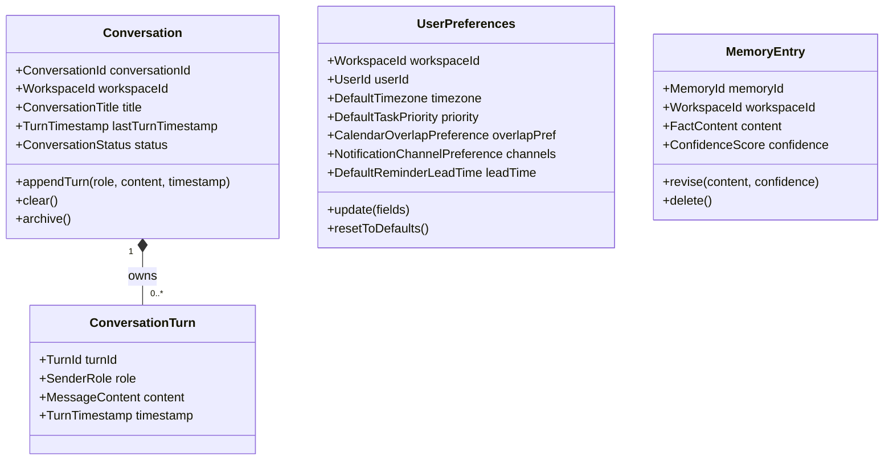
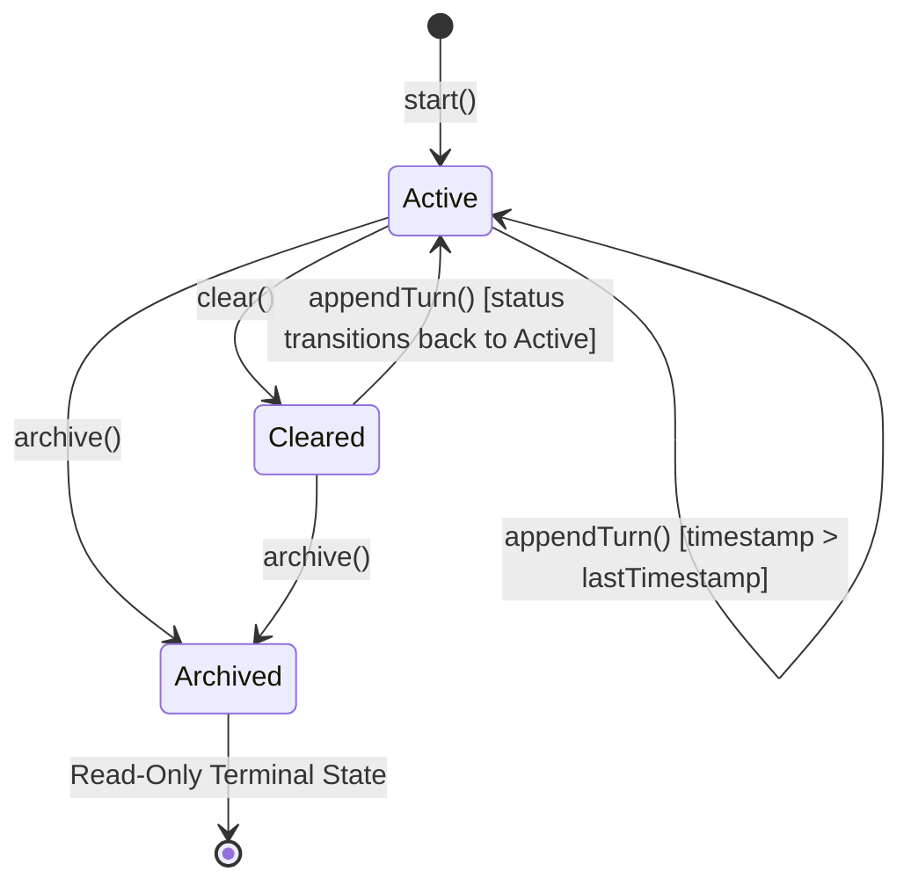
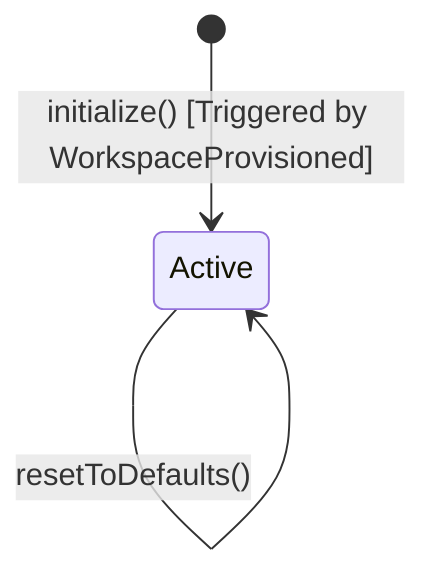
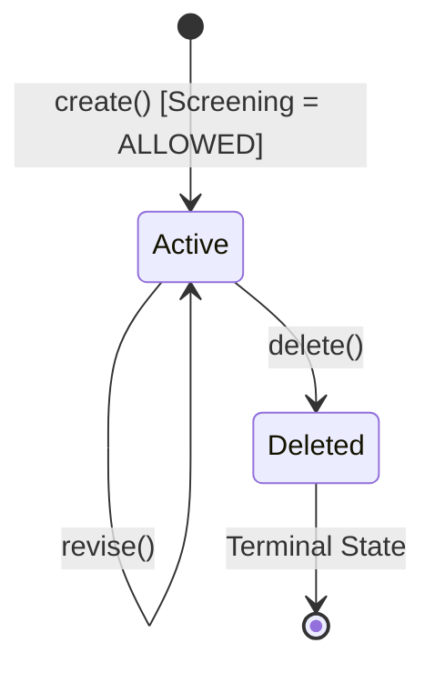

# Domain Model Specification — Memory Bounded Context

## Document Metadata
- **Version**: 2.1.0
- **Status**: Approved / Ready for Application Modeling
- **Date**: August 2, 2026
- **Author**: Principal DDD Reviewer

---

## Section 1: Executive Summary & Bounded Context Scope

The **Memory Bounded Context** is responsible for managing short-term dialogue context (Conversation History), long-term personalized settings (User Preferences), and extracted semantic facts (Long-Term Memory) within the AI Executive Assistant. It provides the core grounding data that the AI Agent reasoning loop uses to contextualize its actions and align with user-specific styles.

### What the Memory Context Owns
- The persistence, integrity, and retrieval of multi-turn conversation logs between users and the AI Agent.
- User-specific configuration profiles (e.g., timezone, notification routes, calendar overlap rules) scoped to workspaces.
- The lifecycle and validation of extracted long-term user facts and semantic knowledge (post-MVP).
- Publishing domain events to alert downstream systems (such as the AI Agent reasoning loop, Calendar, or Notifications) of changes.

### What the Memory Context DOES NOT Own
- **User Authentication**: Managed strictly by the `Auth` context.
- **Workspace Membership**: Managed by the `Workspace` context.
- **LLM/Cognitive Reasoning**: The AI Agent reasoning loop itself belongs to the `AI Agent` context. The Memory context supplies the storage and data contracts but does not run the LLM.
- **Notification Delivery**: Executed by the `Notification` context based on preferences stored here.
- **Task & Calendar Schema**: Stored and managed by the `Todo` and `Calendar` contexts.

---

## Section 2: Ubiquitous Language

| Term | Synonyms | Definition & Context-Specific Meaning |
| --- | --- | --- |
| **Conversation** | Chat Session, Interaction Thread | A continuous, multi-turn chat interaction thread between a User and the AI Agent, strictly bounded by a Workspace. |
| **Conversation Turn** | Message, Chat Turn | A single, discrete message exchange step containing the sender's identity (User or Agent), message content, and a timestamp. |
| **Conversation History**| Chat Log, Session Context | The ordered sequence of all Conversation Turns within a Conversation, used by the Agent to maintain multi-turn coherence. |
| **User Preference** | User Setting, Workspace Preference | Configuration profiles per user workspace defining timezone, notification channels, task priorities, and overlap behaviors. |
| **Memory Entry** | Fact, Semantic Memory | A long-term fact or preference extracted from conversation history representing semantic knowledge about the user. |
| **Confidence Score** | Accuracy Score, Reliability Metric | A floating-point number between `0.0` (unreliable) and `1.0` (fully verified) indicating confidence in an extracted memory entry. |
| **Fact Extraction** | Semantic Ingestion, Memory Extraction | The asynchronous process of analyzing conversation turns to extract long-term user facts, omitting sensitive credentials or data. |
| **Clearing History** | Wipe Conversation, Clear Logs | The action of deleting all conversation message turns while preserving the conversation metadata, resetting the Agent's local context. |

---

## Section 3: Aggregate Discovery

The Memory context is partitioned into three independent aggregates to ensure transactional boundaries are kept small, preventing lock contention and sync issues:

### 1. Conversation Aggregate
- **Responsibilities**: Represents a single interactive chat stream. Encapsulates conversation details, manages an ordered list of turns, enforces chronological message appending, and supports clearing or archiving history.
- **Consistency Boundary**: A single `Conversation` instance and its constituent `ConversationTurn` entities.
- **Transaction Boundary**: Scoped to a single `ConversationId`.
- **Optimization Guardrail**: To avoid loading the entire historical list of `ConversationTurn` entities into memory just to append a message, the `Conversation` root aggregate holds only metadata and the `lastTurnTimestamp`. The chronological constraint is validated by comparing the new turn's timestamp against this root-level property. The repository implements a custom `appendTurn` to write the new turn and update the root's `lastTurnTimestamp` without fetching the full collection.

### 2. User Preferences Aggregate
- **Responsibilities**: Manages configuration settings for a user inside a workspace. Ensures settings are validated atomically and applied immediately.
- **Consistency Boundary**: The configuration profile for a specific `WorkspaceId` and `UserId`.
- **Transaction Boundary**: Scoped to the `(WorkspaceId, UserId)` pair. Standardized on the composite key `(WorkspaceId, UserId)` as the primary identity, removing any redundant separate IDs.

### 3. Memory Entry Aggregate (Post-MVP)
- **Responsibilities**: Represents an individual semantic fact about the user. Manages its own lifecycle, confidence updates, and deletions.
- **Consistency Boundary**: A single `MemoryEntry` instance.
- **Transaction Boundary**: Scoped to a single `MemoryId`.

---

## Section 4: Aggregate Structure & Entities

### Aggregate 1: Conversation

- **Root Entity**: `Conversation`
  - **Properties**:
    - `conversationId`: `ConversationId` (Primary Key)
    - `workspaceId`: `WorkspaceId` (Tenancy boundary)
    - `title`: `ConversationTitle` (Mutable)
    - `lastTurnTimestamp`: `TurnTimestamp` (Used to guard `INV-MEM-02` without loading all turns)
    - `status`: `ConversationStatus` (Active, Cleared, Archived)
    - `turns`: `List<ConversationTurn>` (Internal collection, lazily loaded for queries only)
  - **Behaviors**:
    - `appendTurn(role, content, timestamp)`: Adds a new turn if the conversation is in `Active` or `Cleared` state, and the timestamp is strictly greater than `lastTurnTimestamp`. Sets status to `Active`.
    - `clear()`: Removes all turns, sets `status` to `Cleared`, and resets `lastTurnTimestamp` to null.
    - `archive()`: Transitions `status` to `Archived`, preventing further modifications.
    - `updateTitle(newTitle)`: Modifies the title.

- **Internal Entity**: `ConversationTurn`
  - **Properties**:
    - `turnId`: `TurnId` (Monotonically increasing or unique ID within the conversation)
    - `role`: `SenderRole` (User or Agent)
    - `content`: `MessageContent` (Immutable text payload)
    - `timestamp`: `TurnTimestamp` (Immutable)

---

### Aggregate 2: UserPreferences

- **Root Entity**: `UserPreferences`
  - **Properties**:
    - `workspaceId`: `WorkspaceId` (Composite Primary Key Component)
    - `userId`: `UserId` (Composite Primary Key Component)
    - `timezone`: `DefaultTimezone` (IANA string, e.g., "America/New_York")
    - `priority`: `DefaultTaskPriority` (High, Medium, Low)
    - `overlapPref`: `CalendarOverlapPreference` (Boolean)
    - `channels`: `NotificationChannelPreference` (List of InApp, Email, Slack)
    - `leadTime`: `DefaultReminderLeadTime` (Duration)
  - **Behaviors**:
    - `update(fields)`: Updates specific configuration value objects, enforcing validation on instantiation.
    - `resetToDefaults()`: Reverts all settings back to system defaults.

---

### Aggregate 3: MemoryEntry (Post-MVP)

- **Root Entity**: `MemoryEntry`
  - **Properties**:
    - `memoryId`: `MemoryId` (Primary Key)
    - `workspaceId`: `WorkspaceId` (Tenancy boundary)
    - `content`: `FactContent` (Semantic text)
    - `confidence`: `ConfidenceScore` (Float in `[0.0, 1.0]`)
  - **Behaviors**:
    - `revise(newContent, newConfidence)`: Updates fact text or confidence score, enforcing boundaries.
    - `delete()`: Marks the fact as deleted (terminal lifecycle state).

---

## Section 5: Value Object Catalog

All properties are modeled as immutable Value Objects. Any mutation is handled via "replace-on-change" (reinstantiating the VO and assigning it to the Aggregate).

| Value Object | Fields | Validation Rules (Enforced on Construction) |
| --- | --- | --- |
| **ConversationId** | `value`: UUID | Non-null. |
| **MemoryId** | `value`: UUID | Non-null. |
| **WorkspaceId** | `value`: UUID | Non-null, must be a valid UUID format. *(Cross-workspace access authorization is enforced at the application boundary)* |
| **UserId** | `value`: UUID | Non-null, must be a valid UUID format. *(Access authorization is enforced at the application boundary)* |
| **ConversationTitle** | `value`: String | Optional. Max length 255 chars. Defaults to "New Conversation" if blank. |
| **MessageContent** | `value`: String | Non-blank. Size limits may apply depending on system settings. |
| **SenderRole** | `value`: Enum | Must be either `USER` or `AGENT`. |
| **TurnTimestamp** | `value`: Instant | Non-null. Enforces standard time formatting rules. *(Chronological ordering checked at Aggregate level)* |
| **DefaultTimezone** | `value`: String | Non-null. Must be a valid IANA Timezone Database identifier (e.g., "UTC", "Europe/London"). |
| **DefaultTaskPriority** | `value`: Enum | Must be one of `HIGH`, `MEDIUM`, or `LOW`. |
| **CalendarOverlapPreference** | `value`: Boolean| Non-null. |
| **NotificationChannelPreference** | `values`: Set | Cannot be empty. Members must be subset of `[IN_APP, EMAIL, SLACK]`. |
| **DefaultReminderLeadTime** | `value`: Duration | Positive duration, maximum of 7 days. |
| **FactContent** | `value`: String | Non-blank. *(Sensitive-data screening is executed by Domain Service before VO instantiation)* |
| **ConfidenceScore** | `value`: Float | Inclusive range `[0.0, 1.0]`. |
| **SensitiveDataScreeningResult** | `status`: Enum, `reason`: String | Status must be `ALLOWED` or `REJECTED`. |

---

## Section 6: Domain Services & Factories

### Domain Services

#### 1. SensitiveFactScreeningService
- **Purpose**: Enforces privacy and user consent boundaries (`INV-MEM-05`) before a semantic `MemoryEntry` is created.
- **Responsibilities**:
  - Analyzes a raw string candidate for a memory entry.
  - Checks for sensitive personal data (e.g., credentials, credit card details, high-risk health data).
  - Returns a `SensitiveDataScreeningResult`. If the status is `REJECTED`, the factory will block the creation of the `MemoryEntry`.
- **Necessity**: This service abstracts the screening algorithms and patterns away from the `MemoryEntry` aggregate, which remains focused strictly on lifecycle and confidence management.

*(Note: Default preferences provisioning is coordinated by the Application Layer via an Event Handler subscribing to the `WorkspaceProvisioned` event, utilizing `UserPreferencesFactory` and `UserPreferencesRepository` within a transaction boundary).*

### Factories

#### 1. ConversationFactory
- **Responsibility**: Creates a new `Conversation` in the `Active` state with a generated `ConversationId`, a specified `WorkspaceId`, and an initial title.

#### 2. UserPreferencesFactory
- **Responsibility**: Instantiates a new `UserPreferences` aggregate with default configuration values (e.g., timezone set to "UTC", priority set to "MEDIUM", overlap prevention set to `false`, notification channels set to `[IN_APP]`, lead time set to 15 minutes) for a given `(WorkspaceId, UserId)`.

#### 3. MemoryEntryFactory
- **Responsibility**: Coordinates with `SensitiveFactScreeningService`. If the screening result is `ALLOWED`, it instantiates a new `MemoryEntry` aggregate with an initial confidence score. If `REJECTED`, it throws a domain validation exception.

---

## Section 7: Repositories

Exactly one repository interface is defined per aggregate root. In compliance with Hexagonal Architecture, these are defined in the Domain layer as Ports, and implemented in the Infrastructure layer.

### 1. ConversationRepository
- **Query Methods**:
  - `findById(ConversationId, WorkspaceId): Conversation`
  - `findByWorkspace(WorkspaceId, Pageable): List<Conversation>`
- **Persistence Methods**:
  - `save(Conversation): Conversation`
  - `appendTurn(ConversationId, WorkspaceId, ConversationTurn): void` *(Optimized write: Appends the turn and updates `lastTurnTimestamp` on the conversation row without loading the full list of turns)*

### 2. UserPreferencesRepository
- **Query Methods**:
  - `find(WorkspaceId, UserId): UserPreferences`
- **Persistence Methods**:
  - `save(UserPreferences): UserPreferences`

### 3. MemoryEntryRepository (Post-MVP)
- **Query Methods**:
  - `findById(MemoryId, WorkspaceId): MemoryEntry`
  - `findByWorkspace(WorkspaceId): List<MemoryEntry>`
- **Persistence Methods**:
  - `save(MemoryEntry): MemoryEntry`
  - `delete(MemoryId, WorkspaceId): void`

---

## Section 8: Domain & Application Events

Events are published to notify external boundaries of state changes. Pure Domain Events are raised by Aggregate Roots, whereas Application/Integration Events are dispatched by the Application Layer.

### 1. ConversationStarted (Domain Event)
- **Trigger**: A new conversation aggregate is successfully initialized.
- **Payload**:
  - `conversationId`: `ConversationId`
  - `workspaceId`: `WorkspaceId`
  - `userId`: `UserId`
  - `occurredAt`: `Instant`

### 2. ConversationTurnAppended (Domain Event)
- **Trigger**: A new turn is appended to an active conversation.
- **Payload**:
  - `conversationId`: `ConversationId`
  - `workspaceId`: `WorkspaceId`
  - `turnId`: `TurnId`
  - `senderRole`: `SenderRole`
  - `occurredAt`: `TurnTimestamp`

### 3. ConversationCleared (Domain Event)
- **Trigger**: A conversation's message history is wiped.
- **Payload**:
  - `conversationId`: `ConversationId`
  - `workspaceId`: `WorkspaceId`
  - `occurredAt`: `Instant`

### 4. ConversationArchived (Domain Event)
- **Trigger**: A conversation is marked as archived (read-only).
- **Payload**:
  - `conversationId`: `ConversationId`
  - `workspaceId`: `WorkspaceId`
  - `occurredAt`: `Instant`

### 5. UserPreferencesInitialized (Domain Event)
- **Trigger**: The default configuration profile is created for a user workspace.
- **Payload**:
  - `workspaceId`: `WorkspaceId`
  - `userId`: `UserId`
  - `occurredAt`: `Instant`

### 6. UserPreferencesUpdated (Domain Event)
- **Trigger**: One or more configuration settings are modified.
- **Payload**:
  - `workspaceId`: `WorkspaceId`
  - `userId`: `UserId`
  - `changedFields`: `List<String>`
  - `occurredAt`: `Instant`

### 7. MemoryEntryCreated (Domain Event, Post-MVP)
- **Trigger**: A long-term fact is successfully screened and stored.
- **Payload**:
  - `memoryId`: `MemoryId`
  - `workspaceId`: `WorkspaceId`
  - `confidenceScore`: `ConfidenceScore`
  - `occurredAt`: `Instant`

### 8. MemoryEntryUpdated (Domain Event, Post-MVP)
- **Trigger**: The fact content or confidence score of an existing memory entry is modified.
- **Payload**:
  - `memoryId`: `MemoryId`
  - `workspaceId`: `WorkspaceId`
  - `confidenceScore`: `ConfidenceScore`
  - `contentUpdated`: `Boolean`
  - `occurredAt`: `Instant`

### 9. MemoryEntryDeleted (Domain Event, Post-MVP)
- **Trigger**: A user explicitly deletes a stored semantic fact.
- **Payload**:
  - `memoryId`: `MemoryId`
  - `workspaceId`: `WorkspaceId`
  - `occurredAt`: `Instant`

### 10. MemoryUpdated (Application/Integration Event)
- **Trigger**: Published by the Application Layer after preferences or memory entries are updated, signaling the AI Agent to refresh its reasoning context.
- **Payload**:
  - `workspaceId`: `WorkspaceId`
  - `userId`: `UserId`
  - `updateType`: `String` (e.g., "PREFERENCES", "MEMORIES")
  - `occurredAt`: `Instant`

---

## Section 9: Business Invariants & Validation Rules

### INV-MEM-01 — Workspace Tenancy Scope
- **Category**: Security & Multi-tenancy
- **Rule**: Conversation logs, preferences, and memory entries must strictly belong to a single `WorkspaceId`. Cross-workspace reads or writes are strictly prohibited.
- **Enforcement**: `WorkspaceId` is immutable once set on the aggregate. The application layer filters all queries and updates by the current tenant context.

### INV-MEM-02 — Chronological Messaging
- **Category**: Data Integrity
- **Rule**: Conversation turns must be appended in strictly increasing chronological order.
- **Enforcement**: The `Conversation` aggregate compares the incoming `TurnTimestamp` against its root-level `lastTurnTimestamp`. If the new timestamp is not greater, the append operation is rejected.

### INV-MEM-03 — Preference Bounds Validation
- **Category**: Data Integrity
- **Rule**: Preference values must fall within system-allowed boundaries (timezone, priority, channels, lead time).
- **Enforcement**: Enforced by the constructors of each individual Value Object inside `UserPreferences`.

### INV-MEM-04 — Confidence Score Range
- **Category**: Data Integrity
- **Rule**: A memory entry's confidence score must remain within `[0.0, 1.0]`.
- **Enforcement**: Enforced by the `ConfidenceScore` Value Object on creation and modification.

### INV-MEM-05 — Sensitive Data Screening
- **Category**: Compliance & Privacy
- **Rule**: No memory entries containing high-risk sensitive data (passwords, credentials, finance) can be persisted without explicit screening.
- **Enforcement**: Managed by the `SensitiveFactScreeningService` domain service before aggregate instantiation.

### INV-MEM-06 — Non-Empty Fact Content
- **Category**: Data Integrity
- **Rule**: `FactContent` cannot be blank or empty after trimming.
- **Enforcement**: Enforced by the `FactContent` Value Object.

### INV-MEM-07 — One Preferences Aggregate per Workspace/User
- **Category**: Uniqueness Consistency
- **Rule**: There is exactly one `UserPreferences` aggregate per `(WorkspaceId, UserId)` pair.
- **Enforcement**: Handled at the database level via a unique composite primary/natural key.

### INV-MEM-08 — Immediate Preference Effect
- **Category**: Consistency
- **Rule**: Updates to `UserPreferences` must immediately invalidate cached settings.
- **Enforcement**: Dispatched via `UserPreferencesUpdated` to reset downstream context caches in real-time.

### INV-MEM-09 — Conversation Turns are Immutable
- **Category**: Data Integrity
- **Rule**: Message turns cannot be edited or individually deleted. They can only be cleared en masse.
- **Enforcement**: The aggregate exposes no edit or individual deletion methods; `ConversationTurn` instances have no setter operations.

### INV-MEM-10 — Archived Conversation is Read-Only
- **Category**: State Guard
- **Rule**: An `Archived` conversation cannot accept new turns, be cleared, or have its title updated.
- **Enforcement**: `appendTurn()`, `clear()`, and `updateTitle()` throw exceptions if the state is `Archived`.

### INV-MEM-11 — Preferences Initialized Before First Use
- **Category**: Consistency
- **Rule**: `UserPreferences` must be initialized with default values when a workspace is provisioned. Contexts that read preferences must never encounter a missing preferences aggregate for an active workspace.
- **Enforcement**: Handled by the Application layer in response to the `WorkspaceProvisioned` event, which triggers the `UserPreferencesFactory` and persists the new aggregate via the repository.

---

## Section 10: Lifecycle & State Transitions

### Conversation Lifecycle
- **Active**: Accepting new message turns. History is active and readable.
- **Cleared**: Turns are wiped, but metadata is kept. Appending a turn reactivates the conversation to `Active`.
- **Archived**: Read-only terminal state. No mutations allowed.

#### Detailed Conversation Operations & Transitions
| State (From) | Operation | Arguments | Guard Condition | State (To) | Event Raised |
| --- | --- | --- | --- | --- | --- |
| `None` | `start()` | `workspaceId`, `userId` | Workspace exists | `Active` | `ConversationStarted` |
| `Active` | `appendTurn()` | `role`, `content`, `timestamp` | `timestamp` > `lastTurnTimestamp` | `Active` | `ConversationTurnAppended` |
| `Active` | `clear()` | None | None | `Cleared` | `ConversationCleared` |
| `Cleared` | `appendTurn()` | `role`, `content`, `timestamp` | `timestamp` > `lastTurnTimestamp` (or null) | `Active` | `ConversationTurnAppended` |
| `Active` | `archive()` | None | None | `Archived` | `ConversationArchived` |
| `Cleared` | `archive()` | None | None | `Archived` | `ConversationArchived` |

---

### UserPreferences Lifecycle
- **Active**: Mutable profile containing configuration values. PERSISTS for the entire lifetime of the workspace/user pair. No terminal state.

---

### MemoryEntry Lifecycle
- **Active**: Used for reasoning context and LLM grounding.
- **Deleted**: Marked as deleted; permanently ignored.

