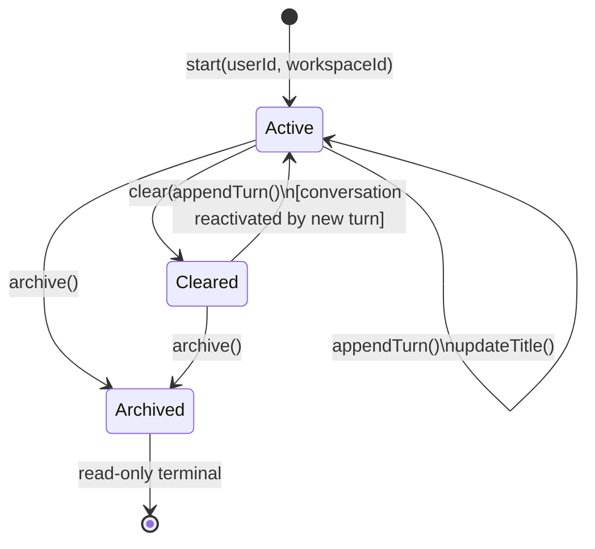
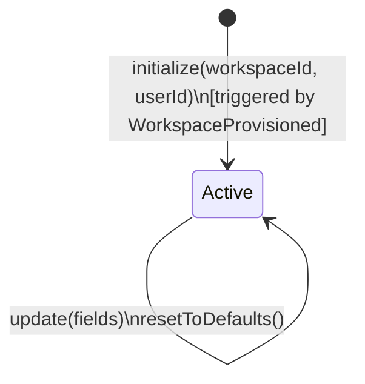
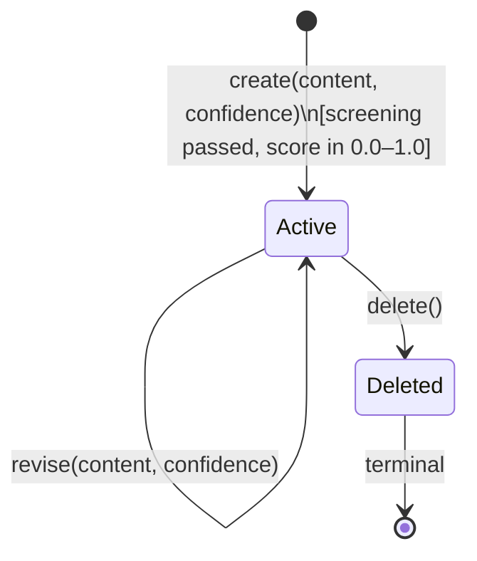

# Aggregate Lifecycle — Memory Bounded Context

---

## Conversation Aggregate

### State Transitions

| From | To | Operation | Guard / Condition |
| --- | --- | --- | --- |
| _(none)_ | **Active** | `start(userId, workspaceId, title?)` | WorkspaceId valid |
| **Active** | **Active** | `appendTurn(sender, content, timestamp)` | Timestamp strictly after last turn |
| **Active** | **Cleared** | `clear()` | Conversation is Active |
| **Cleared** | **Active** | _(implicit)_ | Cleared conversation metadata remains; new turns may be appended |
| **Active** | **Archived** | `archive()` | Policy or explicit user action |
| **Cleared** | **Archived** | `archive()` | Policy |

### Business Operations

| Operation | Pre-condition | Post-condition | Events Raised |
| --- | --- | --- | --- |
| `start(userId, workspaceId, title?)` | Workspace active; user has membership | Conversation Active; empty turns list | `ConversationStarted` |
| `appendTurn(sender, content, timestamp)` | Status Active; timestamp > last turn | New `ConversationTurn` entity added | `ConversationTurnAppended` |
| `updateTitle(title)` | Status Active or Cleared | Title updated | _(none)_ |
| `clear()` | Status Active | All turns removed; status Cleared | `ConversationCleared` |
| `archive()` | Status Active or Cleared | Status Archived (read-only terminal) | `ConversationArchived` |

---

### Conversation State Diagram

---

## UserPreferences Aggregate

### State Transitions

| From | To | Operation | Guard / Condition |
| --- | --- | --- | --- |
| _(none)_ | **Initialized** | `initialize(workspaceId, userId)` | One preferences aggregate per (workspaceId, userId) |
| **Initialized** | **Active** | _(automatic on first use)_ | — |
| **Active** | **Active** | `update(fields)` | Each field within valid bounds |
| **Active** | **Active** | `resetToDefaults()` | — |

### Business Operations

| Operation | Pre-condition | Post-condition | Events Raised |
| --- | --- | --- | --- |
| `initialize(workspaceId, userId)` | No existing preferences for this pair | Preferences created with system defaults | `UserPreferencesInitialized` |
| `update(fields)` | Status Active; all values within valid bounds | Specified fields replaced | `UserPreferencesUpdated` |
| `resetToDefaults()` | Status Active | All fields reset to system defaults | `UserPreferencesUpdated` |

---

### UserPreferences State Diagram

_`UserPreferences` has no terminal state — it persists for the lifetime of the workspace._

---

## MemoryEntry Aggregate _(Post-MVP)_

### State Transitions

| From | To | Operation | Guard / Condition |
| --- | --- | --- | --- |
| _(none)_ | **Active** | `create(content, confidence, workspaceId)` | Content passes sensitive-data screening; confidence in [0.0, 1.0] |
| **Active** | **Active** | `revise(content, confidence)` | New values within bounds |
| **Active** | **Deleted** | `delete()` | User explicit action |

### Business Operations

| Operation | Pre-condition | Post-condition | Events Raised |
| --- | --- | --- | --- |
| `create(content, confidence, workspaceId)` | Screening passed; score valid | MemoryEntry Active | `MemoryEntryCreated` |
| `revise(content?, confidence?)` | Status Active | Content and/or confidence updated | `MemoryEntryUpdated` |
| `delete()` | Status Active | Status Deleted (terminal) | `MemoryEntryDeleted` |

---

### MemoryEntry State Diagram

---

### Lifecycle Notes

- **Conversation** turns are append-only; a turn cannot be edited after appending. This preserves the chronological integrity of the dialogue history.
- **Cleared** conversation retains metadata (title, timestamps). New turns can be appended, effectively reactivating the conversation. This is distinct from deletion.
- **UserPreferences** has no terminal state; it lives for the workspace lifetime. It is always initialized with defaults before first use, triggered by `WorkspaceProvisioned`.
- **MemoryEntry** deletion is terminal and user-initiated; there is no automated purge window.
- Extraction of memory entries from conversations is asynchronous — the `Conversation` aggregate does not call the `MemoryEntry` factory directly.
