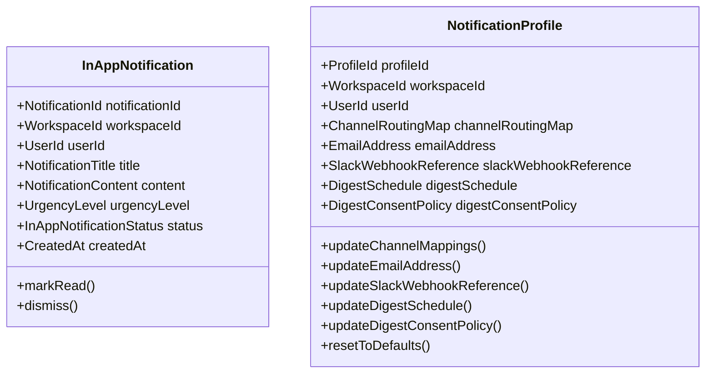
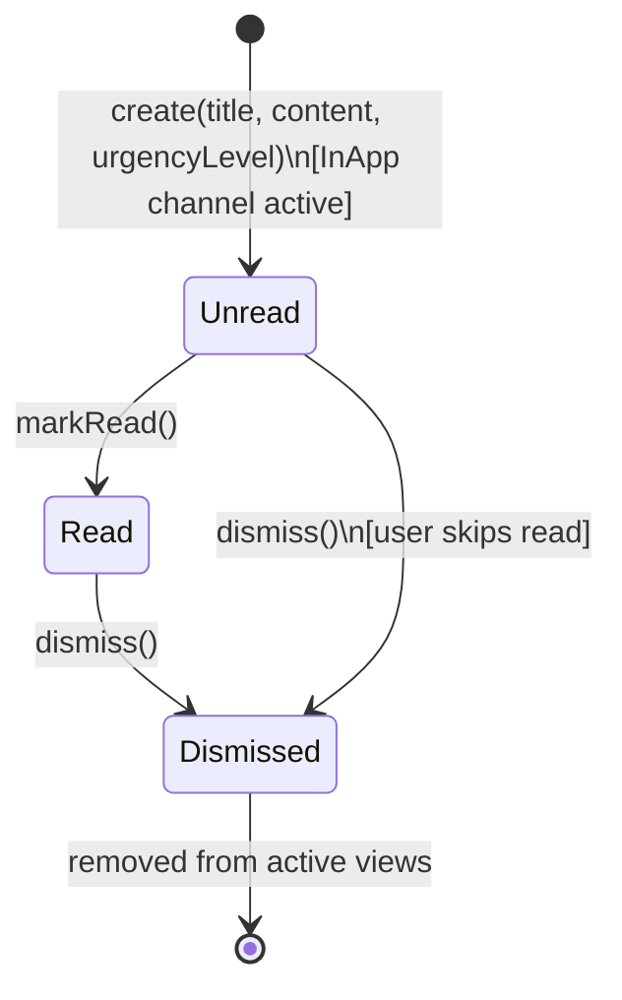
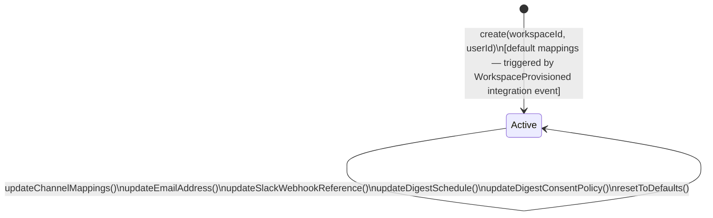
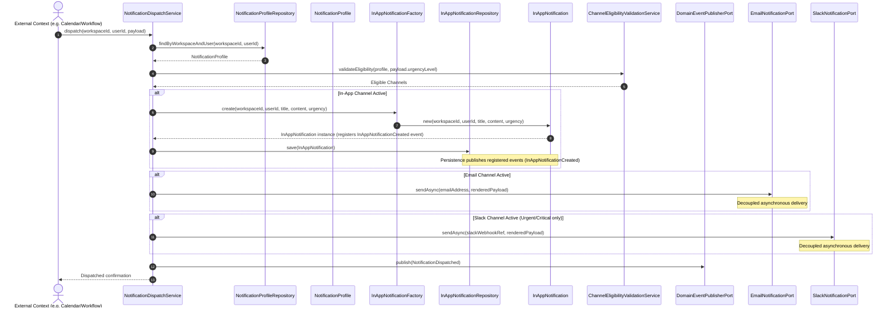

# Domain Model Specification — Notification Bounded Context

## Document Metadata
* **Version**: 2.1.0
* **Status**: Approved / Ready for Application Modeling
* **Date**: August 2, 2026
* **Author**: Principal DDD Reviewer

---

## Section 1: Executive Summary & Bounded Context Scope

The **Notification Bounded Context** (Notification Dispatch) is responsible for routing, rendering, queueing, and dispatching all system alerts, real-time reminders, and consolidated digests within the AI Executive Assistant.

### Responsibilities
* **Notification Dispatching & Routing**: Routing incoming alerts to configured channels (in-app, email, Slack) based on priority urgency and user-defined preferences.
* **In-App Notification Management**: Storing panel-based alerts, tracking read/unread/dismissed statuses, and handling user actions (marking as read, dismissing).
* **Notification Template Management**: Storing rendering templates and formatting payloads specifically for each delivery channel.
* **Consolidated Digests & Reports**: Interacting with external read models to periodically compile and schedule email summaries of user activity (tasks, calendar, notes).
* **Isolation of Secrets**: Maintaining reference IDs (e.g. secret keys/vault references) to third-party Slack webhooks without storing raw tokens or credentials.

### Out of Scope (What it DOES NOT own)
* **Calculating Event Alarms**: Calendar event reminders are calculated and triggered in the `Calendar` context (which then invokes the Notification Dispatch Use Case).
* **SMTP and Slack Credential Management**: The credentials (SMTP passwords, Slack OAuth webhooks) are managed by the `Connector` / Vault context.
* **Workflow Automation Rules**: Mapping system triggers to specific notifications is owned by the `Workflow` context.

---

## Section 2: Ubiquitous Language

| Term | Synonyms | Context-Specific Meaning |
| --- | --- | --- |
| **Notification** | Alert, Message Dispatch | A system-generated message dispatched to a user to alert them of changes, reminders, or activities. Contains a title, content, urgency, and is scoped to a workspace. |
| **InAppNotification** | Internal Alert, Panel Notification | A notification stored and displayed directly within the application's user interface. Persistently stored and managed via read/unread/dismissed states. |
| **NotificationChannel** | Delivery Medium, Channel | The transport medium for delivery: **InApp**, **Email**, or **Slack**. Urgency thresholds govern which channels receive which dispatches. |
| **NotificationProfile** | Notification Preferences, Routing Settings | The routing policy configuration of a user within a workspace. Maps each `UrgencyLevel` to a list of active `NotificationChannel`s. |
| **UrgencyLevel** | Severity Level, Notification Priority | The severity or priority classification: **Low**, **Normal**, **Urgent**, or **Critical**. Drives channel mapping eligibility and dispatch queuing behavior. |
| **Read/Unread Status** | Notification State | The visual state indicating whether a user has acknowledged an `InAppNotification`. New instances default to `Unread` and transition to `Read`. |
| **Dismiss** | Clear, Archive Alert | The user action of acknowledging and permanently clearing an `InAppNotification` from active views, transitioning status to `Dismissed`. |
| **NotificationTemplate** | Message Template | A pre-formatted layout used to render uniform messages. Populated dynamically with domain parameters (e.g., Task Title, Event Start Time) before dispatch. |
| **Digest** | Email Report, Activity Summary | A consolidated summary report containing multiple activity updates sent to a user at configured intervals. Sent periodically via the Email channel. |
| **Dispatch Queue** | Delay Queue, Buffer | An internal routing queue holding non-urgent notifications for throttling, scheduling, or batching. Critical/Urgent notifications bypass this queue. |
| **DigestConsentPolicy** | Consent Settings, Privacy Policy | A value object on the `NotificationProfile` containing boolean flags that dictate whether sensitive details can be included in external Digests. |

---

## Section 3: Aggregate Discovery

The domain defines two Aggregate Roots:

### 1. InAppNotification Aggregate
* **Why it is an Aggregate**:
  It has a distinct identity (`NotificationId`), a stateful lifecycle (unread, read, dismissed), and is bound to a single Workspace. Users interact with notifications independently (marking them read, dismissing them).
* **Responsibilities**:
  * Encapsulates: ID, Workspace scope, Target recipient, Title, Content, Urgency Level, status, and creation timestamp.
  * Manages state transitions (Mark as Read, Dismiss) and guards invariants.
* **Consistency Boundary**: A single `InAppNotification` instance.
* **Transaction Boundary**: Scoped to a single `NotificationId` within a specific `WorkspaceId`.
* **Query Boundary**: Strict multi-tenancy is enforced. Queries must scope requests by both `WorkspaceId` and `UserId` to isolate user inboxes.

### 2. NotificationProfile Aggregate
* **Why it is an Aggregate**:
  This represents the channel routing policy of a user within a workspace. It maps Urgency Levels to Notification Channels and stores delivery configs (Slack webhook reference, email address) alongside consent policies. These preferences must be updated as a single atomic unit.
* **Responsibilities**:
  * Stores: Profile ID, Workspace ID, User ID, Channel Mappings, and configuration references.
  * Validates routing configurations and enforces eligibility constraints.
  * Generates default mappings for new user workspace settings.
* **Consistency Boundary**: The complete routing configuration profile for a workspace user.
* **Transaction Boundary**: Scoped to the `ProfileId` (natural composite unique key: `WorkspaceId` + `UserId`).

---

## Section 4: Aggregate Structure & Entities

### Aggregate Root: InAppNotification

#### Properties
* **notificationId** (`NotificationId`): Unique aggregate identifier (globally unique UUID). (Immutable, Non-null)
* **workspaceId** (`WorkspaceId`): Scopes the notification to a single tenant. (Immutable, Non-null)
* **userId** (`UserId`): The target user recipient within the workspace. (Immutable, Non-null)
* **title** (`NotificationTitle`): Short headline. (Immutable, Non-null, Non-empty)
* **content** (`NotificationContent`): Message body text. (Immutable)
* **urgencyLevel** (`UrgencyLevel`): Classification priority. (Immutable)
* **status** (`InAppNotificationStatus`): Current lifecycle state. (Mutable via behaviors)
* **createdAt** (`CreatedAt`): Timestamp of creation. (Immutable)

#### Behaviors
* `create(...)`: Factory-initialized constructor. Registers an internal `InAppNotificationCreated` event.
* `markRead()`: Transitions status from `Unread` to `Read` if not already dismissed. Registers `InAppNotificationRead`.
* `dismiss()`: Transitions status to `Dismissed`. (Terminal state). Registers `InAppNotificationDismissed`.

---

### Aggregate Root: NotificationProfile

#### Properties
* **profileId** (`ProfileId`): Composite value object identifier of the profile containing `WorkspaceId` and `UserId`. (Immutable, Non-null)
* **workspaceId** (`WorkspaceId`): Workspace scope. (Immutable, Non-null)
* **userId** (`UserId`): User owner of the profile. (Immutable, Non-null)
* **channelRoutingMap** (`ChannelRoutingMap`): Map of urgency level to channel lists. (Mutable)
* **emailAddress** (`EmailAddress`): Email address for notifications. (Mutable)
* **slackWebhookReference** (`SlackWebhookReference`): Vault key referencing the Slack OAuth token. (Mutable)
* **digestSchedule** (`DigestSchedule`): Periodicity configuration for email digests. (Mutable)
* **digestConsentPolicy** (`DigestConsentPolicy`): Flag configurations for digest content inclusion. (Mutable)

#### Behaviors
* `updateChannelMappings(map)`: Validates and replaces the routing map. Rejects the update if requirements (e.g. Email configured for email channel, Slack only on allowed urgencies) are not met. Registers `NotificationProfileUpdated`.
* `updateEmailAddress(email)`: Validates format and updates email. Rejects updates to empty if the Email channel is active. Registers `NotificationProfileUpdated`.
* `updateSlackWebhookReference(ref)`: Sets the opaque vault webhook key. Rejects updates to empty if the Slack channel is active. Registers `NotificationProfileUpdated`.
* `updateDigestSchedule(schedule)`: Sets the timing cron/interval. Registers `NotificationProfileUpdated`.
* `updateDigestConsentPolicy(policy)`: Updates user privacy flags. Registers `NotificationProfileUpdated`.
* `resetToDefaults()`: Restores system defaults. Registers `NotificationProfileReset`.

---

## Section 5: Value Object Catalog

### 1. NotificationId / ProfileId
* **Fields**: Opaque identifier (UUID string). `ProfileId` is composite containing `WorkspaceId` and `UserId`.
* **Immutability**: Immutable.
* **Validation**: Non-null.

### 2. WorkspaceId / UserId
* **Fields**: Opaque identifier representing the tenant scope and user recipient.
* **Immutability**: Immutable.
* **Validation**: Non-null.

### 3. NotificationTitle / NotificationContent
* **Fields**: Plain or structured text representing the message title and detail payload.
* **Immutability**: Immutable.
* **Validation**: Title must be non-empty (cannot be blank).

### 4. UrgencyLevel
* **Fields**: Enum: `Low`, `Normal`, `Urgent`, `Critical`.
* **Immutability**: Immutable.
* **Validation**: Must match valid enum keys.

### 5. InAppNotificationStatus
* **Fields**: Enum: `Unread`, `Read`, `Dismissed`.
* **Immutability**: Immutable.

### 6. NotificationChannel
* **Fields**: Enum: `InApp`, `Email`, `Slack`.
* **Immutability**: Immutable.

### 7. ChannelRoutingMap
* **Fields**: Map `UrgencyLevel` $\rightarrow$ List of `NotificationChannel`.
* **Immutability**: Immutable. Replaced on profile update.
* **Validation**: Slack channel mappings are only valid for `Urgent` and `Critical` levels.

### 8. EmailAddress
* **Fields**: String value containing the target email.
* **Immutability**: Immutable.
* **Validation**: Rejects invalid email formats. Must be non-empty if the email channel is enabled.

### 9. SlackWebhookReference
* **Fields**: Opaque string token (e.g. `vault:secret:slack-webhook-key`). No raw OAuth token is saved.
* **Immutability**: Immutable.
* **Validation**: Required if the Slack channel is mapped. Must follow vault path URI syntax.

### 10. DigestSchedule
* **Fields**: String cron expression or interval representation (e.g. `0 0 18 * * ?` for daily 6 PM).
* **Immutability**: Immutable.
* **Validation**: Must validate as a valid cron schedule format.

### 11. DigestConsentPolicy
* **Fields**: 
  * `allowSensitiveNotes` (boolean)
  * `allowCalendarDetails` (boolean)
  * `allowTaskDescriptions` (boolean)
* **Immutability**: Immutable. Replaced on change.
* **Validation**: All fields must be non-null.

### 12. NotificationTemplate
* **Fields**: Template key (`NotificationTemplateId`), subject format, and channel-specific rendering body template.
* **Immutability**: Immutable.

### 13. CreatedAt
* **Fields**: UTC Instant timestamp.
* **Immutability**: Immutable.

---

## Section 6: Domain Services & Factories

### 1. NotificationDispatchService
* **Why it is a Domain Service**: Orchestrates interaction between separate aggregates (`NotificationProfile` and `InAppNotification`) and delivers payloads to application/infrastructure adapters.
* **Responsibilities**:
  * Loads `NotificationProfile` for the target recipient.
  * Evaluates channel mappings for the incoming alert's `UrgencyLevel`.
  * Filters channels based on `ChannelEligibilityValidationService`.
  * Instantiates and persists `InAppNotification` if the `InApp` channel is triggered.
  * Routes dispatches through outbound ports (`EmailNotificationPort`, `SlackNotificationPort`) asynchronously.
  * Publishes `NotificationDispatched` via `DomainEventPublisherPort`.

### 2. NotificationTemplateRenderingService
* **Why it is a Domain Service**: Templates are shared, read-only catalog assets. Rendering is stateless and independent of aggregate state.
* **Responsibilities**:
  * Renders templated parameters into channel-specific format payloads (Plain-text, HTML, Slack blocks).
  * Omit or summarize fields according to the profile's `DigestConsentPolicy` during digest formatting.

### 3. DigestCompilationService
* **Why it is a Domain Service**: Compilation requires querying read models across multiple bounded contexts (Tasks, Calendar, Notes).
* **Responsibilities**:
  * Compiles summary reports per `DigestSchedule`.
  * Sanitizes contents using the profile's `DigestConsentPolicy`.
  * Enqueues email dispatch via the `EmailNotificationPort`.

### 4. ChannelEligibilityValidationService
* **Why it is a Domain Service**: Validates profile compliance rules at runtime before transmission (e.g. in case settings changed since dispatch queue ingestion).
* **Responsibilities**:
  * Prevents email transmission if `EmailAddress` is missing.
  * Blocks Slack delivery for `Low`/`Normal` urgency levels.

### 5. InAppNotificationFactory
* **Responsibilities**: Factory instantiating `InAppNotification` in the default `Unread` status. Registers `InAppNotificationCreated`.

### 6. NotificationProfileFactory
* **Responsibilities**: Generates a default profile configuration with standard channel configurations when a new workspace user is provisioned.

---

## Section 7: Ports & Repositories

Following **Hexagonal Architecture**, the domain defines the following boundaries (Ports) which infrastructure adapters must implement, and which application services drive.

### Inbound Ports (Application Use Cases)
* **NotificationDispatchUseCase**: Driven by external context events (like Calendar alarms or Workflow alerts) to route and dispatch notifications.
* **InAppNotificationUseCase**: Driven by user interfaces to fetch, mark read, or dismiss in-app notifications.
* **NotificationProfileUseCase**: Driven by user interfaces to manage routing maps, contact preferences, and digest schedules.

### Outbound Ports (Infrastructure SPIs)

#### 1. InAppNotificationRepository
* **Associated Aggregate Root**: `InAppNotification`
* **Responsibilities**:
  * `findById(notificationId, workspaceId)`: Resolves aggregate within workspace bounds.
  * `save(inAppNotification)`: Persists the state. Must publish all registered events inside the aggregate to the event bus.
  * `findByUser(workspaceId, userId, status, pageable)`: Returns paginated lists of notifications for a user.
  * `countUnread(workspaceId, userId)`: Counts unread alerts for real-time badge updates.

#### 2. NotificationProfileRepository
* **Associated Aggregate Root**: `NotificationProfile`
* **Responsibilities**:
  * `findByWorkspaceAndUser(workspaceId, userId)`: Finds the profile.
  * `save(notificationProfile)`: Persists routing preferences, email addresses, webhook references, schedules, and consent flags. Must publish registered events.

#### 3. EmailNotificationPort
* **Responsibilities**:
  * `sendAsync(emailAddress, renderedPayload)`: Non-blocking port to dispatch email messages asynchronously.

#### 4. SlackNotificationPort
* **Responsibilities**:
  * `sendAsync(slackWebhookReference, renderedPayload)`: Non-blocking port to dispatch Slack alerts asynchronously.

#### 5. DomainEventPublisherPort
* **Responsibilities**:
  * `publish(domainEvent)`: Dispatches domain events generated by services directly to the messaging layer.

---

## Section 8: Domain Events

All events generated by the aggregates are registered internally on their respective aggregate root and dispatched to the event bus by the persistence layer (repository) upon a successful transaction commit. Events generated by Domain Services are published immediately via the `DomainEventPublisherPort`.

| Event Name | Publisher | Consumers | Business Meaning | Key Payload Fields |
| --- | --- | --- | --- | --- |
| **InAppNotificationCreated** | `InAppNotification` | UI / WebSocket real-time push layer, Audit log | A new alert has been stored and is visible in the UI inbox. | `notificationId`, `workspaceId`, `userId`, `title`, `urgencyLevel`, `occurredAt` |
| **InAppNotificationRead** | `InAppNotification` | UI, Audit log | User viewed the alert; unread count decremented. | `notificationId`, `workspaceId`, `userId`, `occurredAt` |
| **InAppNotificationDismissed** | `InAppNotification` | UI, Audit log | User cleared the alert from active views. | `notificationId`, `workspaceId`, `userId`, `occurredAt` |
| **NotificationDispatched** | `NotificationDispatchService` | Audit log, Monitoring metrics | The dispatch workflow successfully routed and fired alerts to all targeted channels. | `workspaceId`, `userId`, `urgencyLevel`, `channelsUsed`, `occurredAt` |
| **NotificationRendered** | `NotificationTemplateRenderingService` | Outbound channel delivery adapters | A channel-ready payload has been compiled from templates and domain params. | `workspaceId`, `channel`, `templateId`, `occurredAt` |
| **NotificationProfileUpdated** | `NotificationProfile` | `NotificationDispatchService` (cache eviction), Audit log | User changed routing preferences, email, webhook, schedule, or consent. | `profileId`, `workspaceId`, `userId`, `changedFields`, `occurredAt` |
| **NotificationProfileReset** | `NotificationProfile` | `NotificationDispatchService`, Audit log | Profile preferences restored to default setup. | `profileId`, `workspaceId`, `userId`, `occurredAt` |
| **DigestScheduled** | Digest Scheduling Service | Email Delivery Adapter, Audit log | A daily summary report has been compiled and is ready for SMTP transmission. | `workspaceId`, `userId`, `scheduledFor`, `occurredAt` |

---

## Section 9: Business Invariants & Validation Rules

### INV-NOTIF-01 — Workspace Tenancy Scope (Validation Rule)
* **Rule**: All notifications, alerts, and profiles must strictly belong to a single `WorkspaceId`. Cross-workspace visibility is prohibited.
* **Enforcement**: `WorkspaceId` is set on creation and is immutable. The application layer validates workspace boundaries on all loads and saves.
* **Violation**: Attempts to fetch or save aggregates with mismatched tenant context are rejected.

### INV-NOTIF-02 — Email Channel Requires Valid Address (Validation Rule)
* **Rule**: An email notification must not be dispatched unless a valid, non-empty `EmailAddress` is configured on the `NotificationProfile`.
* **Enforcement**: `updateChannelMappings()` rejects mapping the email channel if `EmailAddress` is absent or invalid. `updateEmailAddress()` rejects setting an empty email if the email channel routing is active.
* **Violation**: Email delivery is bypassed; the email channel is skipped, and a warning is logged.

### INV-NOTIF-03 — Slack Channel Limited to Urgent and Critical (Validation Rule)
* **Rule**: Slack delivery must only be triggered for notifications classified as `Urgent` or `Critical`. Notifications with `Low` or `Normal` urgency must not be routed to Slack.
* **Enforcement**: `updateChannelMappings()` rejects any `ChannelRoutingMap` mapping Slack to `Low` or `Normal`. `ChannelEligibilityValidationService` filters out invalid Slack routes at dispatch time.
* **Violation**: Slack mapping configuration or routing attempts for `Low`/`Normal` alerts are rejected.

### INV-NOTIF-04 — Critical and Urgent Alerts Bypass Dispatch Queue (Validation Rule)
* **Rule**: Notifications marked as `Critical` or `Urgent` must bypass standard delivery queues and be sent immediately.
* **Enforcement**: `NotificationDispatchService` evaluates `UrgencyLevel`. If classified as `Critical` or `Urgent`, the message is pushed synchronously (or via a high-priority immediate channel), bypassing the scheduler/delay queues.
* **Violation**: Standard queue delay for high-priority alerts is treated as a severe system defect.

### INV-NOTIF-05 — Digest Data Consent (Validation Rule)
* **Rule**: Summaries and digests must not render sensitive domain data unless explicit user settings permit it on the `NotificationProfile` via `DigestConsentPolicy`.
* **Enforcement**: `DigestCompilationService` reads the profile's `DigestConsentPolicy`. Sections of notes, tasks, or event descriptions flagged as sensitive are either redacted or generalized.
* **Violation**: Sensitive data printed in the digest without user consent is flagged as a privacy defect.

### INV-NOTIF-06 — Non-Empty Notification Title (Validation Rule)
* **Rule**: Every `InAppNotification` must have a non-empty `NotificationTitle`.
* **Enforcement**: The `NotificationTitle` value object rejects empty or whitespace-only strings during construction.
* **Violation**: Creation of `InAppNotification` is rejected.

### INV-NOTIF-07 — Slack Webhook Reference Required When Slack Enabled (Validation Rule)
* **Rule**: When the `Slack` channel is active for any urgency mapping, a non-null `SlackWebhookReference` must be present on the profile.
* **Enforcement**: `updateChannelMappings()` checks that a reference exists if Slack is active. `updateSlackWebhookReference()` rejects empty references if the Slack routing is active.
* **Violation**: Slack dispatch is blocked; an execution error is logged.

### INV-NOTIF-08 — Dismissed Status is Terminal (Consistency Rule)
* **Rule**: An `InAppNotification` in `Dismissed` state cannot be transitioned back to `Unread` or `Read`.
* **Enforcement**: `markRead()` and `dismiss()` guard transitions; once state becomes `Dismissed`, subsequent status updates throw an exception.
* **Violation**: Attempts to re-open or un-dismiss a notification fail.

### INV-NOTIF-09 — One Profile Per Workspace/User (Consistency Rule)
* **Rule**: There must be exactly one `NotificationProfile` per `(WorkspaceId, UserId)` pair.
* **Enforcement**: Database schema enforces a composite unique constraint on `(WorkspaceId, UserId)`. Application logic implements an idempotent profile provisioning handler.
* **Violation**: Database unique constraint violation.

### INV-NOTIF-10 — Profile Initialized on Workspace Provisioning (Consistency Rule)
* **Rule**: A default `NotificationProfile` must be created with sensible channel defaults when a workspace user is provisioned.
* **Enforcement**: The context listens to the `WorkspaceProvisioned` integration event and calls the `NotificationProfileFactory` to write a default profile configuration to the database.
* **Violation**: Missing profile during dispatch defaults to a standard fallback configuration.

### INV-NOTIF-11 — Slack and SMTP Credentials Are Not Owned Here (Consistency Rule)
* **Rule**: The Notification context must not store raw SMTP passwords or Slack OAuth tokens directly.
* **Enforcement**: It only references secrets via the `SlackWebhookReference` value object. The actual secrets storage and lookup are delegated to the `Connector` / Vault context.
* **Violation**: Raw credentials found in the notification schema.

---

## Section 10: Lifecycle & State Transitions

### InAppNotification State Transitions
* `create(...)`: Transitions from `[void]` to `Unread` (Registers `InAppNotificationCreated`).
* `markRead()`: Transitions from `Unread` to `Read` (Registers `InAppNotificationRead`).
* `dismiss()`: Transitions from `Unread` or `Read` to `Dismissed` (Registers `InAppNotificationDismissed`).
* `Dismissed`: Terminal state. Logical removal from active dashboard views.

---

### NotificationProfile State Transitions
* `create(...)`: Provisioned initially on workspace/user activation in the `Active` state.
* `Active`: Represents the operational state where channel mapping, email address, Slack webhook reference, digest schedule, and consent policies are modified in place.
* No terminal state (persists until the workspace is de-provisioned).

---

### Notification Dispatch Sequence Diagram

The following sequence details how the domain services orchestrate the routing and delivery process using outbound ports in a non-blocking, asynchronous manner:

