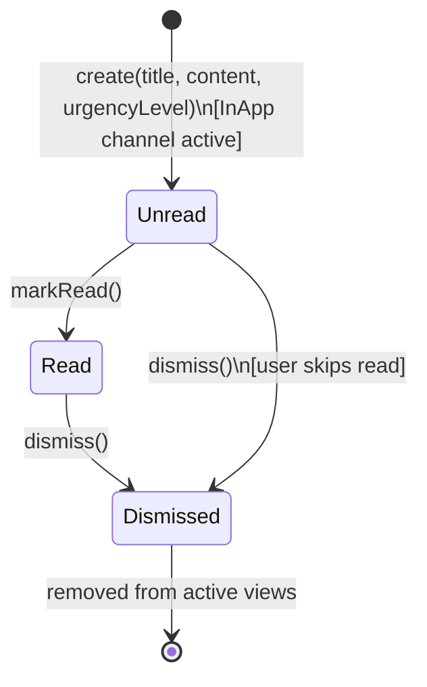
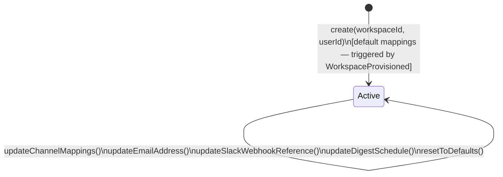

# Aggregate Lifecycle — Notification Bounded Context

---

## InAppNotification Aggregate

### State Transitions

| From | To | Operation | Guard / Condition |
| --- | --- | --- | --- |
| _(none)_ | **Unread** | `create(workspaceId, userId, title, content, urgencyLevel)` | InApp channel active in profile; workspace scoped |
| **Unread** | **Read** | `markRead()` | Status Unread |
| **Read** | **Dismissed** | `dismiss()` | Status Read |
| **Unread** | **Dismissed** | `dismiss()` | Status Unread (user may dismiss without reading) |

### Business Operations

| Operation | Pre-condition | Post-condition | Events Raised |
| --- | --- | --- | --- |
| `create(workspaceId, userId, title, content, urgencyLevel)` | Dispatch service selected InApp channel; title non-empty | Status Unread | `InAppNotificationCreated` |
| `markRead()` | Status Unread | Status Read | `InAppNotificationRead` |
| `dismiss()` | Status Unread or Read | Status Dismissed (terminal for UI) | `InAppNotificationDismissed` |

---

### InAppNotification State Diagram



---

## NotificationProfile Aggregate

### State Transitions

The `NotificationProfile` has a single operational state — **Active**. It is created on workspace provisioning and is always mutable.

| From | To | Operation | Guard / Condition |
| --- | --- | --- | --- |
| _(none)_ | **Active** | `create(workspaceId, userId)` | Triggered by `WorkspaceProvisioned`; default mappings applied |
| **Active** | **Active** | `updateChannelMappings(map)` | Slack only for Urgent/Critical; Email requires valid address |
| **Active** | **Active** | `updateEmailAddress(email)` | Valid email format |
| **Active** | **Active** | `updateSlackWebhookReference(ref)` | Non-null reference |
| **Active** | **Active** | `updateDigestSchedule(schedule)` | Valid interval/cron |
| **Active** | **Active** | `resetToDefaults()` | Always allowed |

### Business Operations

| Operation | Pre-condition | Post-condition | Events Raised |
| --- | --- | --- | --- |
| `create(workspaceId, userId)` | One profile per (workspaceId, userId) | Profile Active with default `ChannelRoutingMap` | _(none — initialization is silent or `ProfileInitialized`)_ |
| `updateChannelMappings(map)` | Status Active; Slack constraint satisfied; email constraint satisfied | `ChannelRoutingMap` replaced | `NotificationProfileUpdated` |
| `updateEmailAddress(email)` | Status Active; valid email format | `EmailAddress` updated | `NotificationProfileUpdated` |
| `updateSlackWebhookReference(ref)` | Status Active | `SlackWebhookReference` updated | `NotificationProfileUpdated` |
| `updateDigestSchedule(schedule)` | Status Active | `DigestSchedule` updated | `NotificationProfileUpdated` |
| `resetToDefaults()` | Status Active | All fields reset to system defaults | `NotificationProfileReset` |

---

### NotificationProfile State Diagram



_`NotificationProfile` has no terminal state — it persists for the lifetime of the workspace._

---

### Dispatch Flow (Domain Service — not an aggregate)

The `NotificationDispatchService` is responsible for routing, rendering, and delivering notifications. It is not an aggregate root and has no stateful lifecycle, but its interactions are documented here for completeness.

```
Incoming Alert
     │
     ▼
Load NotificationProfile (ChannelRoutingMap + UrgencyLevel)
     │
     ├─ UrgencyLevel = Critical/Urgent → Bypass queue → Immediate dispatch
     │
     └─ UrgencyLevel = Normal/Low → Standard dispatch queue
          │
          ▼
     For each active channel:
          ├─ InApp → InAppNotification.create()
          ├─ Email → Render template → SMTP adapter
          └─ Slack → Render template → Webhook adapter (Urgent/Critical only)
          │
          ▼
     Publish NotificationDispatched
```

---

### Lifecycle Notes

- **Dismissed** is terminal for a specific `InAppNotification`. Once dismissed, the record is logically removed from the user's active panel. The aggregate still exists in storage for audit purposes.
- `NotificationProfile` is created automatically when a workspace is provisioned and is never deleted while the workspace is active. Resetting to defaults is the closest operation to "starting over."
- The `DispatchQueuePolicy` is a domain constant (value object), not an aggregate field. It governs queue bypass for `Urgent`/`Critical` notifications at the dispatch service level.
- Digest generation is handled by a scheduling service that reads `DigestSchedule` from the profile; it is not a state on the `NotificationProfile` itself.
