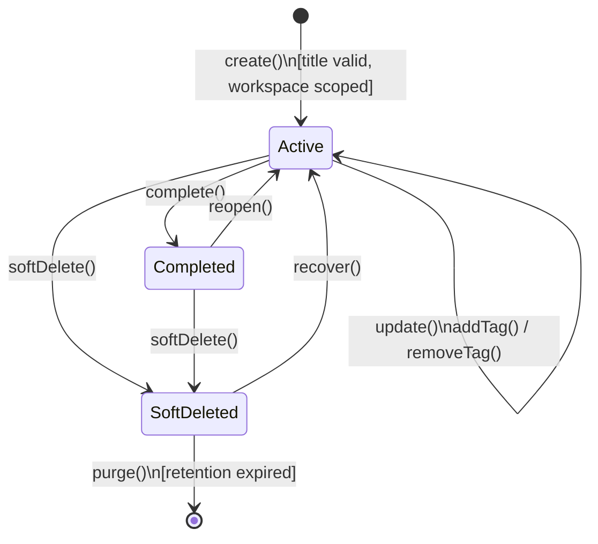
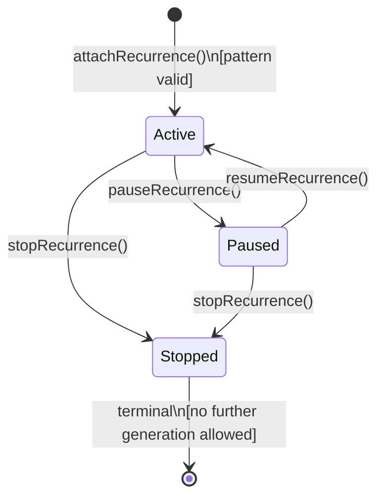

# Domain Model Specification — Todo Bounded Context

## Document Metadata
- **Version**: 2.1.0
- **Status**: Approved / Ready for Application Modeling
- **Date**: August 2, 2026
- **Author**: Principal DDD Reviewer / Architect

---

## Section 1: Executive Summary & Bounded Context Scope

The **Todo Bounded Context** is the core domain component of the AI Executive Assistant responsible for managing the user's tasks, priorities, tags, and automated recurring schedules. It serves as the system of record for all task-related activities, ensuring task isolation, data integrity, and compliance with the tenant's workspace boundary.

### Domain Boundaries

#### What the Todo Context Owns
- **Task Lifecycle Management**: The system of record for CRUD operations, completion, reopen, logical soft-deletion, and recovery of tasks.
- **Triage & Classification**: Enforcing that every task has exactly one priority level and managing its unstructured, case-sensitive tags.
- **Recurrence Logic**: Managing and executing simple task recurrence rules (Daily, Weekly, Monthly patterns).
- **Isolation & Security**: Restricting all read/write operations within the tenant's workspace boundary.
- **Domain Event Publication**: Announcing task lifecycle updates (e.g., creation, completion, deletion, resumption) to notify downstream contexts.

#### What the Todo Context DOES NOT Own
- **User Authentication**: Managed by the `Auth` context.
- **Workspace Membership**: Managed by the `Workspace` context.
- **External Sync Adapters**: Managed by the `Connector` context (interprets external API schemas like Jira/TickTick/Notion).
- **Goal & NLP Planning**: Managed by the `AI Agent` context.
- **Calendar & Notifications**: Managed by the `Calendar` and `Notification` contexts respectively.

---

## Section 2: Ubiquitous Language

| Term | Synonyms | Definition & Context-Specific Meaning |
| --- | --- | --- |
| **Task** | Work Item, Todo Item | A discrete, tracked unit of work bound to a single Workspace and associated with exactly one priority. |
| **Priority** | Priority Level | The level of urgency/importance assigned to a Task. Valid values: **High**, **Medium**, and **Low** (default: Medium). |
| **Tag** | Category, Label | A user-defined, case-sensitive string label attached to a Task. A task can have zero or more tags. |
| **Recurrence Rule** | Repeat Schedule | A specification defining how and when a Task repeats (daily, weekly, monthly). |
| **Parent Task** | Recurring Template | A Task configured with a Recurrence Rule that serves as the template for generating child task instances. |
| **Recurrence Instance** | Child Task | An individual Task aggregate automatically generated from a Parent Task. Has a unique ID and due date. |
| **Soft-Delete** | Logical Delete | Marking a Task as deleted but retaining it in the database during a temporary recovery window. |
| **Hard-Delete** | Physical Delete, Purge | The permanent, irreversible removal of task data after the recovery window expires. |
| **Recovery Window** | Trash Retention | The period during which a soft-deleted task can be recovered from the Trash (e.g., 30 days before permanent purging). |
| **Workspace** | Tenant Space | The logical isolation and tenancy boundary. Cross-workspace task sharing or access is strictly prohibited. |

---

## Section 3: Aggregate Discovery

### Task Aggregate Boundary

The only aggregate in this context is the **Task** aggregate. It represents the consistency boundary for all task fields, tags, and recurrence templates.

```
       [*] ──► [ Active ] ◄──────────┐
                   │   │              │
       ┌───────────┘   │ (Complete)   │ (Recover)
(Soft-Delete)│         ▼              │
       ▼         [ Completed ]        │
  [ Soft-Deleted ] ───────────────────┘
         │
         │ (Purge coordinated by App Service)
         ▼
  [ Hard-Deleted (Purged) ]
```

- **Consistency Boundary**: A single `Task` instance. Updating tags, priority, or execution status is atomic on the aggregate.
- **Transaction Boundary**: Scoped to a single `TaskId` in a specific `WorkspaceId`. Child task instances are generated in separate transactions from the parent to eliminate database locking contention. To prevent duplicate generation due to concurrent scheduler ticks, the generation process updates the parent schedule's generator state (`lastGeneratedOccurrence`), which is saved in the same transaction as the child task instance, using optimistic locking (versioning) on the parent.

### Aggregate Relationships
To maintain strict aggregate isolation, the parent template and its child instances are related by a **Soft Reference** (ID-only) using `ParentTaskId`. This prevents modifying or locking a child task from locking the parent or sibling aggregates.

---

## Section 4: Aggregate Structure & Entities

### Aggregate Root: Task

The `Task` aggregate root manages its internal state, holds metadata, and controls access to its properties.

#### Properties
- `TaskId` (Identity)
- `WorkspaceId` (Tenancy Boundary)
- `ParentTaskId` (Optional soft reference to parent)
- `Title` (Trimmed, non-empty)
- `Description` (Optional text)
- `Priority` (High/Medium/Low)
- `Tags` (Set of unique Tag VOs)
- `DueDate` (Optional calendar date-time; required for recurrence instances)
- `LifecycleStatus` (Active/Completed/SoftDeleted)
- `SoftDeleteMetadata` (Optional, tracks timestamp when soft-deleted)
- `RecurrencePattern` (Optional: DAILY, WEEKLY, MONTHLY)
- `RecurrenceInterval` (Optional positive integer, default 1)
- `RecurrenceStatus` (Optional: Active, Paused, Stopped)
- `lastGeneratedOccurrence` (Optional timestamp)
- `Version` (For optimistic concurrency locking)

#### Public Behaviors
- **Content Mutation**: `update(title, description, priority, due date)` validates state and updates fields.
- **Tag Management**:
  - `addTag(tag)`: Silently ignores addition if the tag is already present (idempotent), but validates that a new tag is non-blank.
  - `removeTag(tag)`: Removes the tag from the internal collection.
- **Completion**: `complete()` transitions `Active → Completed`. `reopen()` transitions `Completed → Active`.
- **Soft Deletion & Recovery**:
  - `softDelete()` transitions `Active / Completed → SoftDeleted` and records `SoftDeleteMetadata`.
  - `recover()` transitions `SoftDeleted → Active` if it has not been permanently purged.
- **Recurrence Controls**:
  - `attachRecurrence(pattern, interval)` configures the task recurrence settings.
  - `pauseRecurrence()` transitions the schedule execution state `Active → Paused`.
  - `resumeRecurrence()` transitions the schedule execution state `Paused → Active`.
  - `stopRecurrence()` transitions the execution state to `Stopped` (terminal for scheduling).
  - `recordGeneration(dueDate)` updates the `lastGeneratedOccurrence` field to prevent duplicate generation.

---

## Section 5: Value Object Catalog

### 1. TaskId
- **Fields**: Unique identifier (UUID).
- **Immutability**: Immutable.
- **Validation**: Non-null.

### 2. WorkspaceId
- **Fields**: Tenant identifier (UUID or String).
- **Immutability**: Immutable.
- **Validation**: Non-null.

### 3. ParentTaskId
- **Fields**: `TaskId` of the template task.
- **Immutability**: Immutable.
- **Validation**: Cannot equal the task's own `TaskId` (checked during validation on the aggregate or service).

### 4. Title
- **Fields**: Cleaned task title string.
- **Immutability**: Replace-on-change.
- **Validation**: Non-empty and non-whitespace after trimming.

### 5. Description
- **Fields**: Free-text description string.
- **Immutability**: Replace-on-change.
- **Validation**: Nullable; length constraints enforced at construction if set.

### 6. Priority
- **Fields**: Enum: `High`, `Medium`, `Low`.
- **Immutability**: Replace-on-change.
- **Validation**: Required; defaults to `Medium` if unspecified.

### 7. Tag
- **Fields**: Case-sensitive string.
- **Immutability**: Immutable.
- **Validation**: Trimmed label must be non-empty. Invalid (blank) tags throw a domain validation exception on constructor initialization.

### 8. DueDate
- **Fields**: Date-time object (e.g. `Instant`).
- **Immutability**: Replace-on-change.
- **Validation**: Must represent a valid timestamp.

### 9. RecurrencePattern
- **Fields**: Enum: `DAILY`, `WEEKLY`, `MONTHLY`.
- **Immutability**: Replace-on-change.
- **Validation**: Required for recurring tasks.

### 10. RecurrenceInterval
- **Fields**: Positive integer.
- **Immutability**: Replace-on-change.
- **Validation**: Must be >= 1.

### 11. RecurrenceExecutionState
- **Fields**: Enum: `Active`, `Paused`, `Stopped`.
- **Immutability**: Replace-on-change.
- **Validation**: Transitions must be explicit (e.g., no transitions allowed out of `Stopped`).

### 12. TaskLifecycleStatus
- **Fields**: Enum: `Active`, `Completed`, `SoftDeleted`.
- **Immutability**: Changes managed by aggregate root transitions.
- **Validation**: Transitions must follow the lifecycle rules.

### 13. SoftDeleteMetadata
- **Fields**: `softDeletedAt` (Instant timestamp).
- **Immutability**: Immutable after creation.
- **Validation**: Required when lifecycle status is `SoftDeleted`.

### 14. RecurrenceInstanceSeed
- **Fields**: Bundle of parameters (`WorkspaceId`, `ParentTaskId`, `Title`, `Priority`, `Tags`, `DueDate`).
- **Immutability**: Immutable.
- **Validation**: Copy of parent's fields at instance creation time. `DueDate` is strictly mandatory.

---

### Composition on Task

| Value Object / Type | Cardinality | Purpose |
| --- | --- | --- |
| `TaskId` | 1 | Primary identifier |
| `WorkspaceId` | 1 | Tenancy partition |
| `ParentTaskId` | 0..1 | Link to recurring template |
| `Title` | 1 | Task name |
| `Description` | 0..1 | Optional details |
| `Priority` | 1 | Importance level |
| `Tag` | 0..* | Classification set |
| `DueDate` | 0..1 | Execution target time |
| `TaskLifecycleStatus` | 1 | Active state tracker |
| `SoftDeleteMetadata` | 0..1 | Logical deletion details |
| `RecurrencePattern` | 0..1 | Pattern for scheduling |
| `RecurrenceInterval` | 0..1 | Interval for scheduling |

---

## Section 6: Domain Services & Factories

### RecurrenceInstanceGenerationService

#### Purpose
Generates a new `Task` child aggregate instance from an active parent task template and updates the parent generator state to maintain sequencing.

#### Why it is a Domain Service
- Spans multiple aggregate boundaries: loading the parent template and generating a new child task.
- Guards the cross-aggregate invariant: **No overlapping due dates** among sibling instances. This requires checking existing instances in the database via the repository, which a single parent task aggregate cannot access.
- Orchestrates parent state mutation and child instantiation. The transaction demarcation itself is managed by the application layer.

#### Responsibilities
- Computes the next occurrence due date using the parent's `RecurrencePattern` and `RecurrenceInterval` starting from `lastGeneratedOccurrence` (or parent `DueDate` if no occurrences exist).
- Queries the repository to verify that the due date does not collide with an existing instance of the parent.
- Invokes `recordGeneration(dueDate)` on the parent task to advance its generation state.
- Assembles a `RecurrenceInstanceSeed` containing inherited priority and tags.
- Uses `TaskFactory` to construct the new child task instance.
- Returns both the updated parent task (for optimistic concurrency version bumping) and the new child task to the application layer.

---

### TaskFactory
- **Purpose**: Encapsulates the construction of a new task aggregate, ensuring all initial value objects and defaults are applied correctly.
- **Responsibilities**:
  - Instantiates manual tasks with standard defaults (e.g., default `Medium` priority).
  - Instantiates child task instances from a `RecurrenceInstanceSeed`, enforcing inheritance and requiring `DueDate`.

---

## Section 7: Repositories

### TaskRepository
There is exactly one repository interface for this context: `TaskRepository`, which manages the persistence of the `Task` aggregate root (including its internal `RecurrenceSchedule` entity).

#### Java Interface Definition
```java
package com.aiexecutiveassistant.todo.domain;

import java.time.Instant;
import java.util.List;
import java.util.Optional;

public interface TaskRepository {
    
    /**
     * Loads a task aggregate by ID, isolated within a workspace boundary.
     * Must return Optional.empty() if the task belongs to a different workspace.
     */
    Optional<Task> findById(TaskId taskId, WorkspaceId workspaceId);
    
    /**
     * Persists the task aggregate (insert or update). Must trigger optimistic locking
     * check using the version field.
     */
    void save(Task task);
    
    /**
     * Finds parent tasks that have active recurrence schedules.
     */
    List<Task> findActiveRecurrenceTemplates();
    
    /**
     * Finds child instances generated from a parent template.
     */
    List<Task> findChildInstances(TaskId parentTaskId);
    
    /**
     * Finds soft-deleted tasks whose recovery window has expired.
     */
    List<Task> findSoftDeletedExpiredBefore(Instant threshold);
    
    /**
     * Permanently hard-deletes a task aggregate from persistent storage.
     */
    void delete(Task task);
}
```

---

## Section 8: Domain Events

### 1. TaskCreated
- **Publisher**: `Task` aggregate
- **Trigger**: New task initialized.
- **Payload**: `taskId`, `workspaceId`, `title`, `priority`, `dueDate`, `tags`, `parentTaskId`, `occurredAt`.
- **Business Meaning**: A trackable unit of work has entered the system. Downstream consumers (e.g., `AI Agent`) check if `parentTaskId` is present to associate this as a child recurrence instance, avoiding the need for duplicate creation events.

### 2. TaskUpdated
- **Publisher**: `Task` aggregate
- **Trigger**: Active task fields modified.
- **Payload**: `taskId`, `workspaceId`, `changedFields` (string list), `occurredAt`.

### 3. TaskCompleted
- **Publisher**: `Task` aggregate
- **Trigger**: Task state transitioned to `Completed`.
- **Payload**: `taskId`, `workspaceId`, `completedAt`.

### 4. TaskReopened
- **Publisher**: `Task` aggregate
- **Trigger**: Task state transitioned from `Completed` back to `Active`.
- **Payload**: `taskId`, `workspaceId`, `occurredAt`.

### 5. TaskSoftDeleted
- **Publisher**: `Task` aggregate
- **Trigger**: Task logically deleted (`Active/Completed → SoftDeleted`).
- **Payload**: `taskId`, `workspaceId`, `softDeletedAt`.

### 6. TaskRecovered
- **Publisher**: `Task` aggregate
- **Trigger**: Soft-deleted task successfully restored (`SoftDeleted → Active`).
- **Payload**: `taskId`, `workspaceId`, `recoveredAt`.

### 7. TaskPurged
- **Publisher**: Application Service (following successful repository delete coordination)
- **Trigger**: Task permanently deleted after recovery window expires.
- **Payload**: `taskId`, `workspaceId`, `purgedAt`.

### 8. RecurrenceStarted
- **Publisher**: `Task` aggregate (parent)
- **Trigger**: Recurrence pattern configured or activated.
- **Payload**: `taskId`, `workspaceId`, `pattern`, `interval`, `occurredAt`.

### 9. RecurrencePaused
- **Publisher**: `Task` aggregate (parent)
- **Trigger**: Recurring task schedule execution paused.
- **Payload**: `taskId`, `workspaceId`, `occurredAt`.

### 10. RecurrenceResumed
- **Publisher**: `Task` aggregate (parent)
- **Trigger**: Recurring task schedule execution resumed from `Paused`.
- **Payload**: `taskId`, `workspaceId`, `occurredAt`.

### 11. RecurrenceStopped
- **Publisher**: `Task` aggregate (parent)
- **Trigger**: Recurring task schedule permanently stopped (terminal).
- **Payload**: `taskId`, `workspaceId`, `occurredAt`.

---

### Domain Event Summary

| Event | Publisher | Key Consumers |
| --- | --- | --- |
| **TaskCreated** | Task aggregate | AI Agent, Notification, Memory |
| **TaskUpdated** | Task aggregate | Connector (outbound sync), AI Agent |
| **TaskCompleted** | Task aggregate | AI Agent, Notification, Connector, Memory |
| **TaskReopened** | Task aggregate | AI Agent, Connector |
| **TaskSoftDeleted** | Task aggregate | Connector, Purge Coordinator |
| **TaskRecovered** | Task aggregate | Connector, AI Agent |
| **TaskPurged** | Application Service | Connector |
| **RecurrenceStarted** | Task aggregate | Recurrence Instance Generation Service |
| **RecurrencePaused** | Task aggregate | Recurrence Instance Generation Service |
| **RecurrenceResumed** | Task aggregate | Recurrence Instance Generation Service |
| **RecurrenceStopped** | Task aggregate | Recurrence Instance Generation Service |

---

## Section 9: Business Invariants & Validation Rules

### INV-TODO-01 — Mandatory Title
- **Rule**: Every Task must have a non-empty, non-whitespace title at all times.
- **Enforcement**: `Title` value object rejects empty strings. The aggregate validates the value before mutating.

### INV-TODO-02 — Single Priority Constraint
- **Rule**: Every task must have exactly one priority value (`High`, `Medium`, or `Low`).
- **Enforcement**: Required at creation (defaults to `Medium` if absent). Priority updates must supply a valid enum value.

### INV-TODO-03 — Workspace Tenancy Scope
- **Rule**: A Task must belong to exactly one `WorkspaceId` for its lifetime. Cross-workspace operations are prohibited.
- **Enforcement**: `WorkspaceId` is immutable. The application layer filters all queries and validates tenancy on write.

### INV-TODO-04 — Tag Uniqueness and Formatting
- **Rule**: A task's tag collection must not contain duplicate tags (case-sensitive). Tags must be non-empty after trimming.
- **Enforcement**: The `Tag` value object constructor throws a domain exception for empty/blank labels. The `Task` aggregate root filters tag additions: adding an existing tag is silently ignored (idempotent operation) to prevent domain failures during bulk updates.

### INV-TODO-05 — Standard Recurrence Rules
- **Rule**: Recurrence rules must conform to RFC 5545. Supported frequencies are restricted to `DAILY`, `WEEKLY`, and `MONTHLY`.
- **Enforcement**: `RecurrenceRule` constructor validates syntax and frequency. Invalid rules are rejected before creation.

### INV-TODO-06 — Instance Property Inheritance
- **Rule**: Generated recurrence instances must inherit the parent task's `Priority` and `Tag` set at the time of generation.
- **Enforcement**: `RecurrenceInstanceGenerationService` copies these values into the `RecurrenceInstanceSeed`.

### INV-TODO-07 — No Overlapping Instance Due Dates
- **Rule**: Sibling instances generated from the same parent must not share the same due date.
- **Enforcement**: `RecurrenceInstanceGenerationService` queries the repository and blocks creation if a collision is detected. Additionally, the service advances `lastGeneratedOccurrence` on the parent task, causing an optimistic lock check to block concurrent generations. A database unique constraint on `(parent_task_id, due_date)` is used as an infrastructure-level safety net.

### INV-TODO-08 — Soft-Delete Trash Recovery Window
- **Rule**: Soft-deleted tasks are placed in the Trash and can be recovered by the user before they are permanently purged (default 30 days).
- **Enforcement**: Trash sweep job purges items past retention, while user recovery simply resets lifecycle status from `SoftDeleted` to `Active`.

### INV-TODO-09 — Mutations Blocked on Deleted Tasks
- **Rule**: Mutations (updates, completion, tagging) are rejected when a task is `SoftDeleted`.
- **Enforcement**: Aggregate command methods verify that `LifecycleStatus` is `Active` or `Completed` (where applicable) before executing changes.

### INV-TODO-10 — Recurrence Resume terminal boundary
- **Rule**: Transitioning out of the `Stopped` execution state is prohibited. `Stopped` is a terminal state.
- **Enforcement**: Recurrence logic rejects any resume operations if current state is `Stopped`.

### INV-TODO-11 — ParentTaskId Integrity
- **Rule**: A child task's `ParentTaskId` must reference a valid parent task within the same `WorkspaceId`.
- **Enforcement**: Evaluated by the `RecurrenceInstanceGenerationService` via repository checks before generating the child task.

---

## Section 10: Lifecycle & State Transitions

### Task State Transitions

| Current State | Target State | Triggering Operation | Guard Conditions | Raised Event |
| --- | --- | --- | --- | --- |
| *(None)* | **Active** | `create()` | Title is valid; Workspace is defined | `TaskCreated` |
| **Active** | **Completed** | `complete()` | Task is in active state | `TaskCompleted` |
| **Completed** | **Active** | `reopen()` | Task is in completed state | `TaskReopened` |
| **Active** | **SoftDeleted** | `softDelete()` | Task is in active state | `TaskSoftDeleted` |
| **Completed** | **SoftDeleted** | `softDelete()` | Task is in completed state | `TaskSoftDeleted` |
| **SoftDeleted** | **Active** | `recover()` | Task is recovered | `TaskRecovered` |
| **SoftDeleted** | **Purged** | `purge()` | Sweep coordinates cleanup | `TaskPurged` |
| **Active** | **Active** | `update()`, `addTag()`, `removeTag()` | Task is in active state | `TaskUpdated` |

---

### Recurrence Schedule Transitions

| Current State | Target State | Triggering Operation | Guard Conditions | Raised Event |
| --- | --- | --- | --- | --- |
| *(None)* | **Active** | `attachRecurrence()` | Pattern and interval are valid | `RecurrenceStarted` |
| **Active** | **Paused** | `pauseRecurrence()` | Schedule is currently active | `RecurrencePaused` |
| **Paused** | **Active** | `resumeRecurrence()` | Schedule is currently paused | `RecurrenceResumed` |
| **Active** | **Stopped** | `stopRecurrence()` | Schedule is active | `RecurrenceStopped` |
| **Paused** | **Stopped** | `stopRecurrence()` | Schedule is paused | `RecurrenceStopped` |
| **Stopped** | *N/A* | *(Terminal)* | Resumption is blocked | *None* |

---

### Task Lifecycle Diagram



---

### Recurrence Schedule Execution Diagram



---

## Section 11: Hexagonal Architecture Alignment

The Todo Bounded Context domain core is designed to be fully isolated from framework dependencies, database libraries (such as Spring Data, JPA/Hibernate), and security contexts (such as JWT/OAuth). 

### Interfaces (Ports)
- **Inbound Port (Driving)**: The domain APIs exposed via public methods on the `Task` aggregate root and the `RecurrenceInstanceGenerationService` are driven by Application Services (use cases).
- **Outbound Port (Driven)**: `TaskRepository` defines the output interface needed to persist tasks and query schedule templates. The actual database adaptation is implemented in the infrastructure layer.
- **Domain Event Dispatcher**: The domain core raises events internally (e.g. by appending to an internal event list on the aggregate root or using a pure publisher port), which the application layer dispatches after transaction success.
