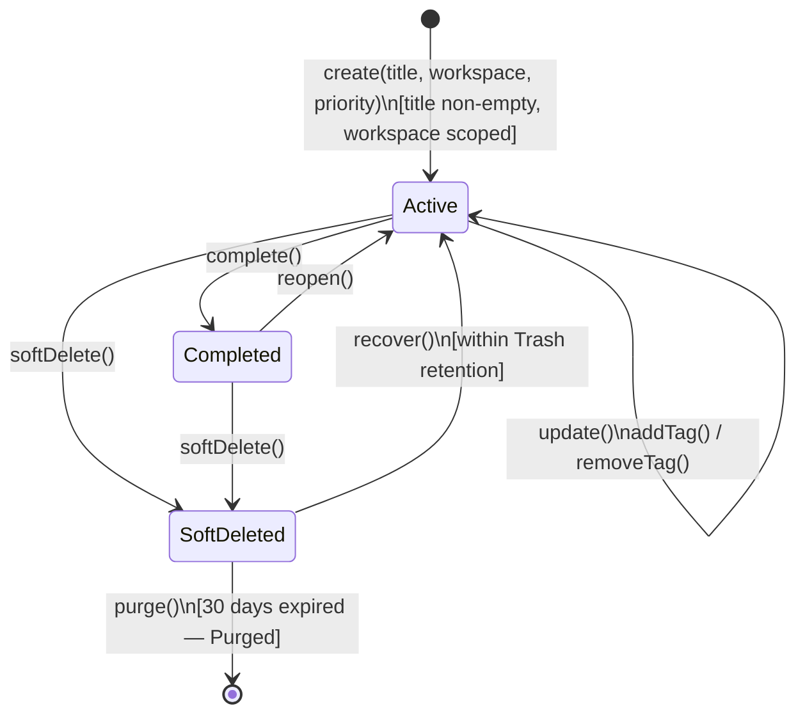
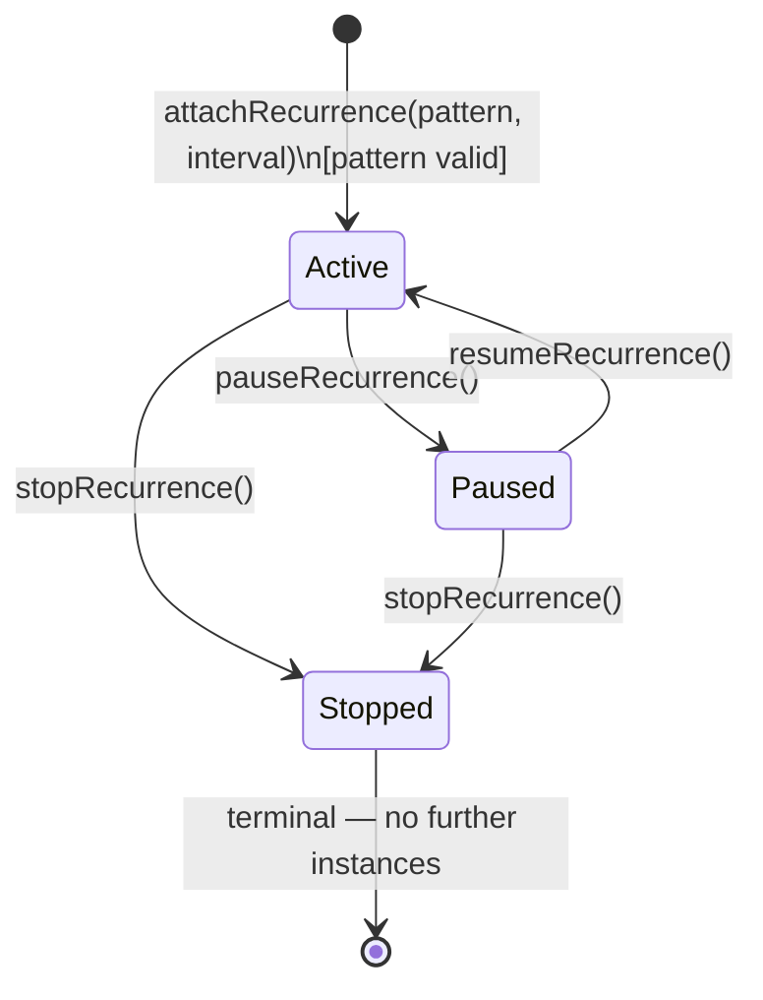

# Aggregate Lifecycle — Todo Bounded Context

---

## Task Aggregate

### State Transitions

| From | To | Operation | Guard / Condition |
| --- | --- | --- | --- |
| _(none)_ | **Active** | `create(title, workspace, priority, ...)` | Title non-empty; valid priority; workspace scoped |
| **Active** | **Completed** | `complete()` | Task is Active |
| **Completed** | **Active** | `reopen()` | Task is Completed |
| **Active** | **SoftDeleted** | `softDelete()` | Task is Active |
| **Completed** | **SoftDeleted** | `softDelete()` | Task is Completed |
| **SoftDeleted** | **Active** | `recover()` | Within Trash retention period |
| **SoftDeleted** | **Purged** | `purge()` (system/scheduler) | Retention expired (30 days) |
| **Active** | **Active** | `update(...)` | Task is Active |
| **Active** | **Active** | `addTag / removeTag / replaceTag` | Task is Active |

### Business Operations

| Operation | Pre-condition | Post-condition | Events Raised |
| --- | --- | --- | --- |
| `create(...)` | Valid title; valid priority; workspace present | Task Active; recurrence optional | `TaskCreated` |
| `update(fields)` | Status Active | Fields updated | `TaskUpdated` |
| `complete()` | Status Active | Status Completed | `TaskCompleted` |
| `reopen()` | Status Completed | Status Active | `TaskReopened` |
| `softDelete()` | Status Active or Completed | Status SoftDeleted; `SoftDeleteMetadata` set | `TaskSoftDeleted` |
| `recover()` | Status SoftDeleted | Status Active; metadata cleared | `TaskRecovered` |
| `purge()` | Status SoftDeleted; retention expired | Aggregate removed (terminal) | `TaskPurged` |
| `attachRecurrence(pattern, interval)` | Status Active; pattern valid | Recurrence attached, state Active | `RecurrenceStarted` |
| `pauseRecurrence()` | RecurrenceExecutionState Active | State Paused | `RecurrencePaused` |
| `resumeRecurrence()` | RecurrenceExecutionState Paused | State Active | `RecurrenceResumed` |
| `stopRecurrence()` | RecurrenceExecutionState Active or Paused | State Stopped (terminal) | `RecurrenceStopped` |

---

### Task Lifecycle State Diagram

---

### Recurrence State Diagram

Applies only to parent/template `Task` aggregates that have recurrence settings configured.

---

### RecurrenceInstance relationship

   Child task instances are independent `Task` aggregates linked to their parent via `ParentTaskId`. They follow the same Task lifecycle independently. Modifying, completing, or deleting an instance requires no lock on the parent.

---

### Lifecycle Notes

- **Purged** is a terminal state. The aggregate ceases to exist; no recovery is possible.
- **Stopped** recurrence is terminal for schedule generation; the parent task itself remains `Active`.
- Recovery eligibility is evaluated based on whether the task's soft-delete time is within the 30-day Trash retention period.
- **RecurrenceInstanceGenerationService** creates child instances in separate transactions to avoid locking the parent template.
