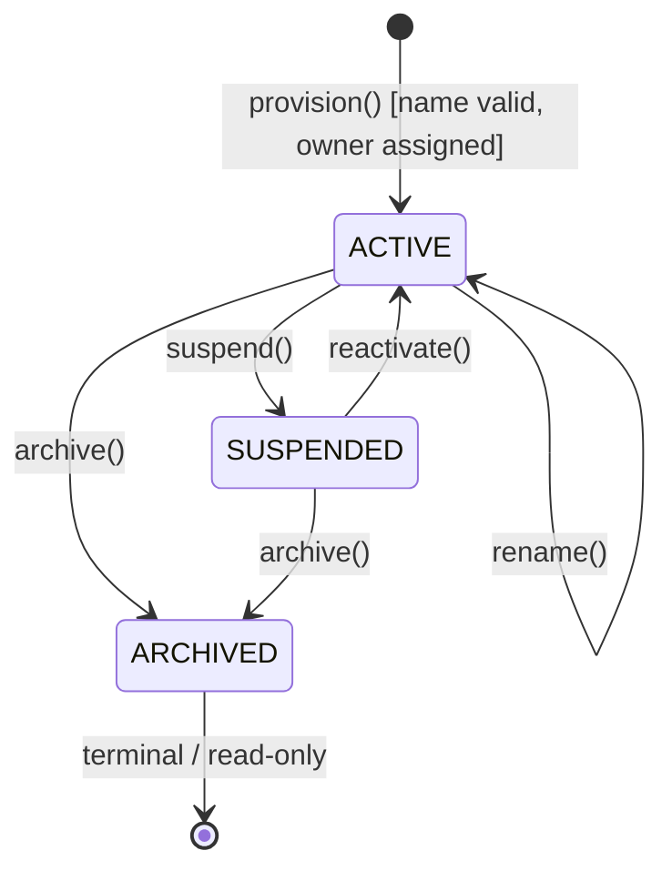

# Domain Model Specification — Workspace Bounded Context

## Document Metadata

- **Version**: 2.0.0
- **Status**: Approved / Ready for Application Modeling
- **Date**: August 2, 2026
- **Author**: Principal Domain-Driven Design Architect & Hexagonal Reviewer

---

## Section 1: Executive Summary & Bounded Context Scope

The **Workspace Bounded Context** is the foundational core of the multi-tenancy and data isolation architecture in the AI Executive Assistant application. It establishes logical security and administrative boundaries to guarantee that users operate strictly within their authorized datasets.

### Domain Responsibilities

- **Logical Data Isolation**: Establishing the boundaries for all user data (tasks, calendars, conversations, etc.).
- **Workspace Provisioning**: Exposing a port (`WorkspaceProvisioningPort`) to trigger workspace creation and default owner assignment.
- **Tenancy Validation**: Exposing an application inbound port (`TenantValidationPort`) to verify that the active execution thread is authorized to access the requested workspace (validating that the user is the owner of the workspace). This port acts as the Open Host Service (OHS) for all other contexts.

### Out of Scope / Boundaries

- **User Authentication**: Handled by the `Auth` Bounded Context (validating credentials, generating JWT claims).
- **Productivity Data Storage**: Actual tasks, calendar events, memories, or notifications are stored in their respective bounded contexts (`Todo`, `Calendar`, `Memory`, `Notification`), referencing the `WorkspaceId` only as an immutable soft reference.

---

## Section 2: Ubiquitous Language

Standardized business terms used within the Workspace Bounded Context:

| Term                  | Synonyms                          | Definition & Context-Specific Meaning                                                                                                                                             |
| :-------------------- | :-------------------------------- | :-------------------------------------------------------------------------------------------------------------------------------------------------------------------------------- |
| **Workspace**         | Tenant Space, Tenant              | The fundamental security and data isolation boundary. Every user-created resource belongs strictly to one Workspace. Data cannot cross this boundary under any circumstance.      |
| **Workspace Tenancy** | Multi-Tenancy                     | The structural pattern of isolating data and operations on a per-workspace basis. Re-validated at every Port entry point to guarantee isolation.                                  |
| **Primary Workspace** | Default Workspace                 | The default workspace allocated automatically to a user during account registration.                                                                                              |
| **Tenant Context**    | Tenancy Context, Security Context | The thread-local security context that propagates the active `WorkspaceId` throughout execution, captured from JWT session claims at the gateway.                                 |
| **Provisioning**      | Workspace Creation, Setup         | The automatic system task that initializes and configures a workspace immediately during user registration.                                                                       |
| **Workspace Status**  | —                                 | The operational state of the workspace. Valid values: **ACTIVE** (unrestricted), **SUSPENDED** (read-only for administration), **ARCHIVED** (permanent read-only terminal state). |

---

## Section 3: Aggregate Discovery

The domain models tenancy structure via a single primary Aggregate Root: the **Workspace** aggregate.

```
+------------------------------------------------+
|               Workspace [AR]                   |
|  - WorkspaceId                                 |
|  - WorkspaceName                               |
|  - WorkspaceStatus                             |
|  - PrimaryWorkspaceMarker (isPrimary)          |
|  - UserId (ownerId)                            |
+------------------------------------------------+
```

### Workspace Aggregate Boundary

- **Aggregate Root**: `Workspace`
- **Consistency Boundary**: A single `Workspace` and its owning `UserId`.
- **Transaction Boundary**: Scoped strictly to a single `WorkspaceId`.
- **Cross-Context Relationships**: Handled via **Soft References** (ID-based only). Other domains (e.g. `Todo`, `Calendar`) use `WorkspaceId` as an immutable foreign key reference to filter and isolate their data. They read `WorkspaceId` from the active security context but never import the `Workspace` aggregate.

---

## Section 4: Aggregate Structure & Entities

### Aggregate Root: Workspace

The root security and data isolation boundary.

#### Fields

- `id` (WorkspaceId): System-wide unique identifier.
- `name` (WorkspaceName): Human-readable name.
- `status` (WorkspaceStatus): ACTIVE, SUSPENDED, or ARCHIVED.
- `primary` (PrimaryWorkspaceMarker): Boolean flag indicating if this is the user's primary workspace.
- `ownerId` (UserId): Soft reference referencing the owner of this workspace.

#### Lifecycle States

- **ACTIVE**: Tenancy is valid, and data operations are authorized.
- **SUSPENDED**: Access is restricted per policy. Workspace remains intact, but mutations from normal execution paths are blocked.
- **ARCHIVED**: Terminal read-only state. No mutations of the aggregate or related resources are allowed.

#### Public Behaviors (with Invariant Guards)

- `rename(WorkspaceName newName)`
  - **Behavior**: Updates the workspace name.
  - **Guards**: Enforces that the workspace status is `ACTIVE`. Throws `InvalidWorkspaceStateException` if suspended or archived.
- `suspend()`
  - **Behavior**: Suspends the workspace, blocking data mutations.
  - **Guards**: Enforces that the workspace is currently `ACTIVE`. Throws `InvalidWorkspaceStateException` if already suspended or archived.
- `reactivate()`
  - **Behavior**: Restores a suspended workspace back to the active state.
  - **Guards**: Enforces that the workspace is currently `SUSPENDED`. Throws `InvalidWorkspaceStateException` if already active or archived.
- `archive()`
  - **Behavior**: Permanently archives the workspace (terminal transition).
  - **Guards**: Enforces that the workspace is currently `ACTIVE` or `SUSPENDED`. Throws `InvalidWorkspaceStateException` if already archived.

---

## Section 5: Value Object Catalog

### 1. WorkspaceId

- **Description**: Opaque unique identifier representing the Workspace.
- **Representation**: String wrapping a UUID v4.
- **Immutability**: Immutable.
- **Validation**: Must not be null; must conform to valid UUID v4 format.

### 2. UserId

- **Description**: Soft reference identifier referencing Auth `UserIdentity`.
- **Representation**: String wrapping a UUID v4.
- **Immutability**: Immutable.
- **Validation**: Must not be null; must conform to valid UUID v4 format. Verified at the application boundary during provisioning.

### 3. WorkspaceName

- **Description**: Human-readable workspace name.
- **Representation**: String.
- **Immutability**: Replace-on-change.
- **Validation**: Must be non-empty after trimming, between 3 and 100 characters in length, and free of HTML tags or script injection sequences.

### 4. WorkspaceStatus

- **Description**: Operational status of the Workspace.
- **Representation**: Enum (`ACTIVE`, `SUSPENDED`, `ARCHIVED`).
- **Immutability**: Replace-on-change via Aggregate Root state transitions.
- **Validation**: Enforces legal state transitions (`ACTIVE` ↔ `SUSPENDED`, `ACTIVE/SUSPENDED` → `ARCHIVED`).

### 5. TenantContext

- **Description**: Thread-local / request-scoped value object representing the active execution credentials.
- **Representation**: Structured object wrapping `WorkspaceId` and `UserId`.
- **Immutability**: Immutable per request execution.
- **Validation**: Evaluated by `TenantValidationPort` to ensure it maps to an active, valid tenancy.

### 6. PrimaryWorkspaceMarker

- **Description**: Value indicating whether this is the default workspace for the user.
- **Representation**: Boolean.
- **Immutability**: Immutable.

---

## Section 6: Domain Services, Factories & Application Services

To align with Hexagonal Architecture and ensure that domain business logic remains decoupled from orchestration, persistence, and external events, services are partitioned by layer:

### Domain Core Layer

#### WorkspaceFactory

- **Purpose**: Generates a valid `Workspace` aggregate upon user creation.
- **Responsibilities**:
  - Instantiates `Workspace` with a generated `WorkspaceId`, default name, `PrimaryWorkspaceMarker(true)`, `WorkspaceStatus.ACTIVE`, and `ownerId` set to the registering user's ID.
  - Enforces aggregate constraints to ensure the initial aggregate is valid.

---

### Application Layer

#### WorkspaceApplicationService

- **Purpose**: Orchestrates workspace use cases. Implements the inbound `WorkspaceProvisioningPort`.
- **Responsibilities**:
  - Consumes or intercepts the `UserRegistered` event.
  - Invokes `WorkspaceFactory` to build the default workspace.
  - Saves the new aggregate via `WorkspaceRepository` (outbound port) within a transactional boundary.
  - Dispatches the `WorkspaceProvisioningPort` event.

#### TenantAccessValidationService

- **Purpose**: Implements the inbound `TenantValidationPort` to evaluate if a transaction carrying a `TenantContext` is permitted.
- **Why It is Needed**: Callers in other contexts require a lightweight, high-performance seam to check access rights without loading full aggregate root graphs.
- **Responsibilities**:
  - Checks if the target workspace exists and is `ACTIVE` (or `SUSPENDED` if the request is a read-only administrative query).
  - Verifies that the invoking `UserId` matches the workspace `ownerId`.
  - Delegates to `WorkspaceRepository.isWorkspaceOwner()` for fast-path validation.

---

## Section 7: Repositories & Ports

In Hexagonal Architecture, all database operations and integrations across module boundaries must occur through Ports.

```
       [ Presentation ] / [ Other Bounded Contexts ]
                             │
                             ▼ (Inbound Port Calls)
                 ┌───────────────────────┐
                 │ TenantValidationPort  │
                 │ ProvisioningPort      │
                 └───────────┬───────────┘
                             │
                             ▼
                 ┌───────────────────────┐
                 │   Workspace Core      │
                 │   Aggregate / Factory │
                 └───────────┬───────────┘
                             │
                             ▼ (Outbound Port Calls)
                 ┌───────────────────────┐
                 │  WorkspaceRepository  │
                 └───────────────────────┘
                             │
                             ▼
                    [ Infrastructure ]
```

### Inbound Ports (Driving APIs)

- `WorkspaceProvisioningPort`: Invoked during registration to set up the default tenant workspace.
- `TenantValidationPort`: Invoked by cross-cutting concerns and other contexts to validate tenancy execution.

### Outbound Ports (Driven SPIs)

- `WorkspaceRepository`: Persistence boundary for the Workspace aggregate.

#### Key Methods (Java-safe Signatures)

- `Optional<Workspace> findById(WorkspaceId workspaceId)`: Loads the workspace aggregate.
- `Optional<Workspace> findPrimaryWorkspaceByUserId(UserId userId)`: Finds the user's primary workspace (used during user login or bootstrap).
- `void save(Workspace workspace)`: Atomically persists the aggregate state.
- `boolean isWorkspaceOwner(WorkspaceId workspaceId, UserId userId)`: Evaluates ownership directly for fast validation.

---

## Section 8: Domain Events

All domain events represent notable business occurrences. They are raised inside the `Workspace` Aggregate Root during state changes and collected in-memory. Once the database transaction is successfully committed, the application service publishes these events to the in-process event bus using `AFTER_COMMIT` transactional semantics.

| Event                    | Trigger                                             | Payload                                                                                               | Key Consumers                                     |
| :----------------------- | :-------------------------------------------------- | :---------------------------------------------------------------------------------------------------- | :------------------------------------------------ |
| **WorkspaceProvisioned** | Workspace created with initial owner assignment.    | `workspaceId` (WorkspaceId), `ownerId` (UserId), `primaryWorkspace` (boolean), `occurredAt` (Instant) | `Memory` (bootstrap preferences), `Notification`  |
| **WorkspaceRenamed**     | Workspace name updated.                             | `workspaceId` (WorkspaceId), `newName` (WorkspaceName), `occurredAt` (Instant)                        | Audit log, UI read model                          |
| **WorkspaceSuspended**   | Workspace status transitioned `ACTIVE → SUSPENDED`. | `workspaceId` (WorkspaceId), `occurredAt` (Instant)                                                   | `Todo`, `Calendar`, `AI Agent` (block writes)     |
| **WorkspaceReactivated** | Workspace status transitioned `SUSPENDED → ACTIVE`. | `workspaceId` (WorkspaceId), `occurredAt` (Instant)                                                   | All restricted contexts                           |
| **WorkspaceArchived**    | Workspace status transitioned to `ARCHIVED`.        | `workspaceId` (WorkspaceId), `occurredAt` (Instant)                                                   | All contexts (block writes, clean up active runs) |

---

## Section 9: Business Invariants & Validation Rules

### INV-WS-01 — Mandatory Primary Workspace

- **Rule**: Every registered user must have exactly one primary workspace allocated at registration.
- **Enforcement**: Orchestrated during registration. A transaction fail-safe ensures registration is aborted if workspace provisioning fails.
- **Exception**: `WorkspaceProvisioningException` thrown if provisioning fails.

### INV-WS-04 — Valid Workspace Name

- **Rule**: The workspace name must be non-empty after trimming and conform to length and character constraints.
- **Enforcement**: Validated on the `WorkspaceName` Value Object constructor (length between 3 and 100 characters, no HTML tags, no script injections).
- **Exception**: `InvalidWorkspaceNameException` thrown on validation failure.

### INV-WS-05 — Access Isolation Constraint

- **Rule**: No operation on data within a workspace may proceed unless the invoking user owns that workspace.
- **Enforcement**: Enforced globally across all contexts via interceptors querying `TenantValidationPort`.
- **Exception**: `TenantAccessDeniedException` thrown on validation failure.

### INV-WS-06 — WorkspaceId Immutability

- **Rule**: `WorkspaceId` is immutable after workspace provisioning.
- **Enforcement**: Enforced by declaring the field final and omitting mutator methods.

### INV-WS-07 — Archived Workspace is Read-Only

- **Rule**: An Archived workspace must block all write operations.
- **Enforcement**: Verified via `WorkspaceStatus != ARCHIVED` checks in the aggregate root and validation port.
- **Exception**: `InvalidWorkspaceStateException` thrown if writes are attempted.

### INV-WS-08 — Suspended Workspace Blocks Data Mutations

- **Rule**: A Suspended workspace must block all data writes, while still permitting read access for administrative review.
- **Enforcement**: Checked dynamically via `TenantValidationPort` at the API / Port level.
- **Exception**: `TenantAccessDeniedException` thrown on write mutations in suspended status.

---

## Section 10: Lifecycle & State Transitions

### Workspace Lifecycle Walkthrough

1. **Creation**: The workspace is initialized via the `WorkspaceFactory` inside the `WorkspaceApplicationService` (implementing `WorkspaceProvisioningPort`) in an `ACTIVE` state with a default name and the registering user set as the owner.
2. **Operations**: While `ACTIVE`, metadata can be renamed. Other contexts route mutations through the gateway, where authorization checks against the workspace owner are enforced.
3. **Suspension**: If policy violations occur, an administrator transitions the status to `SUSPENDED`, blocking further data mutations. Access can be restored back to `ACTIVE`.
4. **Archival**: When closed, the workspace is permanently archived. This is a terminal state; it cannot be reactivated or mutated.

### Workspace State Diagram


