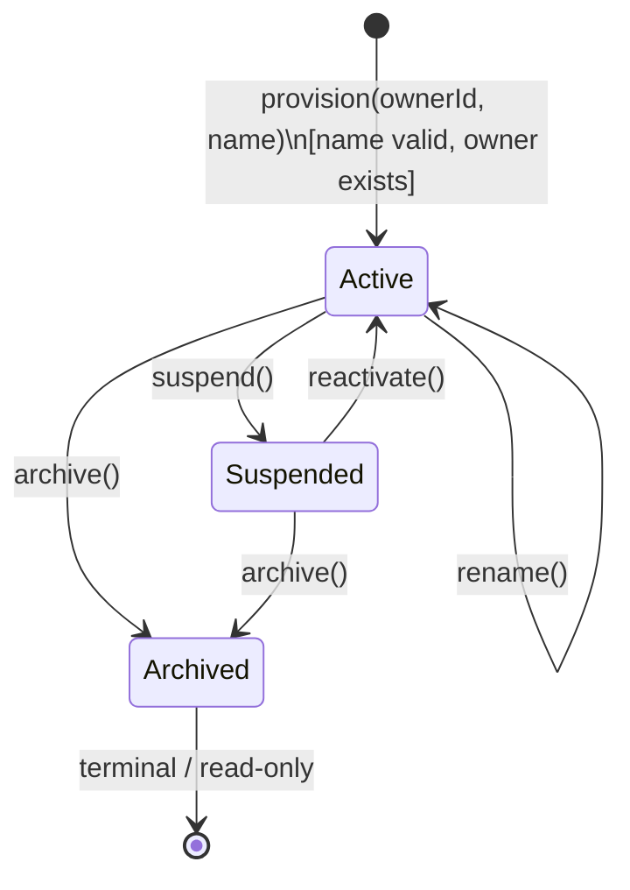

# Aggregate Lifecycle — Workspace Bounded Context

---

## Workspace Aggregate

### State Transitions

| From | To | Operation | Guard / Condition |
| --- | --- | --- | --- |
| _(none)_ | **Active** | `provision(ownerId, name)` | Name non-empty; ownerId valid; primary workspace not yet assigned for user (MVP) |
| **Active** | **Suspended** | `suspend()` | Admin operation |
| **Suspended** | **Active** | `reactivate()` | Admin operation |
| **Active** | **Archived** | `archive()` | No active data loss rules violated |
| **Suspended** | **Archived** | `archive()` | Admin may archive a suspended workspace |
| **Active** | **Active** | `rename(name)` | New name non-empty |

### Business Operations

| Operation | Pre-condition | Post-condition | Events Raised |
| --- | --- | --- | --- |
| `provision(ownerId, name)` | Name valid; owner exists | Workspace Active; owner assigned | `WorkspaceProvisioned` |
| `rename(name)` | Status Active; name non-empty | `WorkspaceName` updated | `WorkspaceRenamed` |
| `suspend()` | Status Active | Status Suspended | `WorkspaceSuspended` |
| `reactivate()` | Status Suspended | Status Active | `WorkspaceReactivated` |
| `archive()` | Status Active or Suspended | Status Archived (terminal) | `WorkspaceArchived` |
| `validateTenant(userId)` | Any | Returns true/false (no state change) | _(none)_ |

---

### Workspace State Diagram

---

### Lifecycle Notes

- **Archived** is effectively terminal. No further renames are permitted. Other contexts must stop accepting write operations scoped to this `WorkspaceId`.
- **Suspended** is a recoverable state; the workspace and all its data remain intact. Access is simply blocked via the `TenantValidationPort`.
- `validateTenant(userId)` is a pure query — it does not transition state and does not emit events. It is exposed via the `TenantValidationPort` consumed by other bounded contexts.
- `WorkspaceId` is shared-kernel and immutable for the workspace lifetime; it can never be changed after provisioning.
