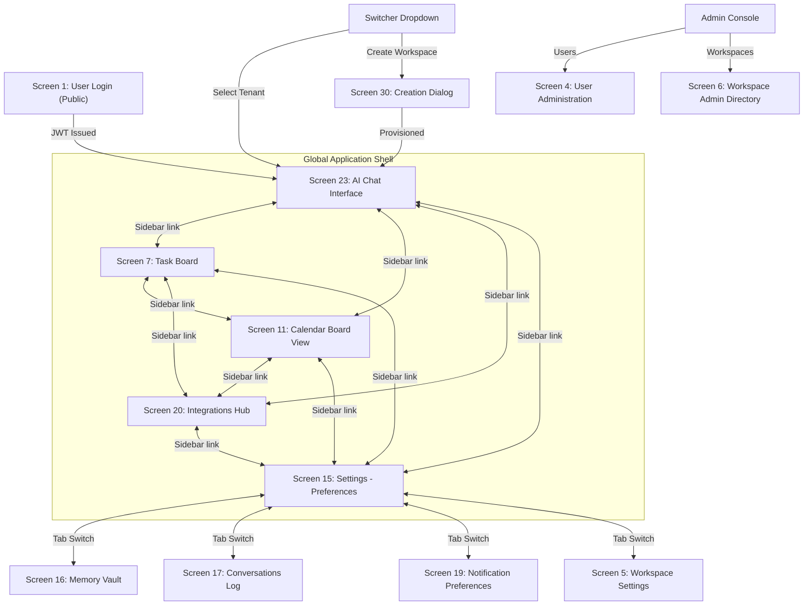
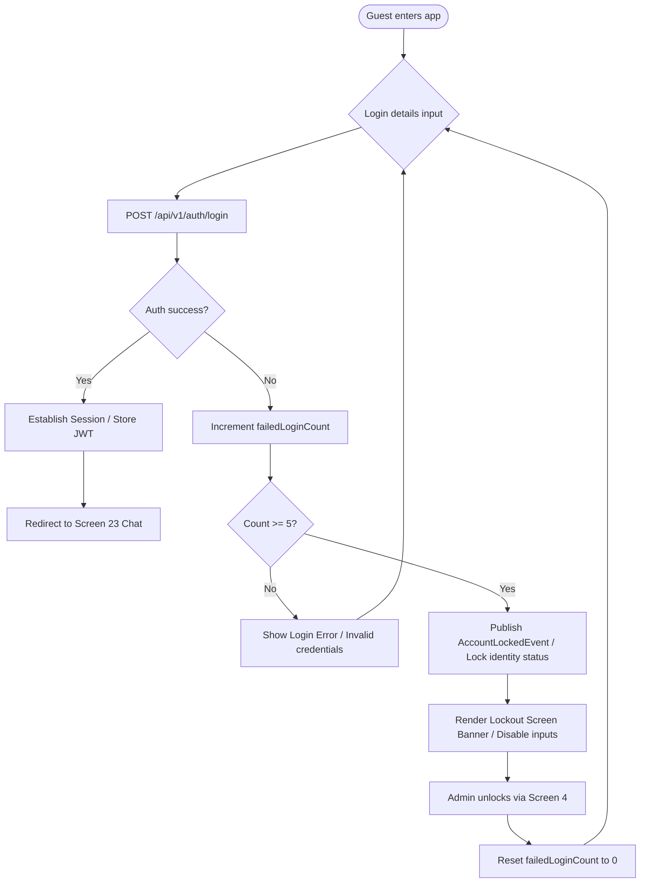
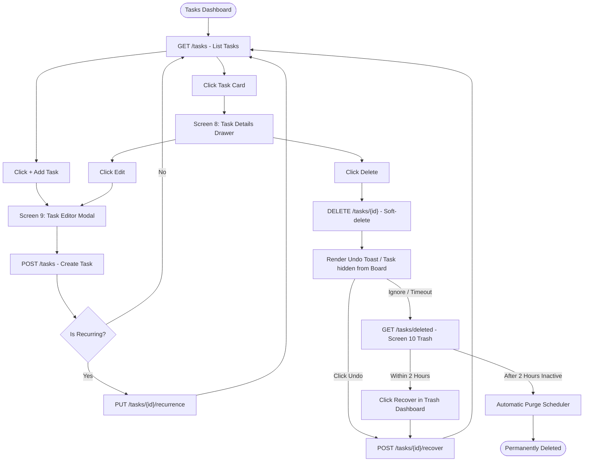
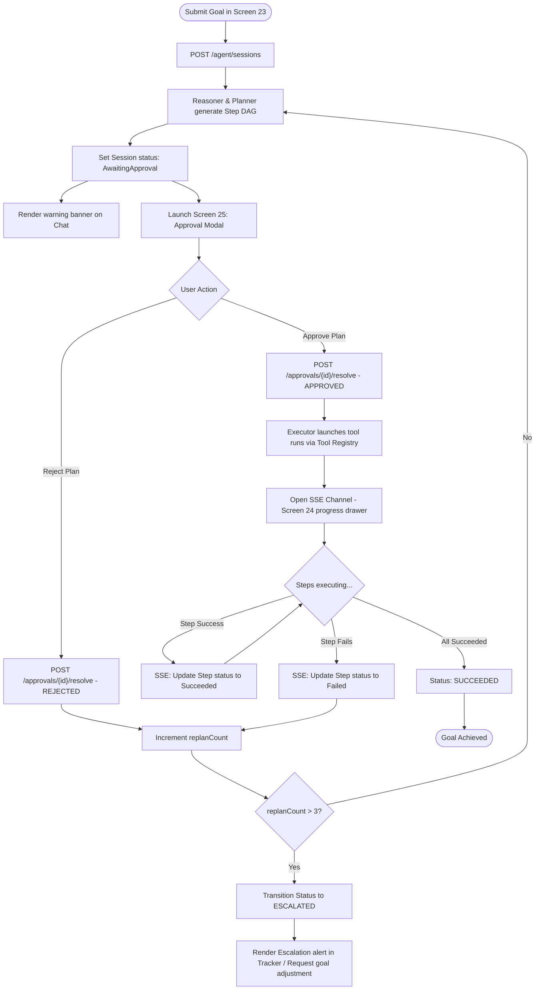
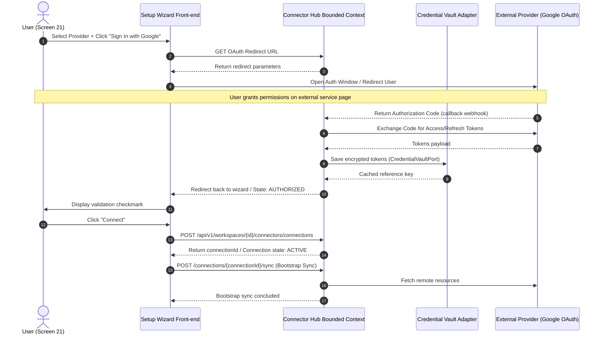

# AI Executive Assistant — Canonical UI Flow & Navigation Guide

- **Document Version**: 2.0.0
- **Status**: Approved / Canonical UI Flow Reference
- **Date**: August 2, 2026
- **Author**: Principal Product Designer & UX Architect
- **References**:
  - `docs/requirements/user-stories-v2.md`
  - `docs/architecture/architecture-v2.md`
  - `docs/context-mapping/context-map.md`
  - `docs/api-design/api-overview.md`
  - `docs/wireframe/`

---

## 1. Executive Summary

The **AI Executive Assistant** represents a new paradigm in professional productivity: an autonomous, proactive assistant operating inside a security-bounded Workspace. The user interface balances two distinct interaction paradigms:

1. **Conversational Stream (AI Agent Chat)**: A natural language interface where users submit high-level goals ("Decompile the repo and create tasks for tomorrow") or ask grounded QA questions. The agent decomposes goals into sequential plans, registers them in a workflow tracker, triggers human-in-the-loop approvals, and executes tasks.
2. **Structured Productivity Boards (Tasks and Calendar)**: Classic, highly structured boards (Task Board list, chronological Weekly/Monthly calendar grid) that allow users to inspect their schedules, triage workloads, and resolve conflicts.

To keep the user in control, the system features a **Human-in-the-Loop Gate** (Plan Approval modal) for high-impact actions and a **Plan Execution Tracker** drawer that stream real-time updates via Server-Sent Events (SSE). Integrations with external SaaS (Google Calendar, Outlook, Slack, GitHub, Jira) are centralized in the **Integrations Hub** and synchronized behind an anti-corruption adapter layer, complete with a side-by-side **Sync Conflict Resolution Dashboard**.

This document serves as the canonical source of truth for the system's screen catalog, global navigation routes, user journeys, and API-to-screen alignments.

---

## 2. Global Navigation & Application Shell

All authenticated screens reside within the **Global Application Shell**. The shell provides workspace containment, navigation triggers, and real-time state communication.

```
+---------------------------------------------------------------------------------+
| Workspace Switcher [Jane's Workspace v] | Header: AI Chat Assistant  [Q] [L] [P|] [Bell] |
|----------------------------------------+----------------------------------------|
| Nav Sidebar:                           |                                        |
| - [Chat] (Active)                      |                                        |
| - [Tasks]                              |               MAIN CONTENT             |
| - [Calendar]                           |                   AREA                 |
| - [Integrations]                       |                                        |
| - [Settings]                           |                                        |
|----------------------------------------|                                        |
| Profile: Jane Doe [Logout]             |                                        |
+---------------------------------------------------------------------------------+
```

### 2.1 Navigation Elements

#### 2.1.1 Sidebar Navigation Menu

- **Navigation Options**:
  - `Chat`: Navigates to **AI Chat Assistant Interface** (default landing dashboard).
  - `Tasks`: Navigates to **Task Board / List Dashboard**.
  - `Calendar`: Navigates to **Calendar Board View**.
  - `Integrations`: Navigates to **Connector Integrations Hub**.
  - `Settings`: Navigates to the **Settings Hub** (defaulting to the Preferences tab). The Settings Hub contains the sub-tabs: **Preferences** (Screen 15), **Memory Vault** (Screen 16), **Conversations** (Screen 17), **Notification Settings** (Screen 19), and **Workspace Settings** (Screen 5).
  - `Admin Console` (visible only to users holding the `SYSTEM_OPERATOR` global role): Contains **Users** (Screen 4 — User Administration Dashboard) and **Workspaces** (Screen 6 — Platform Workspace Admin Directory).
- **Profile Context Card**: Rendered at the bottom of the sidebar. Displays the active user name and avatar. Clicking the card reveals a popover containing:
  - `Change Password`: Navigates to the **Change Password Screen**.
  - `Logout`: Triggers the logout sequence, invalidates the active JWT session, and redirects to the **User Login Screen**.

#### 2.1.2 Workspace Switcher

- Located at the top of the sidebar.
- Displays the active workspace name.
- Clicking the switcher opens a dropdown displaying:
  - All workspaces owned by the user.
  - Workspace status indicators (`ACTIVE`, `SUSPENDED`).
  - Action button: `Create Workspace` (opens creation dialog).
- **Behavior**: Selecting a workspace immediately re-binds the tenant context, pushes the new `workspaceId` into the URL path context, clears the conversation state, and loads the new workspace's default dashboards.

#### 2.1.3 Global Header Bar

- Located at the top of the main content area. Exposes the following global controls:
  - **Page Title**: Reflects the current dashboard state.
  - **Pending Approvals Queue Icon `[Q]`**: Displays a red badge containing the number of outstanding approval requests. Clicking it opens the **Pending Approvals Queue Dashboard**.
  - **Session History Icon `[L]`**: A clock icon. Clicking it opens the **Session History Directory**.
  - **Active Session Tracker Toggle `[P|]`**: A progress icon. Visually highlights if a session is currently executing in the background. Clicking it toggles the **Plan Execution Tracker drawer** on the right side of the screen.
  - **Notification Bell `[Bell]`**: Shows a badge with the count of unread notifications. Clicking it opens the **In-App Notification Inbox Center** dropdown panel.

---

## 3. Screen Catalog

The application features **30 numbered screens** (28 core screens plus 2 cross-context popup/dialog overlays: Citation Source Snippet Popup and Workspace Creation Dialog) across 8 bounded contexts.

### 3.1 Authentication & IAM Context (Auth)

#### Screen 1: User Login Screen (Public)

- **Purpose**: Authenticate guest users, handle failed lockouts, and establish sessions.
- **Owner Context**: `IAM (Auth)`.
- **Primary Actions**:
  - Email & Password input.
  - Click "Sign In".
  - Click "Create an Account" (Redirects to Registration).
- **APIs Used**: `POST /api/v1/auth/login`.
- **Use Cases**: `UC-AUTH-002: Authenticate User & Generate Token`.

#### Screen 2: User Registration Screen (Public)

- **Purpose**: Allow new users to create credentials and provision default workspaces.
- **Owner Context**: `IAM (Auth)` / `Workspace`.
- **Primary Actions**:
  - Email & Password input.
  - Interactive password requirements checklist (8+ chars, uppercase, lowercase, numeric, symbol).
  - Click "Register".
  - Click "Back to Sign In".
- **APIs Used**: `POST /api/v1/auth/register`.
- **Use Cases**: `UC-AUTH-001: Register New User` (automatically invokes workspace provisioning).

#### Screen 3: Change Password Screen (Self-Service)

- **Purpose**: Allow logged-in users to update their credentials.
- **Owner Context**: `IAM (Auth)`.
- **Primary Actions**:
  - Current Password, New Password, and Confirm Password inputs.
  - Click "Save Changes".
  - Click "Cancel".
- **APIs Used**: `PUT /api/v1/auth/password`.
- **Use Cases**: `UC-AUTH-003: Change Password`.

#### Screen 4: User Administration Dashboard (System Operator Console)

- **Purpose**: Admin dashboard for platform-level operators to audit identities and resolve lockouts.
- **Owner Context**: `IAM (Auth)`.
- **Primary Actions**:
  - Search users by email.
  - Paginated audit list of user statuses (Active, Locked, Suspended).
  - Click "Unlock Account".
  - Click "Suspend Account" / "Reactivate Account".
  - Click "Add Role" / "Remove Role".
- **APIs Used**:
  - `GET /api/v1/admin/users`
  - `GET /api/v1/admin/users/{userId}`
  - `POST /api/v1/admin/users/{userId}/suspend`
  - `POST /api/v1/admin/users/{userId}/reactivate`
  - `POST /api/v1/admin/users/{userId}/unlock`
  - `POST /api/v1/admin/users/{userId}/roles`
  - `DELETE /api/v1/admin/users/{userId}/roles/{role}`
- **Use Cases**: `UC-AUTH-004: Unlock Account`, `UC-AUTH-006: Suspend Account`, `UC-AUTH-007: Reactivate Account`, `UC-AUTH-008: Assign/Revoke Global Role`, `UC-AUTH-009: Load Identity for Administration`.

---

### 3.2 Workspace Tenancy Context

#### Screen 5: Workspace Settings Panel (User Self-Service)

- **Purpose**: Let workspace owners review tenant identifiers and rename their workspaces.
- **Owner Context**: `Workspace Tenancy`.
- **Primary Actions**:
  - Read-only Workspace ID & Owner ID display.
  - Workspace Name input.
  - Click "Save Changes".
- **APIs Used**:
  - `GET /api/v1/workspaces/{workspaceId}`
  - `PATCH /api/v1/workspaces/{workspaceId}`
- **Use Cases**: `UC-WS-003: Rename Workspace`, `GetWorkspaceDetailsQuery`.

#### Screen 6: Platform Workspace Admin Directory (System Operator Console)

- **Purpose**: Platform administration panel to suspend, reactivate, or archive client workspaces.
- **Owner Context**: `Workspace Tenancy`.
- **Primary Actions**:
  - View directory table of workspaces.
  - Selected workspace details audit drawer.
  - Click "Suspend Workspace".
  - Click "Reactivate Workspace".
  - Click "Archive Workspace" (triggers irreversible warning modal).
- **APIs Used**:
  - `POST /api/v1/workspaces/{workspaceId}/suspend`
  - `POST /api/v1/workspaces/{workspaceId}/reactivate`
  - `POST /api/v1/workspaces/{workspaceId}/archive`
- **Use Cases**: `UC-WS-004: Suspend Workspace`, `UC-WS-005: Reactivate Workspace`, `UC-WS-006: Archive Workspace`.

---

### 3.3 Task Management Context (Todo)

#### Screen 7: Task Board / List Dashboard

- **Purpose**: View, filter, and quick-complete active workspace tasks.
- **Owner Context**: `Task Management (Todo)`.
- **Primary Actions**:
  - Search tasks input.
  - Filter by Tag dropdown / Filter by Priority dropdown.
  - Toggle "Include Completed" tasks.
  - Sort by Priority/Due Date/Created Date.
  - Click task card (opens Screen 8 details drawer).
  - Quick-complete checkbox toggle.
  - Click "Add Task" (opens Screen 9 modal).
  - Click "View Trash Bin" (opens Screen 10).
- **APIs Used**:
  - `GET /api/v1/workspaces/{workspaceId}/tasks`
  - `POST /api/v1/workspaces/{workspaceId}/tasks/{taskId}/complete`
  - `POST /api/v1/workspaces/{workspaceId}/tasks/{taskId}/reopen`
- **Use Cases**: `UC-TODO-011: List / Filter Tasks`, `UC-TODO-005: Complete Task`, `UC-TODO-010: Reopen Completed Task`.

#### Screen 8: Task Details Drawer

- **Purpose**: Inspector drawer sliding in from the right containing deep metadata and action controls.
- **Owner Context**: `Task Management (Todo)`.
- **Primary Actions**:
  - Visual details display (description, status, priority, due date).
  - Remove tag (clicking "x" on tag chip).
  - Recurrence rules toggles: "Pause Recurrence", "Resume Recurrence", "Stop Recurrence".
  - Click "Edit Task" (opens Screen 9 modal).
  - Click "Delete Task" (triggers soft-deletion).
- **APIs Used**:
  - `GET /api/v1/workspaces/{workspaceId}/tasks/{taskId}`
  - `DELETE /api/v1/workspaces/{workspaceId}/tasks/{taskId}/tags/{tag}`
  - `POST /api/v1/workspaces/{workspaceId}/tasks/{taskId}/recurrence/pause`
  - `POST /api/v1/workspaces/{workspaceId}/tasks/{taskId}/recurrence/resume`
  - `POST /api/v1/workspaces/{workspaceId}/tasks/{taskId}/recurrence/stop`
  - `DELETE /api/v1/workspaces/{workspaceId}/tasks/{taskId}`
- **Use Cases**: `GetTaskQuery`, `UC-TODO-003: Soft-Delete Task`, `UC-TODO-008: Manage Task Tags` (remove step), `UC-TODO-009: Pause / Resume / Stop Recurrence`.

#### Screen 9: Task Editor Modal

- **Purpose**: Pop-up overlay form for creating new tasks or editing existing attributes.
- **Owner Context**: `Task Management (Todo)`.
- **Primary Actions**:
  - Inputs: Title (required), Description, Priority (dropdown), Due Date (picker), Tags (comma-separated).
  - Recurrence subform: Toggle "Repeats...", Frequency (Daily, Weekly, Monthly), custom RFC 5545 RRule string.
  - Click "Save Task".
  - Click "Cancel".
- **APIs Used**:
  - `POST /api/v1/workspaces/{workspaceId}/tasks` (Create)
  - `PUT /api/v1/workspaces/{workspaceId}/tasks/{taskId}` (Update)
  - `PUT /api/v1/workspaces/{workspaceId}/tasks/{taskId}/recurrence` (Set RRule)
  - `POST /api/v1/workspaces/{workspaceId}/tasks/{taskId}/tags` (Add Tags)
- **Use Cases**: `UC-TODO-001: Create Task`, `UC-TODO-002: Update Task`, `ConfigureRecurrenceCommand`, `UC-TODO-008: Manage Task Tags` (add step).

#### Screen 10: Trash Recovery Dashboard

- **Purpose**: List soft-deleted tasks currently within the 2-hour retention window.
- **Owner Context**: `Task Management (Todo)`.
- **Primary Actions**:
  - View table of soft-deleted items with deleted timestamps and purge countdowns.
  - Click "Recover" button on task row.
- **APIs Used**:
  - `GET /api/v1/workspaces/{workspaceId}/tasks/deleted`
  - `POST /api/v1/workspaces/{workspaceId}/tasks/{taskId}/recover`
- **Use Cases**: `UC-TODO-004: Recover Soft-Deleted Task`, `ListDeletedTasksQuery`.

---

### 3.4 Schedule Management Context (Calendar)

#### Screen 11: Calendar Board View

- **Purpose**: Chronological grid view displaying scheduled time commitments and highlighting conflicts.
- **Owner Context**: `Schedule Management (Calendar)`.
- **Primary Actions**:
  - Chronological Grid navigator: Navigate Prev/Next range (Day, Week, Month), click "Today".
  - Grid cell selection: Clicking empty slot launches Screen 13 modal pre-filled with start/end time.
  - Click event block: Opens Screen 12 drawer.
  - Conflict tags display (visual flag on overlapping events).
- **APIs Used**: `GET /api/v1/workspaces/{workspaceId}/calendar/events`.
- **Use Cases**: `ListEventsQuery`.

#### Screen 12: Event Details Drawer

- **Purpose**: Inspect scheduling metadata and manage event-specific reminder offsets.
- **Owner Context**: `Schedule Management (Calendar)`.
- **Primary Actions**:
  - View event title, description, and times.
  - Click "Add Reminder Offset" (sets lead time in minutes).
  - Click "x" on reminder offset (removes reminder).
  - Click "Reschedule Event" (reveals inline time-picker inputs).
  - Click "Delete Event" (triggers soft-deletion).
- **APIs Used**:
  - `GET /api/v1/workspaces/{workspaceId}/calendar/events/{eventId}`
  - `POST /api/v1/workspaces/{workspaceId}/calendar/events/{eventId}/reminders`
  - `DELETE /api/v1/workspaces/{workspaceId}/calendar/events/{eventId}/reminders/{reminderId}`
  - `DELETE /api/v1/workspaces/{workspaceId}/calendar/events/{eventId}`
- **Use Cases**: `GetEventQuery`, `UC-CAL-003: Delete Event`, `UC-CAL-007: Add/Remove Reminder`.

#### Screen 13: Event Editor Modal

- **Purpose**: Center modal dialog to create, update, or reschedule scheduled meetings.
- **Owner Context**: `Schedule Management (Calendar)`.
- **Primary Actions**:
  - Inputs: Title (required), Description, Start Date/Time (picker), End Date/Time (picker), Reminders checkboxes.
  - Click "Save Event".
  - Click "Cancel".
- **APIs Used**:
  - `POST /api/v1/workspaces/{workspaceId}/calendar/events`
  - `POST /api/v1/workspaces/{workspaceId}/calendar/events/{eventId}/reschedule`
  - `PATCH /api/v1/workspaces/{workspaceId}/calendar/events/{eventId}`
- **Use Cases**: `UC-CAL-001: Create Calendar Event`, `UC-CAL-002: Reschedule Event`, `UC-CAL-006: Update Event Metadata`.

#### Screen 14: Active Reminder Toast Alert (Global Popup)

- **Purpose**: Global, real-time toast overlay that pops up across any active screen when a scheduled reminder fires.
- **Owner Context**: `Schedule Management (Calendar)` / `Notification`.
- **Primary Actions**:
  - Select Snooze Duration dropdown.
  - Click "Snooze" button.
  - Click "Dismiss" button.
- **APIs Used**:
  - `POST /api/v1/workspaces/{workspaceId}/calendar/events/{eventId}/reminders/{reminderId}/snooze`
  - `POST /api/v1/workspaces/{workspaceId}/calendar/events/{eventId}/reminders/{reminderId}/dismiss`
- **Use Cases**: `UC-CAL-004: Manage Reminders (Snooze or Dismiss)`.

---

### 3.5 Context & Memory Bounded Context

#### Screen 15: User Preferences Panel (Settings Tab)

- **Purpose**: Let users configure operational defaults, timezone settings, and scheduling constraints.
- **Owner Context**: `Context & Memory`.
- **Primary Actions**:
  - Inputs: Timezone dropdown (IANA), Default Task Priority (radio), Prevent Calendar Overlaps (toggle), Default Reminder Lead Time (minutes).
  - Click "Save Settings".
  - Click "Reset to Defaults".
- **APIs Used**:
  - `GET /api/v1/workspaces/{workspaceId}/preferences`
  - `PUT /api/v1/workspaces/{workspaceId}/preferences`
  - `POST /api/v1/workspaces/{workspaceId}/preferences/reset`
- **Use Cases**: `UC-MEM-003: Update User Preferences`, `GetUserPreferencesQuery`.

#### Screen 16: Semantic Memory Vault (Settings Tab)

- **Purpose**: Let users audit and manage AI-extracted personal facts, preferences, and details.
- **Owner Context**: `Context & Memory`.
- **Primary Actions**:
  - Search bar to filter facts.
  - View memory table showing Extracted Fact, Extraction Date, and Confidence Score (0.0 to 1.0).
  - Click "Edit" (opens inline text input to correct fact).
  - Click "Delete" (permanently deletes semantic entry).
- **APIs Used**:
  - `GET /api/v1/workspaces/{workspaceId}/memory-entries`
  - `PUT /api/v1/workspaces/{workspaceId}/memory-entries/{memoryId}`
  - `DELETE /api/v1/workspaces/{workspaceId}/memory-entries/{memoryId}`
- **Use Cases**: `UC-MEM-009: Manage Memory Entry (View / Edit / Delete)`.

#### Screen 17: Chat Conversations Log (Settings Tab)

- **Purpose**: View past goal conversation logs and manage individual thread retention.
- **Owner Context**: `Context & Memory`.
- **Primary Actions**:
  - View table of threads showing Goal Title, Last Active, and Turn Count.
  - Click "View Turns" (opens popup displaying raw chat bubbles).
  - Click "Clear" (wipes message logs).
  - Click "Clear All Conversations".
- **APIs Used**:
  - `GET /api/v1/workspaces/{workspaceId}/conversations`
  - `GET /api/v1/workspaces/{workspaceId}/conversations/{conversationId}/turns`
  - `POST /api/v1/workspaces/{workspaceId}/conversations/{conversationId}/clear`
- **Use Cases**: `UC-MEM-006: List Conversations`, `GetConversationHistoryQuery`, `UC-MEM-005: Clear Conversation History`.

---

### 3.6 Notification Dispatch Context

#### Screen 18: In-App Notification Inbox Center (Bell Dropdown/Feed)

- **Purpose**: View, read, and dismiss real-time workspace alerts.
- **Owner Context**: `Notification`.
- **Primary Actions**:
  - Filter: All, Unread.
  - Click notification row.
  - Click "Mark Read" (dot toggle) on individual item.
  - Click "Dismiss" (x button) to hide from feed.
  - Click "Mark All Read".
- **APIs Used**:
  - `GET /api/v1/workspaces/{workspaceId}/notifications`
  - `POST /api/v1/workspaces/{workspaceId}/notifications/{notificationId}/read`
  - `POST /api/v1/workspaces/{workspaceId}/notifications/read-all`
  - `POST /api/v1/workspaces/{workspaceId}/notifications/{notificationId}/dismiss`
- **Use Cases**: `UC-NOTIF-002: Mark Notification Read / Dismissed`, `GetInAppNotificationsQuery`.

#### Screen 19: Notification Routing Preferences Panel (Settings Tab)

- **Purpose**: Map alert urgency classes to delivery channels and schedule email digests.
- **Owner Context**: `Notification`.
- **Primary Actions**:
  - Urgency Routing Matrix checkboxes: Urgency level (Critical, Urgent, Normal, Low) vs Channel (In-App, Email, Slack).
  - Inputs: Destination Email address, Slack Webhook Token.
  - Digest settings: Toggle "Send email summaries", Digest Schedule frequency dropdown.
  - Click "Save Profile".
- **APIs Used**:
  - `GET /api/v1/workspaces/{workspaceId}/notification-profile`
  - `PUT /api/v1/workspaces/{workspaceId}/notification-profile`
- **Use Cases**: `UC-NOTIF-003: Update Notification Profile`, `GetNotificationProfileQuery`.

---

### 3.7 Connector Integration Hub

#### Screen 20: Connector Integrations Hub (Directory)

- **Purpose**: Directory of active connections and third-party SaaS integration health audits.
- **Owner Context**: `Connector`.
- **Primary Actions**:
  - Grid of provider cards (Google Calendar, Slack, GitHub, Notion, Jira).
  - Click "+ Connect Service" (launches Screen 21 wizard).
  - Connection management: Click "Trigger Sync", "Suspend", "Reactivate", "Revoke".
  - Click Conflict Alert Banner ("View now" - navigates to Screen 22).
- **APIs Used**:
  - `GET /api/v1/workspaces/{workspaceId}/connectors/connections`
  - `POST /api/v1/workspaces/{workspaceId}/connectors/connections/{connectionId}/sync`
  - `POST /api/v1/workspaces/{workspaceId}/connectors/connections/{connectionId}/suspend`
  - `POST /api/v1/workspaces/{workspaceId}/connectors/connections/{connectionId}/reactivate`
  - `POST /api/v1/workspaces/{workspaceId}/connectors/connections/{connectionId}/revoke`
  - `GET /api/v1/workspaces/{workspaceId}/connectors/connections/{connectionId}/health`
- **Use Cases**: `GetConnectionsQuery`, `UC-CON-002: Orchestrate Synchronization (Sync Run)`, `UC-CON-004: Enable/Disable Connection`, `UC-CON-005: Revoke Connection Authorization`, `GetConnectionHealthQuery`.

#### Screen 21: Connection Setup Wizard

- **Purpose**: Multistep form to register and authorize new external data integrations.
- **Owner Context**: `Connector`.
- **Primary Actions**:
  - Step 1: Select Provider dropdown.
  - Step 2: Select Sync Mode (Bidirectional, Import-only, Export-only).
  - Step 3: Configure Filter Rules (comma-separated tags).
  - Step 4: Click "OAuth Authorize" (launches OAuth pop-up context) or inputs API keys.
  - Click "Connect".
  - Click "Cancel".
- **APIs Used**:
  - `POST /api/v1/workspaces/{workspaceId}/connectors/connections`
  - `POST /api/v1/workspaces/{workspaceId}/connectors/connections/{connectionId}/reauthorize`
- **Use Cases**: `UC-CON-001: Register & Authorize Connection`, `UC-CON-005: Reauthorize Connection`.

#### Screen 22: Sync Conflict Resolution Panel

- **Purpose**: Manual merge workspace to resolve local-to-remote resource collisions.
- **Owner Context**: `Connector`.
- **Primary Actions**:
  - Browse conflict items list.
  - Compare side-by-side versions (Local Workspace vs Remote Provider).
  - Select Resolution Strategy radio: "Use Local State", "Use Remote State", "Manual Merge".
  - Edit Manual Merge text fields (if manual merge selected).
  - Click "Apply Resolution".
- **APIs Used**:
  - `GET /api/v1/workspaces/{workspaceId}/connectors/connections/{connectionId}/conflicts`
  - `POST /api/v1/workspaces/{workspaceId}/connectors/connections/{connectionId}/conflicts/{conflictId}/resolve`
- **Use Cases**: `GetSyncConflictsQuery`, `UC-CON-003: Resolve Sync Conflict`.

---

### 3.8 Cognitive AI Agent Context

#### Screen 23: AI Chat Assistant Interface

- **Purpose**: Primary conversational interface to input goals, ask questions, and interact with the Agent.
- **Owner Context**: `AI Agent`.
- **Primary Actions**:
  - Select mode toggle: `[ Mode: Goal Planner ] [ Mode: Q&A Question ]`.
  - Type text input, click "Send".
  - Click Suggestion Chips ("Summarize my deliverables", "Schedule Q3 planning").
  - Click Citation Tag overlay (displays Screen 29 snippet popup).
- **APIs Used**:
  - `POST /api/v1/workspaces/{workspaceId}/agent/sessions` (Goal Mode)
  - `POST /api/v1/workspaces/{workspaceId}/agent/qa` (Question Mode)
- **Use Cases**: `UC-AGENT-001: Submit Goal & Generate Plan`, `UC-AGENT-006: Answer Grounded Chat Question`.

#### Screen 24: Plan Execution & Progress Tracker Drawer (Sliding Panel)

- **Purpose**: Real-time progress tracker panel showing live planning and execution step transitions.
- **Owner Context**: `AI Agent`.
- **Primary Actions**:
  - Open/Close drawer.
  - View running steps with statuses (`Pending`, `Running`, `Succeeded`, `Failed`).
  - View re-plan attempt count details.
  - Click "Resubmit Goal" (only visible on Failed/Escalated sessions).
- **APIs Used**:
  - `GET /api/v1/workspaces/{workspaceId}/agent/sessions/active`
  - `GET /api/v1/workspaces/{workspaceId}/agent/sessions/{sessionId}`
- **Use Cases**: `Query: GetActiveSession`, `Query: GetAgentSession`, `UC-AGENT-001: Submit Goal` (re-submit).

#### Screen 25: Plan Approval Modal Dialog (Overlay)

- **Purpose**: Human-in-the-loop validation overlay block that intercepts UI operation to acquire step approval.
- **Owner Context**: `AI Agent`.
- **Primary Actions**:
  - Inspect steps list and parameters.
  - Click "Approve Plan" (allows agent executor to proceed).
  - Click "Reject Plan" (re-routes session to automatic re-planning).
  - Click "Dismiss" (if request has expired and escalated).
- **APIs Used**: `POST /api/v1/workspaces/{workspaceId}/agent/approvals/{approvalId}/resolve`.
- **Use Cases**: `UC-AGENT-002: Resolve Approval Request`.

#### Screen 26: Session History Directory

- **Purpose**: Audit log directory to browse, search, and filter previous planning sessions.
- **Owner Context**: `AI Agent`.
- **Primary Actions**:
  - Search session goals input.
  - Filter by Status dropdown (All, Succeeded, Failed, Escalated).
  - Click row item (navigates to Screen 28 detail dashboard).
  - Pagination controls.
- **APIs Used**: `GET /api/v1/workspaces/{workspaceId}/agent/sessions`.
- **Use Cases**: `Query: List agent sessions`.

#### Screen 27: Pending Approvals Queue Dashboard

- **Purpose**: Central index allowing users to retrieve and resolve active approvals that were dismissed or reloaded.
- **Owner Context**: `AI Agent`.
- **Primary Actions**:
  - View list of outstanding approval requests with goal details and expiration countdown.
  - Click "Open Approval Modal" (restores Screen 25 overlay).
- **APIs Used**:
  - `GET /api/v1/workspaces/{workspaceId}/agent/approvals`
  - `GET /api/v1/workspaces/{workspaceId}/agent/approvals/{approvalId}`
- **Use Cases**: `Query: List pending approvals`, `Query: Get approval request`.

#### Screen 28: Session History Detail View

- **Purpose**: Technical audit trail displaying tool runs, parameters, failure reason logs, and retry options.
- **Owner Context**: `AI Agent`.
- **Primary Actions**:
  - Inspect chronological step-timeline status audit trail.
  - Inspect tool JSON parameters.
  - Click "Resubmit Goal as New Session" (copies text and initiates a new session).
- **APIs Used**:
  - `GET /api/v1/workspaces/{workspaceId}/agent/sessions/{sessionId}`
  - `POST /api/v1/workspaces/{workspaceId}/agent/sessions` (Resubmit goal)
- **Use Cases**: `Query: GetAgentSession`, `UC-AGENT-001: Submit Goal`.

---

### 3.9 Dynamic Popups / Sub-Screens (Cross-Context / In-App Overlay)

#### Screen 29: Citation Source Snippet Popup

- **Purpose**: Display grounded evidence text when a user clicks a citation tag under an agent chat answer.
- **Owner Context**: `AI Agent` / `Memory`.
- **Primary Actions**:
  - Inspect retrieved text snippet and source reference context.
  - Click "Close".
- **APIs Used**: None (uses the `citations` payload embedded in the `/qa` response).
- **Use Cases**: `UC-AGENT-006: Answer Grounded Chat Question`.

#### Screen 30: Workspace Creation Dialog

- **Purpose**: Overlay dialog accessed from the Workspace Switcher to create a new workspace tenant boundary.
- **Owner Context**: `Workspace Tenancy`.
- **Primary Actions**:
  - Workspace Name input.
  - Click "Create".
  - Click "Cancel".
- **APIs Used**: `POST /api/v1/workspaces` (new endpoint establishing workspace ownership).
- **Use Cases**: `UC-WS-001: Create Workspace`.

---

### 3.10 MVP Scope Gating (Post-MVP Feature Flags)

The following screens/sections implement stories that are **deferred to post-MVP** in `docs/requirements/user-stories-v2.md`. They remain in the canonical UI flow for design continuity, but **must be feature-flagged (hidden or disabled) in the MVP build**:

| Screen / Section                               | Maps To (Deferred Story) | MVP Gate                                                               |
| :--------------------------------------------- | :----------------------- | :--------------------------------------------------------------------- |
| Screen 23 "Q&A Question" mode + Screen 29      | AI-004                   | Disable Q&A mode toggle & citation popup until RAG/Notes land          |
| Screen 16 Semantic Memory Vault                | MEM-003                  | Hide "Memory Vault" Settings tab                                       |
| Screen 19 Email Digest section                 | NOTIF-002                | Hide digest fields (channel routing matrix stays — NOTIF-001)          |
| Screens 8/9 recurrence controls & RRule editor | TODO-003                 | Disable recurrence sub-forms and recurrence actions                    |
| Screens 20/21/22 provider sync/conflict        | CON-002 .. CON-007       | Keep the Connector Hub shell (CON-001); gate provider adapters         |
| Screen 30 + multi-workspace Switcher           | Workspace multi-tenancy  | Restrict Switcher to single primary workspace; gate "Create Workspace" |

---

## 4. User Journeys (Navigation Paths)

This section maps step-by-step navigation paths across screens, identifying user actions, API calls, and context changes.

### 4.1 Authentication Journey

1. **Screen 1 (User Login)**: User has no active session. Enter credentials, click **Sign In**.
   - _API_: `POST /api/v1/auth/login` (Body: email, password).
   - _Use Case_: `UC-AUTH-002: Authenticate User`.
   - _Next Screen_: If credentials are correct, JWT is issued and stored, and UI redirects to **Screen 23 (AI Chat Assistant)**.
2. **Screen 1 (User Login)**: User is a new visitor. Click **Create an Account**.
   - _API_: None (local routing).
   - _Next Screen_: **Screen 2 (User Registration)**.
3. **Screen 2 (User Registration)**: User fills in details and clicks **Register**.
   - _API_: `POST /api/v1/auth/register` (Body: email, password).
   - _Use Case_: `UC-AUTH-001: Register New User`.
   - _Next Screen_: Account is created, default Workspace is provisioned, and user is redirected to **Screen 1 (User Login)** with a success banner.

### 4.2 Workspace Setup Journey

1. **Screen 23 (AI Chat Assistant)**: User is logged in. Click the Workspace Switcher dropdown in the sidebar, select **Create Workspace**.
   - _API_: None (opens dialog overlay).
   - _Next Screen_: **Screen 30 (Workspace Creation Dialog)**.
2. **Screen 30 (Workspace Creation Dialog)**: User enters workspace name: `"Red Team Project"` and clicks **Create**.
   - _API_: `POST /api/v1/workspaces` (Body: name).
   - _Use Case_: `UC-WS-001: Create Workspace`.
   - _Next Screen_: Workspace is provisioned. Switcher context shifts to the new `workspaceId` and routes the user back to **Screen 23 (AI Chat Assistant)**.
3. **Screen 23 (AI Chat Assistant)**: User clicks the switcher dropdown and selects `"Default Workspace"`.
   - _API_: None (local routing, changes URL context).
   - _Next Screen_: Screen reloads workspace data, fetching `GET /api/v1/workspaces/primary` to verify active tenancy.

### 4.3 Chat & Q&A Onboarding (Dashboard Journey)

1. **Screen 23 (AI Chat Assistant)**: User enters dashboard. The screen displays the welcome prompt and suggestion chips.
   - _API_: `GET /api/v1/workspaces/{workspaceId}/conversations` (loads history threads).
   - _Use Case_: `UC-MEM-006: List Conversations`.
2. **Screen 23 (AI Chat Assistant)**: User toggles mode to `Q&A Question`, inputs: `"What was the meeting conflict yesterday?"`, and clicks **Send**.
   - _API_: `POST /api/v1/workspaces/{workspaceId}/agent/qa` (Body: questionText).
   - _Use Case_: `UC-AGENT-006: Answer Grounded Chat Question`.
   - _Next Screen_: Input is disabled, a loading shimmer `[Searching sources...]` shows, then the chat area appends the user query and the agent's response bubble, complete with citations.
3. **Screen 23 (AI Chat Assistant)**: User clicks citation badge `[Doc 1]`.
   - _API_: None (local popup).
   - _Next Screen_: **Screen 29 (Citation Source Snippet Popup)** opens displaying the extracted source text snippet.

### 4.4 Task Management Journey

1. **Screen 23 (AI Chat Assistant)**: User clicks **Tasks** in the sidebar.
   - _API_: `GET /api/v1/workspaces/{workspaceId}/tasks` (Filters: `includeCompleted=false`).
   - _Use Case_: `UC-TODO-011: List / Filter Tasks`.
   - _Next Screen_: **Screen 7 (Task Board)**.
2. **Screen 7 (Task Board)**: User clicks **+ Add Task**.
   - _API_: None (opens overlay dialog).
   - _Next Screen_: **Screen 9 (Task Editor Modal)**.
3. **Screen 9 (Task Editor Modal)**: User enters Title: `"Compile monthly budget"`, Priority: `"High"`, and checks `"Repeats: Weekly"`. Click **Save Task**.
   - _API 1_: `POST /api/v1/workspaces/{workspaceId}/tasks` (Body: title, description, priority).
   - _API 2_: `POST /api/v1/workspaces/{workspaceId}/tasks/{taskId}/tags` (Body: tags).
   - _API 3_: `PUT /api/v1/workspaces/{workspaceId}/tasks/{taskId}/recurrence` (Body: rrule).
   - _Use Cases_: `UC-TODO-001`, `UC-TODO-008`, `ConfigureRecurrenceCommand`.
   - _Next Screen_: Modal closes, and task is rendered at the top of the **Screen 7 (Task Board)** queue.
4. **Screen 7 (Task Board)**: User clicks `"Compile monthly budget"` task card.
   - _API_: `GET /api/v1/workspaces/{workspaceId}/tasks/{taskId}`.
   - _Use Case_: `GetTaskQuery`.
   - _Next Screen_: **Screen 8 (Task Details Drawer)** slides open from the right.
5. **Screen 8 (Task Details Drawer)**: User clicks **Delete Task**.
   - _API_: `DELETE /api/v1/workspaces/{workspaceId}/tasks/{taskId}`.
   - _Use Case_: `UC-TODO-003: Soft-Delete Task`.
   - _Next Screen_: Drawer slides shut, task is removed from Screen 7 active list, and a toast message appears: `"Task soft-deleted. Click to [Undo]"`.
6. **Screen 7 (Task Board)**: User clicks **Trash Can Icon** in the header.
   - _API_: `GET /api/v1/workspaces/{workspaceId}/tasks/deleted`.
   - _Use Case_: `ListDeletedTasksQuery`.
   - _Next Screen_: **Screen 10 (Trash Recovery Dashboard)** loads, displaying the deleted task and a 2-hour recovery timer.
7. **Screen 10 (Trash Recovery Dashboard)**: User clicks **Recover** on the task row.
   - _API_: `POST /api/v1/workspaces/{workspaceId}/tasks/{taskId}/recover`.
   - _Use Case_: `UC-TODO-004: Recover Soft-Deleted Task`.
   - _Next Screen_: Row vanishes from Screen 10. Navigating back to Screen 7 reveals the task restored to its active state.

### 4.5 Calendar Management Journey

1. **Screen 23 (AI Chat Assistant)**: User clicks **Calendar** in the sidebar.
   - _API_: `GET /api/v1/workspaces/{workspaceId}/calendar/events`.
   - _Use Case_: `ListEventsQuery`.
   - _Next Screen_: **Screen 11 (Calendar Board View)** displaying weekly time grid.
2. **Screen 11 (Calendar Board View)**: User clicks empty slot at `14:00 Monday`.
   - _API_: None (local modal initialization).
   - _Next Screen_: **Screen 13 (Event Editor Modal)** with start time pre-filled.
3. **Screen 13 (Event Editor Modal)**: User enters Title: `"Project Sync"`, sets End Time: `"15:00"`, selects `"15 min before"` reminder, and clicks **Save Event**.
   - _API 1_: `POST /api/v1/workspaces/{workspaceId}/calendar/events` (Body: title, start, end).
   - _API 2_: `POST /api/v1/workspaces/{workspaceId}/calendar/events/{eventId}/reminders` (Body: leadTime).
   - _Use Cases_: `UC-CAL-001: Create Event`, `UC-CAL-007: Add Reminder`.
   - _Next Screen_: If calendar overlap preference is active and conflict is detected, API returns `409 Conflict`. Screen 13 highlights error in validation banner. If successful, modal closes, and event block is rendered on **Screen 11 (Calendar Board)**.
4. **Screen 11 (Calendar Board View)**: Background scheduling timer tick determines a meeting starts in 15 minutes.
   - _Trigger Event_: `ReminderTriggered` published on client session.
   - _Next Screen_: **Screen 14 (Active Reminder Toast Alert)** slides open on the screen top-right corner.
5. **Screen 14 (Active Reminder Toast Alert)**: User clicks **Snooze** (10 min duration selected).
   - _API_: `POST /api/v1/workspaces/{workspaceId}/calendar/events/{eventId}/reminders/{reminderId}/snooze` (Body: snoozeMinutes).
   - _Use Case_: `UC-CAL-004: Snooze Reminder`.
   - _Next Screen_: Toast is dismissed. It will re-trigger 10 minutes later.

### 4.6 Memory Management Journey

1. **Screen 23 (AI Chat Assistant)**: User clicks **Settings** in sidebar, then clicks the **Memory Vault** tab.
   - _API_: `GET /api/v1/workspaces/{workspaceId}/memory-entries`.
   - _Use Case_: `UC-MEM-009: View Memory Entries`.
   - _Next Screen_: **Screen 16 (Semantic Memory Vault)**.
2. **Screen 16 (Semantic Memory Vault)**: User enters keyword `"coffee"` in search.
   - _API_: `GET /api/v1/workspaces/{workspaceId}/memory-entries?query=coffee`.
   - _Next Screen_: List filters to display: `"User prefers coffee over tea"`.
3. **Screen 16 (Semantic Memory Vault)**: User clicks **Edit** on the fact row, corrects text to: `"User prefers green tea over coffee"`, and clicks **Save**.
   - _API_: `PUT /api/v1/workspaces/{workspaceId}/memory-entries/{memoryId}` (Body: content).
   - _Use Case_: `UC-MEM-009: Revise Memory Entry`.
   - _Next Screen_: Text field switches back to read-only text, reflecting the change. Future LLM generations retrieve the updated fact.
4. **Screen 16 (Semantic Memory Vault)**: User clicks the **Conversations** tab.
   - _API_: `GET /api/v1/workspaces/{workspaceId}/conversations`.
   - _Use Case_: `UC-MEM-006: List Conversations`.
   - _Next Screen_: **Screen 17 (Conversations Log)**.
5. **Screen 17 (Conversations Log)**: User clicks **Clear** on a thread row.
   - _API_: `POST /api/v1/workspaces/{workspaceId}/conversations/{conversationId}/clear`.
   - _Use Case_: `UC-MEM-005: Clear Conversation History`.
   - _Next Screen_: Chat history turns are deleted. Row status changes to `CLEARED`.

### 4.7 AI Planning, Approval & Execution Journey

1. **Screen 23 (AI Chat Assistant)**: User toggles mode to `Goal Planner`, inputs goal: `"Schedule status sync and email agenda to team"`, and clicks **Send**.
   - _API_: `POST /api/v1/workspaces/{workspaceId}/agent/sessions` (Body: goal).
   - _Use Case_: `UC-AGENT-001: Submit Goal & Generate Plan`.
   - _Next Screen_: Input bar is disabled. A loading shimmer card `[Planning steps...]` is added to chat stream.
2. **Screen 23 (AI Chat Assistant)**: Session changes state to `AwaitingApproval`.
   - _Trigger Event_: `ApprovalRequested` websocket push.
   - _Next Screen_: **Screen 25 (Plan Approval Modal)** pops up on top of chat, displaying a countdown timer and list of generated tool steps.
3. **Screen 25 (Plan Approval Modal)**: User clicks **Approve Plan**.
   - _API_: `POST /api/v1/workspaces/{workspaceId}/agent/approvals/{approvalId}/resolve` (Body: resolution = "APPROVED").
   - _Use Case_: `UC-AGENT-002: Resolve Approval Request`.
   - _Next Screen_: Modal closes, and **Screen 24 (Plan Tracker drawer)** slides open from the right.
4. **Screen 24 (Plan Tracker Drawer)**: Drawer opens SSE connection: `GET /api/v1/workspaces/{workspaceId}/agent/sessions/{sessionId}`. Steps transition live from `[?]` to `[>]` to `[x]`.
   - _Trigger Event_: Step state updates streamed from executor.
   - _Next Screen_: Execution concludes. Tracker shows `"Status: SUCCEEDED"`.
5. **Screen 24 (Plan Tracker Drawer)**: _Alternative flow_: Step 2 fails. Re-planning occurs automatically up to 3 times, then execution halts on step failure 3. Status is marked `FAILED`.
   - _Next Screen_: Step details show error codes. **Resubmit Goal** and **View Failure Details** buttons appear.
6. **Screen 24 (Plan Tracker Drawer)**: User clicks **Resubmit Goal**.
   - _API_: `POST /api/v1/workspaces/{workspaceId}/agent/sessions` (re-submits the goal text).
   - _Next Screen_: Resets session tracker and launches a new planning cycle.

### 4.8 Connector Management & Conflict Resolution Journey

1. **Screen 23 (AI Chat Assistant)**: User clicks **Integrations** in the sidebar.
   - _API_: `GET /api/v1/workspaces/{workspaceId}/connectors/connections`.
   - _Use Case_: `GetConnectionsQuery`.
   - _Next Screen_: **Screen 20 (Connector Integrations Hub)**.
2. **Screen 20 (Connector Integrations Hub)**: User clicks **+ Connect Service**.
   - _API_: None (local routing).
   - _Next Screen_: **Screen 21 (Connection Setup Wizard)** overlay modal.
3. **Screen 21 (Connection Setup Wizard)**: User selects `"Google Calendar"`, checks `"Bidirectional Sync"`, inputs filter tag `"work"`, and clicks **Sign In with Google**.
   - _OAuth Flow_: Window redirects to Google Auth screen, acquires user permission, caches token in vault adapter, and redirects back to wizard with connection state `READY`.
4. **Screen 21 (Connection Setup Wizard)**: User clicks **Connect**.
   - _API_: `POST /api/v1/workspaces/{workspaceId}/connectors/connections` (Body: provider, syncMode, filters).
   - _Use Case_: `UC-CON-001: Register & Authorize Connection`.
   - _Next Screen_: Connection is added. Wizard closes. User is routed back to Screen 20 Hub showing Google Card as `ACTIVE`.
5. **Screen 20 (Connector Integrations Hub)**: Background synchronizer encounters divergent updates on `"Lunch Sync"` calendar event. A red banner appears: `"You have unresolved sync conflicts. View now"`. User clicks **View now**.
   - _API_: `GET /api/v1/workspaces/{workspaceId}/connectors/connections/{connectionId}/conflicts`.
   - _Use Case_: `GetSyncConflictsQuery`.
   - _Next Screen_: **Screen 22 (Conflict Resolution Panel)**.
6. **Screen 22 (Conflict Resolution Panel)**: User selects `"Lunch Sync"` conflict card, compares Local vs Google Calendar fields, checks `"Use Remote State"`, and clicks **Apply Resolution**.
   - _API_: `POST /api/v1/workspaces/{workspaceId}/connectors/connections/{connId}/conflicts/{conflictId}/resolve` (Body: resolutionStrategy = "USE_REMOTE").
   - _Use Case_: `UC-CON-003: Resolve Sync Conflict`.
   - _Next Screen_: Google Calendar metadata overwrites Local event data. Conflict row transitions to `RESOLVED` and disappears.

### 4.9 Settings Hub Navigation

1. **Screen 23 (AI Chat Assistant)**: User clicks **Settings** in the sidebar.
   - _API_: `GET /api/v1/workspaces/{workspaceId}/preferences`.
   - _Next Screen_: **Screen 15 (User Preferences)**.
2. **Screen 15 (User Preferences)**: User clicks **Memory Vault** tab.
   - _API_: `GET /api/v1/workspaces/{workspaceId}/memory-entries`.
   - _Next Screen_: **Screen 16 (Semantic Memory Vault)**.
3. **Screen 16 (Semantic Memory Vault)**: User clicks **Notification Settings** tab.
   - _API_: `GET /api/v1/workspaces/{workspaceId}/notification-profile`.
   - _Next Screen_: **Screen 19 (Notification Routing Preferences)**.
4. **Screen 19 (Notification Routing Preferences)**: User clicks **Integrations** tab.
   - _API_: `GET /api/v1/workspaces/{workspaceId}/connectors/connections`.
   - _Next Screen_: **Screen 20 (Connector Hub)**.

### 4.10 Settings Hub — Workspace Settings & Administrator Console Journey

1. **Screen 23 (AI Chat Assistant)**: User clicks **Settings** in the sidebar, then the **Workspace Settings** tab.
   - _API_: `GET /api/v1/workspaces/{workspaceId}`.
   - _Use Case_: `GetWorkspaceDetailsQuery`.
   - _Next Screen_: **Screen 5 (Workspace Settings)**.
2. **Screen 5 (Workspace Settings)**: User edits the Workspace Name and clicks **Save Changes**.
   - _API_: `PATCH /api/v1/workspaces/{workspaceId}`.
   - _Use Case_: `UC-WS-003: Rename Workspace`.
   - _Next Screen_: Toast confirmation; header name refreshes.
3. **Screen 23 (AI Chat Assistant)**: User (holding `SYSTEM_OPERATOR`) clicks **Admin Console > Users** in the sidebar.
   - _API_: `GET /api/v1/admin/users`.
   - _Use Case_: `UC-AUTH-009: Load Identity for Administration`.
   - _Next Screen_: **Screen 4 (User Administration Dashboard)**.
4. **Screen 4 (User Administration Dashboard)**: User searches a locked account and clicks **Unlock Account**.
   - _API_: `POST /api/v1/admin/users/{userId}/unlock`.
   - _Use Case_: `UC-AUTH-004: Unlock Account`.
   - _Next Screen_: Row status flips to `ACTIVE`; failedLoginCount resets.
5. **Screen 4 (User Administration Dashboard)**: User clicks **Admin Console > Workspaces**.
   - _Next Screen_: **Screen 6 (Platform Workspace Admin Directory)**.
6. **Screen 6 (Platform Workspace Admin Directory)**: User selects a workspace and clicks **Archive Workspace**.
   - _API_: `POST /api/v1/workspaces/{workspaceId}/archive`.
   - _Use Case_: `UC-WS-006: Archive Workspace`.
   - _Next Screen_: Irreversible warning modal → confirm → status `ARCHIVED`, actions disabled.

### 4.11 Session History & Pending Approval Recovery Journey

1. **Screen 23 (AI Chat Assistant)**: User clicks the **History** icon in the header.
   - _API_: `GET /api/v1/workspaces/{workspaceId}/agent/sessions`.
   - _Use Case_: `Query: List agent sessions`.
   - _Next Screen_: **Screen 26 (Session History Directory)**.
2. **Screen 26 (Session History Directory)**: User searches by goal keyword, filters by status, pages, and clicks a row.
   - _Next Screen_: **Screen 28 (Session History Detail View)**.
3. **Screen 28 (Session History Detail View)**: User inspects the step timeline, tool parameters, and failure logs, then clicks **Resubmit Goal as New Session**.
   - _API_: `POST /api/v1/workspaces/{workspaceId}/agent/sessions`.
   - _Use Case_: `UC-AGENT-001: Submit Goal`.
   - _Next Screen_: Returns to **Screen 23 (AI Chat)** with the goal text prefilled and a new planning cycle launched.
4. **Screen 23 (AI Chat Assistant)**: User clicks the **Pending Approvals Queue** icon `[Q]` in the header.
   - _API_: `GET /api/v1/workspaces/{workspaceId}/agent/approvals`.
   - _Use Case_: `Query: List pending approvals`.
   - _Next Screen_: **Screen 27 (Pending Approvals Queue Dashboard)**.
5. **Screen 27 (Pending Approvals Queue Dashboard)**: User clicks **Open Approval Modal** on a request.
   - _API_: `GET /api/v1/workspaces/{workspaceId}/agent/approvals/{approvalId}`.
   - _Next Screen_: **Screen 25 (Plan Approval Modal)** restores with the countdown timer.
6. **Recovery after reload/dismiss**: If the approval modal was dismissed or the page reloaded, a persistent banner **"Active session awaiting approval"** appears at the top of the Chat dashboard; clicking it re-opens **Screen 25**, and the `[Q]` icon badge reflects the outstanding count.

---

## 5. Mermaid Flow Diagrams

### 5.1 Application Navigation Map

This diagram maps how an authenticated user moves between the primary application layout panels.



### 5.2 Authentication Flow

Tracks user validation and locking rules.



### 5.3 Task Management Flow

Illustrates task CRUD actions, tagging, and the 2-hour soft-delete recovery window.



### 5.4 AI Planning Flow

Traces the reasoning loop, the plan approval gate, re-planning retry limit, and SSE progress tracking.



### 5.5 OAuth Connection Flow

Describes registration of connections and the redirect-based external validation sequence.



---

## 6. Screen ↔ API Mapping

| Screen Name               | Trigger User Action        | HTTP Method & Path                                                                             | Backing Application Use Case               | Owner Bounded Context |
| :------------------------ | :------------------------- | :--------------------------------------------------------------------------------------------- | :----------------------------------------- | :-------------------- |
| **1: User Login**         | Click Sign In              | `POST /api/v1/auth/login`                                                                      | `UC-AUTH-002: Authenticate User`           | IAM (Auth)            |
| **2: User Registration**  | Click Register             | `POST /api/v1/auth/register`                                                                   | `UC-AUTH-001: Register User`               | IAM (Auth)            |
| **3: Change Password**    | Click Save Changes         | `PUT /api/v1/auth/password`                                                                    | `UC-AUTH-003: Change Password`             | IAM (Auth)            |
| **Shell: Profile**        | Click Logout               | `POST /api/v1/auth/logout`                                                                     | `UC-AUTH-005: Logout / Invalidate Token`   | IAM (Auth)            |
| **4: User Admin**         | Load Directory list        | `GET /api/v1/admin/users`                                                                      | `UC-AUTH-009: Search Identities`           | IAM (Auth)            |
| **4: User Admin**         | Click Unlock Account       | `POST /api/v1/admin/users/{userId}/unlock`                                                     | `UC-AUTH-004: Unlock Account`              | IAM (Auth)            |
| **4: User Admin**         | Click Suspend              | `POST /api/v1/admin/users/{userId}/suspend`                                                    | `UC-AUTH-006: Suspend Account`             | IAM (Auth)            |
| **4: User Admin**         | Click Reactivate           | `POST /api/v1/admin/users/{userId}/reactivate`                                                 | `UC-AUTH-007: Reactivate Account`          | IAM (Auth)            |
| **4: User Admin**         | Click Add Role tag         | `POST /api/v1/admin/users/{userId}/roles`                                                      | `UC-AUTH-008: Assign Role`                 | IAM (Auth)            |
| **4: User Admin**         | Click Remove Role tag      | `DELETE /api/v1/admin/users/{id}/roles/{role}`                                                 | `UC-AUTH-008: Revoke Role`                 | IAM (Auth)            |
| **5: Workspace Settings** | Load workspace detail      | `GET /api/v1/workspaces/{workspaceId}`                                                         | `GetWorkspaceDetailsQuery`                 | Workspace             |
| **5: Workspace Settings** | Click Save Changes         | `PATCH /api/v1/workspaces/{workspaceId}`                                                       | `UC-WS-003: Rename Workspace`              | Workspace             |
| **Switcher**              | Load primary workspace     | `GET /api/v1/workspaces/primary`                                                               | `UC-WS-007: Resolve Primary Workspace`     | Workspace             |
| **Switcher**              | List owned workspaces       | `GET /api/v1/workspaces` (new — GAP-08)                                                        | `Query: List my workspaces`                | Workspace             |
| **6: Workspace Admin**    | Click Suspend Workspace    | `POST /api/v1/workspaces/{workspaceId}/suspend`                                                | `UC-WS-004: Suspend Workspace`             | Workspace             |
| **6: Workspace Admin**    | Click Reactivate Workspace | `POST /api/v1/workspaces/{workspaceId}/reactivate`                                             | `UC-WS-005: Reactivate Workspace`          | Workspace             |
| **6: Workspace Admin**    | Click Archive Workspace    | `POST /api/v1/workspaces/{workspaceId}/archive`                                                | `UC-WS-006: Archive Workspace`             | Workspace             |
| **7: Task Board**         | Load active task board     | `GET /api/v1/workspaces/{workspaceId}/tasks`                                                   | `UC-TODO-011: List/Filter Tasks`           | Task (Todo)           |
| **7: Task Board**         | Check complete box         | `POST /api/v1/workspaces/{workspaceId}/tasks/{id}/complete`                                    | `UC-TODO-005: Complete Task`               | Task (Todo)           |
| **7: Task Board**         | Uncheck complete box       | `POST /api/v1/workspaces/{workspaceId}/tasks/{id}/reopen`                                      | `UC-TODO-010: Reopen Task`                 | Task (Todo)           |
| **8: Task Detail Drawer** | Load task fields           | `GET /api/v1/workspaces/{workspaceId}/tasks/{id}`                                              | `Query: GetTask`                           | Task (Todo)           |
| **8: Task Detail Drawer** | Click Delete               | `DELETE /api/v1/workspaces/{workspaceId}/tasks/{id}`                                           | `UC-TODO-003: Soft-Delete Task`            | Task (Todo)           |
| **8: Task Detail Drawer** | Click "Pause Recurrence"   | `POST /api/v1/workspaces/{workspaceId}/tasks/{id}/recurrence/pause`                            | `UC-TODO-009: Pause Recurrence`            | Task (Todo)           |
| **8: Task Detail Drawer** | Click "Stop Recurrence"    | `POST /api/v1/workspaces/{workspaceId}/tasks/{id}/recurrence/stop`                             | `UC-TODO-009: Stop Recurrence`             | Task (Todo)           |
| **8: Task Detail Drawer** | Click tag "x" chip         | `DELETE /api/v1/workspaces/{workspaceId}/tasks/{id}/tags/{tag}`                                | `UC-TODO-008: Manage Tags`                 | Task (Todo)           |
| **9: Task Editor**        | Click Save (New Task)      | `POST /api/v1/workspaces/{workspaceId}/tasks`                                                  | `UC-TODO-001: Create Task`                 | Task (Todo)           |
| **9: Task Editor**        | Click Save (Edit Task)     | `PUT /api/v1/workspaces/{workspaceId}/tasks/{id}`                                              | `UC-TODO-002: Update Task`                 | Task (Todo)           |
| **9: Task Editor**        | Save Recurrence Rule       | `PUT /api/v1/workspaces/{workspaceId}/tasks/{id}/recurrence`                                   | `ConfigureRecurrenceCommand`               | Task (Todo)           |
| **9: Task Editor**        | Submit tag fields          | `POST /api/v1/workspaces/{workspaceId}/tasks/{id}/tags`                                        | `UC-TODO-008: Manage Tags`                 | Task (Todo)           |
| **10: Trash Recovery**    | Load soft-deleted list     | `GET /api/v1/workspaces/{workspaceId}/tasks/deleted`                                           | `ListDeletedTasksQuery`                    | Task (Todo)           |
| **10: Trash Recovery**    | Click Recover              | `POST /api/v1/workspaces/{workspaceId}/tasks/{id}/recover`                                     | `UC-TODO-004: Recover Task`                | Task (Todo)           |
| **11: Calendar Board**    | Load events in range       | `GET /api/v1/workspaces/{workspaceId}/calendar/events`                                         | `ListEventsQuery`                          | Calendar              |
| **12: Event Detail**      | Load event fields          | `GET /api/v1/workspaces/{workspaceId}/calendar/events/{id}`                                    | `Query: GetEvent`                          | Calendar              |
| **12: Event Detail**      | Click Delete               | `DELETE /api/v1/workspaces/{workspaceId}/calendar/events/{id}`                                 | `UC-CAL-003: Delete Event`                 | Calendar              |
| **12: Event Detail**      | Add reminder offset        | `POST /api/v1/workspaces/{workspaceId}/calendar/events/{id}/reminders`                         | `UC-CAL-007: Add Reminder`                 | Calendar              |
| **12: Event Detail**      | Remove reminder offset     | `DELETE /api/v1/workspaces/{workspaceId}/calendar/events/{id}/reminders/{remId}`               | `UC-CAL-007: Remove Reminder`              | Calendar              |
| **13: Event Editor**      | Click Save (New Event)     | `POST /api/v1/workspaces/{workspaceId}/calendar/events`                                        | `UC-CAL-001: Create Event`                 | Calendar              |
| **13: Event Editor**      | Click Save (Reschedule)    | `POST /api/v1/workspaces/{workspaceId}/calendar/events/{id}/reschedule`                        | `UC-CAL-002: Reschedule Event`             | Calendar              |
| **13: Event Editor**      | Click Save (Edit event)    | `PATCH /api/v1/workspaces/{workspaceId}/calendar/events/{id}`                                  | `UC-CAL-006: Update Event`                 | Calendar              |
| **14: Reminder Toast**    | Click Snooze               | `POST /api/v1/workspaces/{workspaceId}/calendar/events/{eventId}/reminders/{remId}/snooze`     | `UC-CAL-004: Snooze Reminder`              | Calendar              |
| **14: Reminder Toast**    | Click Dismiss              | `POST /api/v1/workspaces/{workspaceId}/calendar/events/{eventId}/reminders/{remId}/dismiss`    | `UC-CAL-004: Dismiss Reminder`             | Calendar              |
| **15: Preferences Tab**   | Load preferences           | `GET /api/v1/workspaces/{workspaceId}/preferences`                                             | `GetUserPreferencesQuery`                  | Memory                |
| **15: Preferences Tab**   | Click Save Settings        | `PUT /api/v1/workspaces/{workspaceId}/preferences`                                             | `UC-MEM-003: Update Prefs`                 | Memory                |
| **15: Preferences Tab**   | Click Reset defaults       | `POST /api/v1/workspaces/{workspaceId}/preferences/reset`                                      | `Query: ResetPreferences`                  | Memory                |
| **16: Memory Vault**      | Load extracted facts       | `GET /api/v1/workspaces/{workspaceId}/memory-entries`                                          | `UC-MEM-009: View Memories`                | Memory                |
| **16: Memory Vault**      | Click Save Fact edit       | `PUT /api/v1/workspaces/{workspaceId}/memory-entries/{id}`                                     | `UC-MEM-009: Revise Memory`                | Memory                |
| **16: Memory Vault**      | Click Delete Fact          | `DELETE /api/v1/workspaces/{workspaceId}/memory-entries/{id}`                                  | `UC-MEM-009: Delete Memory`                | Memory                |
| **17: Conversations**     | Load thread list           | `GET /api/v1/workspaces/{workspaceId}/conversations`                                           | `UC-MEM-006: List Convs`                   | Memory                |
| **17: Conversations**     | Open thread message list   | `GET /api/v1/workspaces/{workspaceId}/conversations/{id}/turns`                                | `Query: GetConvHistory`                    | Memory                |
| **17: Conversations**     | Click Clear                | `POST /api/v1/workspaces/{workspaceId}/conversations/{id}/clear`                               | `UC-MEM-005: Clear History`                | Memory                |
| **18: In-App Inbox**      | Load notification feed     | `GET /api/v1/workspaces/{workspaceId}/notifications`                                           | `Query: GetNotifications`                  | Notification          |
| **18: In-App Inbox**      | Click mark read dot        | `POST /api/v1/workspaces/{workspaceId}/notifications/{id}/read`                                | `UC-NOTIF-002: Mark Read`                  | Notification          |
| **18: In-App Inbox**      | Click Mark All Read        | `POST /api/v1/workspaces/{workspaceId}/notifications/read-all`                                 | `UC-NOTIF-002: Mark All Read`              | Notification          |
| **18: In-App Inbox**      | Click Dismiss icon         | `POST /api/v1/workspaces/{workspaceId}/notifications/{id}/dismiss`                             | `UC-NOTIF-002: Dismiss Alert`              | Notification          |
| **19: Notif Routing**     | Load routing profile       | `GET /api/v1/workspaces/{workspaceId}/notification-profile`                                    | `Query: GetNotifProfile`                   | Notification          |
| **19: Notif Routing**     | Click Save Profile         | `PUT /api/v1/workspaces/{workspaceId}/notification-profile`                                    | `UC-NOTIF-003: Update Profile`             | Notification          |
| **20: Integrations**      | Load connections list      | `GET /api/v1/workspaces/{workspaceId}/connectors/connections`                                  | `Query: GetConnections`                    | Connector             |
| **20: Integrations**      | Click Trigger Sync         | `POST /api/v1/workspaces/{workspaceId}/connectors/connections/{id}/sync`                       | `UC-CON-002: Trigger Sync`                 | Connector             |
| **20: Integrations**      | Click Suspend connection   | `POST /api/v1/workspaces/{workspaceId}/connectors/connections/{id}/suspend`                    | `UC-CON-004: Suspend Connection`           | Connector             |
| **20: Integrations**      | Click Reactivate           | `POST /api/v1/workspaces/{workspaceId}/connectors/connections/{id}/reactivate`                 | `UC-CON-004: Reactivate Connection`        | Connector             |
| **20: Integrations**      | Click Revoke oauth         | `POST /api/v1/workspaces/{workspaceId}/connectors/connections/{id}/revoke`                     | `UC-CON-005: Revoke Auth`                  | Connector             |
| **20: Integrations**      | Query health logs          | `GET /api/v1/workspaces/{workspaceId}/connectors/connections/{id}/health`                      | `Query: GetConnHealth`                     | Connector             |
| **21: Setup Wizard**      | Click Connect button       | `POST /api/v1/workspaces/{workspaceId}/connectors/connections`                                 | `UC-CON-001: Register Connection`          | Connector             |
| **21: Setup Wizard**      | Click Reauthorize button   | `POST /api/v1/workspaces/{workspaceId}/connectors/connections/{id}/reauthorize`                | `UC-CON-005: Reauthorize`                  | Connector             |
| **22: Conflict Panel**    | Load conflict entries      | `GET /api/v1/workspaces/{workspaceId}/connectors/connections/{id}/conflicts`                   | `Query: GetConflicts`                      | Connector             |
| **22: Conflict Panel**    | Click Apply Resolution     | `POST /api/v1/workspaces/{workspaceId}/connectors/connections/{connId}/conflicts/{id}/resolve` | `UC-CON-003: Resolve Conflict`             | Connector             |
| **23: AI Chat**           | Submit goal text           | `POST /api/v1/workspaces/{workspaceId}/agent/sessions`                                         | `UC-AGENT-001: Submit Goal`                | AI Agent              |
| **23: AI Chat**           | Submit question text       | `POST /api/v1/workspaces/{workspaceId}/agent/qa`                                               | `UC-AGENT-006: Grounded QA`                | AI Agent              |
| **23: AI Chat**           | Load chat history threads  | `GET /api/v1/workspaces/{workspaceId}/conversations`                                           | `UC-MEM-006: List Conversations`           | Memory                |
| **24: Session Tracker**   | Open SSE stream            | `GET /api/v1/workspaces/{workspaceId}/agent/sessions/{sessionId}/stream` (SSE — GAP-07)        | `Query: Stream step updates`               | AI Agent              |
| **24: Session Tracker**   | Load active session info   | `GET /api/v1/workspaces/{workspaceId}/agent/sessions/active`                                   | `Query: GetActiveSession`                  | AI Agent              |
| **24: Session Tracker**   | Click Resubmit Goal        | `POST /api/v1/workspaces/{workspaceId}/agent/sessions`                                         | `UC-AGENT-001: Submit Goal`                | AI Agent              |
| **25: Approval Modal**    | Click Approve              | `POST /api/v1/workspaces/{workspaceId}/agent/approvals/{id}/resolve` (Approved)                | `UC-AGENT-002: Resolve Approval` (Approve) | AI Agent              |
| **25: Approval Modal**    | Click Reject               | `POST /api/v1/workspaces/{workspaceId}/agent/approvals/{id}/resolve` (Rejected)                | `UC-AGENT-002: Resolve Approval` (Reject)  | AI Agent              |
| **26: Session History**   | Load session list          | `GET /api/v1/workspaces/{workspaceId}/agent/sessions`                                          | `Query: List sessions`                     | AI Agent              |
| **27: Approvals Queue**   | Load pending approval list | `GET /api/v1/workspaces/{workspaceId}/agent/approvals`                                         | `Query: List approvals`                    | AI Agent              |
| **27: Approvals Queue**   | Fetch single request       | `GET /api/v1/workspaces/{workspaceId}/agent/approvals/{id}`                                    | `Query: GetApproval`                       | AI Agent              |
| **28: History Detail**    | Load step details          | `GET /api/v1/workspaces/{workspaceId}/agent/sessions/{sessionId}`                              | `Query: GetSessionDetail`                  | AI Agent              |
| **28: History Detail**    | Click Resubmit Goal        | `POST /api/v1/workspaces/{workspaceId}/agent/sessions`                                         | `UC-AGENT-001: Submit Goal`                | AI Agent              |
| **30: WS Create**         | Click Create button        | `POST /api/v1/workspaces`                                                                      | `UC-WS-001: Create Workspace`              | Workspace             |

---

## 7. Cross-Context Interaction Case Study

To validate data isolation and cooperative event mapping, this section traces a multi-context scenario: **"Dashboard Goal Decompositions and Executions."**

```
 [AI Chat (Agent)]
       │
       ▼ (Goal Submit)
 ┌──────────────┐      Tool call (Create)      ┌──────────────┐
 │   AI Agent   │─────────────────────────────►│     Todo     │
 └──────┬───────┘                              └──────┬───────┘
        │                                             │ (TaskCreated)
        │ Tool call                                   ▼
        │ (Create)                             ┌──────────────┐
        │                                      │ Notification │
        ▼                                      └──────────────┘
 ┌──────────────┐
 │   Calendar   │◄─────────────────┐
 └──────┬───────┘                  │
        │                          │ sync updates
        ▼ (Conflict)               │
 ┌──────────────┐        writes    │           ┌──────────────┐
 │  Connector   │──────────────────┴──────────►│    Memory    │
 └──────────────┘                              └──────────────┘
```

### 7.1 Action Sequence Details

#### 1. Goal Submission & Reasoning (Cognitive Agent Context)

- User inputs goal on **Screen 23 (AI Chat)**: `"Plan meeting with John to sync on code tomorrow and add task to compile notes."`
- Request commits to `POST /api/v1/workspaces/{workspaceId}/agent/sessions`.
- The **AI Agent Bounded Context** instantiates a session. The Reasoner parses semantic instructions.
- The Planner retrieves user parameters (Default Priority, Timezone) by querying the memory port `MemoryStorePort.getUserPreferences`.
- The Planner maps out a sequence of dependency-aware steps:
  1. Check Calendar for overlaps on tomorrow's slots.
  2. Create a Calendar Event named `"Code Sync with John"`.
  3. Create a Task named `"Compile code notes"`.
- The session transitions to status `AwaitingApproval`, blocks the main Chat thread, and opens the **Screen 25 (Plan Approval Modal)** displaying the steps.

#### 2. Human-in-the-Loop Verification (Cross-Cutting Gate)

- User reviews steps in the modal. User clicks **Approve Plan**.
- Resolves endpoint `POST /approvals/{approvalId}/resolve` (resolution = APPROVED).
- The state changes to `Executing`. The **Screen 24 (Plan Tracker)** drawer opens and subscribes to SSE channel `GET /sessions/{sessionId}`.

#### 3. Task Creation (Todo Context Collaboration)

- The Executor selects the first task-creation step. It calls the Todo Bounded Context inbound port: `TodoPort.createTask(title = "Compile code notes", priority = HIGH)`.
- The Todo context commits the task to its local database, verifying tenancy, and publishes the domain event `TaskCreated` (containing `workspaceId`, `taskId`, `title`) on the in-process event bus.
- The Notification Context consumes `TaskCreated` asynchronously. It formats the template and pushes an in-app alert to the user's feed on **Screen 18 (Notification Inbox)**.
- The Progress Tracker drawer receives the step update via SSE and transitions Step 3 to Succeeded `[x]`.

#### 4. Event Scheduling & Overlap Protection (Calendar Context Collaboration)

- The Executor moves to the scheduling step. It invokes `CalendarPort.createEvent(title = "Code Sync with John", startTime = "2026-08-03 10:00", endTime = "2026-08-03 11:00")`.
- The Calendar context intercepts the command. If user preference `preventCalendarOverlap` is active, it runs an overlap check against active events.
- Finding no collisions, the event is saved. Calendar publishes `CalendarEventCreated`.
- The Progress Tracker updates Step 2 status to Succeeded `[x]` via SSE.

#### 5. External Integration Sync (Connector Hub Context)

- Since Google Calendar is active, the Connector Context consumes the `CalendarEventCreated` event.
- It translates the event details into Google standard payload structures (ACL layer) and makes an outbound call to the Google API using client credentials retrieved via `CredentialVaultPort`.
- The event successfully synchronizes with the remote calendar.

#### 6. Memory updates (Memory Context Collaboration)

- Once all steps conclude, the session transitions to status `SUCCEEDED`.
- The Agent context publishes the session history payload to the Memory context: `ConversationHistoryPort.appendTurn(turns)`.
- The thread details are saved on the conversations database. The thread title is registered and becomes visible on **Screen 17 (Conversations Settings Tab)**.
- The Agent triggers semantic extraction. Key facts (e.g. `"User has recurring syncs with John"`) are indexed and added as semantic memories, visible on **Screen 16 (Memory Vault)**.

---

## 8. Screen ↔ API Capability Gaps

A comprehensive audit of the front-end wireframes against the backend API overview has identified several missing features, mismatched payloads, and orphaned endpoints.

### 8.1 Critical UI/API Gaps (P1 - Required before implementation)

#### GAP-01: Plan Approval Rejection Notes Mismatch

- **Mismatched Elements**: The Task Rejection and Re-planning User Flow assumes the user can input optional notes when rejecting a plan (e.g., "re-schedule for 4 PM instead"), which the LLM consumes to modify the plan. However, the API schema `POST /approvals/{approvalId}/resolve` (via `ResolveApprovalRequest` DTO) only accepts a flat `resolution` ("APPROVED" or "REJECTED"). There is no feedback field.
- **Remediation (Deferred — aligned with wireframe)**:
  - _Decision_: Rejection feedback is **out of scope for MVP**. `ResolveApprovalRequest` accepts only `resolution`, and the wireframe (`docs/wireframe/agent.md` Screen 3) therefore removes the notes textarea; rejection triggers automated re-planning based on history.
  - _Deferred API Update_: When rejection feedback is required (post-MVP), extend `ResolveApprovalRequest` with an optional `rejectionReason` string and pass it into the re-planning prompt.
  - _Deferred UI Update_: Screen 25 may then add a notes textarea and submit it in the request payload.

#### GAP-02: Retrieval of Full Citation Source Documents

- **Mismatched Elements**: Screen 23 (AI Chat) lists a flow: _"Click citation tag (reveals source document popup)"_. This assumes a retrieval mechanism for the source document. However, the AI Agent Q&A API only returns `GroundedAnswerResponse.citations[]` containing `snippetText` and `documentId`. No endpoint exists to fetch the full original document from memory or notes using the `documentId`.
- **Remediation**:
  - _Scope Reduction_: Restrict the UI popup strictly to the already-returned `snippetText` and metadata, avoiding calls for the full document.
  - _Alternative API_: Create a read-only endpoint in the memory context: `GET /api/v1/workspaces/{workspaceId}/memory-entries/{memoryId}` to fetch the full entry if necessary.

#### GAP-03: No UI Consuming Pending Approvals List

- **Mismatched Elements**: The API design registers `GET /api/v1/workspaces/{workspaceId}/agent/approvals` (`ApprovalListResponse`) to retrieve pending approvals, but the initial wireframe did not provide any screen or layout to list these. If a user reloads the browser, the active approval modal is lost, leaving the session stranded in `AwaitingApproval` status.
- **Remediation**: Create **Screen 27 (Pending Approvals Queue Dashboard)**. Back it with this GET API. Expose a header indicator `[Q]` linking to it.

---

#### GAP-07: Real-Time Channels Not Defined in API Design (P1)

- **Mismatched Elements**: Screen 24 opens an SSE channel `GET /agent/sessions/{sessionId}/stream` (§9.4), and the Global Application Shell requires a WebSocket to push `ReminderTriggered` toasts (Screen 14) and notification alerts to the Bell badge (Screen 18). Neither the AI Agent API design (`docs/api-design/agent/api-design.md`) nor the API Overview endpoint matrix defines these streaming endpoints.
- **Remediation**: Define `GET /api/v1/workspaces/{workspaceId}/agent/sessions/{sessionId}/stream` (SSE) in the Agent API, and a WebSocket hub (e.g. `/ws/notifications`) or equivalent SSE channel in the Notification API. Document authentication for streaming (Bearer token), reconnection, and backoff semantics.

#### GAP-08: Workspace List Endpoint Missing (P1)

- **Mismatched Elements**: The Workspace Switcher (§2.1.2) lists "all workspaces owned by the user," but the Workspace API only exposes `GET /workspaces/primary` and `GET /workspaces/{workspaceId}`. No endpoint lists workspaces owned by the user, and `POST /workspaces` (create, Screen 30) is only marked "(new)".
- **Remediation**: Add `GET /api/v1/workspaces` (list my workspaces, paginated) to the Workspace API and add `POST /api/v1/workspaces` to the endpoint matrix. Both must be resolved before the Switcher and Screen 30 can ship.

#### GAP-11: Post-MVP Features Exposed in MVP UI (P1)

- **Mismatched Elements**: Screens implement stories deferred to post-MVP: Q&A mode + citations (Screens 23/29 ↔ `AI-004`), Semantic Memory Vault (Screen 16 ↔ `MEM-003`), email digest settings (Screen 19 ↔ `NOTIF-002`), recurrence management (Screens 8/9 ↔ `TODO-003`), provider sync/conflict screens (Screens 20/21/22 ↔ `CON-002`..`CON-007`), and multi-workspace switching (Screen 30).
- **Remediation**: Feature-flag these sections per §3.10 (hidden or disabled in the MVP build), or revise the MVP story list.

---

### 8.2 Minor Gaps & Operational Enhancements (P2)

#### GAP-04: Session Stop/Cancellation Endpoint

- **Mismatched Elements**: Screen 24 (Plan Tracker drawer) originally displayed a "Stop Execution" button. However, neither the AI Agent application service model nor the API design includes a cancel or delete endpoint for active sessions.
- **Remediation**: Remove the "Stop Execution" button from Screen 24. Executions must conclude naturally via success, failure, or approval expiry. If cancellation is required later, add `DELETE /api/v1/workspaces/{workspaceId}/agent/sessions/{sessionId}` to the API.

#### GAP-05: Missing Unread Notification Count Indicator

- **Mismatched Elements**: The global header Bell icon displays a red count badge. However, the Notification API only exposes `GET /notifications`, requiring a fetch of the entire paginated list to determine the unread count.
- **Remediation**: Add a lightweight endpoint: `GET /api/v1/workspaces/{workspaceId}/notifications/unread-count` returning a simple integer.

#### GAP-06: API Pagination Key Standardization

- **Mismatched Elements**: Pagination response envelopes vary across modules. Auth uses `items[]` + `pageSize`, Memory uses `data[]` + nested `meta`, Todo uses 1-indexed pages, while Notification uses standard Spring Boot Page envelopes (`content[]` + `size` + `page` + 0-indexed).
- **Remediation**: Force all collection responses to standardize on the 0-indexed page envelope model:
  ```json
  {
    "content": [ ... ],
    "page": 0,
    "size": 20,
    "totalElements": 100,
    "totalPages": 5
  }
  ```

#### GAP-09: Free-Text Search Parameters Not Defined (P2)

- **Mismatched Elements**: Screen 7 (Task Board) and Screen 26 (Session History) render search inputs, but no API documents a free-text query parameter. Todo list filters (`tag`, `priority`, `includeCompleted`, `sortBy`, `sortOrder`) exclude text search; Agent `GET /sessions` supports only `status`.
- **Remediation**: Add a `q`/`search` query parameter to `GET /tasks` and `GET /agent/sessions`, and record the full-text search strategy (ILIKE / Full-Text Search) in Database Design.

#### GAP-10: Uncovered APIs Without UI (P2)

The following API endpoints have no UI consumer in this flow. Each requires a decision:

- `GET /tasks/{taskId}/recurrence` — Screen 8 recurrence panel can consume it when opening; otherwise mark internal.
- `GET /memory-entries/{memoryId}` — retained as the GAP-02 alternative; currently unused by UI.
- `PUT /connectors/connections/{connectionId}` — update sync mode/filters; Screen 21 covers create only. Add an edit action to Screen 20 or mark internal.
- `POST /conversations` and `POST /conversations/{conversationId}/turns` — conversations are created/appended by the AI Agent via in-process ports; the REST surface is redundant unless the Agent adopts REST. Mark internal or remove.
- `POST /auth/logout` and `GET /workspaces/primary` — consumed by Shell actions (Logout, Switcher) but were missing from the §6 mapping table; rows added in this revision.

---

## 9. Front-End Component & Integration Notes

This section outlines technical implementation details for UI elements, state channels, and performance patterns.

### 9.1 Dialogs (Modals)

- **Implementations**:
  - Task Editor Modal (Screen 9)
  - Event Editor Modal (Screen 13)
  - Connection Setup Wizard (Screen 21)
  - Plan Approval Modal (Screen 25)
  - Workspace Creation Dialog (Screen 30)
- **UX & Accessibility Rules**:
  - Must trap focus: Keyboard focus must move inside the modal upon render. Pressing `Tab` must cycle exclusively through modal controls.
  - Close on `Esc`: Pressing `Escape` must dismiss the dialog, returning focus to the trigger element.
  - Backdrop blur: Render a dark, glassmorphism overlay (`backdrop-filter: blur(8px)`) behind the modal, blocking clicks on underlying elements.
  - Expired State: For Screen 25, if the local countdown hits `00:00`, blur the modal contents, disable actions, and overlay an expiration warning card.

### 9.2 Drawers (Sliding Panels)

- **Implementations**:
  - Task Details Drawer (Screen 8)
  - Event Details Drawer (Screen 12)
  - Plan Execution Tracker Drawer (Screen 24)
- **UX & Accessibility Rules**:
  - Slide-in transition: Animate from `transform: translateX(100%)` to `translateX(0)` over 200ms using a smooth `cubic-bezier(0.16, 1, 0.3, 1)` easing function.
  - Non-blocking layout: On desktop views, drawers slide in alongside the main dashboard content, shifting the content layout to avoid covering active inputs.
  - Mobile full-screen overlay: On screens <= 600px, drawers scale to `width: 100%`, overlaying the entire viewport to maximize readability.

### 9.3 Wizards

- **Implementations**: Connection Setup Wizard (Screen 21).
- **UX & Accessibility Rules**:
  - Progress tracker stepper: Display a progress bar at the top showing step numbers (1 to 4).
  - Validation: Disable the "Next" button until the active step's inputs are valid.
  - Keep states: Users must be able to click "Back" to correct settings without losing previously entered parameters.

### 9.4 Real-time State Synchronization

- **Server-Sent Events (SSE)**:
  - Exclusively used to stream plan execution transitions on Screen 24.
  - On approval resolution, the client opens the channel: `new EventSource('/api/v1/workspaces/' + wsId + '/agent/sessions/' + sessionId + '/stream')`.
  - The client updates step icons and progress bars dynamically as messages arrive: `event: step_updated`.
  - **Polling Fallback**: If the browser does not support SSE, or the connection fails, the client falls back to polling `GET /agent/sessions/{sessionId}` every 5 seconds, utilizing exponential backoff up to 30 seconds if the server responds with rate-limit errors.
- **WebSocket connection**:
  - Configured at the global application shell level to push real-time event reminders (`ReminderTriggered`) and notification alerts.
  - On reminder trigger, opens Screen 14 toast. On notification trigger, increments the header bell badge.

### 9.5 Background Synchronization & Optimistic UI

- **Sync Sagas**: Triggering a sync on Screen 20 transitions the card status to `SYNCING`, disables the "Trigger Sync" action, and renders a loading spinner. The client continues polling the connection health status: `GET /connectors/connections/{connectionId}/health`. Once completed, the card transitions back to `ACTIVE` and updates the timestamp.
- **Optimistic UI Updates**:
  - When completing a task via Screen 7 checkboxes, immediately toggle the check visual state locally, add a strikethrough to the text, and begin a 500ms delay.
  - During the delay, show an inline undo option. If not cancelled, dispatch the API request: `POST /tasks/{id}/complete`.
  - If the API fails (e.g. network disconnect), revert the checkbox state and render a toast alert containing a retry button.

---

**End of Document.** This guide represents the canonical baseline for development. All front-end layout configurations and screen integrations must conform to these routes and mappings.
